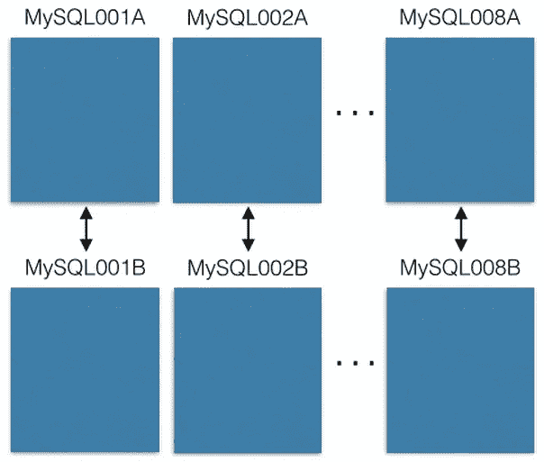
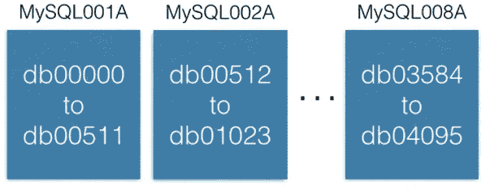
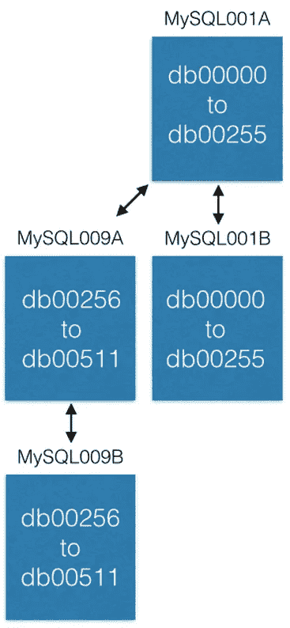
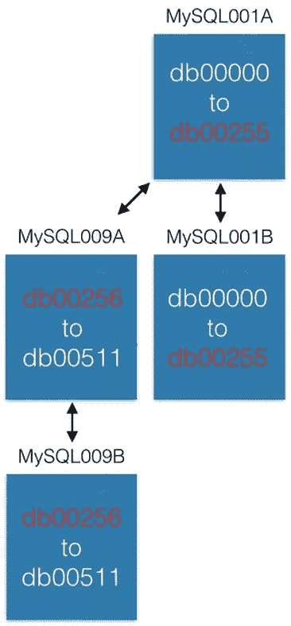

# Sharding Pinterest:我们如何扩展我们的 MySQL 车队

> 原文：<https://medium.com/pinterest-engineering/sharding-pinterest-how-we-scaled-our-mysql-fleet-3f341e96ca6f?source=collection_archive---------0----------------------->

Marty Weiner | Pinterest 工程师，BlackOps

> “夏德。或者不要碎片。没有尝试。”
> —尤达

这是对我们如何在许多 MySQL 服务器上分割数据的技术探讨。我们在 2012 年初完成了这种分片方法的发布，它仍然是我们今天用来存储核心数据的系统。

在讨论如何拆分数据之前，让我们先熟悉一下我们的数据。情调照明，草莓巧克力，星际迷航语录…

Pinterest 是你感兴趣的一切的发现引擎。从数据角度来看，Pinterest 是世界上最大的人类策划兴趣图。有超过 500 亿个引脚被 Pinners 保存到 10 亿块板上。人们 repin 和 like 其他 pin(粗略地复制)，关注其他 pin ner，董事会和兴趣，并查看他们关注的所有 pin ner，董事会和兴趣的主页。太好了！现在把它放大！

## 发育期痛

2011 年，我们达到了牵引力。[按](http://www.zdnet.com/article/sap-netbase-pinterest-is-fastest-growing-social-site-ever/) [某种](http://techcrunch.com/2011/11/26/pinterest-viral/) [的估计](http://www.businessinsider.com/holy-smoke-pinterest-is-the-fastest-growing-site-ever-2012-2)，我们的增长速度比以往任何一家初创公司都要快。大约在 2011 年 9 月，我们的所有基础设施都超负荷了。我们有几项 NoSQL 技术，最终都灾难性地崩溃了。我们也有一船的 MySQL 奴隶用于读取，这产生了许多恼人的错误，特别是缓存。我们重新设计了整个数据存储模型。为了有效，我们仔细地制定了我们的需求。

## 要求

*   我们的整个系统需要非常稳定，易于操作，并能适应月球。我们希望支持随着站点的增长，将数据存储从最初的一小组机器扩展到许多机器。
*   所有 Pinner 生成的内容必须随时可供网站访问。
*   支持以确定的顺序(如反向创建时间或用户指定的顺序)请求电路板中的 N 个引脚。对于 Pinner 到 likes、Pinner 到 Pins 等也是如此。
*   为简单起见，更新通常是最大努力。为了获得最终的一致性，你需要一些额外的东西，比如一个分布式的[事务日志](https://en.wikipedia.org/wiki/Transaction_log)。很有趣，也(不太)容易！

## 设计理念和注意事项

因为我们希望这些数据跨越多个数据库，所以我们不能使用数据库的连接、外键或索引来收集所有数据，尽管它们可以用于不跨越数据库的子查询。

我们还需要支持数据的负载平衡。我们讨厌移动数据，尤其是一项一项地移动，因为这很容易出错，并使系统变得不必要的复杂。如果我们必须移动数据，最好将整个虚拟节点移动到不同的物理节点。

为了让我们的实现快速成熟，我们需要最简单的可用解决方案和非常稳定的分布式数据平台节点。

所有数据都需要复制到从机进行备份，并具有高可用性，转储到 S3 进行 MapReduce。我们只在制作中与大师互动。在生产过程中，你永远不要读/写奴隶。奴隶滞后，导致奇怪的 bug。一旦你被分割，在生产中与奴隶互动通常没有优势。

最后，我们需要一种好的方法来为我们所有的对象生成通用的唯一 id(UUID)。

## 我们是如何分开的

无论我们要建造什么，都需要满足我们的需求，并且稳定、性能好、可修复。换句话说，它不能太糟糕，所以[我们选择了一项成熟的技术](https://engineering.pinterest.com/blog/learn-stop-using-shiny-new-things-and-love-mysql)作为我们的基础，MySQL。我们有意避开自动扩展的新技术，如 MongoDB、Cassandra 和 Membase，因为它们的成熟度还不够(它们正以惊人的方式向我们袭来！).

*除此之外:我仍然建议创业公司避免花哨的新东西——尽全力只使用 MySQL。相信我。我有伤疤可以证明。*

MySQL 是成熟的，稳定的，它只是工作。我们不仅使用它，而且它还被许多其他公司用来推动更大的规模。MySQL 支持我们对数据请求排序、选择特定范围的数据和行级事务的需求。它有更多的功能，但我们并不需要或使用它们。但是，MySQL 是一个单一的解决方案，因此需要对我们的数据进行分片。这是我们的解决方案:

我们从八台 EC2 服务器开始，每台服务器运行一个 MySQL 实例:



每台 MySQL 服务器都是主-主复制到备份主机上，以防主服务器出现故障。**我们的生产服务器只能读写主服务器。我建议你也这样做。它简化了一切，避免了滞后的复制错误。**

每个 MySQL 实例可以有多个数据库:



注意每个数据库是如何被唯一地命名为 db00000、db00001 到 dbNNNNN 的。每个数据库都是我们数据的一部分。我们做了一个设计决定，一旦一个数据进入一个碎片，它就永远不会移动到那个碎片之外。然而，您可以通过将碎片移动到其他机器来获得更多的容量(我们将在后面讨论)。

我们维护了一个配置表，其中显示了这些碎片位于哪些机器上:

```
[{“range”:     (0,511), “master”: “MySQL001A”, “slave”: “MySQL001B”},
 {“range”: (512, 1023), “master”: “MySQL002A”, “slave”: “MySQL002B”},
    ...
 {“range”: (3584, 4095), “master”: “MySQL008A”, “slave”: “MySQL008B”}]
```

只有当我们需要移动碎片或更换主机时，才会更改此配置。如果主人死了，我们可以提升奴隶，然后培养一个新的奴隶。这个配置存在于 [ZooKeeper](https://engineering.pinterest.com/blog/serving-configuration-data-scale-high-availability) 中，并在更新时被发送给维护 MySQL 碎片的服务。

每个 shard 包含相同的一组表:pin、boards、users_has_pins、users_likes_pins、pin_liked_by_user 等。一会儿我会详细说明这一点。

那么我们如何将数据分配给这些碎片呢？

我们创建了一个 64 位的 ID，它包含碎片 ID、包含数据的类型以及数据在表中的位置(本地 ID)。碎片 ID 是 16 位，类型 ID 是 10 位，本地 ID 是 36 位。精明的加法学专家会注意到，只增加了 62 位。我在编译器和芯片设计方面的经历告诉我，保留位的价值与黄金相当。所以我们有两个(设置为零)。

```
ID = (shard ID << 46) | (type ID << 36) | (local ID<<0)
```

给定这个 Pin:【https://www.pinterest.com/pin/241294492511762325/】T2，我们来分解 Pin ID 241294492511762325:

```
Shard ID = (241294492511762325 >> 46) & 0xFFFF = 3429
Type ID  = (241294492511762325 >> 36) & 0x3FF = 1
Local ID = (241294492511762325 >>  0) & 0xFFFFFFFFF = 7075733
```

所以这个 Pin 对象存在于碎片 3429 上。它的类型是 1(即‘Pin’)，在 pins 表的第 7075733 行。举个例子，我们假设这个碎片在 MySQL012A 上。我们可以这样来理解它:

```
conn = MySQLdb.connect(host=”MySQL012A”)
conn.execute(“SELECT data FROM db03429.pins where local_id=7075733”)
```

有两种类型的数据:对象和映射。对象包含详细信息，如 Pin 数据。

## 对象表！

对象表，比如 pin、users、boards 和 comments，有一个 ID(本地 ID，一个自动递增的主键)和一个 blob 数据，其中包含一个 JSON 和所有对象的数据。

```
CREATE TABLE pins (
  local_id INT PRIMARY KEY AUTO_INCREMENT,
  data TEXT,
  ts TIMESTAMP DEFAULT CURRENT_TIMESTAMP
) ENGINE=InnoDB;
```

例如，一个大头针对象看起来像这样:

```
{“details”: “New Star Wars character”, “link”: “http://webpage.com/asdf”, “user_id”: 241294629943640797, “board_id”: 241294561224164665, …}
```

为了创建新的 Pin，我们收集所有数据并创建一个 JSON blob。然后，我们决定一个碎片 ID(我们更喜欢选择与它所插入的板相同的碎片 ID，但这不是必须的)。Pin 的类型为 1。我们连接到数据库，并将 JSON 插入到 pins 表中。MySQL 将返回自动增加的本地 ID。现在我们有了碎片、类型和新的本地 ID，所以我们可以组成完整的 64 位 ID 了！

为了编辑 Pin，我们在一个 [MySQL 事务](http://dev.mysql.com/doc/refman/5.7/en/innodb-locking-reads.html)下读-修改-写 JSON:

```
> BEGIN
> SELECT blob FROM db03429.pins WHERE local_id=7075733 FOR UPDATE
[Modify the json blob]
> UPDATE db03429.pins SET blob=’<modified blob>’ WHERE local_id=7075733
> COMMIT
```

要删除一个 Pin，您可以在 MySQL 中删除它所在的行。不过，更好的办法是添加一个名为“active”的 JSON 字段，并将其设置为“false”，然后在客户端过滤出结果。

## 映射表！

映射表将一个对象链接到另一个对象，例如电路板到其上的引脚。用于映射的 MySQL 表包含三列:一个 64 位的“from”ID、一个 64 位的“to”ID 和一个序列 ID。(from，to，sequence)三元组上有索引键，它们位于“from”ID 的分片上。

```
CREATE TABLE board_has_pins (
  board_id INT,
  pin_id INT,
  sequence INT,
  INDEX(board_id, pin_id, sequence)
) ENGINE=InnoDB;
```

映射表是单向的，例如 board_has_pins 表。如果你需要相反的方向，你需要一个单独的 pin_owned_by_board 表。序列 ID 给出了一个排序(我们的 ID 不能跨分片进行比较，因为新的本地 ID 偏移量不同)。我们通常用序列 ID = unix 时间戳将新的管脚插入到新板中。序列可以是任何数字，但是 unix 时间戳是一种方便的方法，可以强制新的内容总是更高，因为时间单调增加。您可以像这样在映射表中查找内容:

```
SELECT pin_id FROM board_has_pins 
WHERE board_id=241294561224164665 ORDER BY sequence 
LIMIT 50 OFFSET 150
```

这将为您提供多达 50 个 pin _ ids，然后您可以使用它们来查找 pin 对象。

我们刚刚做的是一个应用层连接(board_id -> pin_ids -> pin objects)。应用层连接的一个令人惊叹的特性是，您可以将映射与对象分开缓存。我们在 memcache 集群中保存 pin_id -> pin 对象缓存，但是在 redis 集群中保存 board _ id-> pin _ id。这允许我们选择正确的技术来最好地匹配被缓存的对象。

## 增加更多容量

在我们的系统中，增加容量有三种主要方式。最简单的是升级机器(更大的空间，更快的硬盘，更多的内存，不管你的瓶颈是什么)。

增加容量的下一个方法是开辟新的范围。最初，我们只创建了 4，096 个碎片，尽管我们的碎片 ID 是 16 位(总共 64k 个碎片)。新对象只能在这些最初的 4k 碎片中创建。在某个时候，我们决定用 4096 到 8191 个碎片创建新的 MySQL 服务器，并开始填充这些服务器。

我们增加容量的最后一种方法是将一些碎片转移到新的机器上。如果我们想给 MySQL001A(它有 0 到 511 个碎片)增加更多的容量，我们用下一个最大的名字(比如 MySQL009A 和 B)创建一个新的主-主对，并开始从 MySQL001A 复制。



复制完成后，我们更改配置，使 MySQL001A 只有 0 到 255 个碎片，MySQL009A 只有 256 到 511 个碎片。现在每台服务器只需处理以前一半的碎片。



## 一些不错的属性

对于那些必须构建系统来生成新的 UUIDs 的人来说，你会发现我们在这个系统中可以免费获得它们！当您创建一个新对象并将其插入到对象表中时，它会返回一个新的本地 ID。该本地 ID 与碎片 ID 和类型 ID 相结合，为您提供了一个 UUID。

对于那些已经执行了向 MySQL 表添加更多列的修改的人来说，你会知道它们可能非常慢，并且是一大痛苦。我们的方法不需要任何 MySQL 级别的改变。在 Pinterest，我们可能在过去三年里进行了一次改变。要向对象添加新字段，只需告诉您的服务您的 JSON 模式有几个新字段。您可以有一个默认值，这样当您从一个没有新字段的对象中反序列化 JSON 时，就会得到一个默认值。如果您需要一个映射表，那么创建新的映射表，并随时开始填充它。完成后，运送您的产品！

## Mod 碎片

就像 [Mod 小队](http://www.imdb.com/title/tt0062589/)，只是完全不同。

有些对象需要通过非 ID 来查找。例如，如果一个 Pinner 用他们的脸书账户登录，我们需要一个从脸书 id 到 Pinterest IDs 的映射。脸书 id 对我们来说只是比特，所以我们把它们存储在一个独立的碎片系统中，叫做 mod shard。其他示例包括 IP 地址、用户名和电子邮件。

mod shard 很像上一节描述的 shard 系统，但是您可以使用任意输入来查找数据。根据系统中存在的碎片总数对该输入进行散列和修改。结果是数据将存在/已经存在的碎片。例如:

```
shard = md5(“1.2.3.4") % 4096
```

*碎片*在这种情况下会是 1524 年。我们维护一个类似于 ID shard 的配置文件:

```
[{“range”:    (0,  511), “master”: “msdb001a”, “slave”: “msdb001b”},
  {“range”:  (512, 1023), “master”: “msdb002a”, “slave”: “msdb002b”},
  {“range”: (1024, 1535), “master”: “msdb003a”, “slave”: “msdb003b”},
…]
```

因此，要查找有关 IP 地址 1.2.3.4 的数据，我们可以这样做:

```
conn = MySQLdb.connect(host=”msdb003a”)
conn.execute(“SELECT data FROM msdb001a.ip_data WHERE ip='1.2.3.4'”)
```

您失去了 ID 碎片的一些好的属性，比如空间局部性。你必须从一开始制作的所有碎片开始，自己制作钥匙(它不会为你制作一个)。用不可变的 id 来表示系统中的对象总是最好的。这样，当用户更改用户名时，你就不必更新大量的引用。

## 最后的想法

这个系统已经在 Pinterest 上生产了 3.5 年，并且可能会永远存在下去。实现它相对简单，但打开它并从旧机器上转移所有数据却非常困难。如果你是一家面临成长烦恼的初创公司，并且刚刚构建了新的碎片，那么考虑构建一个后台处理机器集群(使用 [pyres](https://github.com/binarydud/pyres) )来编写将数据从旧数据库移动到新碎片的脚本。我保证无论你怎么努力数据都会丢失(系统里的小妖精，我发誓)，所以一遍又一遍的重复数据传输，直到写入新系统的新东西很微小或者为零。

这个系统是最大的努力。它不会在所有情况下都给你原子性、孤立性或一致性。哇！听起来很糟糕！但是不用担心。没有这些保证，你可能也很好。如果需要的话，你可以在其他流程/系统中构建这些层，但是我会告诉你你可以免费得到什么:这个东西就是工作。简单性带来了良好的可靠性，而且速度非常快。如果你担心 A，I 和 C，给我写信。我可以帮你想清楚这些问题。

但是故障转移呢？我们构建了一个维护 MySQL 碎片的服务。我们在 ZooKeeper 中存储了 shard 配置表。当主服务器死亡时，我们有脚本来提升从服务器，然后启动一台替换机器(并使其保持最新)。即使在今天，我们也不使用自动故障转移。

*鸣谢:Yash Nelapati、Ryan Probasco、Ryan Park 和我在来自*[*Evan priest ley*](https://twitter.com/evanpriestley)*的爱心指导下构建了 Pinterest 切分系统。红牛和咖啡让它跑起来。*