# 多平台 Kotlin 项目中的共享客户端逻辑

> 原文：<https://blog.kotlin-academy.com/shared-client-logic-in-multiplatform-kotlin-project-2509bc36ff51?source=collection_archive---------8----------------------->

我们已经展示了[多平台 Kotlin 项目](/architecture-for-multiplatform-development-in-kotlin-cc770f4abdfd)的架构。它的核心思想是我们如何定义客户端逻辑，以便它可以与所有客户端共享。这里我们用 Kt 来描述。学院申请示例。

在这一部分，我们将描述 [Kot 的*公共客户端*部分。学院申请项目](https://github.com/MarcinMoskala/KotlinAcademyApp)。接下来关于 Android、web、桌面、iOS 和其他的文章将强烈引用这篇文章。

*公共* *模块*已经在[关于整体架构的文章](/architecture-for-multiplatform-development-in-kotlin-cc770f4abdfd)和[关于提取 Android 项目中公共模块的文章](/extracting-multiplatform-common-modules-in-android-4a564cc03e0a)中描述过了。

本文的主要目标是:

*   告诉你什么是*主持人*以及他们的目的是什么。请注意，对每个*演示者*的描述都是从一组具体的职责和一个涵盖其中每个职责的单元测试开始的。这些是那些*主持人*满足的特定商业规则。
*   让您了解如何在**模块中定义*演示者*。**
*   *呈现并描述*公共客户端模块*，这样在接下来的文章中，我们可以基于这些知识，描述我们如何在多平台 Kotlin 项目中定义 Android、web、桌面或 iOS。*

# *演示*

*您可能已经看到了这个示例应用程序的样子。下面是 [Android](https://play.google.com/store/apps/details?id=org.kotlinacademy.mobile) 和 [web](http://portal.kotlin-academy.com/) 客户端的演示:*

*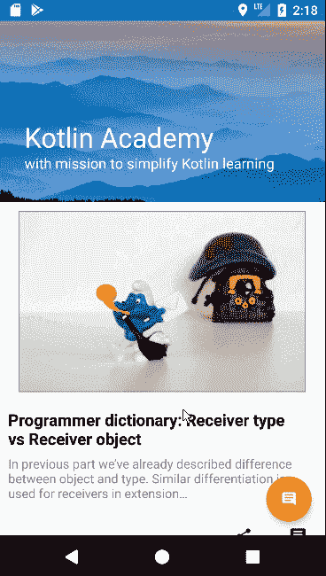**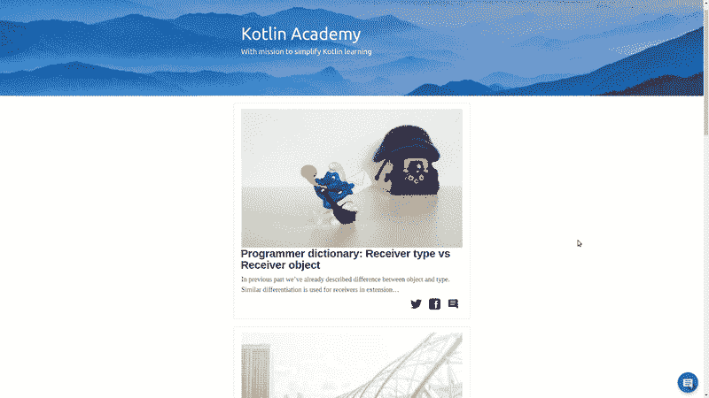*

*该应用程序目前实现了以下功能:*

*   *可以看到所有 Kot。学院职位*
*   *你可以给新闻或者具体的文章添加评论*
*   *应用程序正在发送推送通知*

*这 3 个核心功能在 3 个独立的*呈现者*中实现:`NewsPresenter`、`FeedbackPresenter`和`RegisterNotificationTokenPresenter`。*

*我们将一个接一个地(按不同的顺序)描述。*

# *反馈演示者*

**反馈**

*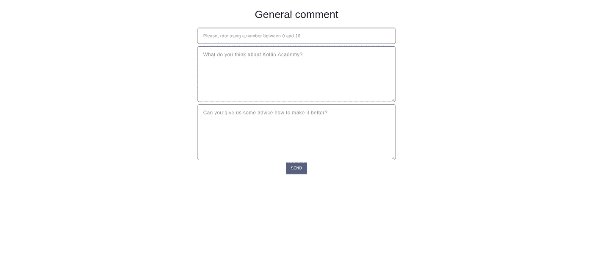*

*它真的很简单，因为它只决定当“发送”按钮被点击时如何反应。其业务逻辑规则如下:*

*   *发送表单中提供的所有数据*
*   *发送反馈时，将显示加载器*
*   *当存储库返回错误时，它会显示在视图上*
*   *数据发送后，视图切换回新闻列表*

*检查[所有这些被定义为*演示者*](https://github.com/MarcinMoskala/KotlinAcademyApp/blob/7ffa651a93ec2f60144084b1f40328c5d322ca8e/common-client/src/test/kotlin/org/kotlinacademy/FeedbackPresenterUnitTest.kt) 的单元测试的规则。*

*整个此逻辑在以下实现中实现:*

*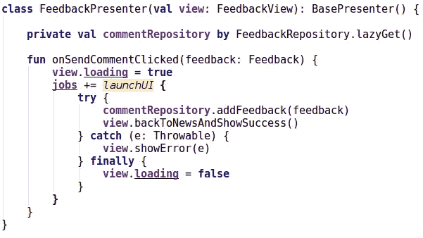*

*[FeedbackPresenter in common-client module](https://github.com/MarcinMoskala/KotlinAcademyApp/blob/7ffa651a93ec2f60144084b1f40328c5d322ca8e/common-client/src/main/kotlin/org/kotlinacademy/presentation/feedback/FeedbackPresenter.kt)*

*我们可以看到，当调用`onSendCommentClicked`时，我们将`loading`设置为`true`(显示加载指示器)，使用`commentRepository`添加注释，并调用`backToNewsAndShowSuccess`返回到之前的活动。当存储库抛出错误时，我们捕获它并显示在视图上。我们总是用隐藏负载指示器来完成这个方法。*

*`FeedbackPresenter`使用`FeedbackView`界面表示视图:*

*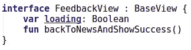*

*[FeedbackView in common-client module](https://github.com/MarcinMoskala/KotlinAcademyApp/blob/7ffa651a93ec2f60144084b1f40328c5d322ca8e/common-client/src/main/kotlin/org/kotlinacademy/presentation/feedback/FeedbackView.kt)*

*所有显示反馈表单的视图(页面、活动等)都需要实现它(在下一篇文章中，我们将看到更多具体的例子)。所有客户端的视图都需要实现`BaseView`:*

*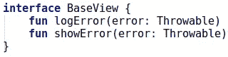*

*[BaseView interface in common-client module](https://github.com/MarcinMoskala/KotlinAcademyApp/blob/7ffa651a93ec2f60144084b1f40328c5d322ca8e/common-client/src/main/kotlin/org/kotlinacademy/presentation/BaseView.kt)*

*大多数`onSendCommentClicked`方法在`launchUI`块中。这个块用于在协程中启动作用域。`launchUI`是在 Kt 中定义的。学院项目，因为协程还不支持*通用模块*。它被定义为预期声明:*

**

*[launchUI expected declaration in common-client module](https://github.com/MarcinMoskala/KotlinAcademyApp/blob/7ffa651a93ec2f60144084b1f40328c5d322ca8e/common-client/src/main/kotlin/org/kotlinacademy/common/coroutines.kt)*

*我们可以像对待 JVM 方法`launch(UI)`一样对待它，其中`UI`是应用程序的 UI 线程。在 JS 中，它只使用了`async`函数，因为 web 上没有主线程这种东西。查看 JVM 和 JS 的具体实现，但是记住它们很快就会改变，我们将会发表关于在通用模块 T21 中使用协程的整篇文章。*

*`launch(UI)`回报`Cancellable`:*

*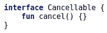*

*[Cancellable interface in common-client module](https://github.com/MarcinMoskala/KotlinAcademyApp/blob/7ffa651a93ec2f60144084b1f40328c5d322ca8e/common-client/src/main/kotlin/org/kotlinacademy/common/Cancellable.kt)*

*由于这一点，我们可以在用户离开屏幕时取消任务。这非常重要，因为这样我们可以防止当 *presenter* 试图调用已经被销毁的活动的方法时，出现数据泄漏和错误。对于每个扩展`BasePresenter`的类，作业取消自动发生:*

*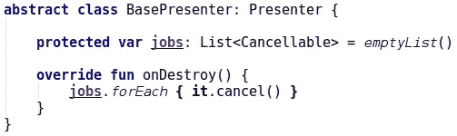*

*[BasePresenter abstract class in common-client module](https://github.com/MarcinMoskala/KotlinAcademyApp/blob/7ffa651a93ec2f60144084b1f40328c5d322ca8e/common-client/src/main/kotlin/org/kotlinacademy/presentation/BasePresenter.kt)*

*其中`onDestroy`是`Presenter`的两种生命周期方法之一:*

*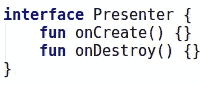*

*[Presenter interface in common-client module](https://github.com/MarcinMoskala/KotlinAcademyApp/blob/7ffa651a93ec2f60144084b1f40328c5d322ca8e/common-client/src/main/kotlin/org/kotlinacademy/presentation/Presenter.kt)*

**

# *仓库*

*`FeedbackPresenter`使用`FeedbackRepository`发送反馈。同样`NewsPresenter`使用`NewsRepository`而`RegisterNotificationTokenPresenter`使用`NotificationRepository`。该库的具体实现需要针对每个平台分别定义，但是它们的接口在*公共客户端*模块*中定义:**

*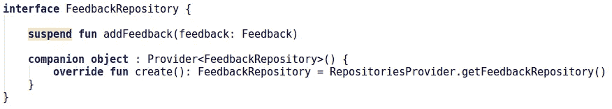*

*[FeedbackRepository in common-client module](https://github.com/MarcinMoskala/KotlinAcademyApp/blob/7ffa651a93ec2f60144084b1f40328c5d322ca8e/common-client/src/main/kotlin/org/kotlinacademy/respositories/FeedbackRepository.kt)*

*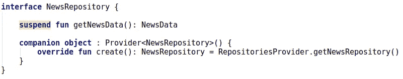*

*[NewsRepository in common-client module](https://github.com/MarcinMoskala/KotlinAcademyApp/blob/7ffa651a93ec2f60144084b1f40328c5d322ca8e/common-client/src/main/kotlin/org/kotlinacademy/respositories/NewsRepository.kt)*

*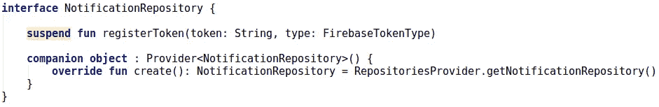*

*[NotificationRepository in common-client module](https://github.com/MarcinMoskala/KotlinAcademyApp/blob/7ffa651a93ec2f60144084b1f40328c5d322ca8e/common-client/src/main/kotlin/org/kotlinacademy/respositories/NotificationRepository.kt)*

*它们被注入到*演示者*中，使用轻量级依赖注入替代(尽管它可能很快会被 Kodein 取代)。它们都是使用`RepositoriesProvider`预期声明创建的，该声明在平台模块中提供了特定于平台的实现:*

*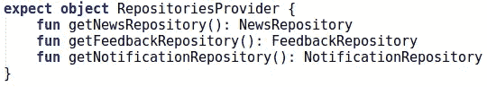*

*RepositoriesProvider expected declaration in common-client module*

*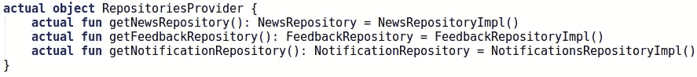*

*RepositoriesProvider actual declaration in [common-client-js module](https://github.com/MarcinMoskala/KotlinAcademyApp/blob/7ffa651a93ec2f60144084b1f40328c5d322ca8e/common-client-js/src/main/kotlin/org/kotlinacademy/respositories/RepositoriesProvider.kt) and in [common-client-jvm module](https://github.com/MarcinMoskala/KotlinAcademyApp/blob/7ffa651a93ec2f60144084b1f40328c5d322ca8e/common-client-jvm/src/main/kotlin/org/kotlinacademy/respositories/RepositoriesProvider.kt)*

*具体的实现使用特定于平台的方法来发出 HTTP 请求，并序列化/反序列化数据。*

# *新闻记者*

*下一个*演示者*要描述的是`NewsPresenter`。它控制用于显示新闻的视图。其业务逻辑规则如下:*

*   *创建视图后，它加载并显示新闻列表。在新闻加载期间，加载器被显示。*
*   *当用户请求刷新时，加载新闻。在刷新期间，显示刷新指示器。*
*   *新闻每 60 秒悄悄刷新一次。*
*   *新闻按发生的降序显示。*
*   *当任何新闻加载返回错误时，将显示 loit。*

*查看该*演示者* 的[单元测试。](https://github.com/MarcinMoskala/KotlinAcademyApp/blob/7ffa651a93ec2f60144084b1f40328c5d322ca8e/common-client/src/test/kotlin/org/kotlinacademy/NewsPresenterUnitTest.kt)*

*所有这些逻辑都是通过以下实现来实现的:*

*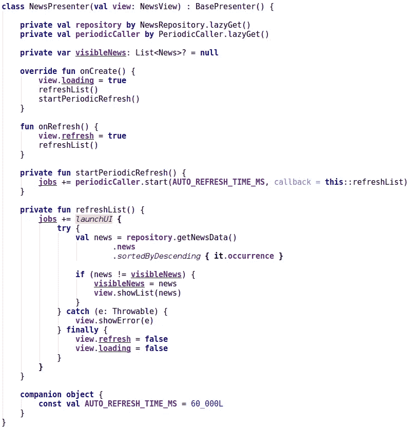*

*[NewsPresenter in common-client module](https://github.com/MarcinMoskala/KotlinAcademyApp/blob/e871a4a60900982b5acaaa16f6e65f627318605b/common-client/src/main/kotlin/org/kotlinacademy/presentation/news/NewsPresenter.kt)*

*在`onCreate`阶段，它显示加载，刷新列表并开始定期刷新。定期刷新使用`periodicCaller`每 60 秒刷新一次。刷新是异步作业(因此当用户离开屏幕时它被取消)，它使用`newsRepository`获取新闻，对它们进行排序，如果它们发生了变化，然后显示它们。毕竟，它隐藏了加载和刷新(如果它们没有显示，那么它什么也不做)。当使用请求刷新(`onRefresh`)时，显示刷新指示灯(`view.refresh = true`)并调用`refreshList`。*

*这就是我们如何表示由这个*演示者*控制的*视图*:*

*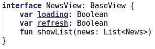*

*[NewsView in common-client module](https://github.com/MarcinMoskala/KotlinAcademyApp/blob/e871a4a60900982b5acaaa16f6e65f627318605b/common-client/src/main/kotlin/org/kotlinacademy/presentation/news/NewsView.kt)*

*`NewsPresenter`采用`PeriodicCaller`类。它只有一个责任——在每一个具体的时间段内，从参数中调用函数。它也是[单独测试](https://github.com/MarcinMoskala/KotlinAcademyApp/blob/9408caab2fa3431664a823e69e85dc8117b30bb6/android/common/src/test/java/org/kotlinacademy/PeriodicCallerUnitTest.kt)。下面是它的实现:*

*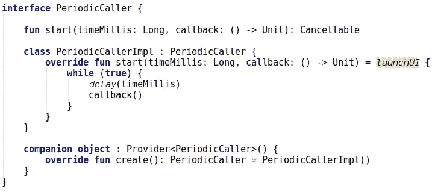*

*[PeriodicCaller in common-client module](https://github.com/MarcinMoskala/KotlinAcademyApp/blob/9408caab2fa3431664a823e69e85dc8117b30bb6/common-client/src/main/kotlin/org/kotlinacademy/usecases/PeriodicCaller.kt)*

*注意也是用`Provider`注入的。这就是为什么它在[单元测试](https://github.com/MarcinMoskala/KotlinAcademyApp/blob/7ffa651a93ec2f60144084b1f40328c5d322ca8e/common-client/src/test/kotlin/org/kotlinacademy/NewsPresenterUnitTest.kt)中很容易被嘲笑的原因。这展示了如何从*演示者*中提取具体的功能，以便它们可以被容易地重用和单独测试。感谢它被提取的事实，我们可以在`[NewsPresenter](https://github.com/MarcinMoskala/KotlinAcademyApp/blob/7ffa651a93ec2f60144084b1f40328c5d322ca8e/common-client/src/test/kotlin/org/kotlinacademy/NewsPresenterUnitTest.kt)` [测试](https://github.com/MarcinMoskala/KotlinAcademyApp/blob/7ffa651a93ec2f60144084b1f40328c5d322ca8e/common-client/src/test/kotlin/org/kotlinacademy/NewsPresenterUnitTest.kt)中模拟它，所以我们不需要在那里处理时间。*

# *RegisterNotificationTokenPresenter*

*项目中最后一位*主持人*(目前)是`RegisterNotificationTokenPresenter`。它用于向后端发送 Firebase 通知令牌。这是一个棘手的部分，因为没有用于发送令牌的单一视图。它发生在后台。对于 Android 和 web 来说，也有不同的机制用来获得这个令牌。这些是演示者的职责:*

*   *向后端正确发送令牌*
*   *当后端返回错误时，它会被记录*
*   *已知令牌何时被正确注册*

*查看该*演示者* 的[单元测试。下面是它的实现:](https://github.com/MarcinMoskala/KotlinAcademyApp/blob/0c6b1b80e90ab02700a4f9f9fa61c5fdf70225bb/common-client/src/test/kotlin/org/kotlinacademy/RegisterNotificationTokenPresenterUnitTest.kt)*

*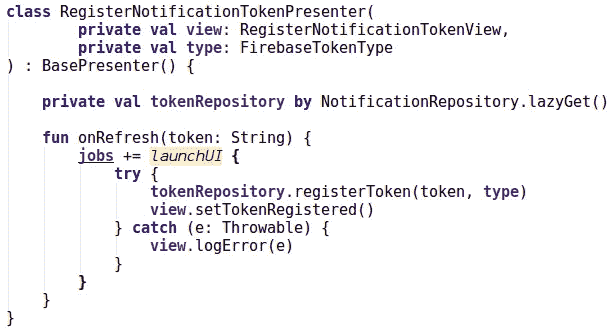*

*[RegisterNotificationTokenPresenter in common-client module](https://github.com/MarcinMoskala/KotlinAcademyApp/blob/0c6b1b80e90ab02700a4f9f9fa61c5fdf70225bb/common-client/src/main/kotlin/org/kotlinacademy/presentation/notifications/RegisterNotificationTokenPresenter.kt)*

*并查看声明:*

*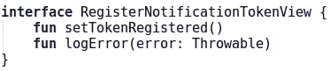*

*[RegisterNotificationTokenView in common-client module](https://github.com/MarcinMoskala/KotlinAcademyApp/blob/0c6b1b80e90ab02700a4f9f9fa61c5fdf70225bb/common-client/src/main/kotlin/org/kotlinacademy/presentation/notifications/RegisterNotificationTokenView.kt)*

*注意这个接口没有实现`BaseView`。是因为我们不需要实现未使用的`showError`，也不是平台特定的 base view 提供的，因为这个视图并没有真正显示出来。*

*除此之外，`RegisterNotificationTokenPresenter`的工作方式与`FeedbackPresenter`类似。它是如何工作的更有趣，但这将在专门针对 Android、iOS 和 web 的文章中详细描述。*

# *摘要*

*现在你知道了*公共客户端*模块是如何在 Kt 中工作的。学院申请。你应该明白这种*主持人*应该如何定义以及如何使用。*

*要深入了解*演示者*的目的和用途，请查看[本次演示](https://medium.com/@marcinmoskala/mvc-vs-mvp-vs-mvvm-vs-mvi-ce72907d330)。如果你还没有这样做，你也应该读一下[关于多平台开发的整体架构的文章](/architecture-for-multiplatform-development-in-kotlin-cc770f4abdfd?source=collection_detail----e57b304801ef-----10----------------)。*

*如果你想检查自己，那么你可以为这个项目做出贡献。仍然有大量的任务和大量的客户端需要实现。*

*在接下来的文章中，我们将描述如何在 Android、web、桌面、iOS 和其他平台上使用来自*公共客户端*的*演示者*。如果你不想错过他们，就订阅吧。*

*下一篇文章:*

* [## 测试通用模块

### 在具有良好架构的 Kotlin 多平台项目中，我们在公共-客户端公共模块中拥有完整的业务逻辑…

blog.kotlin-academy.com](/testing-common-modules-66b39d641617)* 

## *学到了什么？单击👏说“谢谢！”并帮助他人找到这篇文章。*

*如果你认为这很重要，与他人分享。*

*你需要 Kotlin 工作室吗？请访问我们的网站，看看我们能为您做些什么。*

*要在 Twitter 上提到我，请使用 [@marcinmoskala](https://twitter.com/marcinmoskala) 。*

****