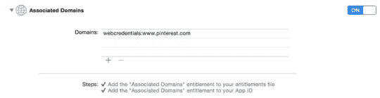
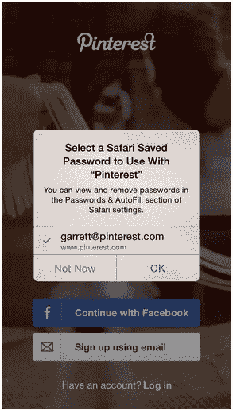
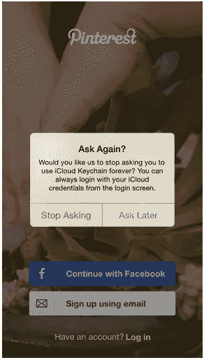

# 共享 web 凭据:一种更简单的登录方式

> 原文：<https://medium.com/pinterest-engineering/shared-web-credentials-a-simpler-way-to-log-in-f94bca0d683b?source=collection_archive---------1----------------------->

Garrett Moon | Pinterest 工程师，iOS 核心体验

我们的首要任务是在我们构建的所有产品中，跨平台地创造出色的用户体验。作为其中的一部分，我们每天都在努力减少使用 Pinterest 的工作量。所以当苹果宣布支持[共享网络凭证](https://developer.apple.com/library/ios/documentation/Security/Reference/SharedWebCredentialsRef/)时，我们很高兴能让 Pinners 更容易登录。

共享 web 凭证允许 iOS 应用程序读取和写入 Safari 在 iOS 和 Mac 上使用的同一商店的密码。例如，如果一个 Pinner 在他们的 Mac 上注册了 Pinterest，他们可以下载我们的 iPhone 应用程序并立即登录，而不需要记住或输入他们的凭据。神奇！

## 如何

在您可以开始使用 API 之前，有两个要求可以让 iOS 使用共享的 web 凭据来信任您的应用程序。

*   将您的域添加到 Xcode 项目功能部分的“关联域”中:

*   签署一个 JSON 文件，并将其托管在 https://<yourdomain.com>/apple-app-site-association。请注意 https。</yourdomain.com>
*   该文件应包含一个字典，其中列出了您批准的应用程序标识符，并经过签名以确保它未被篡改。下面的清单显示了一个为阅读而格式化的 JSON 文件示例:
*   清单 1–1 服务器端 web 凭据:
*   `{ "webcredentials": { "apps": [ "YWBN8XTPBJ.com.example.myApp"] } }`
*   我们使用我们的 pinterest.com 证书和密钥来签署 JSON 文件(更多关于证书的要求[在这里](https://developer.apple.com/library/ios/documentation/Security/Reference/SharedWebCredentialsRef/))。要签署证书，请使用以下命令:
*   清单 1–2 签署凭证文件:
*   `echo '{"webcredentials":{"apps":["YWBN8XTPBJ.com.example.myApp"]}}' > json.txt cat json.txt | openssl smime -sign -inkey pinterest.com.key -signer pinterest.com.pem -certfile intermediate.pem -noattr -nodetach -outform DER > apple-app-site-association`
*   最后一步，将制作好的文件放在你网站的[https://example.com/apple-app-site-association.](https://example.com/apple-app-site-association.)下
*   这个过程应该相对简单，但是有几个问题。
*   首先，请确定您在 iCloud 钥匙串中拥有与您的域相匹配的凭据。如果没有它们，API 方法将失败，并出现错误(-25300，未找到匹配项)。如果用户单击“Not Now ”,将不会出现错误，但会返回零个凭据。
*   此外，如果你第一次没有正确设置好一切，你会想在测试之间删除应用程序。Apple 会在安装应用程序时验证您的域应用程序链接，因此在修复问题后重新启动应用程序不会导致新的检查。
*   现在，要在应用程序中请求用户的凭证，只需进行一个简单的函数调用:
*   `SecRequestSharedWebCredential(NULL, NULL, ^(CFArrayRef credentials, CFErrorRef error) { if (error) { //handle error } else { if ([(__bridge NSArray *)credentials count] > 0) { NSDictionary *dictionary = [(__bridge NSArray *)credentials objectAtIndex:0]; NSString *accountName = dictionary[(__bridge id)(kSecAttrAccount)]; NSString *password = dictionary[(__bridge id)(kSecSharedPassword)]; } else { // No accounts } } });`

## 设计

想象一下，你刚刚在网上注册了 Pinterest，然后下载了我们的 iOS 应用。加载应用程序后，您可以立即使用您的凭据登录，这是理想的体验。

然而，你不想惹恼那些对使用这个特性没有兴趣的用户。因此，如果用户点击“现在不要”，那么每次他们在登录屏幕上时，就停止显示对话框。

要创建最无缝的体验，请在应用程序的其他部分集成共享的 web 凭据。

*   当用户成功登录时，调用 SecAddSharedWebCredential 更新用户的凭据，以便他们以后访问您的网站时可以使用它们。
*   如果您有密码更改功能，请务必如上所述更新钥匙串中的凭证。
*   最后，确保在您的登录屏幕上有一个使用凭证登录的按钮。

## 结果

在引入对共享 web 凭证的支持后，我们看到 Pinners 的参与度有了适度的提高，这使得这一小小的努力物有所值。鼓励人们使用像 iCloud Keychain 这样的功能将有助于用户创建更安全的密码，而不必记住它们，这对所有参与者来说都是一个胜利。

*Garrett Moon 是移动团队的 iOS 工程师。*

*鸣谢:感谢高级安全工程师 Amine Kamel 提供正确签署 JSON 文件的方法。*

*获取 Pinterest 工程新闻和更新，关注我们的工程*[*Pinterest*](https://www.pinterest.com/malorie/pinterest-engineering-news/)*，* [*脸书*](https://www.facebook.com/pinterestengineering) *和*[*Twitter*](https://twitter.com/PinterestEng)*。有兴趣加入团队吗？查看我们的* [*招聘网站*](https://about.pinterest.com/en/careers/engineering-product) *。*