# 2021 年前 60 个 Shell 脚本面试问题和答案

> 原文：<https://medium.com/edureka/shell-scripting-interview-questions-c60c94f21c23?source=collection_archive---------1----------------------->


**Linux** 在过去的几年里已经开始迅速扩展其市场，Linux 中的 **Shell 脚本是十大 IT 工作需求之一。因此，我们想通过制作一套最常被问到的 **Shell 脚本面试问题**来让你的工作变得更容易，这将让你为你希望出现的任何工作面试做好准备。**

这些问题被分成三个部分:

*   面向初学者的面试问题
*   针对中级人员的面试问题
*   有经验者的面试问题

# 面向初学者的面试问题

## Q1。壳牌是什么？

Shell 是一个命令行解释器。它翻译用户输入的命令，并将它们转换成内核可以理解的语言。shell 解释在终端输入的命令，并调用您想要的程序。

## Q2。什么是 Shell 脚本？你能说出它的一些优点吗？

shell 脚本是一个包含命令的文本文件，它按照命令的执行顺序包含命令。shell 脚本执行的典型操作包括打印文本、文件操作和程序执行。

以下是 shell 脚本的两个主要优点:

*   它有助于开发您自己的定制操作系统，并提供最适合您需求的相关功能。
*   它有助于根据各自的平台设计软件应用程序。

## Q3。Shell 脚本中使用了哪些不同类型的变量？

shell 脚本有两种类型的变量:

*   **系统定义变量**由操作系统(Linux)自己创建/定义。这些变量通常以大写字母定义，可通过“ **set** 命令查看。
*   **用户自定义变量**由系统用户创建或定义，可以使用命令 **echo** 查看变量值。

## Q4。典型的 Linux 系统上有哪些不同类型的常用 shells？

Linux 操作系统中主要有两种 Shell，即 Bourne Shell 和 C-Shell。从每一个衍生的例子如下:

*   **Bourne Shell:**Bourne Shell，Bourne-Again Shell，Korn Shell，POSIX Shell。
*   **C 壳:** C 壳，TENEX C 壳，Z 壳

## Q5。如何在 Linux 中创建快捷方式？

这可以借助 Linux 操作系统中的链接来完成。

**硬链接:**硬链接链接到文件的 inode，并且必须与文件在同一个文件系统上。删除原始文件不会影响硬链接。

**软链接:**软链接链接到文件名，也可以驻留在不同的文件系统上。删除原始文件会使软链接无效。

## Q6。讲讲 Shell 脚本中的超级块？

超级块本质上是一个包含特定文件系统记录的程序。

诸如块大小、空块和已填充块及其各自的计数、inode 表的大小和位置、磁盘块图和使用信息以及块组的大小等特征在超级块中可用。

## Q7。什么是 GUI 脚本？

GUI 用于控制计算机及其应用程序。GUI 脚本支持不同的应用程序。这主要取决于操作系统。

## Q8。它所经历的 Linux 过程的各个阶段是什么？

Linux 进程通常经历四个阶段:

*   **等待**:Linux 进程等待资源。
*   **正在运行**:当前正在执行 Linux 进程。
*   **停止**:Linux 进程执行成功后停止。
*   **僵死**:进程已经停止，但在**进程表**中仍处于活动状态。

## Q9。中断和继续命令之间有什么区别？

*   **Break:** 这是退出正在进行的循环的简单方法。我们可以使用 break 命令退出任何循环，包括 while 和 until 循环。
*   **继续:**退出循环的当前迭代，而不是整个循环。

## Q10。Shebang 行在 Shell 脚本中的意义是什么？

Shebang 行出现在脚本的顶部，例如 *#！/bin/sh* 。它只是提供关于引擎放置位置的信息。引擎是执行脚本的引擎。

## Q11。如何将参数传递给脚本？

```
*#!/bin/sh*
*ct $1*
```


*question 11 — Shell Scripting Interview Questions — Edureka*


## Q12。如何在脚本中使用参数？

```
*#!/bin/sh*
*cp $1 $2*
```

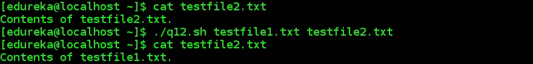

*question 12 — Shell Scripting Interview Questions — Edureka*

## Q13。如何计算传递的参数个数？

```
*#!/bin/sh*
*echo "Number of Parameters passed:$#"*
```


*question 13 — Shell Scripting Interview Questions — Edureka*

## Q14。如何在脚本中获取脚本名？

```
*!/bin/sh*
*echo "Script Name:$0"*
```


*question 14 — Shell Scripting Interview Questions — Edureka*

## Q15。如何检查前面的命令是否运行成功？

```
*#!/bin/sh*
*var=$?*
*if var=0*
*then*
*echo "Script was Run successfully"
else*
*echo "Script was unsuccessful"*
*fi*
```


*question 15 — Shell Scripting Interview Questions — Edureka*

## Q16。如何仅使用终端获取文件的最后一行？

```
*tail -1 <filename>*
```

## Q17。如何仅使用终端从文件中获取第一行？

`*head -1 <filename>*`

## Q18。如何从文件中获取每行的第 3 个元素/列？

```
*#!/bin/sh*
*awk '{print $3}' $1*
```

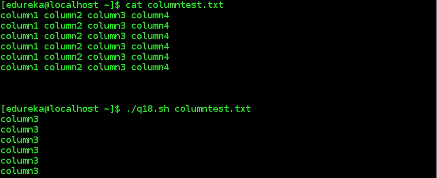

*question 18 — Shell Scripting Interview Questions — Edureka*

## Q19。如何写一个函数？

```
*#!/bin/sh
function example {*
*echo "Hello Learner"*
*}*
```

## 问题 20。写下 Shell 脚本中所有循环的语法。

**For 循环:**

```
*for var in word1 word2 ... wordN
do
   Statement(s) to be executed for every word.
done*
```

**While 循环:**

```
*while command
do
   Statement(s) to be executed if command is true
done*
```

**直到循环:**

```
*until command
do
   Statement(s) to be executed until command is true
done*
```

# 中级的面试问题

## 问题 21。是什么让 C shell 比 Bourne Shell 更受欢迎？

在下列情况下，c 是更可取的选项:

*   所有的命令都可以简单地使用 C shell 作为别名，而在 Bourne Shell 中则不可能。
*   冗长的命令可以在 C shell 中反复使用，而 Bourne 不允许在所有情况下都使用。
*   命令历史可以通过 C shell 访问，但不能通过 Bourne 访问。

## 问题 22。如何比较 Shell 脚本中的字符串？

**测试命令**用于比较文本字符串。test 命令通过比较每个字符串中的每个字符来比较文本字符串。

## 问题 23。如何将标准输出和标准错误重定向到同一个位置？

将标准输出和标准错误重定向到同一位置的两种方法如下:

*   **2>1(# ls/usr/share/doc>out . txt 2>1)**
*   **&>(# ls/usr/share/doc&>out . txt)**

## 问题 24。区分“和”引号。

*   **单引号:**用于不需要对变量赋值的情况。
*   **双引号:**用于需要对变量赋值的情况。

## 问题 25。什么时候不应该使用 shell 编程/脚本？

在下列情况下，不建议使用外壳脚本；

*   当任务非常复杂时，例如编写整个工资处理系统。
*   需要高生产率的地方。
*   当它需要或涉及不同的软件工具时。

## 问题 26。shell 脚本中变量的寿命是多少？

shell 脚本中变量的生命周期只有到执行的**结束。**

## Q27。什么是文件系统？

**文件系统**是包含文件相关信息的文件集合。

## 问题 28。文件创建时的默认权限是什么？

在 Linux 和其他类似 Unix 的操作系统上，新文件是用一组默认的权限创建的。 **umask** 或用户屏蔽命令用于确定新创建文件的默认权限。它是一个 4 位数的八进制数，使用符号值来设置和表示。文件创建时的默认权限是 **664** ，即 **rw-rw-r-** 。文件权限表如下所示；

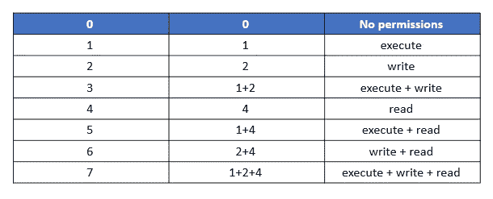

## 问题 29。#是什么意思！/bin/sh 或者#！每个脚本的开头都有/bin/bash？

一个**剧本**可能会指定 **#！/bin** / **bash** 在第一行，意味着脚本应该总是用 **bash** 运行，而不是另一个 shell。/ **bin** / **sh 是**一个代表系统外壳的可执行文件。实际上，它通常被实现为一个符号链接，指向作为系统外壳的任何外壳的可执行文件。

## Q30。$*和$@有什么区别？

$@将每个带引号的参数视为单独的参数，但$*会将整组位置参数视为单个字符串。

## Q31。确定以下命令的输出:name=Shubham && echo '我的名字是$name '。


*question 31 — Shell Scripting Interview Questions — Edureka*

## Q32。确定以下命令的输出:[ -z "" ] && echo 0 || echo 1


*question 32 — Shell Scripting Interview Questions — Edureka*

## Q33。确定以下命令的输出:echo ${new:-variable}


*q33 — Shell Scripting Interview Questions — Edureka*

## Q34。如何只用 echo 命令获取字符串变量的一部分？

```
*#!/bin/sh*
*echo ${variable:x:y}*
*#x - start position*
*#y - length**variable="My name is Upasana, and I work at Edureka."*
*echo ${variable:11:7} # will display Upasana*
```


*q34 — Shell Scripting Interview Questions — Edureka*

## Q35。重写命令打印句子，将变量转换为复数: **echo“我喜欢$variable”。**

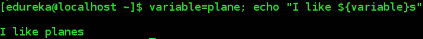

*q35 — Shell Scripting Interview Questions — Edureka*

## Q36。如何打印提供给脚本的所有参数？

```
*#!/bin/bash* * for i; do* *    echo $i* * done*
```

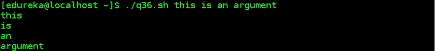

q36 — Shell Scripting Interview Questions — Edureka

## **Q37。如何打印当前 shell 的 PID？**

```
*#!/bin/sh**for PID in $$*
*do*
*echo $PID*
*done*
```


*q37 — Shell Scripting Interview Questions — Edureka*

## Q38。如何打印所有数组元素及其各自的索引？

```
*#!/bin/sh**for PID in $$*
*do*
*echo $PID*
*done*
```


*q38 — Shell Scripting Interview Questions — Edureka*

## Q39。如何打印第一个数组元素？

```
*#!/bin/sh*
*array=("This" "is" "Shell" "Scripting" )*
*echo ${array[0]}*
```

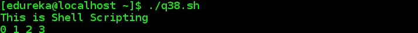

*q39 — Shell Scripting Interview Questions — Edureka*

## Q40。什么是 Crontab？

**Crontab** 代表 *cron 表*，因为它使用作业调度器 *cron* 来执行任务。crontab 是您希望定期运行的命令列表，也是用于管理该列表的命令的名称。

该时间表被称为 *crontab* ，这也是用于编辑该时间表的程序的名称。

# 有经验者的面试问题

## Q41。crontab 文件中有多少个字段，每个字段指定什么？

crontab 文件有六个字段。

**前五个字段**包含关于*何时执行命令*的信息，它们如下:

*   分钟(0–59)
*   小时(0–23)
*   第一天(1–31 天)
*   月份(1–12)
*   一周中的某一天(0–6，星期日= 0)。

**第六个字段**包含要执行的*命令*。

## Q42。crontab 命令的两个文件是什么？

crontab 命令的两个文件是:

*   **cron.allow** 决定用户使用 **crontab 命令**需要*许可*。
*   **cron.deny** 决定需要*阻止*用户使用 **crontab 命令**。

## Q43。需要使用什么命令进行备份？

**tar** 命令用于进行备份。它代表**磁带存档**。该命令主要用于在归档介质(如磁带)中保存和恢复文件。

## Q44。有哪些不同的命令可用于检查磁盘使用情况？

有三种不同的命令可用于检查磁盘使用情况。

*   **df:** 用于检查空闲磁盘空间。
*   **du:** 用于检查目录智能磁盘使用情况。
*   **dfspace:** 用于检查可用磁盘空间，以 MB 为单位。

## Q45。Shell 中有哪些不同的通信命令？

Shell 中有四种不同的通信命令。

*   **邮件**
*   **新闻**
*   **墙壁**
*   **motd**

Edureka 使用的总磁盘空间如下所示。

```
*du –s/home/Edureka*
```

## Q46。解释 Shell 的基本架构

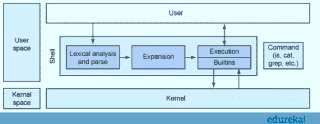

假设的 Shell 所基于的基础架构并不复杂。基本架构非常类似于管道，在那里输入被分析和解析，符号被扩展。它使用了多种方法，如大括号、波浪号、变量和参数扩展和替换以及文件名生成。然后，使用 shell 内置命令或外部命令来执行命令。

## Q47。如何调试 shell 脚本/程序中遇到的问题？

下面给出了一些用于调试脚本中问题的常用方法。

*   可以在 shell 脚本中插入调试语句，以输出/显示有助于识别问题的信息。
*   使用 *set -x* 我们可以在脚本中启用调试。

## Q48。=和==有什么区别？

*   **=** 这用于**给变量赋值**。
*   **==** 这用于**字符串比较**。

## Q49。如何在 Shell 中打开只读文件？

可以使用以下命令打开只读文件:

```
*vi –R <File Name>*
```

## Q50。如果不在 shell 脚本中解压缩，如何读取 jar 中文件的内容？

jar 中文件的内容无需解压缩就可以读取，如下所示。

```
tar –tvf <File Name>.tar
```

## Q51。编写一个 shell 脚本来获取当前日期、时间、用户名和当前工作目录。

```
*#!/bin/sh*
*echo "Hello, $LOGNAME"*
*echo "Today's date is `date`"*
*echo "Username is `who i am`"*
*echo "Current directory is `pwd`"*
```

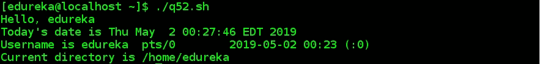

*q51 — Shell Scripting Interview Questions — Edureka*

## Q52。如何找到不到 3 天内修改的所有文件，并将记录保存在文本文件中？

`*find . -type f -mtime -3 -exec ls -l {} ; > last3days.txt*`

## Q53。编写一个 Shell 脚本，如果作为命令行参数提供，它会将两个数字相加，如果没有输入这两个数字，它会抛出一条错误消息。

```
*#!/bin/sh*
*# The Shebang
if [ $# -ne 2 ]*
*# If two Inputs are not received from Standard Input
then*
*# then execute the below statements
echo "Usage - $0 x y"*
*# print on standard output, how-to use the script (Usage - ./1.sh x y )
echo " Where x and y are two nos for which I will print sum"*
*# print on standard output, “Where x and y are two nos for which I will pri$
exit 1*
*# Leave shell in Error Stage and before the task was successfully carried o$
fi
# print on standard output, how-to use the script (Usage - ./1.sh x y )
echo " Where x and y are two nos for which I will print sum"*
*# print on standard output, “Where x and y are two nos for which I will pri$
exit 1*
*# Leave shell in Error Stage and before the task was successfully carried o$
fi*
*# End of the if Statement.
echo "Sum of $1 and $2 is `expr $1 + $2`"*
*# If the above condition was false and user Entered two numbers as a command$*
```

**情况 1:参数未通过时**


*q52.1 — Shell Scripting Interview Questions — Edureka*

**情况 2:参数正确传递时**


*q52.2 — Shell Scripting Interview Questions — Edureka*

## Q54。使用 Shell 脚本以相反的顺序打印给定的数字，以便仅使用命令行参数提供输入。

```
*#!/bin/sh*
*if [ $# -ne 1 ]*
*then*
*echo "Usage: $0 number"*
*echo " Reverse of the given number will be printed"*
*echo " For eg. $0 0123, 3210 will be printed"*
*exit 1*
*fi**n=$1*
*rev=0*
*sd=0**while [ $n -gt 0 ]*
*do*
*sd=`expr $n % 10`*
*rev=`expr $rev * 10 + $sd`*
*n=`expr $n / 10`*
*done*
```

## 情况 1:当参数没有被传递时


*q54.1 — Shell Scripting Interview Questions — Edureka*

## **情况二:参数正确传递时**


*q54.2 — Shell Scripting Interview Questions — Edureka*

## Q55。直接从终端计算实数，而不是任何 shell 脚本。


*q55 — Shell Scripting Interview Questions — Edureka*

## Q56。你如何得到圆周率的值直到小数点后 100 位？

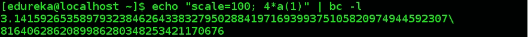

*q56 — Shell Scripting Interview Questions — Edureka*

## Q57。如何找到特定用户使用的总磁盘空间？

```
*du -sh ~*
```


*q57 — Shell Scripting Interview Questions — Edureka*

## Q58。如何检查目录是否存在？

```
*#!/bin/sh
if [ -d $mydir ]*
*then*
*echo "Directory exists"*
*fi*
```


*q58 — Shell Scripting Interview Questions — Edureka*

## Q59。你能写一个脚本来描述 set-x 是如何工作的吗？

```
*#!/bin/sh*
*#set -x*
*i=1*
*while [ $i -lt 6 ]*
*do*
*print "in loop iteration: $i"*
*((i+=1))*
*done*
*exit*
```

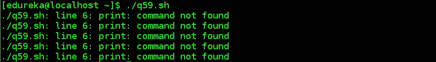

*q59.1 — Shell Scripting Interview Questions — Edureka*

```
*#!/bin/sh*
*set -x*
*i=1*
*while [ $i -lt 6 ]*
*do*
*print "in loop iteration: $i"*
*((i+=1))*
*done*
*exit*
```

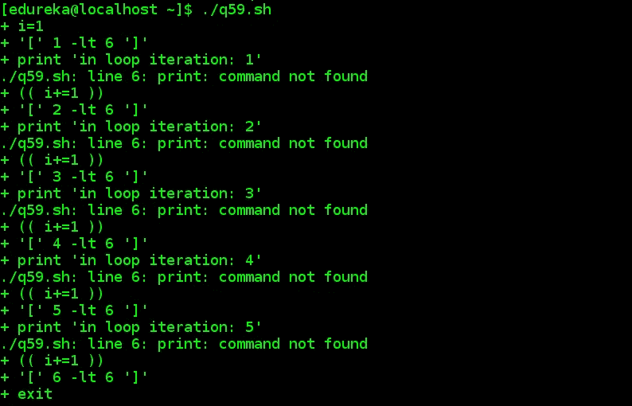

*q59.2 — Shell Scripting Interview Questions — Edureka*

## Q60。假设您使用 exec 执行一个命令，那么 shell 中当前进程的状态是什么？

当 exec 被执行时，所有新的分叉进程都被覆盖。该命令只是被执行，而不会对当前进程产生任何影响。此外，在这种情况下，不会创建新的流程。

如果你想查看更多关于人工智能、DevOps、道德黑客等市场最热门技术的文章，你可以参考 Edureka 的官方网站。

请留意本系列中的其他文章，它们将解释操作系统的各个方面。

> *1。* [*Linux 命令*](/edureka/linux-commands-895d69fa4f07)
> 
> *2。* [*Top 75+ Unix 面试问答*](/edureka/unix-interview-questions-dba26b8a13bc)
> 
> *3。*[*Linux Mint*](/edureka/linux-mint-904d4de15c58)

*原载于【https://www.edureka.co】[](https://www.edureka.co/blog/interview-questions/shell-scripting-interview-questions/)**。***