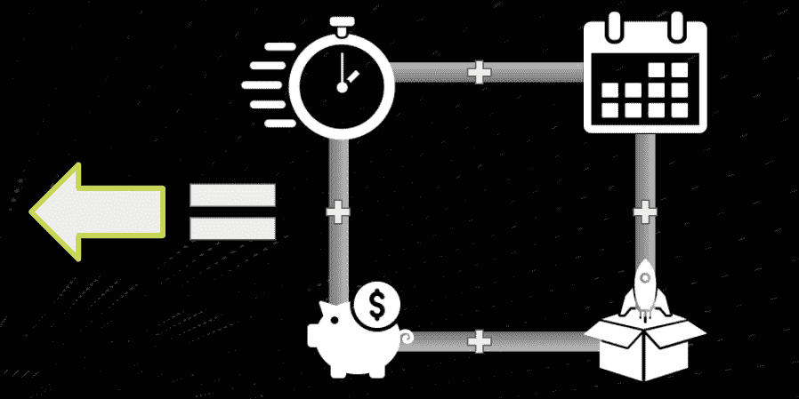
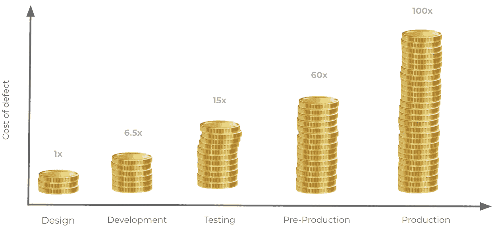
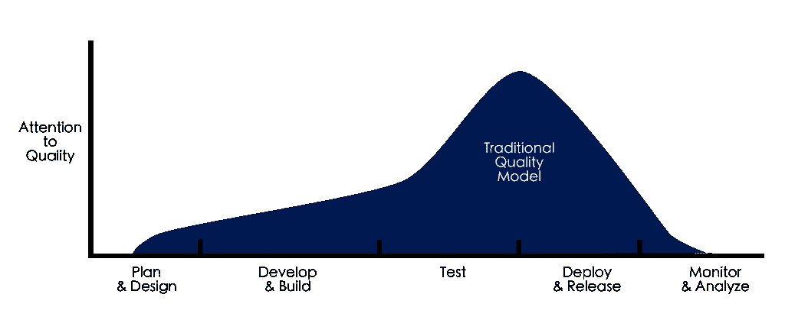
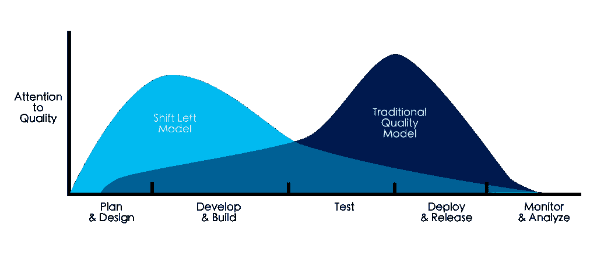
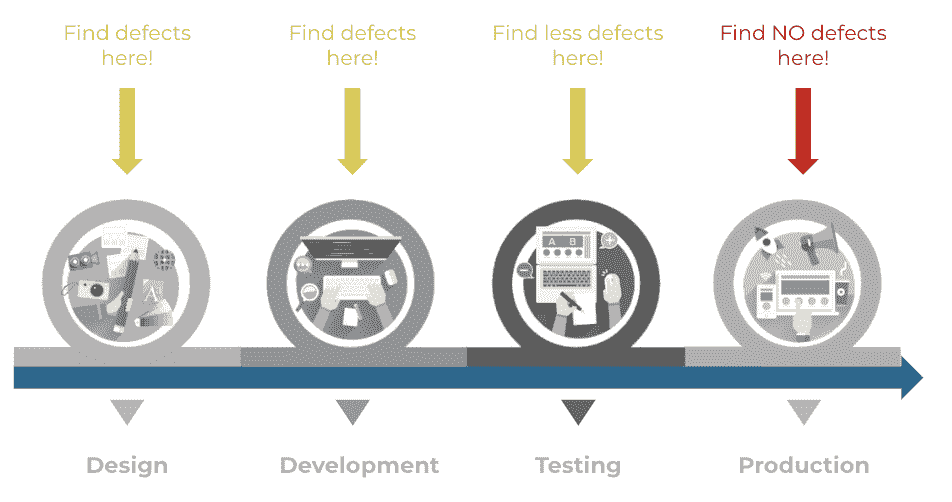
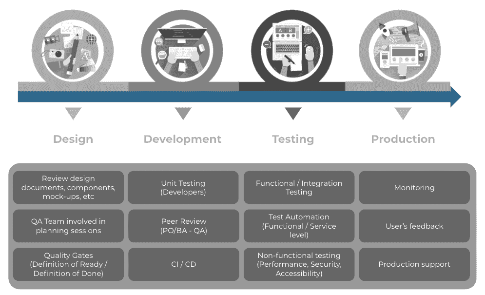
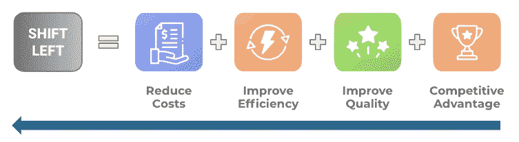
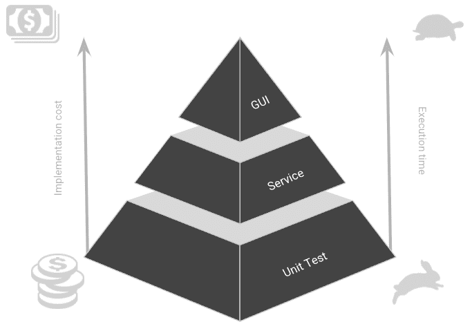

# 左移测试

> 原文：<https://medium.com/globant/shift-left-testing-c838521617b0?source=collection_archive---------0----------------------->

数字化转型正以这样一种方式影响着业务，即软件和 IT 团队一直面临着加快速度的压力。敏捷世界发展很快，这意味着减少交付时间的相对长度，同时继续提高每个后续版本的质量。

许多采用敏捷开发计划的组织面临着交付更快的挑战，这意味着通过提高速度、生产率和效率来缩短冲刺；增加发布的频率(每天一次，每两周一次，等等),更快地整合客户反馈，除此之外，总是有最小化测试成本的压力。但是在试图克服这些挑战时，他们遇到了严重的质量问题，这些问题影响了他们的客户，阻碍了这些组织实现他们的目标。

对测试和质量的强调已经在软件市场上出现，在那里“快速移动和打破东西”不再可行。一种被称为“左移测试”的质量保证方法应运而生。

**质量保证和软件测试:缺陷成本和传统质量模型(负面影响)**

在太多的项目中，甚至对于太多的敏捷团队来说，测试是低优先级的考虑，因为在交付管道的上游将开发人员和产品人员聚集在一起要容易得多。专注于构建产品要容易得多。一系列的冲刺还在继续，但是很难说服产品和开发部门将测试融入到每一次迭代中。早期测试通常是一场斗争。

结果是，在客户发布之前，测试被压缩在一个很短的时间内。正如许多团队将证明的那样，这种被动的测试方法会产生质量问题，并在团队成员之间建立紧张关系。对于想要更快行动的经理来说，测试被视为一个瓶颈。重要的是要认识到，当测试不是作为整个团队的努力来进行时，测试只会成为一个瓶颈。

**缺陷的成本**

除了文化负担之外，众所周知，随着软件开发生命周期中阶段的进展，检测和修复软件缺陷的成本呈指数增长。

这是因为当在随后的阶段中发现或修复时，而不是在相同的阶段中，影响和返工的量更大。例如，如果设计缺陷扩展到构建阶段并在测试阶段被检测到，修复的成本很高，因为它已经经历了构建、设计和测试的过程，那么必须投入大量的努力来修复它。相反，如果缺陷在同一阶段被检测到并被纠正，这种影响就会减少。

**传统质量模式**

传统质量模型的特征如下:

*   QA 成员倾向于较少参与早期阶段，如规划和设计。
*   许多架构需求和设计缺陷直到在它们的实现上浪费了大量的努力之后才被发现和纠正。
*   修复缺陷的时间更少。
*   由于最后一分钟的修复，很有可能“破坏”功能，危及发布日期。
*   测试时间缩短，通常成为瓶颈。
*   测试是开发周期结束时的一个阶段。

因此，理解缺陷的成本和在软件开发生命周期的后期阶段进行质量保证活动的负担，驱使组织寻求不同的方法和策略来解决这些改进领域，因此，出现了以下问题:

*   如何早期发现缺陷？/如何防止缺陷？
*   如何在软件开发生命周期的早期阶段参与 QA &测试活动？
*   如何降低开发和测试成本？
*   如何让团队更有效率？

**左移接近**

左移测试是一种软件测试方法，在生命周期的早期进行测试。

**“在开发生命周期中尽早开始测试活动。早考常考"**

左移实践是关于将你的测试集成到你的软件开发过程中，从而在更容易和更便宜地修复时更早地发现缺陷。

**为什么向左移动？**

*   有助于在软件开发生命周期(SDLC)的早期阶段主动识别缺陷。
*   提高效率/降低成本。
*   有助于减少生产缺陷。
*   有助于缩短漫长的测试周期

**左移质量模型**

由于修复过程中早期检测到的 bug 更容易、更便宜，因此引入了在 SDLC 早期转移测试的新策略，以帮助尽早识别问题。早期检测加快了采取纠正措施的过程，从而减少了修复这些问题的时间和成本。向左移动，基本上意味着尽可能早地开始测试(在生命周期轴上向左移动)。

Shift-Left 就是在软件开发过程中尽可能早地发现尽可能多的问题，因此修复这些问题的成本得到了控制，并且有助于提高交付产品的质量。

成功实现左移方法的关键是让质量分析师参与到 SDLC 的开始阶段，这反过来会让他们理解需求、软件设计、架构、编码及其功能，向客户、业务分析师和开发人员提出尖锐的问题，寻求澄清，并尽可能提供反馈以支持团队。

这种参与和理解将引导质量分析师获得关于产品的完整知识，考虑各种场景，设计基于软件行为的实时场景，这将帮助团队甚至在编码完成之前识别缺陷。

左移方法成功的另一个极其重要的因素是建立质量文化是每个人的责任，包括开发人员、开发运营工程师、业务分析师、生产支持、业务利益相关者，甚至经理。

下图显示了每个阶段的活动示例，团队可以将这些活动作为左移方法的实施来进行:

**左移福利**

*   **早期检测:**及早发现缺陷，便于在缺陷成为生产中的主要问题之前进行补救。
*   **节约成本:**提高开发团队的效率；有助于减少 DIT(缺陷注入趋势)
*   测试中的可靠性:更好地理解业务，因此设计了更全面的测试，因为从一开始就有 QA 的参与
*   **增强团队合作:**质量是每个人的责任。
*   **加速交付:**允许在开发管道中尽早测试

**左移到底是什么意思？**

Shift-Left 不仅仅帮助 IT 团队更早地发现缺陷。它还可以帮助团队更好地与利益相关者合作，提高集体能力，并制作更真实的测试场景，总体上带来了一些文化上的好处。

实施左移测试将对组织的文化产生深刻的影响，为了享受它的好处，每个组织必须:

*   **观念转变** —在整个开发周期中定义质量关口和质量实践
*   **责任转移—** 质量是每个人的责任
*   **转变时机——**提早试验
*   组织的转变——更少的测试人员更多的 QE(质量工程师)。设计全面的测试场景，而不是孤立的测试用例。

**尽早测试和经常测试——测试自动化的角色**

左移方法基于尽早测试和经常测试。要做到这一点，尤其是在敏捷组织中，测试自动化扮演着关键的角色。

像测试自动化金字塔这样的模型有助于引导关于如何自动化各种类型的测试的讨论。这种框架提供了一种工具，用于讨论如何在不同的层次上对特定的特性进行自动化测试，这有助于在开发人员和测试人员之间分担测试负担。开发人员可能会发现，用 API 级别的测试来测试他们的代码会更容易，或者，他们可能会发现他们可以在单元级别测试一切，而不需要更高级别的测试。

**实现左移**

**第一步——确定运营战略**

组织必须相信测试应该发生在生命周期的早期阶段，因此，应该有一个明确的操作策略:应该定义和实现整个开发周期中的质量关、质量实践和测试活动。

**第二步——提高敏捷成熟度**

[敏捷方法](https://agilemanifesto.org/principles.html)将测试作为较短开发周期的一个组成部分。因此，左移测试非常适合敏捷世界。为了成功地实现左移方法，IT 组织必须在遵循和实现敏捷方法方面已经具备了一定的成熟度。

**步骤# 3——拥抱测试自动化**

由于左移测试涉及频繁的测试，开发团队应该使用[测试自动化工具](https://www.testim.io/blog/what-is-a-test-automation-tool/)。一般来说，测试自动化将加速开发生命周期，并允许 IT 组织减少上市时间。除此之外，它确保在软件开发生命周期的后期会发现更少的错误。

**步骤#4 —实施 CI/CD 管道**

通过自动化新构建的部署和为每个代码增量运行测试，将允许开发人员专注于基本任务，如编码和审查过程。质量也会得到提高，因为缺陷可以在代码集成的早期被检测到并修复，然后再移交给下一个阶段。

**第 5 步—尽早并经常测试(手动和自动化)**

软件测试应该在软件开发生命周期的早期开始。在开发人员和质量分析师之间，可以进行各种类型的测试，以便及早发现缺陷。测试类型可以是单元测试、代码静态测试、服务测试、系统集成、功能测试等等。重要的是尽可能自动化这些测试，以减少测试活动的工作量和压力，并提供关于代码和系统稳定性的更快的反馈。

**第 6 步——自动发布和部署**

发布和部署生成过程越自动化，在此过程中出现人为错误的可能性就越小。事实已经证明，健康的 CI/CD 渠道将提高团队的效率和效能，从而提高生产力，同时交付预期的质量水平。

**结论**

**“左移”是可遵循的道路吗？**

答案完全取决于每个组织。理论上，每个组织都可以采取“左移”方法。他们可以从介绍一些实践和方法开始。

然而，“左移”的好处是显而易见的。通过在软件开发生命周期的早期检测和减少缺陷的数量，他们可以确保更高的代码质量，以及提高的效率和成本节约。