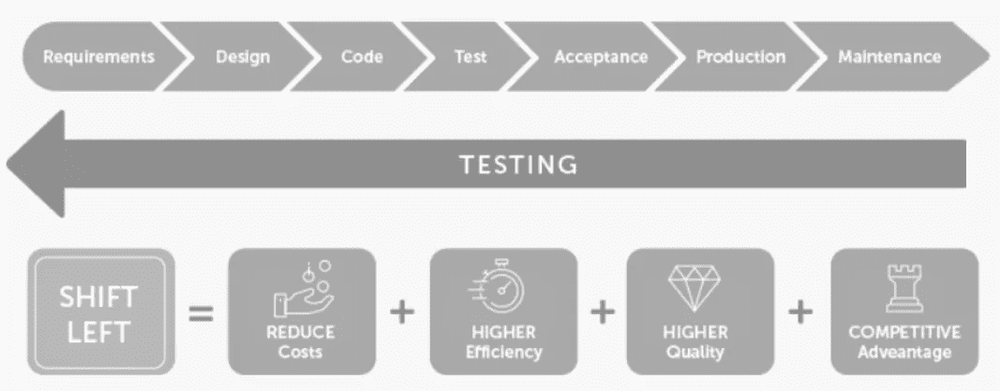

# 如何提高软件质量，降低成本并充分利用您的测试人员

> 原文：<https://medium.com/version-1/shift-left-testing-pushing-quality-upstream-d69a4111c977?source=collection_archive---------9----------------------->

作者:理查德·迪金森，第一版

在您的交付项目中，您的预算是有限的，时间表是不可能的，质量是不可测量的吗？阅读这篇文章的 95%的人都会同意这些说法——然而每个人都听说过软件行业中的左移——为什么实现起来如此困难？这个博客将带您了解为什么它很重要的简史，以及我作为测试人员 20 多年来学到的一些经验。

**为什么这很重要？**

让我们后退一步——20 年前，当我参加我的第一个测试管理课程时，软件测试方法学已经有一个公认的原则，即在开发生命周期中越早发现错误，修复它就越便宜，发布后发现的错误是最昂贵的——无论是在金钱上还是声誉上的损失。目睹的一些最臭名昭著的事件包括:

奔腾 FDIV 错误，1994

美国宇航局的火星气候轨道飞行器，1998 年

EDS 儿童支助系统，2004 年

希思罗机场 5 号航站楼开放，2008 年

比特币黑客，Mt. Gox，2011

IT 行业遵循软件开发的瀑布模型，其中测试阶段位于软件开发生命周期的最右端:

**需求= >设计= >编码= >测试**

这意味着当问题被发现时，它们已经对预算和时间表产生了重大影响——要么是由于发布延迟，要么是由于严重的设计缺陷，不得不废弃软件并重新开始。

这种认识和学到的经验教训催生了一个新概念，称为测试的**‘左移’**；换句话说，通过在尽可能接近注入点的地方发现问题或者完全避免它们，将质量添加到生命周期的每个阶段。

Shift-Left Testing — Advantage overview

# 左移测试:软件成功的秘诀

然而，由于传统的工作实践造成了很大的阻力，这种向左的移动令人惊讶地缓慢，因为它们使架构师、开发人员和测试人员彼此隔离。

直到敏捷工作实践出现，更加协作的开发方法才真正开始，但是即使在那时，在最初的讨论之后，开发人员仍然在开发，测试人员仍然在筒仓中测试——因为工作方式已经变得根深蒂固并且很难改变。

需要协作实践来打破这些孤岛，将开发人员和测试人员聚集在一起:结对编程和群殴，包括测试人员，改变了团队动态，允许更多的声音被听到(产品所有者在群殴中也是必不可少的)；测试人员可以在代码编写的时候查看代码，并提出一些问题，比如正在编写的逻辑将如何满足一个场景。

这里,“左移”原则支持测试团队在开发阶段尽可能早地与所有利益相关者合作。这种方法基于敏捷宣言，它有几个优点:

**个人和交互**流程和工具。

**工作软件**全面文档化。

**客户协作**合同谈判。

**按照计划应对变化**。

但这只是解决方案的一部分，继续阅读，找出你还需要什么…

# 测试驱动开发以及为什么你应该喜欢它

您工作过的团队有多经常遇到遗留代码，您想做更改但不敢做？或者确实敢，但随后引入生产 bug？

TDD 正逐渐成为专业人员的最佳工作实践:它被证明能产生更精简、更集中的代码；创建快速反馈循环；避免讨厌的“兔子洞”；少写 bugs 提供活文档并允许安全有效的重构。

一旦 TDD 被加入进来，你就有了一个全身心投入的团队，并且能够考虑生产开箱即用的企业就绪软件的所有方面。

关于 TDD 的应用还有很多可以说的；多少次测试就够了？测试应该写在什么水平？如何避免测试和代码过于紧密地耦合？遗留代码呢？但是我们会留到下一天。

# **变革——如何变革？**

协作测试驱动的开发让软件测试人员在他们需要的地方——开发团队的核心***——他们可以清楚地理解需求，并设计测试用例以“快速失败”，尽早修复。***

它避免了为那些本应在开发过程中发现并修复或者完全避免的问题生成无休止的 bug 报告，然后重新测试修复，从而浪费时间；相反，重点是增加项目的价值。毕竟，任何人都可以点击按钮，告诉你软件在哪里崩溃，但有经验的测试人员会发现微妙的边缘情况，考虑改善用户旅程，并增加推动质量的价值。

一个典型的工作日包括团队讨论一个故事、定义场景、发现陷阱和编写代码——首先是测试。这促使架构从一开始就是可测试的，并让测试人员从头开始参与进来，因为测试场景是首先考虑的。一旦开发人员全力以赴，测试人员可以远离人群，考虑其他因素，如发布计划和专业测试场景，但始终关注代码如何进展，留意错过的场景和不正确的业务逻辑。当代码准备好了，团队一起测试它，然后将它传递到 UAT 环境，在那里自动回归包运行，测试人员可以直接转移到其他类型的测试，*因为他们知道它已经工作了*。

它自然地推动了代码库的创建，这些代码库符合[软件测试金字塔、](https://www.perfecto.io/blog/testing-pyramid)的理想定义，具有强大的单元测试执行逻辑的基础，一层用于接口交汇处的集成测试，最后是一个小型的、有针对性的、基于端对端 UI 的测试集，这些测试驱动“快乐路径”场景。

*不确定这是否适合您的组织？让我分享一下我自己对这种质量范式转变的体验。*

# 证据就在布丁里

最近几年，我很高兴在一个团队中工作，这个团队过渡到了协作工作，将 TDD 和 BDD 结合到一个敏捷的 CI/CD 框架中，在 20 多年的时间里，这给我的日常工作带来了最大的变化。

当团队第一次切换到协作工作时，很难做出调整，通常测试人员、scrum masters 和架构师都非常热衷，而开发人员则非常抗拒。整个驾驶员/导航员设置和定时转换的全面包围是激烈的，开发人员真的害怕被他们的同行评判。事实上，团队放弃了它，几个月后，在通过更多的配对练习建立了它之后，又回到了它。随着时间的推移，他们放松了，建立了一个安全的空间，在这里每个人都可以做出贡献，提出问题并寻求解释，而不用担心评判，这成为了一种受欢迎的工作实践。

然后疫情号撞上了，我们都开始远程全职工作。在这里，我们作为一个团队合作的能力被证明是天赐良机——每天早上我们开始一个虚拟会议，并一起工作了一整天。我们对暴徒采取了一种更宽松的结构，没有计时器或司机，并根据我们的感觉轮流进行。这种合作保持了牢固的工作关系，使成员不再感到孤立，并提高了生产率。另一个意想不到的副作用是，它改善了与客户的沟通，客户以前觉得自己被冷落了，因为他们远离主 scrum 团队，不得不远程参加会议。

评估我们团队成功的一种方法是成员自己的反应:随着时间的推移，每个人都成为了这种工作方式的粉丝，并评论这种方式创造了一个多么令人满意和支持的环境。当项目结束，团队解散时，最大的问题是下一个项目会以同样的方式进行吗——人们会和潜在的雇主和经理进行面试和讨论，并询问他们采用配对、围捕、scrum 和看板、TDD 和 BDD 等方法的情况，你会先写测试吗？如果没有，为什么不呢？

**因此，我们终于有办法向左移动进行测试，从而在软件开发方法学上实现一次飞跃，生产企业级产品，通过在整个过程中提高质量来加快产品上市时间。**

*你觉得怎么样？仍然不支持协作测试驱动的开发吗？您是否愿意就在您的工作场所引入这些做法进行初步咨询，就像其他有声望的客户所接受的那样？*

*探多处:*[***version1.com/it-service/digital-services/test-as-a-service***](version1.com/it-service/digital-services/test-as-a-service)

*关于作者:Richard Dickinson 从 20 世纪 90 年代开始从事软件测试工作，那时测试人员的角色刚刚被引入这个行业。在其职业生涯中，除了处理测试交付和实施复杂项目的 DevOps 实践之外，他还进行了大量的 TMMI 评估和测试产业化工作。但根据他的说法，学习永远不会停止……*