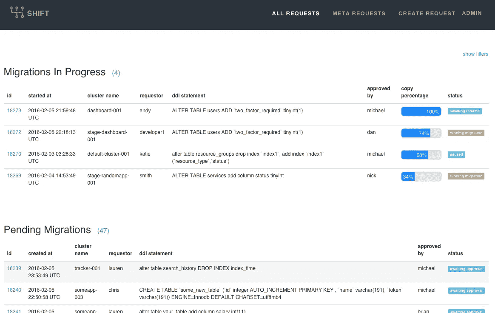

# Shift —安全、轻松的数据库迁移

> 原文：<https://medium.com/square-corner-blog/shift-safe-and-easy-database-migrations-42108ee216f?source=collection_archive---------0----------------------->

## 帮助您运行 MySQL 数据库在线模式迁移的服务。

*作者写的***。**

> *注意，我们已经行动了！如果您想继续了解 Square 的最新技术内容，请访问我们的新家[https://developer.squareup.com/blog](https://developer.squareup.com/blog)*

*Shift 是一个使 MySQL 数据库的在线模式迁移变得容易的应用程序。我们在 Square 使用它每月运行数千个数据库迁移。今天，我们很高兴能够开源这个项目，它可以在 https://github.com/square/shift 的 GitHub 上找到。*

# *一些历史*

*两年前，Square 上的几乎每个数据库都位于共享主机上，这意味着一台服务器和一个 MySQL 实例上可以有 2 到 60 个模式。在很大程度上，这实际上对我们来说很好，特别是因为我们还没有工具来管理成千上万的数据库主机。然而，这种设置的主要缺点是明显缺乏隔离性——任何一个服务表现不佳都可能中断——甚至关闭——数十个其他服务。再加上对哪个服务导致数据库主机出现性能问题缺乏了解，您就开始了解我们当时处理的问题了。可以说，共享数据库在一段时间内为我们提供了很好的服务，但是是时候开发一个更成熟的基础设施了。*

*我们决定使用容器化(通过 [LXC](https://linuxcontainers.org/) )来提供数据库之间的隔离，但在这样做时，我们必须记住一件重要的事情——随着我们生态系统中的服务数量每周都在增长(到那时已经达到数百个),我们必须确保我们的小型运营团队能够支持从共享主机的迁移。将我们所有的数据库容器化会将数十台共享主机变成数千个容器，我们需要能够无缝地处理这种转变。因此，我们的第二个目标——实际上也是更重要的目标——是让 Square 的数据库易于开发人员自行管理。Shift 是从这个目标发展而来的一项服务。*

# *引入移位*

**

*Square 的数据库模式迁移过程过去相当繁琐。它看起来像这样:*

*1.开发人员提交一个标签，解释他们想要做出的改变
2。运营团队编写了一个程序，用[pt-online-schema-change](https://www.percona.com/doc/percona-toolkit/2.2/pt-online-schema-change.html)
3 进行更改。有人批准程序
4。操作团队手动运行程序*

*或者，更糟糕的是，开发人员可能会在部署过程中意外运行迁移，这可能会导致他们的服务停机。不用说，这不是一个完善的过程。现在，所有数据库迁移都要经历转变。*

**

*在 Shift 中，开发人员可以提交他们需要在数据库上运行的迁移(修改、删除或创建一个表)。提交之后，执行一次模拟运行以确保迁移是有效的，并且收集一些关于被修改的表的基本统计信息并显示在 UI 中。考虑到这些统计数据，另一个用户必须决定是否批准迁移，可以选择以本地注释的形式留下反馈。获得批准后，即可运行迁移—只需点击一个按钮。Shift 有一些简单的挂钩，您可以插入这些挂钩来提供对哪些用户有权执行给定数据库的每个操作的细粒度控制。*

*我们在服务中内置的一些附加功能包括:*

*   *暂停和恢复迁移的能力。为此，我们为屡试不爽的 pt-online-schema-change (pt-osc)创建了一个补丁，您可以在这里找到，它跟踪文件中的迁移状态。只要保留触发器，这个状态文件就允许我们从被终止的 pt-osc 中恢复，而不会丢失任何进度。这很有用，因为我们让用户能够在数据库负载过重的情况下暂停迁移(如果负载过重，他们可以完全取消迁移，这也将删除触发器)，但当 pt-osc 由于各种原因(如失去与数据库的连接)而终止时，这也很有帮助。*
*   *支持分片数据库。创建迁移请求时，Shift 允许您多选需要运行 DDL 语句的数据库和主机，最终创建一个元请求(一组共享相同 DDL 的迁移)。元请求中的所有迁移都可以被批准、启动、取消等。，这意味着您可以在 100 个数据库上运行迁移，就像在单个数据库上运行迁移一样容易。出于安全原因，一次只允许在一个数据库上运行一个迁移(可配置)，但是当这个锁被释放时，迁移可以排队自动运行。*

*Shift 消除了更改数据库模式时容易出错的手动工作，并为运营团队节省了宝贵的时间。在撰写本文时，Shift 在一天内运行数百次迁移或运行需要数周时间才能完成的迁移都没有问题。您可以阅读更多关于它的功能和组件的信息，也可以在[https://github.com/square/shift](https://github.com/square/shift)观看演示视频。*

# *展望未来*

*在 Square 的当前工作量下，轮班工作非常有效。我们计划在不久的将来将一些功能
嵌入其中，使其更加健壮，其中一个例子就是使其更容易与开发者工作流集成(例如:与 ActiveRecord 的直接集成)。从长远来看，我们可能会实现自己的 pt-osc 版本，以支持 alter 中的“WHERE”子句(用于修剪数据)，并探索在从服务器上运行迁移，然后将它们提升为主服务器的可能性。*

# *装置*

*请遵循此处的安装指南[。](https://github.com/square/shift/wiki/Installation-Guide)*

* [## 迈克尔·芬奇(迈克尔·芬奇)

### michaelfinch 有两个可用的存储库。在 GitHub 上关注他们的代码。

github.com](https://github.com/michaelfinch)*