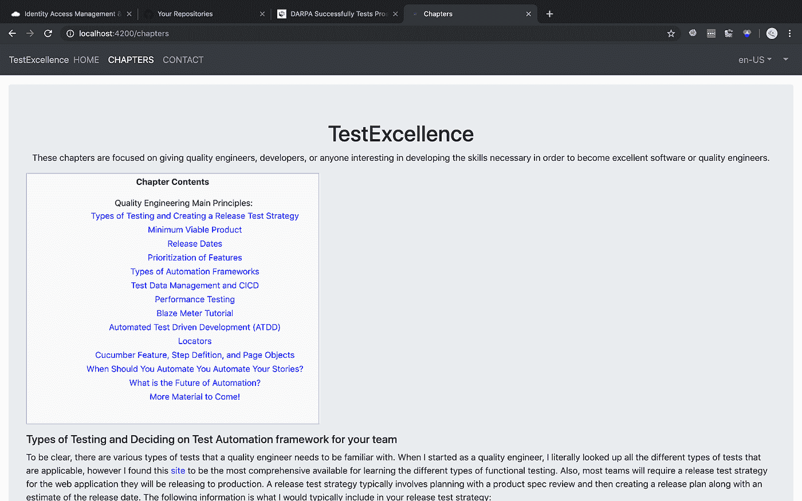
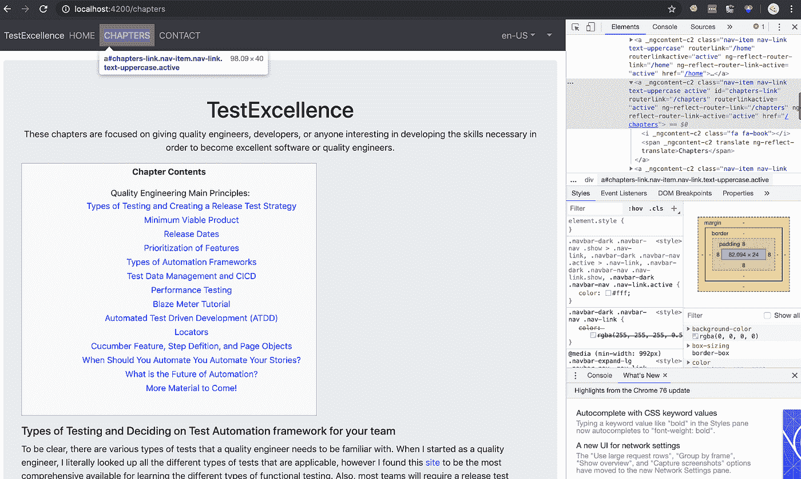
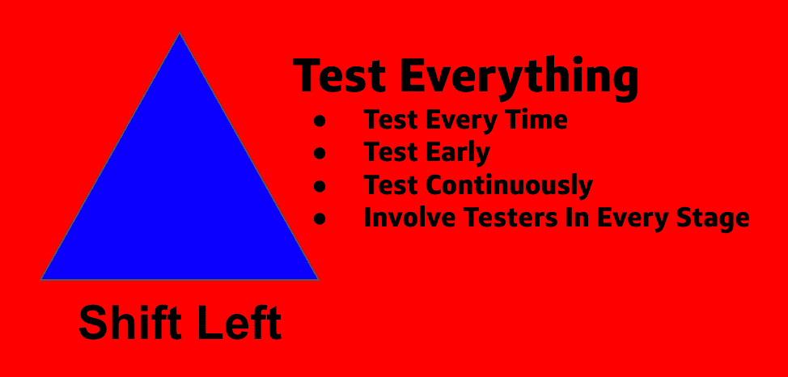

# 将敏捷团队中的测试转移到左边

> 原文：<https://medium.com/capital-one-tech/shifting-testing-in-agile-teams-to-the-left-5f3a3d647a41?source=collection_archive---------7----------------------->

## 将测试转移到左侧，以便快速高效地交付

> 你在敏捷团队中工作吗？你的团队中有测试的质量工程师或开发人员吗？

如果你在敏捷团队中工作过，你会知道团队成员很容易落入陷阱，把测试留到冲刺的最后一两天。这可能有多种原因，其中一些是，*“*我们的开发环境总是停机，所以我白天从来没有时间测试功能更改”或“代码在 sprint 的最后一两天被推送到 QA 或 Dev 区域，这没有给质量工程师足够的时间进行测试。”在我担任质量工程师的六年里，我遇到了这两种经历。我曾经在一个团队中工作，那里的 QA 或开发环境会关闭一整天，我们无法测试任何部署的代码。这些经验让我想到一个简单的解决方案:*在任何代码部署到 QA 或 dev 环境之前，首先在本地托管的环境中运行您的测试！*

测试有许多方面需要考虑，无论您是刚刚开始敏捷之旅，还是您公司的敏捷实践已经成熟，这些方面都适用。在我近六年的质量工程经验中，我遇到了你的敏捷团队在开发测试策略时应该考虑的四个要点:

1.  尽早设计场景。
2.  与团队一起回顾场景。
3.  尽早编写测试自动化。
4.  让整个团队参与所有场景的测试。

让我们一个一个地分解它们。

# 尽早设计场景

如果我们将思维模式转变为尽早设计场景，我们也能够更早地为最终用户识别所有相关的用例。为每个故事尽早设计场景对成功交付至关重要。一个建议是，一旦你计划好将什么样的故事带入 sprint，就设计测试场景。

# 与团队一起回顾场景

在您认为测试用例场景将会完成的合理时间范围内，在每个人的日程表上预定测试用例设计时间。在团队会议期间查看方案后，根据需要添加或修改任何现有方案。瓦拉！你已经完成了第一个任务。标记为关闭，烧掉那些时间！

为什么要和团队一起回顾场景？嗯，我们希望确保整个团队都了解我们是如何验证产品质量的。此外，评审会议提出了质量工程师可能没有想到的边缘案例或场景，这提高了每个单独故事的整体测试覆盖率。最终，向市场提供高质量的产品是团队的责任，因此团队参与这一过程至关重要。当我开始邀请我所有的团队成员参加测试场景评审时，我能够获得前端和后端开发人员、技术领导、产品负责人，有时还有 scrum masters 的观点。当我让整个团队参与进来时，我对我们正在构建的产品的整体技术架构有了更广泛的理解，并且更好地理解了如何在构建时测试它。

# 尽早编写测试自动化

尽早编写测试自动化也是至关重要的，尤其是如果您有多个故事，并且您的团队还没有在您用于测试的框架中成熟起来。如果你的团队中有一个质量工程师，他们应该充分意识到有时候故事会在你冲刺的最后一两天交付。在现代敏捷工作场所中，一个测试人员对应多个开发人员是很常见的(例如:每个团队有五个开发人员和一个测试人员。)在大多数情况下，质量工程师觉得有更大的责任在两到三天的时间内测试多个故事。我们怎样才能最好地减轻编写测试自动化的压力，以便整个团队能够按时交付一个故事？

组合拳来了，准备好了吗？为将要交付的每个代码库获取本地构建的 repos！困惑于我所说的在本地建立回购协议是什么意思？好吧，让我给你分解一下这个过程:

1.  写出在每个项目的特性交付阶段需要覆盖的框架内的测试场景。如果您的团队中已经有了一个框架，那么项目中已经包含了其中的一些步骤。
2.  您有向客户公开的用户界面吗？如果答案是肯定的，我的建议是在本地构建这个环境。很有可能，你的一个队友正在积极地工作在建议的存储库上。放下他们正在做的代码，开始工作！
3.  在本地构建 UI。在我目前从事的项目中，这可以通过简单的 npm 安装和 npm 启动来完成。如果您没有使用 npm，只需按照 README.md 为您的特定团队构建 UI repo。
4.  一旦 UI 托管在您的本地端口/URL 上，指向您当前使用的测试环境的 URL，并将该 URL 更改为您本地托管的开发环境。

对于下面的例子，我将参考一个质量工程师基于我正在建立的个人网站开发的特定场景:

***当我选择章节链接
时，我会导航到卓越测试页面
，然后我会看到章节页面
，我会验证章节页面*** 的内容

流程截图如下:

This is an example for my own personal website I am building

5.如果您看到上面显示的窗口，您可以看到它指向我的本地托管区域，现在剩下的唯一部分是开始运行测试！

6.在第一次测试中，我选择了章节内容部分，然后验证了章节页面的内容。为了消除测试中的碎片，我们需要为网页中的重要元素添加独特的选择器。

7.当我检查页面时，对于我想在页面上选择的每个元素，我应该看到至少一个唯一的选择器。

8.在这个例子中，我为章节导航链接添加了一个唯一的选择器。以下章节内容的唯一选择器的屏幕截图:

This is an example for my own personal website I am building

使用这种方法，在开发周期中尽可能早地开始测试自动化没有任何限制。

# 让整个团队参与进来

为了达到客户对我们的应用程序所期望的最高质量水平，我们需要对整个团队进行测试实践方面的培训。我鼓励您主持团队研讨会，以便您团队中的其他开发人员能够理解质量保证的最佳实践。此外，让他们参考 Applitools 提供的[测试自动化大学等资源，以获取更多教育资源。一旦对所有的开发人员进行了培训，鼓励他们每个人进行一个新的测试，一个他们没有为每个 sprint 开发的故事。这个过程将允许团队成员采用质量工程实践，并成为他们自己组织内高质量标准的倡导者！](https://testautomationu.applitools.com/)

# 你准备好向左移动了吗？

通过并行保持这些实践，您可以限制在提交任何已完成工作的 pull 请求时可能出现的技术债务的数量。最重要的是，这种方法还消除了对测试环境(如开发和 QA)的依赖。我们不仅将测试留给了我们的质量工程师，而且所有团队成员都将在开发过程中更快地负责执行测试。如果您有任何其他问题，请随时通过下面提供的链接联系我:

领英:[https://www.linkedin.com/in/evan-wiley](https://www.linkedin.com/in/evan-wiley)

推特:@testexcellence

*披露声明:2019 首创一。观点是作者个人的观点。除非本帖中另有说明，否则 Capital One 不隶属于所提及的任何公司，也不被这些公司认可。使用或展示的所有商标和其他知识产权是其各自所有者的财产。*