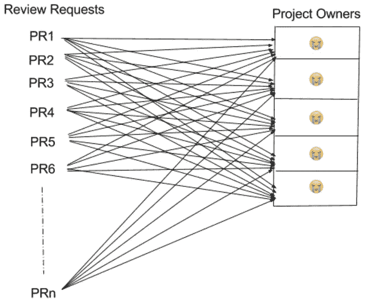

# 借助新的 PR 处理系统加快运输速度

> 原文：<https://medium.com/pinterest-engineering/shipping-faster-with-a-new-pr-processing-system-7bf3af3a53ff?source=collection_archive---------2----------------------->

Nick Zheng | Pinterest 基础设施工程经理

随着我们的工程组织的快速发展，我们开发了一个正式的流程，以确保每一段代码都有明确的所有者，并且在关键路径上做出的所有代码更改都得到相应所有者的批准。这提高了长期代码质量、健康和开发速度，并使我们成为一个更有效和协作的团队。

随着这个过程的发展，我们配置了我们的代码审查系统(Phabricator ),将请求分配给项目所有者。然而，有一些许多工程师贡献的代码路径只有少数所有者。这是一个问题，因为每个人都会收到所有相关的审阅请求，导致每个审阅更新都有不必要的通知。一些繁忙的代码库的所有者可能每天会收到 40-50 个审查请求，以及他们所有的更新。

上图显示了每个项目负责人由于大量的代码评审请求/通知而感到多么沮丧。

随着我们继续扩展工程组织，这种情况变得更糟，并阻止我们快速前进。我们知道必须有一个更好的方法，所以我们实现了一个新的系统，在团队成员之间循环传递 PR(代码审查请求)，这样每个 PR 被自动分配给一个所有者，并且每个项目所有者只接收一个项目的所有代码更改 PR 通知的 1/n(n 是项目所有者的总数)。

*上图显示了新流程如何极大地改善了每个项目负责人的状况。*

## 构建循环代码评审系统

以前，我们使用 Phabricator 的 Herald 规则向项目所有者发送相关变更的通知，但是它没有在项目所有者之间循环调度 pr 的功能。我们不得不扩展先驱规则来做到这一点。

当 PR 第一次触发这样的先驱规则时，我们以特定的顺序将项目所有者的列表保存到数据库中。从列表中选择第一个所有者，将其分配给 PR，并放在列表的最后一个位置。现在原来的第二个主人移动到第一个位置，成为第一个主人等待下一个 PR。当下一个 PR 到来时，它重复相同的过程，如下图所示。

如果我们更新项目所有者，当新的 PR 触发 Herald 规则时，列表也将被更新。一个新成员将被插入到列表中，一个被删除的成员将被移除。

下图是新扩展的 Herald 规则。

如上图所示，“以循环方式添加阻止审阅者”和“以循环方式添加非阻止审阅者”都是扩展的 Herald 规则提供的新操作。

这种方法提供了一种新的方式，以编程方式将代码评审请求分配给项目所有者，并确保项目所有者更有生产力和效率。它使我们的代码所有权更加有效和可伸缩，并最终帮助我们快速前进。

*鸣谢:扩展先驱报规则由 Nick Zheng 实施，项目成员之间 PRs 循环系统的想法最初来自基础设施团队的* [*史蒂夫·科恩*](https://engineering.pinterest.com/blog/introducing-new-open-source-tools-elixir-community) *。*