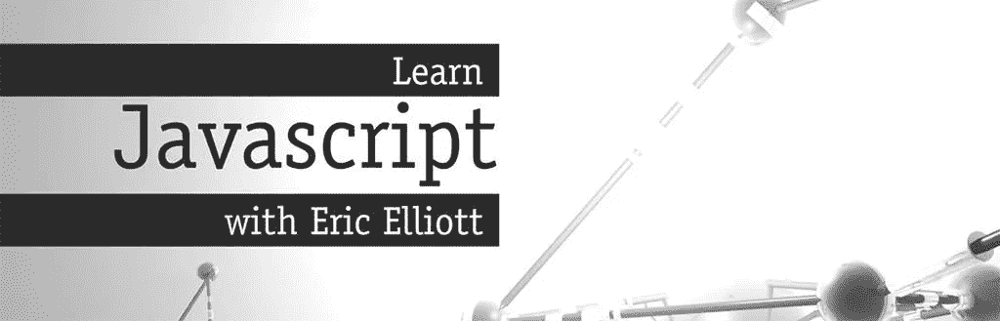

# 猎枪:从零开始建立 OSS 货币安全图书馆

> 原文：<https://medium.com/javascript-scene/shotgun-building-the-oss-moneysafe-library-from-scratch-c9117ffe5f9b?source=collection_archive---------3----------------------->


Photo: [Brandon Bailey](https://www.flickr.com/photos/luxurydesigner/) — Midnight Cowboy (CC-BY-2.0)

> 当我构建真正的软件(和开源库)时，猎枪视频系列让你与我并肩作战。

观看我使用单元测试作为指南，从零开始构建 OSS 库。Moneysafe 旨在简化 JavaScript 中的货币操作。它使用函数式编程思想来构建易于学习和使用的直观 API。

在 GitHub 上查看[货币安全图书馆。](https://github.com/ericelliott/moneysafe)

为[EricElliottJS.com](http://ericelliottjs.com/)的成员推出了一部新的 7 集散弹枪迷你剧。会员可以登录并立即观看剧集。

点击这里查看第一集:

# 什么是货币安全？

Moneysafe 是一个开源的 JavaScript 库，旨在让用 JavaScript 进行资金安全的计算变得非常简单。

用 JavaScript 编写处理金钱的软件有点麻烦。资金安全的计算比想象的要困难。

为什么？因为 JavaScript 数字是 IEEE 754 64 位浮点。结果是我们不能安全地添加货币，因为小数会被浮点舍入误差串起来。

```
.2 + .1 === .3; // false
```

然而，如果你以美分为单位进行同样的计算，然后四舍五入到最接近的美分，这个问题就不存在了。Moneysafe 将您的美元值转换成美分，然后将它们暴露给普通的 JavaScript 数学运算符，因此您可以像平常一样使用`+`、`-`、`*`、`/`。

## 用安全的钱

从 npm 安装:

```
npm install --save moneysafe
```

然后导入并使用:

```
import { $ } from 'moneysafe';$(.1) + $(.2) === $(.3).cents;
```

甚至更好。对于购物车等常见计算，有一个方便的分类帐表单:

```
import { $ } from 'moneysafe';
import { $$, subtractPercent, addPercent } from 'moneysafe/ledger';$$(
  $(40),
  $(60),
  // subtract discount
  subtractPercent(20),
  // add tax
  addPercent(10)
).$; // 88
```

# Moneysafe 是如何运作的？

它的工作原理是以美分而不是美元来存储和处理金额，这减少了将金额表示为十进制美元时的浮点舍入误差。当然，在大量的乘法和除法运算中，您仍然会遇到舍入误差，但是当换算到美分时，误差就不那么常见和显著了。

关于金钱的最佳实践是以完全浮点精度用美分进行计算，然后在准备使用最终值时四舍五入到最接近的美分。

那些`$()`符号*不是 jQuery。*这是一个货币工厂，它将您的计算从美元值扩展到美分，并添加了一些方便的工具，如自动舍入到最近美分的`money.$`和`money.cents`getter，以及允许您使用普通 JavaScript 数学运算符的`money.valueOf()`方法。

# 货币安全准确性注释

关于准确的货币计算有很多误解。以下是 Moneysafe 使用原生 JavaScript `Number`类型的原因:

## 小数类型不能修复舍入误差

有些人认为“只使用小数类型”是货币计算中浮点舍入误差的好解决方案，但这种观点是错误的。

**所有的小数类型都有舍入误差**，无论基数还是精度，因为有些分数没有无限位数是无法准确表示为小数的。一些必须以 2 为基数舍入的分数以 10 为基数是有限的。这导致了混乱，但是*并没有使基数 10 更精确。*

例如，`5/6`总是取整，不考虑基数。`1/3`始终以 10 为基数四舍五入。同样，如果您的 decimal 类型被设置为 2 小数精度(对于美分)，那么如果不进行舍入，您就不能准确地表示`1/1000`——这是那些认为他们可以“只使用 decimal 类型”来进行精确货币计算的人的常见错误。

当你从基数为 2 的浮点数转换到基数为 10 的十进制数时，你所要做的就是改变*哪些分数*会产生舍入误差。

一些十进制类型在每次计算时会自动舍入到最接近的美分，但是**这会使精确度更差，而不是更好，**在小得多的十进制精度下引入累积舍入误差。

**Moneysafe 使用完整的 IEEE 754 浮点十进制精度来计算分的小数部分。**

在 Moneysafe 中，IEEE 754 给了我们十进制精度的大概 **16 位小数。**

与大多数十进制库不同，每次计算都会保留整个可用精度范围，而不是四舍五入。我们不会因为每次计算的舍入而使舍入误差变大。我们只在用户说是时候取整的时候取整，所以取整误差尽可能小。

我们通过鼓励使用`.$` getter 来实现自动舍入，当您需要得到以美元为单位的值时，或者当您需要以美分为单位的值时，使用`.cents`，舍入到最接近的美分。

## Moneysafe 对所有整分数值都有完美的表示准确性。

整分精度还扩展到所有的`+` & `—`计算。无舍入意味着无舍入误差。

## 函数式编程的货币组合

Moneysafe 使用可组合函数作为数据类型。要了解其工作原理，请查看[“组合软件”系列](/javascript-scene/composing-software-an-introduction-27b72500d6ea)(了解[函数组合](/javascript-scene/master-the-javascript-interview-what-is-function-composition-20dfb109a1a0)、[高阶函数](/javascript-scene/higher-order-functions-composing-software-5365cf2cbe99)、[归约](/javascript-scene/reduce-composing-software-fe22f0c39a1d))，尤其是[“带函数的可组合数据类型”](/javascript-scene/composable-datatypes-with-functions-aec72db3b093)帖子。

# 后续步骤

想了解更多关于 TDD 和 JavaScript 函数式编程的知识吗？

[跟 Eric Elliott 学 JavaScript】。如果你不是会员，你就错过了！](http://ericelliottjs.com/product/lifetime-access-pass/)

[](https://ericelliottjs.com/product/lifetime-access-pass/)

***埃里克·艾略特*** *是* [*【编程 JavaScript 应用】*](http://pjabook.com) *(O'Reilly)的作者，也是*[*devanywhere . io*](https://devanywhere.io)*的联合创始人。他为 Adobe Systems 的******尊巴健身*******华尔街日报*******ESPN*****BBC**等顶级录音师贡献了软件经验******

**他和世界上最美丽的女人一起在任何他想去的地方工作。**