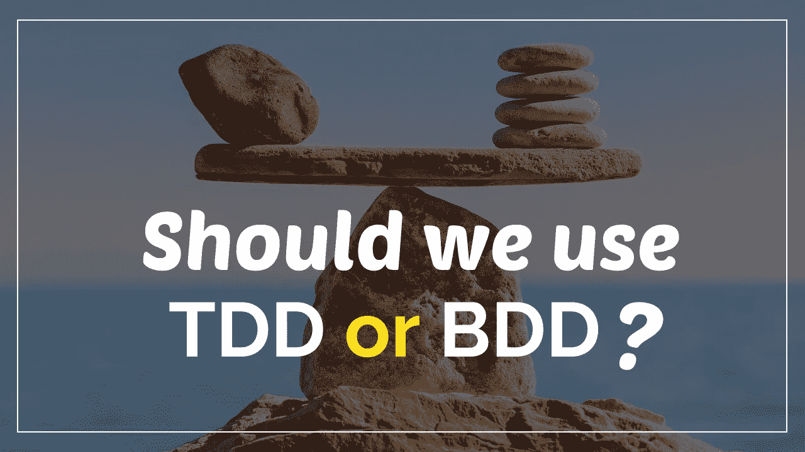

# 我们应该使用 TDD，BDD…还是两者都用？

> 原文：<https://medium.com/walmartglobaltech/should-we-use-tdd-or-bdd-or-both-801b6a2c6f31?source=collection_archive---------0----------------------->

Photo by styf22

# 测试驱动开发和行为驱动开发，哪个更好？

这两个，TDD 和 BDD 你肯定听过不少。但是哪个软件开发过程是最好的，为什么它比另一个更好？

# 答案可能会让你吃惊，但请继续读下去。

> 什么是 TDD？

测试驱动开发(TDD)是一个在编写代码之前编写测试的过程。在 TDD 中，对一小部分代码的测试被称为单元测试，编写这一测试将先于那部分程序的编码。这个过程将一直重复，直到程序的每个单元都被覆盖并通过测试。为新代码编写单元测试比为现有代码编写单元测试容易得多，但是这并不意味着它很容易。

TDD 中的关键挑战是隔离测试单元。隔离意味着编写排除被测试代码的任何实际依赖的测试，并且让测试范围只覆盖单元的方法或类。

> 隔离测试有什么好处？

通过运行隔离的单元测试，开发人员将能够更快更容易地发现并修复他们程序中的任何缺陷。当一个失败的测试发现一个缺陷时，将只有一小部分代码需要检查和调试。

如果单元测试是在没有隔离的情况下完成的，这意味着它将使用实际的运行时类和组件来实现代码依赖，那么测试结果可能是不可预测的。例如，一个单元测试需要从一个外部数据库中读取数据，并期望从数据库中得到某些值，如果外部数据库发生变化，这个单元测试可能会失败。测试的完整性在每次运行时都会受到质疑，因为根据数据库提供的值，同一个单元测试可能会失败，也可能会成功。单元测试的外部依赖性，比如数据库，会导致结果的不可预测性和不一致性，使得跟踪代码中的缺陷更加困难。由于测试和它所依赖的外部资源之间的交互延迟，单元测试的速度也会变慢。当一个开发人员必须运行数百个测试时，低测试速度是一个大问题。

> 隔离听起来不错，但是我如何隔离我的单元测试呢？

隔离单元测试的一种方法是提供模拟，这是可以模拟实际依赖关系的假对象。通过用快速模拟替换外部资源来运行测试通常会显著提高测试的速度。可以编写模拟，使得它们每次都将返回一些预期的结果，甚至可以执行验证规则或计算被测试单元中的方法被调用的次数。

然而，为单元测试编写模拟可能是乏味和耗时的。有一个选项可以通过使用模拟框架来缩短测试时间。像这样的框架通常提供一个接口来创建模拟对象，这些模拟对象基于一组预定义的参数返回固定的响应或抛出异常。嘲笑框架在 TDD 过程中是必不可少的。创建我们自己的嘲笑框架是可能的，但它可能会延迟我们的发展，不必要地耗尽我们的资源(时间和人力)。

> 回到 TDD。那里面有什么？

由于每个单元测试的覆盖范围很小，TDD 可以帮助开发人员有效地检测代码中的缺陷，最大限度地减少了在体系结构的各个层中跟踪缺陷所花费的时间。

> 那么，什么是 BDD 呢？

在行为驱动开发(BDD)中，测试用简单的英语编写，将一组行为描述为软件系统的预期结果。每个测试都被称为行为测试，分为三个部分；背景、事件和结果。上下文是开始状态，事件是用户所做的事情，结果是事件之后的预期结果。行为测试可以在任何时间编写——在开发之前、期间或之后——而在 TDD 中，单元测试应该总是在开发之前编写。在 BDD 中，开发后编写行为测试没有特别的困难。

也就是说，理想情况下，在 BDD 中，测试也将在代码之前编写，尤其是当一个新特性被开发时。在编写代码之后，如果测试失败(行为不像预期的那样)，那么代码将被重构；如果它成功了，那么开发人员可以继续下一个功能，并在之后对其运行相应的行为测试。简而言之，它被称为行为驱动，因为它强调基于业务目标和期望的行为来开发特性。

> BDD 的优势是什么？

BDD 的本质是用简单的英语来描述系统的预期行为结果，它允许非技术人员(业务负责人、销售、产品管理)专注于对最终用户真正重要的行为。它促进了更多的企业参与产品开发。

行为驱动开发还可以帮助开发人员更加专注于编写刚好符合预期行为框架并通过测试的代码。它可以防止他们写太多的代码，或者写一些不必要的代码。

> 有什么缺点吗？

一般来说，行为测试比单元测试运行得慢。此外，当测试失败时，它不能指出问题的根本原因；只是“它没有按照它应该的方式工作”。

> TDD 和 BDD 之间的主要区别是什么？

在 TDD 中，单元测试本质上是技术性的，这使得读者和作者仅限于开发人员或测试人员。然而，在 BDD 中，行为测试通常由更了解客户的人来决定，比如产品所有者或经理。由于行为测试的本质相对类似于简单的英语，它可以被任何人阅读和评估——利益相关者、企业主、产品经理、开发人员和测试人员。

TDD 也可能比 BDD 更快，因为 BDD 在编写测试之前需要更多的设置和团队间的沟通。单元测试可以利用模拟作为实际依赖的替代，开发人员甚至可以通过使用模拟框架节省更多的时间。此外，在 TDD 中，开发人员可以轻松高效地检测 bugs 然而，在 BDD 中，行为测试可以报告程序中的故障，但不能揭示失败代码的确切部分。

说到代码覆盖率，越高，以后的代码维护就越容易。然而在单元测试中，代码覆盖率很少高于 90%。然而在行为测试中，代码覆盖率往往更高，甚至高达 100%。

由于其高层次的本质，随着时间的推移，行为测试更容易维护，这意味着随着代码的变化，测试的变化会更少；对代码的大多数更改不会影响软件的高级行为。另一方面，每当代码改变时，单元测试通常也需要改变。单元测试也特定于它们所覆盖的代码；例如，编程语言或其框架的变化将导致单元测试的变化。在 BDD 中，行为测试将保持不变，即使编写程序的语言完全改变了。

> 那么，TDD 和 BDD 哪个更好呢？

最佳实践实际上是实现这两种方法，因为它们实际上很好地互补。行为驱动开发利用行为测试来指导团队构建向客户交付确切价值的产品，并防止开发中不必要的代码。与测试驱动的开发相结合，单元测试也将提高产品的质量，因为 bug 将被更快地发现和修复，而不必等到以后在架构中已经建立了更多的层时才爆发。