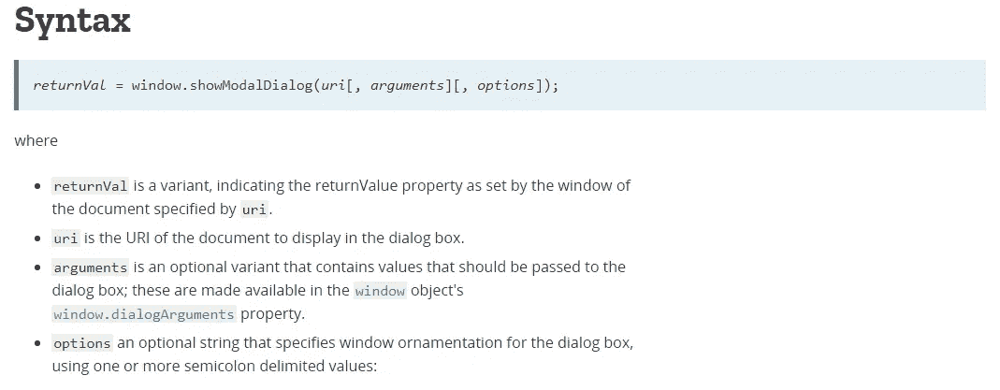
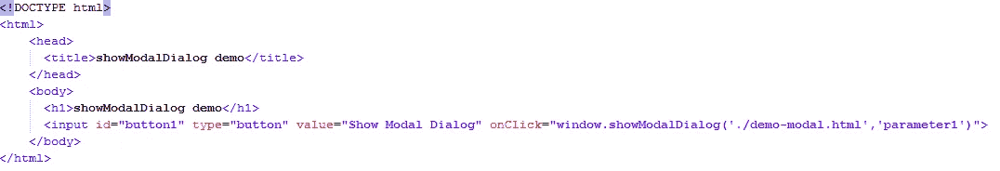
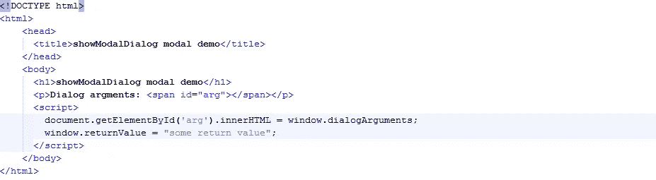
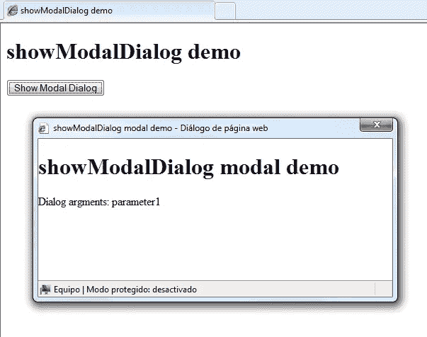
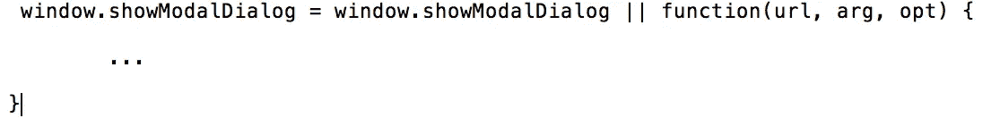

# 在 Javascript 中显示模式对话框

> 原文：<https://medium.com/quick-code/show-modal-dialog-in-javascript-216ad291fd5?source=collection_archive---------1----------------------->

看来 Javascript 世界发展的越来越快了。有改进语言的新功能，新标准，如 ES6 …但也有一些不再存在的功能。这就是 **window.showModalDialog** 函数的情况。

我在一个旧项目中工作，主要的网络浏览器是 Internet Explorer 8(我知道，我在史前工作！！！)现在，客户希望将整个项目迁移到新版本的浏览器(主要是 Mozilla 和 Chrome)

正如我之前所说，在新版本的浏览器中， **window.showModalDialog** 功能已经消失，因此，我不得不寻找其他替代功能。

根据[***MDN***](https://developer.mozilla.org/en-US/docs/Web/API/Window/showModalDialog)***，*******window . showmodaldialog****创建并显示一个包含指定 HTML 文件*的模态对话框。Sintax 非常简单:*

**

*如你所见，函数需要一个 URL(显然！！！)**但是，**如果你愿意(是可选的)，它也可以带一些参数(和选项，但在这种情况下，这无关紧要)，你可以在新窗口(模态对话框)中得到*

*让我们看一个例子:*

**

*In the main window, the function **window.showModalDialog** is called, with some parameters (“parameter1”)*

**

*In the modal dialog box opened, you can get the arguments (in this case “parameter1”) and return a value*

**

*So, you get something like this*

*一旦你知道它是如何工作的，让我们把注意力集中在真正的问题上(记住这个特性已经过时了，在新版本的浏览器中已经被删除了，比如 Chrome 或者 Firefox)*

*如果你在 Firefox 中研究“ **window.showModalDialog** 或者在 Chrome 中研究“ **window.showModalDialog** ”(我的项目不支持 Safari。由于这个原因，Safari 没有出现在我的研究中)，你会发现“ [*这个方法在 Chrome 43 中被移除，而 Firefox 56*](https://developer.mozilla.org/en-US/docs/Web/API/Window/showModalDialog)*”**

*寻找不同选择的第一步是知道你需要什么。例如，如果你在许多 HTML 或 JS 文件中使用这个函数，你将需要完全相同的函数，具有相同的名称和相同的参数(你不必寻找所有的调用并改变它们。你可以变得疯狂！！！)*

*在这种情况下，您需要一个聚合填充。[*" A****poly fill****是在不支持特性*](https://en.wikipedia.org/wiki/Polyfill_(programming)) *的 web 浏览器上实现特性的代码。听起来很完美，不是吗？但是……我们怎样才能做到呢？答案很简单……然而，实现起来有点棘手。**

*最好的方法是使用 [<对话框> HTML5 元素](https://www.w3schools.com/tags/tag_dialog.asp)。像往常一样，这个元素的主要问题是与 web 浏览器的兼容性。如今，Chrome 是唯一支持它的浏览器。[微软 Edge](https://developer.microsoft.com/en-us/microsoft-edge/platform/status/dialogelementformodals/) 已经在考虑这个元素，而 [Firefox](https://caniuse.com/#feat=dialog) 已经在新版本中发布了这个元素(从版本 57 开始)，但是要使用这个元素，你必须在 about:config 中启用“dom.dialog_element.enabled”。*

*要解决这个问题，您可以重写函数:*

**

*通过这种方式，如果你使用 Internet Explorer 8、Firefox 或 Chrome，你将执行真正的功能或新的实现(这种替代方案的真正问题是 Microsoft Edge。在我的例子中，客户认为没什么大不了的)*

*如果你认为这种选择是有趣的，你必须检查 [niutech 实现](https://github.com/niutech/showModalDialog)。*

*如果你不在乎函数的名字和参数，你可以找到更多的选择。强烈推荐 2021 年[学 Javascript](https://blog.coursesity.com/best-ecmascript-courses/) 编程。*

*如果你寻找“窗口模态”，你会发现 Bootstrap 是最著名的显示模态对话框的框架。主要问题是与旧的 web 浏览器(例如，Internet Explorer 8)的兼容性，但是如果您使用 1.9.1 版本的 JQuery，它也可以工作。*

*除了 Bootstrap，您还可以寻找其他库或其他实现。我没有找到足够好的。有一些很好的实现，如 JQueryUI Dialog，但它没有提供与 showModalDialog 相同的功能(您必须考虑到您可以使用 iframe 导航到 URL，并显示带有 Boostrap 的模态窗口)*

*正如你所看到的，除了 window.showModalDialog 之外，没有任何好的替代品。它停止代码执行，直到对话关闭，对话结果返回给调用者。出于这个原因，我们必须重构代码，使用回调函数(或者可能是承诺)来代替。*