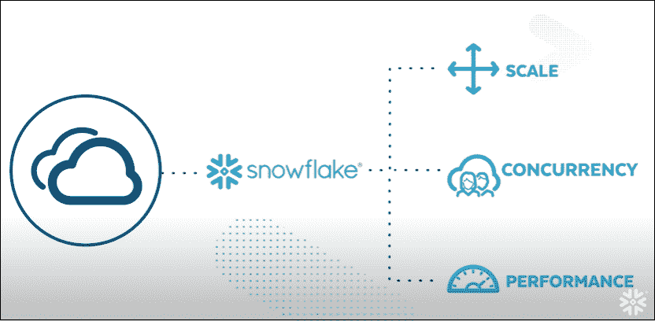
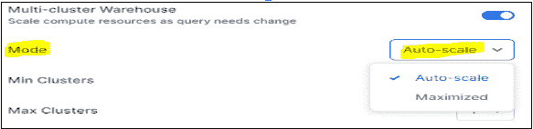
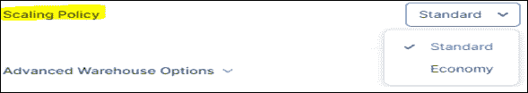
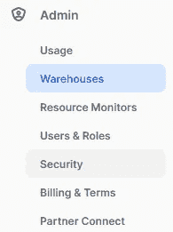
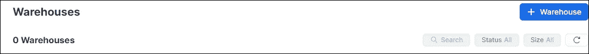
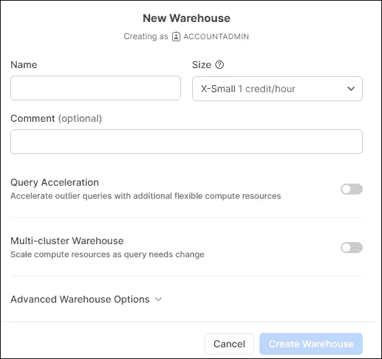
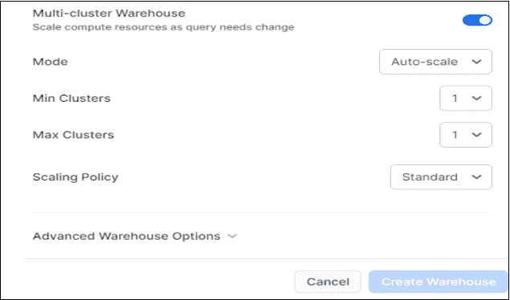
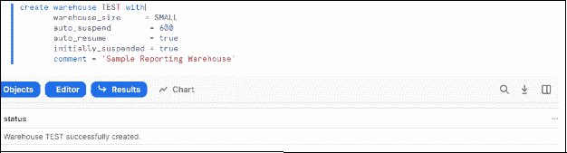
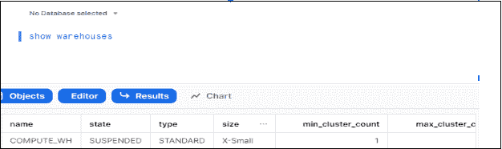

# 雪花:为云构建的数据仓库

> 原文：<https://medium.com/globant/showflake-a-data-warehouse-for-the-cloud-7aca70f5a155?source=collection_archive---------0----------------------->

## 调整计算能力以满足不断变化的需求



Picture Courtesy: [Warehouse](https://www.youtube.com/watch?v=aSEu8cAtcKA&list=PL4IM5KTx_T7hfAKKl_fLtr_yprrtXcvNu)

在这篇博客中，我们将看到如何创建一个雪花型多集群仓库，以及如何使用它来优化和高效地处理组织的数据。

# 雪花中的多簇仓库

为什么我们需要雪花多集群仓库？

与银行业一样，每天收到的数据是数百万甚至数万亿条记录，在数据仓库中处理这些数据时会出现性能问题。为了克服这个问题，实现了一个[雪花多集群仓库](https://docs.snowflake.com/en/user-guide/warehouses-multicluster.html)。

虽然典型的虚拟仓库只有一个集群的处理资源，但是多集群仓库可以包含多达十个集群。然而，您的雪花帐户中可以拥有的多集群仓库的数量给了您无限的能力来更快地处理数据。

## 利益

以下是雪花多集群仓库的主要优势。

*   **自动调整大小**:当使用自动缩放模式时，您不需要像在常规仓库中那样调整仓库大小来适应波动的查询。此外，根据需要，您可以在最大化模式下控制多群仓库容量。雪花会帮你处理的。
*   **时间旅行**:被更改或删除的数据可以在指定的时间段(即 90 天的时间范围)内随时访问。
*   **自动防故障**:除了时间旅行之外，在系统崩溃或其他情况下，自动防故障保护先前数据的保护(例如，安全漏洞)；它最多支持 7 天。

## **功能**

多集群仓库的功能仅在雪花的企业版中可用，它使您能够为运行查询提供更大的处理能力池。

## 操作模式

雪花型多集群仓库有两种操作模式:

*   **最大化模式** —该模式对静态控制可用资源有效。如果我们有大量的并发用户会话和查询，并且数量没有显著波动，我们将选择这种模式。
*   **自动扩展模式** —如果仓库的并发用户会话或查询数量增加或减少，则该模式会自动启动或关闭额外的集群，直到达到为仓库定义的最大或最小数量。

下图显示了如何在雪花 Web 界面中选择模式。



Multi-Cluster Warehouse Mode

## [雪花缩放策略](https://www.youtube.com/watch?v=orwPD5nxCN4)

只有在自动扩展模式下运行时，多群仓库的扩展策略才适用。在最大化模式下，所有集群并发运行，因此不需要启动或关闭单个集群。



Type of scaling policy

在雪花多集群仓库中有两种类型的扩展策略。

*   **标准**:如果数据量巨大，并且用户想要更好的性能，那么他们可以选择标准的扩展策略。与经济相比，标准消耗更多信用。
*   **经济**:它支持节约信贷，优先考虑成本而不是性能。如果用户可以牺牲性能，他们可以选择经济缩放策略。系统将需要排队一段时间，但这将节省成本。

# **如何在雪花中创建多集群仓库**

您可以使用 Snowflake web 界面或 SnowSQL 创建多集群仓库。

## **使用雪花网络界面**

以下是应用 web 界面的步骤。

1:转到管理-仓库。下图显示了您将看到的内容。



Warehouse creation

2:点击 **+仓库**创建一个新的仓库。此图显示了如何创建新仓库。



Create New Warehouse

3:点击新建仓库后，您需要输入仓库名称等详细信息，根据您的要求，您需要选择仓库大小。如需更多了解，请阅读[确定仓库规模](https://docs.snowflake.com/en/user-guide/warehouses-overview.html)。



Detail View to create a new warehouse

4:您必须选择本博客前面讨论的模式和缩放策略；然后点击创建仓库。



Warehouse Mode and Scaling policy

## 使用 [**SnowSQL**](https://docs.snowflake.com/en/user-guide/snowsql.html) **命令行**

SnowSQL 命令行客户端连接到 Snowflake，允许用户运行 SQL 查询并执行所有 DDL 和 DML 活动，包括从数据库表加载和卸载数据。

```
Create warehouse Test with
       warehouse_size     = SMALL
       auto_suspend       = 600
       auto_resume        = true
       intially_suspended = true
       comment = 'Sample Reporting Warehouse'
```

请参见下图中创建仓库的 SQL 查询。



SnowSQL query to create a warehouse

在下面 SQL 命令的帮助下，用户可以在雪花中检查仓库。

```
show warehouses
```

上述查询的结果将显示所创建仓库的详细视图。



Snowflake web interface

# **总结**

在这篇博客中，我向您介绍了如何创建雪花多集群仓库以及多集群仓库的好处。我希望这篇博客对你有所帮助，并激发你对这个话题的兴趣。

## **有用链接**

如果你想了解更多关于雪花多集群仓库的信息，你可以通过下面的链接。

[雪花文档](https://docs.snowflake.com/en/user-guide/warehouses-multicluster.html)

[雪花定价和成本](https://www.snowflake.com/pricing/)

*拜*[费德里科](https://fkereki.medium.com/) *！！*

感谢费德里科·克里基