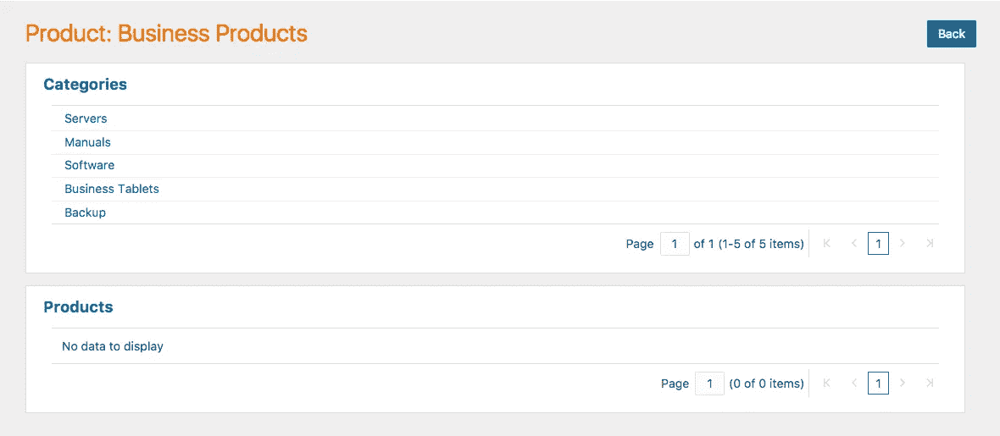

# 在 Visual Builder 云服务中显示 Oracle Sales Cloud 的产品目录

> 原文：<https://medium.com/oracledevs/showing-a-product-directory-from-oracle-sales-cloud-in-visual-builder-cloud-service-c61b708ce62f?source=collection_archive---------1----------------------->

Oracle 销售云(OSC)REST API 包含产品组和产品的资源。由此，组织可以构建更深层次的产品目录。但是在像 VBCS 这样的 REST 客户端中显示和导航这些目录是有挑战性的。

在 VBCS 定制代码大师 David Konecny 的帮助下，我们最近构建了一个目录，如下所示:



[产品组 REST API](http://docs.oracle.com/cloud/latest/salescs_gs/FAAPS/api-Product%20Groups.html) 有以下特点:

*   产品组(*/crmRestApi/resources/11 . 13 . 0 . 0/setupSalesCatalogs*)有称为子组和产品的子组。
*   产品组的子组(*/crmRestApi/resources/11 . 13 . 0 . 0/setupsalestacations/{ prod groupid }/child/ProductGroupSubgroupAdministration*)不是常规的产品组，并且不具有其所有属性，尤其是子组的子组列表。
*   类似地，产品组中的产品(*/crmRestApi/resources/11 . 13 . 0 . 0/setupsalestocals/{ prod groupid }/child/productgroupproducsetup*)不是常规产品(*/crmRestApi/resources/11 . 13 . 0 . 0/products*)，并且缺少关键属性。

这里的问题是，当您深入其中一个子组时，您想要显示的不是一个*ProductGroupSubgroupAdministration*对象，而只是一个普通的旧产品组。要做到这一点，我们必须插入一些自定义代码。

1.  放下一个列表，并将其挂接到产品组业务对象。仅启用详细信息操作。
2.  在产品组详细信息页面中，删除一个列表并将其绑定到子组。不要添加任何 CRUD 操作页面。
3.  选择子组名称，然后转到属性检查器中的“操作”选项卡。添加新的自定义操作。
4.  将自定义 JavaScript 块添加到操作中，并输入以下代码:

```
**// Replace com_oracle_abcs_fa_V7OhT with the variable used in your page
// Get the ProdGroupId for the subgroup**
var prodId = $com_oracle_abcs_fa_V7OhT_setupSalesCatalogs_ProductGroupSubgroupAdministrationListArchetypeRecord.getValue('ProdGroupId');**// Create a new record with the ProdGroupId**
var record = new Record({'_breeze_system_id' : prodId});**//  Navigate to the ProductGroup details page and pass in the record with the ProdGroupId** Abcs.Pages().navigateToPage('com_oracle_abcs_fa_V7OhT_setupSalesCatalogsPage',
    ContextualData.createRecordToEditContext({entityId: 'com.oracle.abcs.fa.V7OhT.setupSalesCatalogs', data: record}));
resolve();
```

要设置产品链接，请执行相同的操作。

1.  拖放到列表中，并将其绑定到产品组的产品子级(*ProductGroupProductSetup*)*)。*
2.  *将产品名称上的操作设置为以下自定义 JavaScript:*

```
*var prodId = $com_oracle_abcs_fa_V7OhT_setupSalesCatalogs_ProductGroupProductSetupListArchetypeRecord.getValue('InventoryItemId');var record = new Record({'_breeze_system_id' : prodId});Abcs.Pages().navigateToPage('ProductDetail',
    ContextualData.createRecordToEditContext({entityId: 'com.oracle.abcs.fa.xPiEu.products', data: record}));
resolve();*
```

*这里假设您已经创建了 ProductDetail 页面，方法是转到页面列表，创建一个 Detail 类型的新页面，并将其绑定到 Product(*/crmRestApi/resources/11 . 13 . 0 . 0/products*)业务对象。*