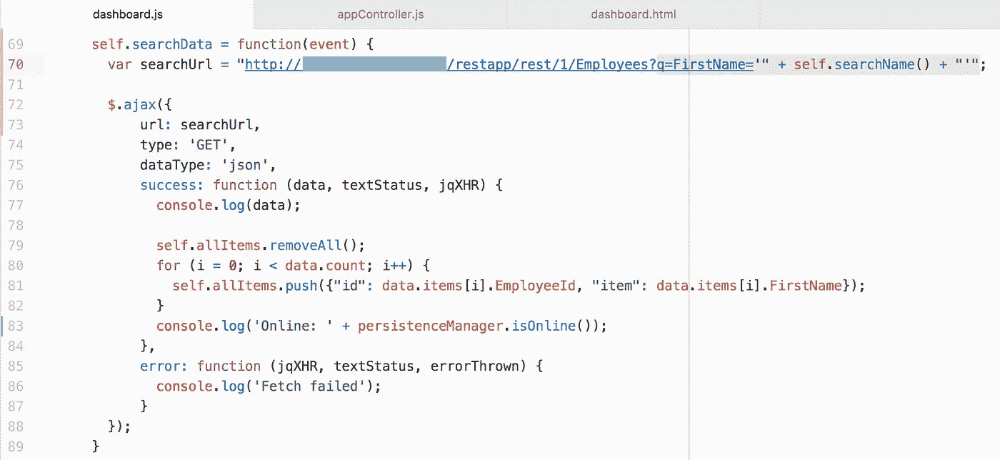

# JET 中的 Oracle 离线持久化分解和查询

> 原文：<https://medium.com/oracledevs/shredding-and-querying-with-oracle-offline-persistence-in-jet-8b67fe47c86?source=collection_archive---------1----------------------->

我觉得离线功能话题应该会成为未来的一个趋势。Oracle 已经提供了离线解决方案——Oracle 离线持久性工具包，这真是太好了。这是我的第二篇关于离线支持的帖子，请阅读上一篇帖子— [Oracle 离线持久性工具包 JET 的简单 GET 响应示例](http://andrejusb.blogspot.lt/2018/01/oracle-offline-persistence-toolkit.html)。我已经用示例应用程序测试并解释了它如何处理简单的离线获取响应。今天，我想更进一步，看看如何过滤离线数据——离线粉碎和查询。

示例应用程序正在获取雇员列表——获取雇员按钮。它显示在线/离线状态—参见右上角的图标。我们在线，并且持久性工具包缓存了 GET 响应:

我们可以很容易地测试离线行为——这可以通过 Chrome 开发者工具来完成——打开离线模式。顺便说一下，查看 GET 请求的*发起方*字段——它来自 Oracle 离线持久性工具包。正如我在之前的[帖子](http://andrejusb.blogspot.lt/2018/01/oracle-offline-persistence-toolkit.html)中提到的——一旦启用了持久性工具包，所有 REST 调用都将通过工具包，这就是它能够缓存响应数据的方式:

离线时，单击 Get Employees 按钮—您应该会看到从缓存返回的数据。您注意到了吗——右上角的图标被更改为表示我们处于离线状态:

好了，现在我们来看看粉碎机制是如何工作的(更多信息请阅读 [GitHub](https://github.com/oracle/offline-persistence-toolkit) )。离线时，我们可以搜索缓存数据子集。*通过名称*进行搜索，它从缓存条目中获取 *Lex* :

切换到联机状态，再次调用相同的操作，但使用不同的名称— REST 调用将按预期对后端服务器进行调用。同样，它对 JET 开发人员是透明的，无需担心应用程序状态是在线还是离线，在两种情况下都会执行相同的 REST 请求:

让我们快速看一下实现部分(完整的例子可以在我的 [GitHub](https://github.com/abaranovskis-redsamurai/persistencejetapp) 库中找到)。

在线/离线状态图标由可观察变量控制:

确定在线/离线状态非常简单。我们需要为联机/脱机添加事件监听器，并相应地重置可观察变量:

持久性工具包支持*简单*和 *Oracle* 粉碎/查询处理程序。我使用 ADF BC REST 作为后端，所以我选择 oracleRestJsonShredding 和 oracleRestQueryHandler。Oracle shredder 理解 ADF BC REST 返回的 REST 结构。Oracle 查询处理程序支持 ADF BC REST 脱机过滤的过滤参数—这允许联机和脱机使用相同的查询格式。我很高兴看到 Oracle 查询处理程序明确支持 ADF BC REST — [查询处理程序](https://oracle.github.io/offline-persistence-toolkit/queryHandlers.html):

在线和离线执行带有过滤的相同 REST 调用:

*原载于 2018 年 2 月 17 日*[*andrejusb.blogspot.com*](https://andrejusb.blogspot.lt/2018/02/shredding-and-querying-with-oracle.html)*。*