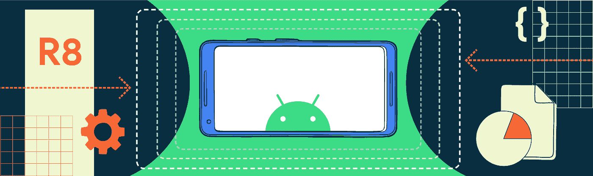

# 用 R8 缩小你的应用

> 原文：<https://medium.com/androiddevelopers/shrinking-your-app-with-r8-909efac25de4?source=collection_archive---------0----------------------->

*由软件工程师索伦·杰希和软件工程师克里斯托夫·亚当森发布*

下载量和安装占用空间较小的应用更有可能被安装并持续安装，尤其是在新兴市场。有了 R8 编译器，您现在可以通过收缩、混淆和优化获得更全面的支持。

在本帖中，我们提供了在 R8 可用的特性的概述，您可能期望的代码大小的减少，并展示了如何在 R8 启用这些特性。

# R8 缩小特征

R8 提供了四个旨在减少你的 Android 应用程序大小的功能:

*   **摇树**:使用静态代码分析发现并移除不可达代码和未实例化类型。
*   **优化**:通过移除死代码、选择性内联、移除未使用的参数和类合并来优化代码大小。
*   **标识符重命名又称混淆**:使用短名称和压缩包名称空间。
*   **减少调试信息**:规范化调试信息，压缩行号信息。

# 为什么我们需要 R8 萎缩

当你编写一个应用程序时，所有的代码都应该服务于一个目的，并实现应用程序中的功能。但是大部分 app 都使用第三方库，比如 [Jetpack](https://developer.android.com/jetpack) 、 [OkHttp](https://square.github.io/okhttp/) 、 [Guava](https://github.com/google/guava) 、 [Gson](https://github.com/google/gson) 和 [Google Play Services](https://developers.google.com/android/guides/overview) ，用 Kotlin 编写的 app 总是包含 [Kotlin 标准库](https://kotlinlang.org/api/latest/jvm/stdlib/)。当您使用这些第三方库之一时，通常每个单独的库只有很小一部分在您的应用程序中使用。如果不收缩，所有库代码都会保留在您的应用程序中。

您的代码也可能比实际需要的要大，因为冗长的代码有时会提高可读性和可维护性:例如，您可能会努力使用有意义的变量名和生成器模式，以便其他人更容易查看和理解您的代码。但是这些模式是以代码大小为代价的——通常，您自己编写的代码提供了大量缩减的机会。

# 启用应用程序的 R8 收缩

要让 R8 为发布版本收缩你的应用，在你的应用主`build.gradle`文件中设置`minifyEnable`为真，如下所示:

不要让这个名字迷惑了你——它会让 R8 退缩。

# R8 会将你的应用程序缩小多少？

R8 可以大大减少你的应用程序的大小。例如，去年的 Google I/O 应用程序在收缩前为 18.55 MB，包含 150，220 个方法和 3 个 dex 文件。收缩后，该应用程序减少到 6.45 MB，包含 45，831 个方法和 1 个 dex 文件。R8 节省了 65%的 dex 大小(用 Android Studio 3.5.1 和 [IOSched 示例应用](https://github.com/google/iosched)在 [this commit](https://github.com/google/iosched/commit/7b1e6c3f1efcca6bd25d2ca10a1b839eb51eb0b1) 测得)。

# 基本收缩算法

为简单起见，让我们以 Java 编程语言中的独立程序为例:

程序的入口点是静态 void main 方法，我们使用下面的 [keep 规则](https://developer.android.com/studio/build/shrink-code#configuration-files)来指定它:

R8 收缩算法的工作原理如下:

*   首先，它从程序众所周知的入口点跟踪所有可到达的代码——这些入口点是由 R8 [keep 规则](https://developer.android.com/studio/build/shrink-code#configuration-files)定义的。例如，在这个 Java 代码示例中，R8 将从 main 方法开始。
*   在这个例子中，R8 从主方法追溯到问候方法。greeting 方法调用运行时，因此跟踪在那里停止。
*   跟踪完成后，R8 使用一种叫做树抖动的优化来删除未使用的代码。在本例中，树抖动删除了未使用的方法，因为 R8 的跟踪步骤检测到该方法无法从任何已知的入口点到达。
*   接下来，R8 将标识符重命名为在 DEX 文件中占用较少空间的较短名称。在这个例子中，R8 可能会将方法 greeting 重命名为更短的名称`a`:

*   最后，应用代码优化。其中之一是内联，这会导致代码更少。在这个例子中，将方法`a`的主体直接移到 main 中会使代码变得更小:

如您所见，结果代码比原始代码小得多。

# 为 R8 萎缩准备应用程序

像一个独立的 Java 程序一样，Android 应用程序有许多众所周知的入口点:活动、服务、内容提供者和广播接收者。aapt2 工具通过基于 Android 清单文件生成 keep 规则来为您处理这些入口点。

除了这些众所周知的入口点，Android 应用程序还需要其他标准的 keep 规则。这些规则由 Android Gradle 插件在默认配置文件中提供，您可以在配置您的版本时指定该文件:

# 应用程序代码中的反射

反射会产生 R8 在跟踪代码时无法识别的代码入口点。请记住，反射也可能发生在第三方库中，因为第三方库实际上是应用程序的一部分，所以作为应用程序开发人员，您实际上要对这些库中以及您自己的代码中执行的反射负责。库可能会附带自己的规则，但请记住，许多库不是用 Android 编写的，也没有考虑到收缩，所以它们可能需要额外的配置。

举一个 Kotlin 类的例子，它有一个名为`name`的字段和一个`main`方法，该方法创建一个实例并将该实例序列化为 JSON:

收缩代码后，运行程序输出一个空的 JSON 对象`{}`。这是因为 R8 只看到字段名是写的(这发生在 Person 构造函数中)而不是读的，所以 R8 删除了它。Person 最终没有字段，导致 JSON 对象为空。然而，字段*被 Gson 串行器*读取，但是 Gson 使用反射技术来这样做，所以 R8 看不到这个字段被读取。

为了保留`name`字段，在您的`[proguard-rules.pro](https://developer.android.com/studio/build/shrink-code#add-configuration)`文件中添加一个保留规则:

这条规则指示 R8 不要在班级里触摸名为“人”的字段。有了这些，运行代码就会得到预期的 JSON 对象`{“name”:”Søren Gjesse”}`。

最后，在设置您的项目时，确保将`proguard-rules.pro`文件添加到您的`build.gradle`配置中:

# 了解更多信息

有兴趣了解更多关于 R8 心理医生的工作原理吗？查看 [R8 开发者文档](https://developer.android.com/studio/build/shrink-code)并观看 2019 年 Android Dev Summit 的演讲，了解 R8 的总体情况并深入了解 R8 更高级的优化之一——类内联:

你可以点击[这里](https://youtu.be/uQ_yK8kRCaA?t=565)直接进入类内联部分。