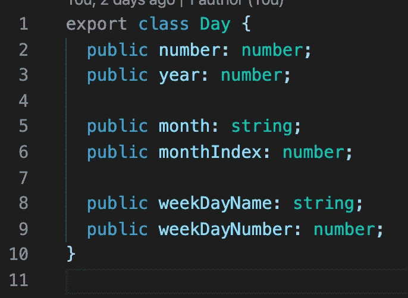

# 棱角分明的简单日历

> 原文：<https://medium.com/quick-code/simple-calendar-in-angular-86b3b1ac6f8c?source=collection_archive---------0----------------------->

## 角度示例

## 制作自己的日历很容易

在这篇文章中，我们将使用 angular 制作自己的日历。

我们的日历将只使用一种模式。这个模型包含关于年、月、工作日的信息，我们称之为“日”。

**型号**

day.model.ts

**服务**

下一步是创建日历服务。这项服务将一个月中的一系列日子。

calendarCreator.service.ts

函数“getMonthName”和“getWeekDayName”只是一组通过索引返回周和月的名称的开关案例。

Functions ‘getMonthName’ and ‘getWeekDayName’

主函数“getMonth”创建一个日期数组。它有两个周期，第一个周期创建上个月的空天，如果它们在一个月的第一周，第二个周期创建当前月的天。

Function ‘getMonth’

我们服务的最后一个功能是“创建日”。这个函数初始化我们的日模型。

Function ‘createDay’

**组件**

完成步骤是为日历创建一个组件。我们将在 html 中使用该组件的所有属性，以及一些我们也将在 HTML 中使用的函数，如“onNextMonth”和“onPreviusMounth”。

calendar.component.ts

方法“OnInit”为 HTML 初始化一个星期名称数组，它还通过使用其他函数“setMonthDays”初始化一个月中的日期数组。

方法“onNextMonth”和“onPreviousMonth”只是在需要时改变一年中的月份数，并创建一个新的日期数组。

Methods of calendar.component.ts

在 HTML 中，我们为两个按钮“onNextMonth”和“onPreviousMonth”做了一个标记，显示了年份和月份名称，我们循环了两次，一次表示一周中的几天，另一次表示一个月中的几天。

calendar.component html and css

在 CSS 中，我们设置主 div 和每个垃圾邮件的固定宽度，因为在七个跨度之后，下一个跨度将显示在下一行，用户将看到一个表格。

Result

我们的日程表准备好了。如果你需要仔细看看项目[，这里有链接。](https://github.com/8Tesla8/simple-calendar)

*原载于 2020 年 6 月 21 日 http://tomorrowmeannever.com**的* [*。*](https://tomorrowmeannever.com/2020/06/21/simple-calendar-in-angular/)