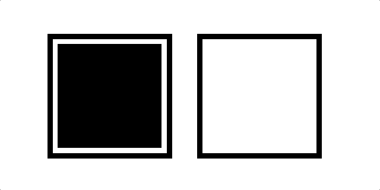

# 简单的 Javascript 拖放

> 原文：<https://medium.com/quick-code/simple-javascript-drag-drop-d044d8c5bed5?source=collection_archive---------1----------------------->

## 裸机交互性

在现代操作系统的界面中，最令人满意的体验之一是拖放。它非常直观，看起来非常流畅。


Everyday functionality.

我想把这个功能添加到我的 Javascript web 应用程序中，但是我发现的示例代码看起来令人生畏——通常有大约 150 行，有大量的事件侦听器，我不知道哪个是哪个。

事实证明，很多都是废话。实现这一点的实际代码大约有 30 行 Javascript 长，虽然不是最漂亮的方式。

## HTML

它以可拖动的 HTML 属性开始。在一个元素上设置为“true”允许它被点击并在屏幕上拖动。我直接在 HTML 文件中创建了这个简单的例子，但是也可以用 document.createElement 轻松地创建它。

```
<div class="container">
  <div class="box" draggable="true"></div>
</div><div class="container">
</div>
```


Dragging an element.

但那有点没用。

## Javascript

这就是 eventListeners 发挥作用的地方。有很多可拖动的对象，但是基本的功能只需要三个就可以实现。

```
const box = document.getElementsByClassName('box')[0]const containers = document.getElementsByClassName('holder')for(const container of containers) {
  container.addEventListener("dragover", dragover)
  container.addEventListener("dragenter", dragenter)
  container.addEventListener("drop", drop)
}
```

对于屏幕上的每个容器，我都仔细检查并添加一个 eventListener，用于拖放元素。

```
function dragover(e) {
  e.preventDefault()
}function dragenter(e) {
  e.preventDefault()
}function drop() {
  this.append(box)
}
```

这些都是我的 App 类中的静态函数，尽管我将它们显示为在 index.js 文件中。

dragover 和 dragenter 事件需要删除它们的默认行为，这样 drop 才能正常工作，所以我们将它们作为侦听器来删除该功能。

最后一个函数只是将我们之前声明的“box”元素附加到“this”中，此时 this 指的是要放入的容器。

其余的侦听器可以用于样式效果，如更改边框、颜色或任何其他 CSS 质量。



Our beautiful creation.

需要注意的一件重要事情是，被拖动的元素只是元素第一次被拖动时的快照，因此您可能会遇到奇怪的事情，如下面的代码所示，您更改类以获得新的样式，然后立即将其更改回来。

> 在[快速代码](http://www.quickcode.co/)上找到各种编程语言的免费课程。在[信使](https://www.messenger.com/t/1493528657352302)上获取新的更新。

可拖动元素中还有很多其他特性，但这足以添加一些基本功能。强烈推荐[2021 年学 JavaScript](https://blog.coursesity.com/popular-javascript-frameworks/) 开发。

## 更进一步

最重要的可拖动属性是 dataTransfer 属性，它可以通过拖放操作传递信息。您可以在下面的代码中看到，我用关于被拖动对象的原始容器的信息来设置它:

```
static dragstart(e) {
    e.dataTransfer.setData('text', e.target.parentNode.id
}
```

然后使用该信息重新排列列表:

```
static drop(e) {
  const div = e.dataTransfer.getData('text') const pointA = document.getElementById(div)
  const pointB = document.getElementById(e.target.parentNode.id) App.swapElements(pointA, pointB)
}
```

swapElements 函数是从这里的[借用的。](http://jsfiddle.net/jfriend00/oq92jqrb/)

请点击👏按钮下面几下，以示支持！⬇⬇

谢谢！别忘了**关注下面的**快速码。