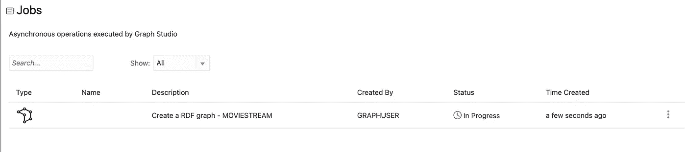

# 在 Graph Studio 中创建 RDF 图的简单步骤

> 原文：<https://medium.com/oracledevs/simple-steps-to-create-an-rdf-graph-in-graph-studio-f63fe34c27e0?source=collection_archive---------6----------------------->

Oracle 自治数据库包括 Graph Studio，它可以自动化图形数据管理，从而简化数据建模、分析和可视化。分析师和开发人员可以使用这个工具来寻找联系，检测不寻常的模式，并链接数据。

RDF 图特别适合于知识图和数据集成应用，因为 URIs 提供了全球唯一的标识符，并且简单、无模式的三元组结构使得将来自几个不同 RDF 图的数据组合成单个图变得非常容易。

本文将展示在 Graph Studio 中创建 RDF 图是多么简单和快速。我将使用预认证(PAR)对象存储，其中包含一个包含电影数据的 RDF 三元组文件。这个实践研讨会还将介绍如何创建 RDF 图和查询！

**先决条件**

*   部署自治数据库
*   创建启用图形的用户

[*本博客*](/@rahultasker/set-up-your-autonomous-database-to-use-graph-studio-9e7d1cbf46c8) *帮你执行以上步骤。*

*   将您的数据集放在一个对象存储桶中，该对象存储桶可以通过一个预认证的 URL 进行访问(详情请参见此处的)。

*注意:带有其他类型凭证的对象存储桶位置也可用于存储您的数据。*

让我们直接开始创建 RDF 图吧！

***在 Graph Studio 中创建一个 RDF 图***

1.  在 Oracle 云基础架构控制台中导航到您的自治数据库，然后打开工具。


2.打开 Graph Studio，使用您创建的用户名和密码登录。([如何部署自治数据库和创建图形用户的步骤](/@rahultasker/set-up-your-autonomous-database-to-use-graph-studio-9e7d1cbf46c8)

3.单击左侧导航菜单上的图形，导航图形页面。


4.在图形类型下拉菜单中，选择 RDF 并单击界面右上角的创建按钮。


5.创建 RDF 图向导打开，如下所示:


6.输入 OCI 对象存储 URI 路径。在这个例子中，我们使用这个 PAR 对象存储 [URI](https://objectstorage.us-ashburn-1.oraclecloud.com/p/VEKec7t0mGwBkJX92Jn0nMptuXIlEpJ5XJA-A6C9PymRgY2LhKbjWqHeB5rVBbaV/n/c4u04/b/livelabsfiles/o/data-management-library-files/moviestream_rdf.nt) 。

7.点击**无证件**(因为我们用的是 PAR URI)。

8.点击下一个的**。应该会出现以下对话框；输入您的图形名称:**


9.点击**创建**。将启动 RDF 图创建作业。您可以在 Graph Studio 的**作业**页面上监控作业。



成功后，状态将从挂起变为成功，点击作业行右侧的三个点，选择**查看日志**，可以查看日志。该作业的日志显示详细信息，如下所示:

```
Tue, Mar 1, 2022 08:21:04 AM
Finished execution of task Graph Creation - MOVIESTREAM.

Tue, Mar 1, 2022 08:21:04 AM
Graph MOVIESTREAM created successfully

Tue, Mar 1, 2022 08:21:04 AM
Optimizer Statistics Gathered successfully

Tue, Mar 1, 2022 08:20:50 AM
External table <graph-user>_TAB_EXTERNAL dropped successfully

Tue, Mar 1, 2022 08:20:49 AM
Data successfully bulk loaded from ORACLE_ORARDF_STGTAB

Tue, Mar 1, 2022 08:20:39 AM
Model MOVIESTREAM created successfully

Tue, Mar 1, 2022 08:20:37 AM
Network RDF_NETWORK created successfully

Tue, Mar 1, 2022 08:20:24 AM
Data loaded into the staging table ORACLE_ORARDF_STGTAB from <graph-user>_TAB_EXTERNAL

Tue, Mar 1, 2022 08:20:19 AM
External table <graph-user>_TAB_EXTERNAL created successfully

Tue, Mar 1, 2022 08:20:19 AM
Using the Credential MOVIES_CREDENTIALS

Tue, Mar 1, 2022 08:20:19 AM
Started execution of task Graph Creation - MOVIESTREAM.
```

***验证你的 RDF 图***

您可以在 Graph Studio 的 **Graphs** 页面上探索和验证新创建的 RDF 图，如下所示:

1.  导航至**图形**页面，使用下拉菜单将**图形类型**设置为 RDF。从可用的 RDF 图、示例语句(应该会出现三元组或四元组)中选择您的图表行，并使用三个水平点来调整这些语句的大小并将其显示在视图中。RDF 图中的示例语句(三元组或四元组)显示在底部面板上，如下所示:


现在您可以继续查询和可视化您的 RDF 图了！

了解 Oracle Graph 更多信息的有用链接:

*   [中](/tag/oracle-graph) (=所有带有 Oracle Graph 标签的文章)
*   [堆栈溢出](https://stackoverflow.com/questions/tagged/oracle-graph) (=带有 oracle-graph 标记的问题)
*   [Slack AnDOUC](https://join.slack.com/t/andouc/shared_invite/zt-1a2hmiz6f-vLlblcQyv0t9FMraMMP5uQ) (=邀请链接，请访问#graph)
*   [Slack OracleDevRel](https://join.slack.com/t/oracledevrel/shared_invite/zt-uffjmwh3-ksmv2ii9YxSkc6IpbokL1g) (=邀请链接，请访问#oracle-db-graph)

想讨论一下吗？加入我们的[公共 Slack 频道](https://bit.ly/devrel_slack)与其他 Oracle 开发人员交流！