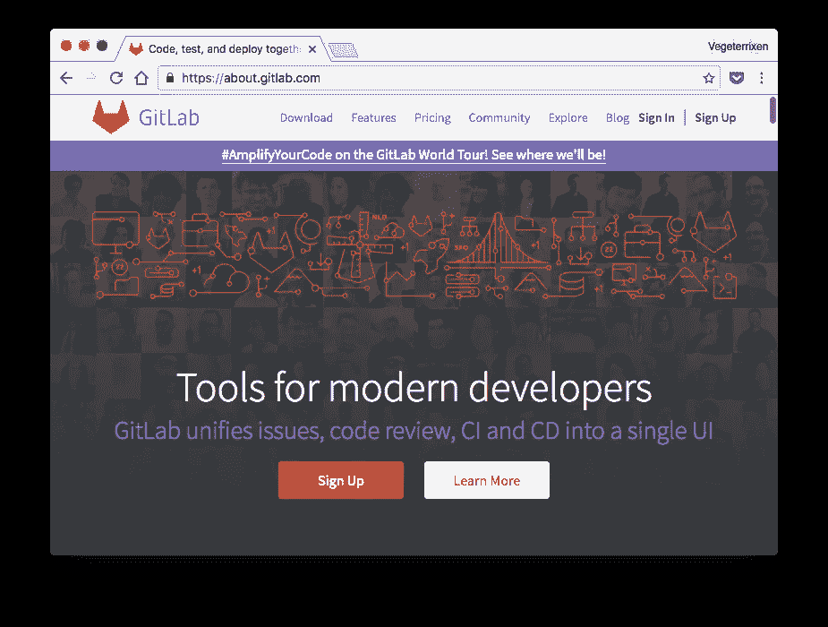
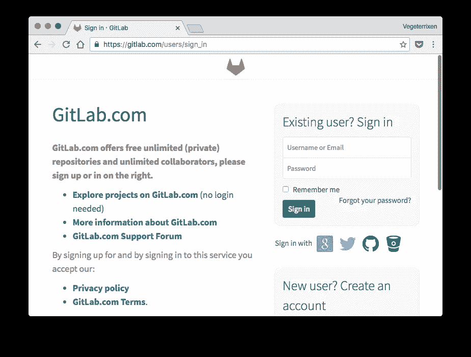
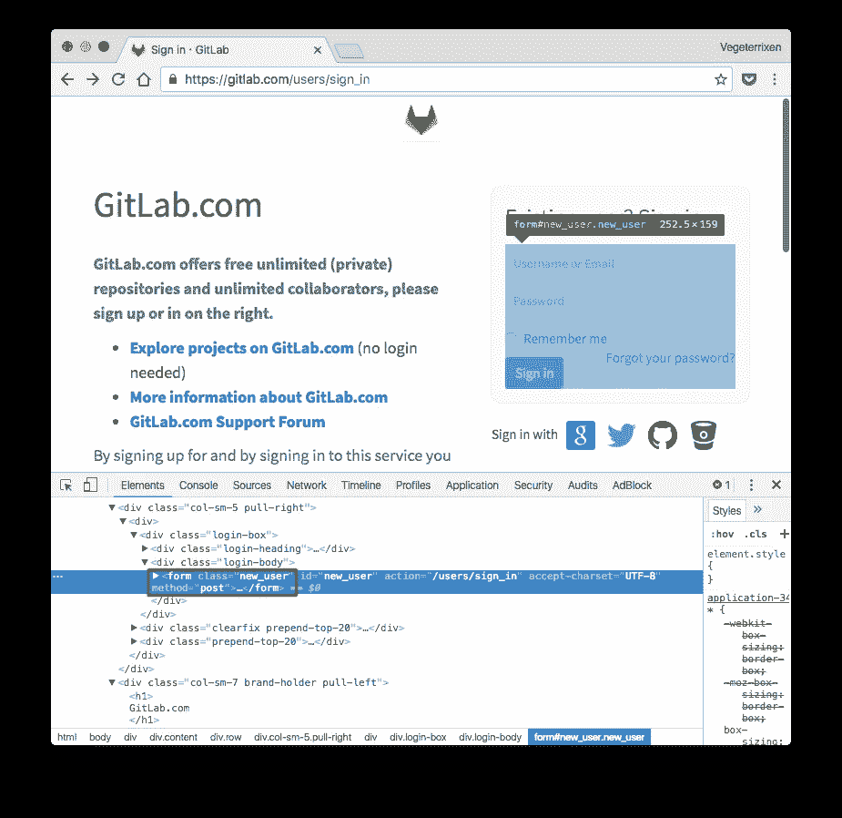
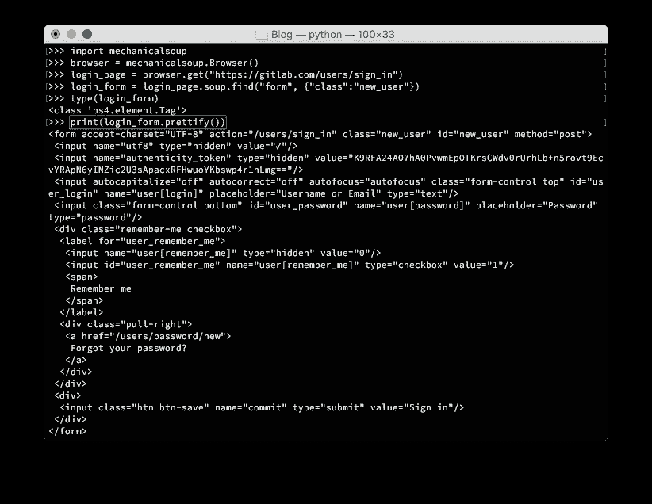
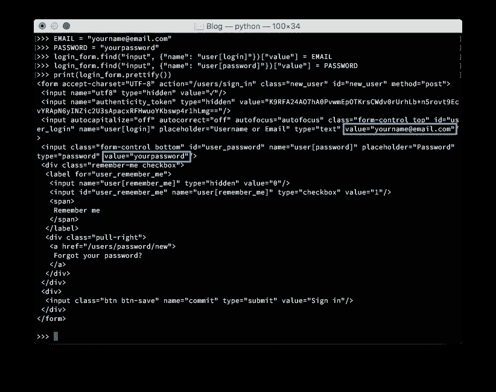
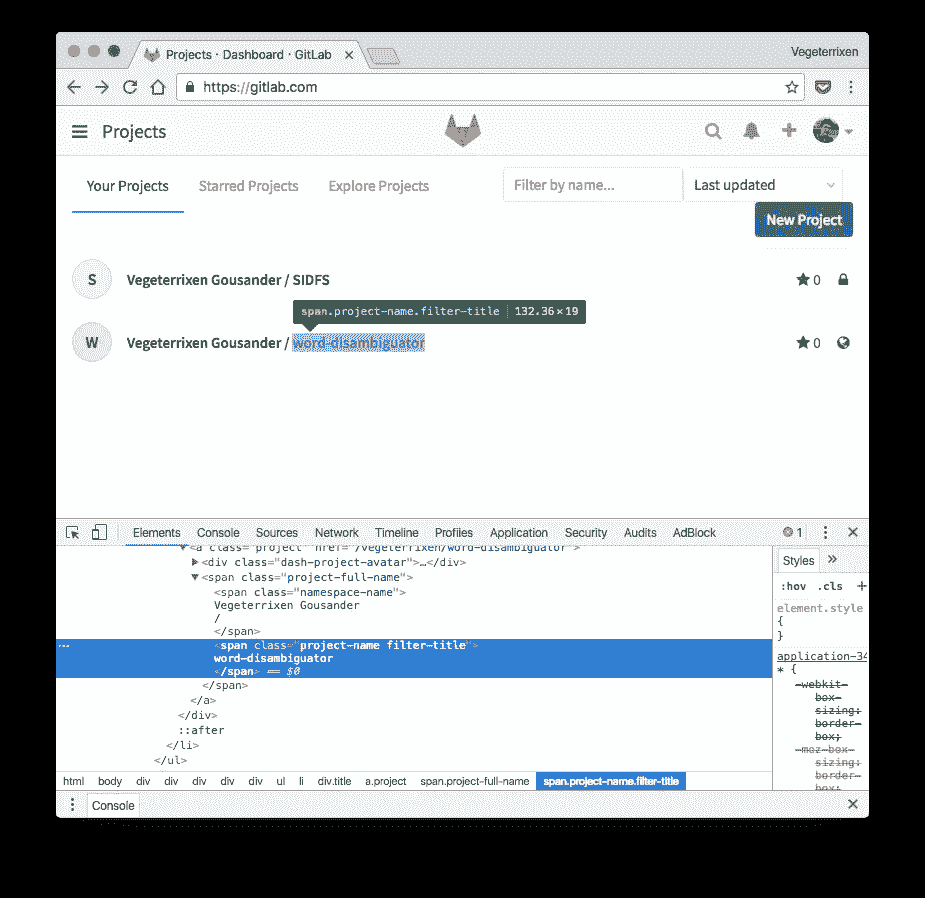
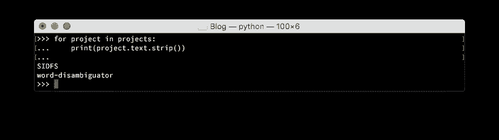
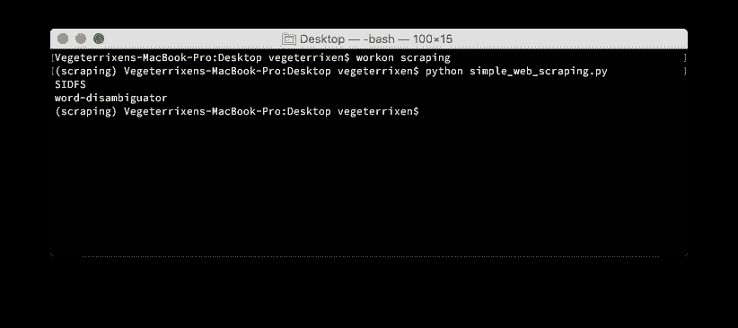
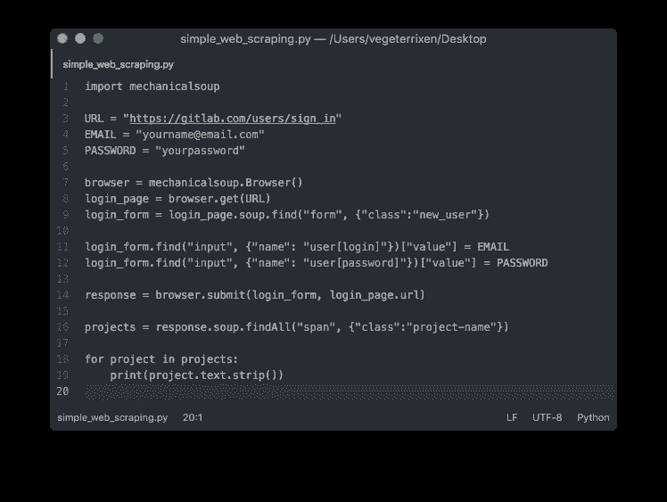

# Simple Web Scraping using Python

> 原文：<https://medium.easyread.co/simple-web-scraping-using-python-fdfebbb4343a?source=collection_archive---------0----------------------->

Di artikel sebelumnya, kita sudah melakukan environment setup untuk python project menggunakan **virtualenv** . Sekarang kita akan mencoba membuat project [*web scraping*](https://en.wikipedia.org/wiki/Web_scraping) sederhana yang dapat mengambil / mengekstrak data dari website.

## Preparation

Pertama, kita perlu menentukan website yang akan dijadikan target untuk diambil datanya. Pada artikel ini, saya memilih target website [GitLab](http://gitlab.com/) yang tujuannya untuk mengesktrak nama project-project dari akun GitLab.



Tahap selanjutnya, kita perlu mencari bagian *form* untuk login / sign in, yang nantinya link untuk login ini diperlukan oleh script web scraping kita untuk menginput username/email dan password. Berikut tampilan form untuk login di GitLab:



Link untuk login di GitLab yaitu:

```
https://gitlab.com/users/sign_in
```

Setelah menemukan link login, kita baru dapat memulai tahap membuat script web scraping kita. Buka text editor favorit masing-masing, disini saya menggunakan text editor [**Atom**](https://atom.io/) .

## Web scraping script

Kita akan menggunakan MechanicalSoup library untuk melakukan web scraping dengan python. Pertama import dulu mechanicalsoup library nya:

```
import mechanicalsoup
```

Buat variables untuk menyimpan informasi link login, email, dan password akun GitLab.

```
URL = "https://gitlab.com/users/sign_in"
EMAIL = "yourname@email.com"
PASSWORD = "yourpassword"
```

Kita buat object dengan nama browser dan memberikan url untuk login kepada browser:

```
browser = mechanicalsoup.Browser()
login_page = browser.get(URL)
```

Object yang telah kita buat dengan nama “browser” memiliki *state* , termasuk navigation history, HTML form state, dan cookies yang mengemulasikan seperti browser umumnya.
Note: MechanicalSoup tidak sepenuhnya berjalan seperti browser Chrome, Firefox, atau Safari, karena MechanicalSoup tidak dapat menghandle Javascript.

Kita perlu menganalisa form dari login url GitLab untuk mengetahui nama class dari HTML nya. Hal ini dapat dilakukan dengan browser Chrome melalui shortcut **control + shift + c** atau melalui **Inspect Element** :



Tujuan analisa form ini akan digunakan saat ingin melakukan login, sehingga script yang kita buat dapat melakukan input untuk Email dan Password. Kita akan mengambil element form ini dan ditampung ke dalam login_form:

```
login_form = login_page.soup.find("form", {"class":"new_user"})
```

login_form menampung isi dari tag



Kita perlu melakukan analisa element HTML nya lagi untuk dapat memberikan  value untuk Email dan Password pada form login. Kita akan mencari tag  dalam login_form berdasarkan * name * dan langsung memberikan input value dengan variable EMAIL dan PASSWORD yang telah kita definisikan di atas


```
login_form.find("input", {"name": "user[login]"})["value"] = EMAIL
login_form.find("input", {"name": "user[password]"})["value"] = PASSWORD
```



Value untuk Email dan Password sudah berhasil diberikan, sekarang kita sudah siap submit untuk melakukan login.

```
response = browser.submit(login_form, login_page.url)
```

Di tahap ini, kita asumsikan Email dan Password yang diinput benar, bearti kita sudah berhasil login ke GitLab. Tujuan awal web scraping kita yaitu untuk mengambil nama-nama project yang ada di akun GitLab, maka kita perlu menganalisa lagi element HTML nya saat sudah login.



Untuk mengambil nama project, kita akan mencari semua tag yang memiliki nama class “project-name”.

```
projects = response.soup.findAll("span", {"class":"project-name"})
```

Nama-nama project sudah berhasil diambil. Sekarang kita print hasil dari script web scrapingnya:



## Testing

Buka **Terminal** dan masuk ke dalam virtual environment “scraping” yang sebelumnya sudah dibuat:

```
workon scraping
```

Script yang dibuat saya save di directory Desktop dengan nama **simple_web_scraping.py** . Untuk menjalankan scriptnya:

```
python simple_web_scraping.py
```



Script yang dijalankan berhasil mengambil data nama project dari akun GitLab.

Banyak hal menarik yang dapat dilakukan dengan web scraping, misalnya monitoring cuaca, pengambilan harga barang dan lainnya. Saya sendiri belum lama mencoba web scraping dengan python. Dengan terus menelusuri tentang web scraping, saya berharap dapat membuat script / project yang dapat digunakan sehari-hari untuk meningkatkan produktivitas.

## Complete script

