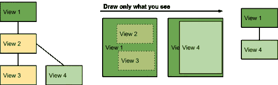
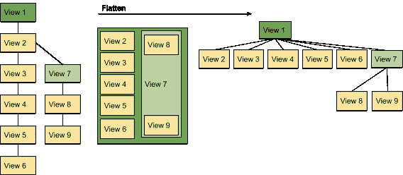
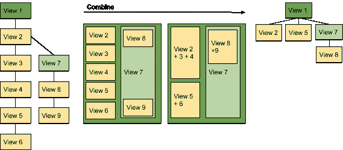
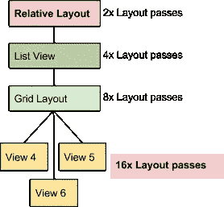

# 简化复杂的视图层次结构

> 原文：<https://medium.com/androiddevelopers/simplify-complex-view-hierarchies-5d358618b06f?source=collection_archive---------6----------------------->

应用程序的核心是视图的层次结构，它构成了用户界面和用户的视觉体验。对于功能丰富的应用程序，这种层次结构变得庞大而复杂，并可能成为性能问题的根源。你将会看到的最可能的症状是应用程序的一般缓慢，尤其是当在屏幕上呈现复杂的视图时。

简化或重新排列应用程序的视图层次结构可以提高性能，尤其是在低端设备和早期版本的 Android 上。作为一个额外的好处，你的应用程序将变得更容易维护。

**准备工作:**如果您还没有这样做，[通过移除不必要的背景来减少过度绘制](/google-developers/draw-what-you-see-and-clip-the-e11-out-of-the-rest-6df58c47873e#.d9t0874dv)以消除与您的视图层次无关的常见缓慢来源。

# 分析视图层次结构

分析视图层次结构是使用多种工具来查明和修复性能问题的一个例子。因此，您可能需要使用其中一个或所有工具来优化性能。

## **Profile GPU 渲染**

1.  [**运行 Profile GPU 渲染工具**](http://developer.android.com/tools/performance/profile-gpu-rendering/index.html?utm_campaign=app_series_complexviewhierarchies_012616&utm_source=medium&utm_medium=blog) **查看条形的蓝色段。**如果蓝色线段很高，导致条形越过 16 mspf 线，你的应用程序会花很多时间更新显示列表。Android 的 M 版本增加了额外的颜色段，浅绿色的测量/布局段也可能比预期的要大。其中一个原因可能是视图层次结构过于复杂。这只是告诉你可能有一个问题，它没有告诉你，在哪里寻找。所以，让我们继续前进。

## 显示 GPU 视图更新

1.  **在您的移动设备上运行显示 GPU 视图更新工具**。在**开发者选项**中，滚动到**硬件加速渲染**并打开**显示 GPU 视图更新**。
2.  与您的应用程序互动。
3.  屏幕上更新的视图将闪烁红色。如果您注意到屏幕的某些部分在闪烁，并且它们与正在更新的区域无关，那么可能是视图层次结构中的某个连接导致它们不正确地失效。因此，您可以将精力集中在这些方面，以便更快地发现问题。

## 层次结构查看器

这是工具，你将在这里做繁重的工作。

1.  **启动** [**层次查看器工具**](http://developer.android.com/tools/performance/hierarchy-viewer/index.html?utm_campaign=app_series_complexviewhierarchies_012616&utm_source=medium&utm_medium=blog) 。
2.  找到你在应用程序中仍然看到大量透支的视图层次区域。考虑重组你的观点是否可以减少透支。
3.  确定视图层次结构复杂的区域，并考虑如何简化它。
4.  [**Profile**](https://developer.android.com/tools/performance/hierarchy-viewer/profiling.html?utm_campaign=app_series_complexviewhierarchies_012616&utm_source=medium&utm_medium=blog) 从层次结构查看器查看层次结构，以确认或识别其他潜在问题点。

## 用棉绒深潜

使用布局文件上的 [lint 工具](http://developer.android.com/tools/debugging/improving-w-lint.html?utm_campaign=app_series_complexviewhierarchies_012616&utm_source=medium&utm_medium=blog)来搜索可能的视图层次优化……然而，lint 的出色之处是另一篇文章的内容。

# 简化视图层次结构

## 删除对最终图像没有贡献的视图

要识别对屏幕上的最终图像没有贡献的视图:

1.  在层次查看器中，从树叶开始到根遍历层次。
2.  单击每个节点，查看该节点在屏幕上的外观。或者，查看布局视图窗口，了解视图如何分层。
3.  如果一个以前可见的视图变得完全隐藏，那么您可能根本不需要那个视图，如图 1 所示。
4.  从你的代码中删除那些被完全覆盖的、从不显示的或者在屏幕之外的视图。

Figure 1\. Views 2 and 3 are fully obscured and can be safely removed.

## 展平视图层次结构以减少嵌套

1.  您的视图层次结构有看起来像图 2 左边的嵌套排列的部分吗？
2.  通过尽可能用相对布局替换嵌套的线性布局来扁平化视图层次结构。
    参见[优化布局层次](http://developer.android.com/training/improving-layouts/optimizing-layout.html?utm_campaign=app_series_complexviewhierarchies_012616&utm_source=medium&utm_medium=blog)。

Figure 2\. This deep view hierarchy can be flattened to improve performance.

## 减少视图的数量

1.  如果您的用户界面有许多简单的视图，您可以在不降低用户体验的情况下组合其中一些，如图 3 所示。
2.  下面的两个变化可能会影响你向用户展示信息的方式，并将包括设计上的权衡。记住，对于你的应用程序的成功来说，性能比其他任何东西都重要，尽可能选择简单。
3.  通过将视图合并成更少的视图来减少视图的数量。例如，如果减少字体和样式的数量，可以合并文本视图。
4.  重新设计你的应用程序的用户界面，使用更少的视图。

Figure 3\. Example of combining views.

## 简化触发多个布局通道的嵌套布局

一些布局容器，如 RelativeLayout，需要两次布局传递来最终确定其子视图的位置。因此，他们的孩子也需要两次布局传递。当您嵌套这些类型的布局容器时，布局过程的数量会随着层次的每个级别而呈指数增长。

例如，相对布局中的列表视图中的网格视图中的视图可以被布局 8 次(！idspnonenote)。)如图 4 所示。

*   [相对布局](http://developer.android.com/reference/android/widget/RelativeLayout.html?utm_campaign=app_series_complexviewhierarchies_012616&utm_source=medium&utm_medium=blog)
*   [线性布局](http://developer.android.com/reference/android/widget/LinearLayout.html?utm_campaign=app_series_complexviewhierarchies_012616&utm_source=medium&utm_medium=blog)也使用 *measureWithLargestChild* 。
*   [网格视图](http://developer.android.com/reference/android/widget/GridView.html?utm_campaign=app_series_complexviewhierarchies_012616&utm_source=medium&utm_medium=blog)也使用重力。
*   作为上述子类的自定义容器。
*   权重的一些使用也可以触发多个布局过程。

使用这些容器中的任何一个作为复杂视图层次结构的根、深层子树的父，或者在布局中使用它们中的许多，都会影响性能。因此，考虑是否可以使用一个容器配置来实现相同的布局，而不会导致这些指数级的布局传递。例如，您可以用栅格视图(无重力)替换相对布局作为根视图。

观看[这个截屏](https://www.youtube.com/watch?v=-FUw8HMbmBQ)来看看所有这些技术的运用。

卡巴莱版本见[双版面征税](https://www.youtube.com/watch?v=dB3_vgS-Uqo)。更多提示，请参见[优化布局层次](http://developer.android.com/training/improving-layouts/optimizing-layout.html?utm_campaign=app_series_complexviewhierarchies_012616&utm_source=medium&utm_medium=blog)。更多视频，请查看 YouTube 上的安卓[性能模式。如果你想提前学习，可以在 Udacity](https://goo.gl/cnn9aF) 上学习 [Android 性能课程。但最重要的是，加入我们的](https://goo.gl/v6Eaec) [Android Performance G+社区](https://goo.gl/Nqfsx7)，获得关于构建高性能 Android 应用程序的伟大技巧，因为…[**# perf matters**](https://goo.gl/Nqfsx7)。