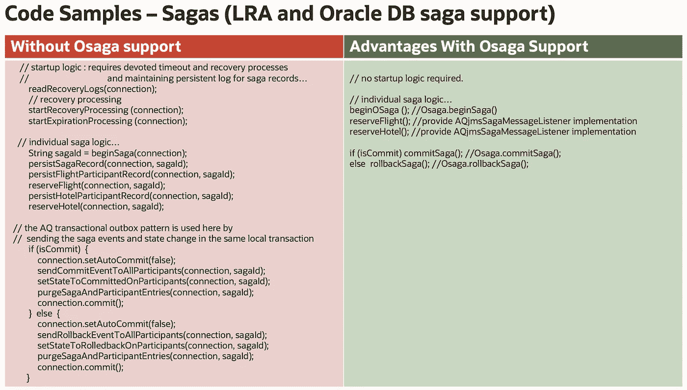

# 利用 Oracle 数据库传奇简化微服务交易

> 原文：<https://medium.com/oracledevs/simplify-microservice-transactions-with-oracle-database-sagas-2395b5b430ec?source=collection_archive---------8----------------------->

# 了解 Oracle 数据库中即将推出的 saga 支持。

# 传奇模式

saga 模式用于在潜在的长期活动(有时称为业务活动或业务事务以消除歧义)中涉及的多个分布式、隔离的服务之间提供数据完整性。经典的例子，也是我在这里和在[相应研讨会](https://bit.ly/OracleDatabaseSagaLiveLab)中使用的例子，是一个旅行预订，包括航班、酒店和汽车预订:

[的原始论文](https://www.cs.cornell.edu/andru/cs711/2002fa/reading/sagas.pdf)发表于 1987 年，提到了在数据库中运行*和*存储数据的实现的优势，这正是 Oracle 数据库正在做的事情，使其非常适合微服务和现代应用程序开发。

关于传奇的文章很多，所以在这篇文章中，我将重点介绍 Oracle 数据库传奇产品，但我将首先介绍一些基本方面。如果您熟悉这些概念，可以跳到“Oracle 数据库 Saga 支持和 OSaga API”

# 传统事务处理模型和微服务

传统的事务处理系统使用两阶段提交(2pc)协议和 XA 标准来处理这种数据完整性，并跨资源管理器(数据库、消息系统等)提供 [ACID](https://en.wikipedia.org/wiki/ACID) 保证。).该协议是为受控环境中的短期运行事务设计的，通常带有阻塞同步通信。它使用分布式锁来实现这些 ACID 属性，从而防止事务看到其他正在进行的事务的影响，并使应用程序能够简单地对事务管理器进行回滚调用，以便有效地将资源管理器的数据状态设置回事务开始之前的状态。

系统故障由中央事务管理器/恢复管理器解决。由于该协议涉及资源的锁定和可用性，它在微服务环境中造成了一个潜在的问题，该环境具有不同的服务、潜在的长时间运行的活动、异步/事件驱动的通信的增加的使用、不同程度的容错和可用性，以及由于每个服务一个数据库的模式而潜在地增加的参与者数量。

# Oracle 融合数据库

请注意，每个服务一个数据库模式的关键方面是微服务之间的数据依赖性的隔离和解耦。这是为了促进敏捷开发和部署模型、独立伸缩、为特定用例/模型使用最佳数据库，等等。这些服务可能需要也可能不需要文字数据库。Oracle 数据库可以在多个级别提供隔离和安全性，例如模式。

它还提供了各种数据模型和开放的 API，如传统的关系、JSON、XML、Spatial 等。，甚至直接兼容 Kafka、MongoDB 等其他厂商 API。最后，它提供了严格的每个服务一个数据库的功能，同时还为管理、高可用性和备份、知识库等提供了单一的同步体系结构。这就是 Oracle 被称为融合数据库的一些原因，也是它非常适合 sagas 和微服务的原因。

# 关于家族模式的思考

saga 模式只使用本地资源事务(没有分布式锁),这样做缓解了传统 2pc 协议提到的问题，但是，它有自己的考虑和权衡。当使用 sagas 时，开发人员必须考虑业务活动/事务的隔离和最终一致性需求，并为回滚情况提供他们自己的补偿逻辑，因为没有管理锁、数据更改等的机制。

这一点，以及与之相关的调试，可能是一项非常复杂且容易出错的任务，这就是为什么 Oracle 非常关注这些问题，通过保证事务行为使它们变得简单，我将在本文和未来的博客中更详细地讨论这一点。

一般来说，大多数优化的本质是，它们需要更密切地关注实际用例的具体细节和需求，并且可能需要更精细的处理。例如，一些开发人员可能没有考虑到 ACID 属性的重要性，以及如果没有一个或多个 ACID 属性会出现什么问题，而其他开发人员可能认为除了拥有强大的 ACID 属性之外，没有其他方法来设计事务性解决方案。

在任何场景中，只有严格的 ACID 属性才是可接受的，这种误解通常是出于方便——简单地单击数据源旁边的“enable XA”复选框，并在方法上粘贴@Transactional 注释，而不是用例的实际需求。

以许多金融系统的交易为例。在两个银行账户表之间没有单一的 2pc XA 交易，而是两个独立的交易，包括发送给 tx1 的取款消息和接收给 tx2 的存款消息。许多事务还有排序需求，XA 规范实际上并不处理这些需求，等等。

有些情况最适合 2pc 和 XA，而且微服务环境本身并不绝对禁止这种情况，但它可能会对微服务模型带来的一些最重要的优势构成重大障碍。数据/锁定隔离、部署模型以及伸缩性和吞吐量限制等优势。这就是为什么建议将其用于受控环境/架构或给定/单个微服务内的独立设备。

# 世家细节和变化

传奇模式有一些变化。

基于编排的传奇包括参与者/微服务解决他们之间的共识。基于编排的传奇故事的基本版本可以在[简化微服务中找到，融合 Oracle 数据库研讨会](http://bit.ly/simplifymicroservices)涉及订单和库存服务。基于编排的传奇涉及一个专门的编排者/协调者，类似于事务经理，负责管理传奇的生命周期，包括进行必要的回调等。

数据库中的 saga 支持是基于编排的。基于 Eclipse micro profile Long Running Actions(LRA)规范的 Saga 实现也是基于编排的，包括 Narayana、Helidon 和即将推出的微服务产品事务管理器，后者也将提供 XA 和尝试确认/取消事务支持。这些实现的编排器/协调器运行在 Kubernetes 中，而 Oracle 数据库 saga 编排器/协调器运行在数据库本身中。

还有 saga 通信和控制转移的变体，如聚合器与链流。在旅行社示例中，旅行社在完成或补偿发生之前收集来自旅行参与者的所有回复，这是聚合器模式的一个示例，而在返回订单服务之前进行库存补偿的订单库存示例是链式流程的一个示例。虽然相关，但是这些和其他通信模式(事件命令转换模式、事件源、事务发件箱等)也是如此。)，超出了本博客的范围，对核心概念并不重要。

# 佐贺流

下图描述了旅行预订的流程，用颜色区分了电话类型:

1.  旅行社服务联系协调员开始一个传奇。
2.  然后，旅行社联系酒店服务，提出预订房间的申请。
3.  该请求包括一个 saga ID 作为上下文的一部分，因此驻留在酒店服务中的库联系协调者并请求加入 saga，为 saga 提供一个在 saga 完成时使用的回调。
4.  控制返回到旅行社，并且对任何其他参与者(例如航班服务)重复相同的过程。
5.  一旦旅行社收到所有回复，它将决定是提交/完成还是回滚/补偿该事件，并向协调者发出该命令。
6.  然后，协调员为 saga 参与者召集适当的回电，并将控制权交还给旅行社。

# Oracle 数据库 Saga 支持和 OSaga API

下表比较了在数据库中使用 LRA 和 Oracle saga 时提供的支持，以及开发人员必须实现整个协议的情况。

正如您所看到的，正确而健壮地实现协议是一项复杂而艰巨的任务，还会导致混乱的应用程序代码。最初将为 PL/SQL 和 Java 提供 Oracle 数据库 saga 支持，然后将扩展到所有其他语言。下面是一个 Java 示例，展示了从头开始开发与使用 Oracle 数据库 saga 支持和 OSaga API 时的区别。左边是额外逻辑、数据库日志、日志等的保守示例。需要，而右边是一个非常准确的描述，它是一个多么简单的选择。

# 托管和自动补偿数据类型

托管类型为高并发热点提供了一种独特的锁定机制，这种机制完全适合微服务事务模型，并将成为未来博客的主题。我还将谈到一个相关的特性，自动补偿数据类型，但现在我将详细阐述后者，因为它是直接针对 sagas 的。

自动补偿数据类型将为交换数据操作提供与传统的两阶段提交 XA 事务中相同的隐式回滚支持(从而消除了开发回调和恢复的需要)，但对于 sagas(即仅使用本地事务)。通过将它与数据库中的 saga 支持结合使用，开发人员可以获得 saga 模式的所有好处以及传统事务模式的所有好处和简单性！

同样，Oracle 也非常注重让微服务和 saga 支持变得强大而简单。

# 今天就亲自尝试一下

虽然提到的功能尚未发布，但您可以在新研讨会中尝试预览:[使用 Oracle 数据库 Sagas 简化微服务事务研讨会](https://bit.ly/OracleDatabaseSagaLiveLab)

感谢您的阅读，并一如既往地请随时联系我，让我知道任何问题，建议等。您的反馈。