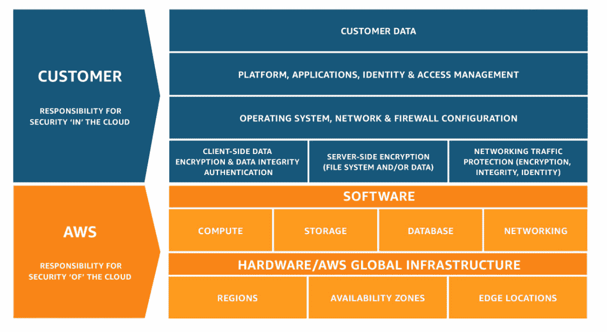
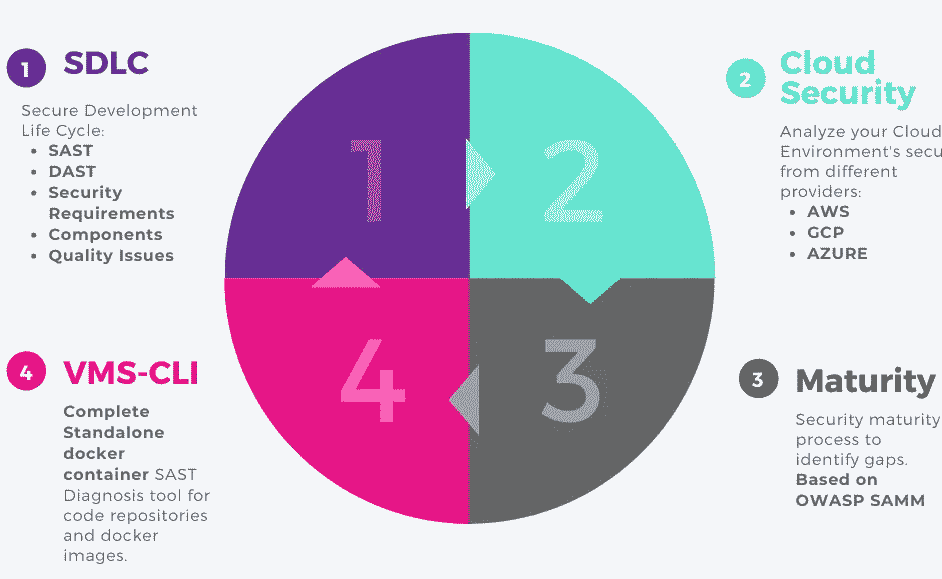
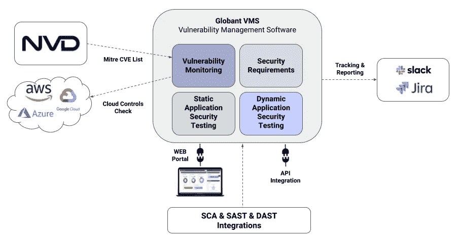
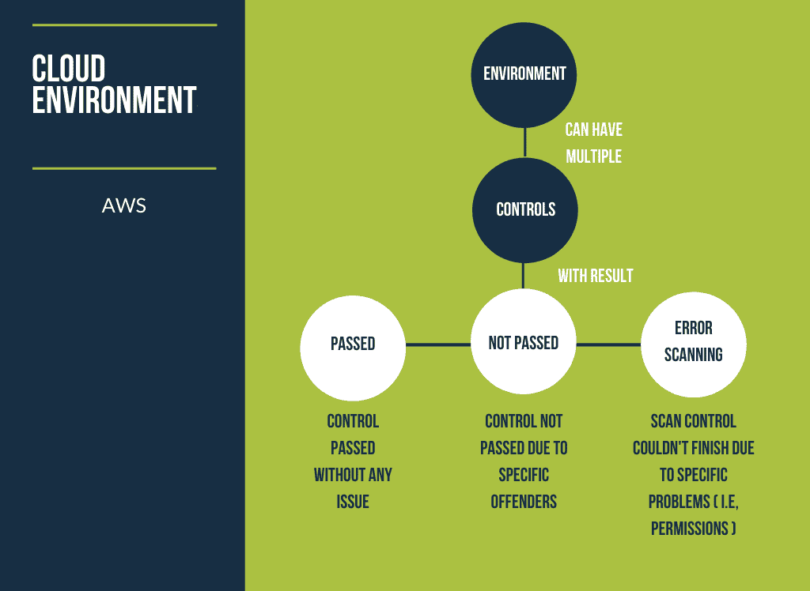
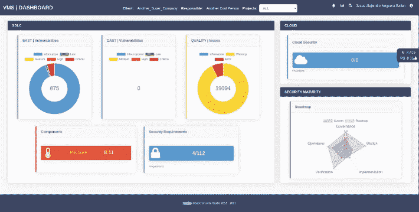
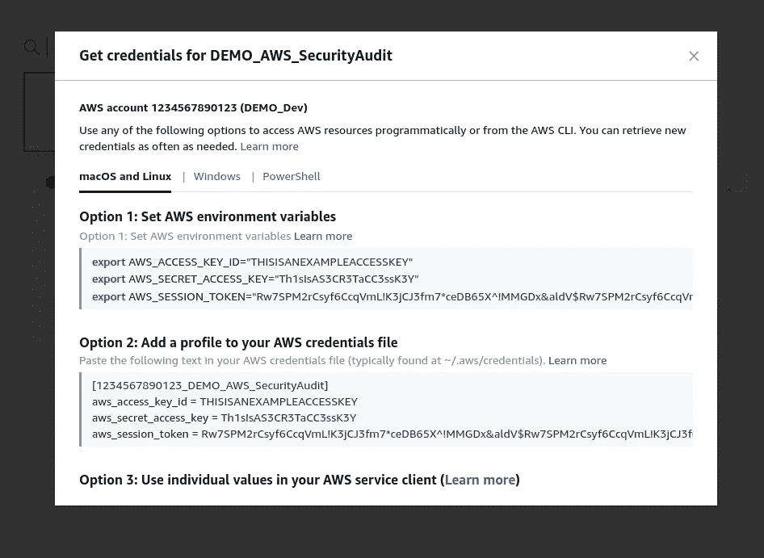
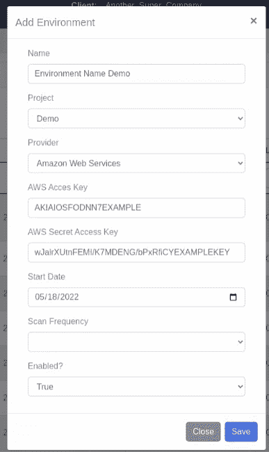
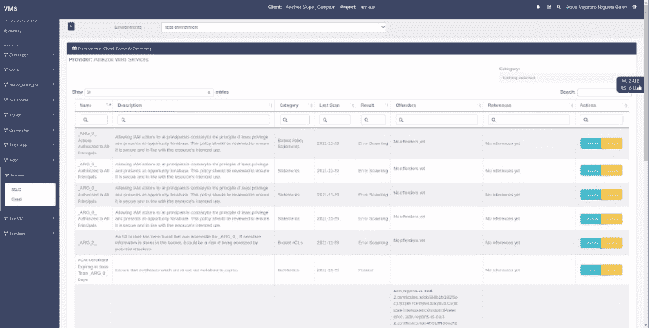
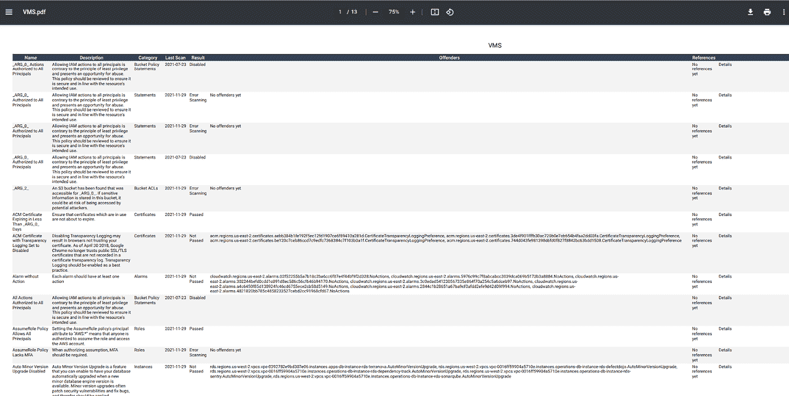

# 使用 Globant 开发的虚拟机简化 AWS 中的安全审计

> 原文：<https://medium.com/globant/simplify-your-security-audit-in-aws-with-vms-developed-by-globant-4e74d6e6dd2b?source=collection_archive---------1----------------------->

如果您已经在 IT 行业工作了一段时间，您可能已经注意到云正在不断地改变我们开发、部署和使用软件的方式。亚马逊 AWS 也不例外，事实上，AWS 一直是这种不断进化的重要组成部分。

最近，许多公司决定将其基础架构迁移到云，就在那时，他们意识到许多现有的内部安全控制与云模型没有直接关联。

# **AWS 中的安全性**

AWS 基于[共享责任模型](https://aws.amazon.com/compliance/shared-responsibility-model/?nc1=h_ls)工作，这意味着它将大多数责任分为两类:云安全(由 AWS 管理)和云中安全(由客户管理)。通过这种方式，可以减轻客户的运营负担，因为 AWS 控制、管理主机组件、虚拟化层，甚至信息所在设施的物理安全，也就是说，AWS 在安全处理信息方面非常谨慎。然后，客户端的责任由他选择的服务决定，这在很大程度上取决于他为确定系统的良好安全性而进行的配置。其中包括操作系统、应用程序、安全组的选择、ACL 的定义、AWS 帐户的管理、防火墙配置和身份管理等。

[Shared Responsibility Model](https://aws.amazon.com/compliance/shared-responsibility-model/?nc1=h_ls)

这就是云客户端了解并拥有良好的服务配置以及应用最佳安全实践至关重要的原因，同样，管理系统的实施是一个持续的实施过程，必须有一个持续的审查和持续的改进。换句话说，必须依靠工具来审核并清楚地呈现由客户负责的服务配置中的漏洞或故障，虚拟机就是这些出色工具之一。

# 什么是虚拟机？

VMS 是由 Globant 的网络安全工作室开发的漏洞管理系统，旨在作为基于不同类型的控制(代码、应用程序、组件和云)的安全发现的集中平台。

[Vulnerability Management System](https://www.globant.com/studio/cybersecurity)

# **建筑**

VMS 有许多有用且友好的功能，例如:

*   Web 仪表板。
*   漏洞编排(SAST、DAST 等)。
*   历史数据的趋势分析。
*   可配置的报告输出为 PDF、XLS 和 CSV 格式。
*   第三方工具集成。
*   能够与 CICD 管道整合。
*   确定差距的安全成熟度流程(OWASP SAMM)。
*   使用 NVD 信息的威胁情报。
*   组件的许可检查。
*   使用 CIS 控件的云控件。
*   符合行业标准的预加载检查。

今天，我们将重点介绍 AWS 云上的云控制功能，我们可以重点介绍:

*   从 CIS 基准中提取的控制。
*   每次新扫描都会检查新的控制。
*   未通过控制的详细信息，包括违规者资源。
*   每天、每周、每两周和每月自动扫描。

# **入门—权限**

首先，我们需要定义一个具有必要权限的 AWS 帐户，以便虚拟机可以执行云分析，为此，您必须启用:

*   只读访问
*   安全性审计

# **虚拟机中 AWS 环境的配置**

一旦我们有了拥有所需权限的用户，我们就可以将每个云环境添加到我们的 VMS 项目中

在那里，我们可以添加我们想要审计的任意多个帐户。

我们必须准备好 AWS 访问密钥和 AWS 秘密访问密钥，这将允许虚拟机与我们想要分析的 AWS 环境链接。这些密钥可以在我们每个环境的“命令行或编程访问”中找到。

然后，我们可以轻松地将它们复制并添加到虚拟机中。

最后，我们在表单中填写我们环境的数据，不要忘记开始分析的初始日期和我们想要的频率，记住它可以是每天、每周、每两周或每月。

# **结果分析**

添加我们的 AWS 环境后，我们可以通过单击“扫描”立即执行分析，这需要几秒钟时间，完成分析后，我们可以访问我们的审计报告。

该分析审核来自 ACM、Lambda、CloudFormation、CloudTrail、CloudWatch、DynamoDB、EC2、EFS、IAM、KMS、RDS、VPC、SNS、Secrest Manager 和其他服务的资源。

在这里，您可以看到一个虚拟机中的报告示例。

如您所见，您可以在存储桶中找到类似“存储桶访问日志记录已禁用”的控件，如果禁用此策略，您将获得“未通过”的结果，例如，对于 EC2 实例及其角色，如果您没有 EC2 服务的未使用角色，您的结果将是“通过”。事实上，VMS 允许我们按类别过滤结果，如访问键、存储桶、集群、策略、角色等等。

在每个结果中，我们可以找到诸如名称、简要描述、所属类别、上次执行扫描的日期、控制分析的结果、是否有违规者、参考等信息，最后我们可以执行操作来查看控制的更多细节或禁用它。

通过这种方式，可以详细检查每个服务，并以最安全的方式配置它们，因此我们将充分利用 AWS 为我们提供的一切，例如，KMS 等关键服务或 CloudWatch、IAM、CloudTrail 等服务。

# **生成我们的报告**

最后，VMS 允许我们以 PDF、XLS 或 CSV 格式导出我们的审计报告，我们将在其中找到与 VMS 相同的结果，我们只需转到列表末尾，单击 Excel、CSV 或 PDF 图标中的一个即可。

# **结论**

VMS 是一个完整的系统，它为用户提供了受保护的云环境的能力，具有 AWS 提供的最佳配置实践和服务控制，充分利用了云为我们提供的优势。还允许在同一个管理系统中整合 SAST 和 DAST 控制，有助于安全的开发生命周期。

# **参考文献**

[共担责任模式](https://aws.amazon.com/compliance/shared-responsibility-model/)

[全球网络安全工作室](https://www.globant.com/studio/cybersecurity)