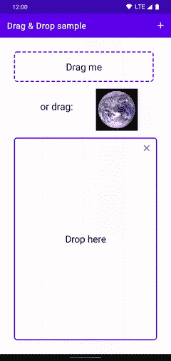
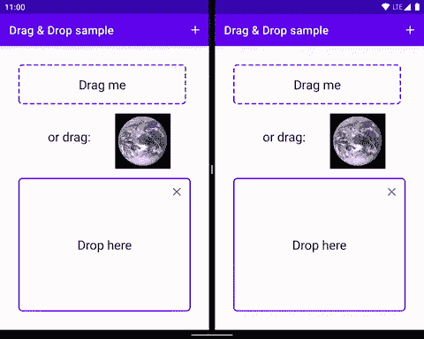

# 简化拖放

> 原文：<https://medium.com/androiddevelopers/simplifying-drag-and-drop-3713d6ef526e?source=collection_archive---------0----------------------->

在最基本的层面上，[拖放](https://developer.android.com/guide/topics/ui/drag-drop)是一种手势，用户可以点击并按住图像、文本字符串或其他数据元素，然后将其拖动到另一个应用程序(或同一应用程序中的另一个位置)并释放，其中数据被合并到新位置。这种手势通常是在触摸屏上长按，或者在使用鼠标时点击并拖动。

A simple drag & drop sample.

虽然 Android 很早就支持拖放功能(`[DragEvent](https://developer.android.com/reference/android/view/DragEvent)`是在 Android 3.0，API level 11 中引入的)，但事实证明，集成对处理手势、事件、权限和回调的完全支持是复杂的。

> **今天我们将推出**[**Jetpack DragAndDrop**](https://developer.android.com/jetpack/androidx/releases/draganddrop)**库作为 alpha 版本，让你更轻松地处理放入应用的数据。**

拖放越来越适用于大屏幕形式:平板电脑和笔记本电脑，但尤其是可折叠的，其中分屏的使用频率是传统手机的 7 倍。将数据从一个应用程序拖到另一个应用程序的能力是用户的自然体验，因为他们在分屏或窗口模式下更有效地进行多任务处理。

虽然平台本身支持从`EditTexts`中拖动文本，但我们强烈建议用户能够从应用程序的其他组件中拖动任何图像、文件或文本。同样重要的是，我们鼓励用户将数据放入你的应用程序中。

Dragging from one app into another.

`[DropHelper](https://developer.android.com/reference/androidx/draganddrop/DropHelper)`与`[DragStartHelper](https://developer.android.com/reference/androidx/core/view/DragStartHelper)`相结合，使得手势支持、回调、样式和像素完美对齐变得更加容易。

## dragstartphelper

`DragStartHelper`是 Jetpack core 中的一个实用程序类，用于检测常用于开始拖动的手势，如长按或用鼠标单击并拖动。

## DropHelper

新的`DropHelper`是一个实用程序类，负责监听器和删除目标。确保在构建`DropHelper.Options`时使用`addInnerEditTexts()`,以确保你的拖放目标中的任何嵌套`EditTexts`不会获得焦点。

## 了解更多信息

阅读 Android 开发人员的[拖放指南](https://developer.android.com/guide/topics/ui/drag-drop)，深入[示例](https://github.com/android/user-interface-samples/tree/main/DragAndDrop)查看`DropHelper`的实践，然后在 alpha now 中试用[给我们反馈](https://issuetracker.google.com/issues/new?component=1139019)。

 [## 用户界面-示例/拖放到主 Android/用户界面-示例

### 一个 android 应用程序，演示了使用 Jetpack 拖放库的基本拖放功能。允许…

github.com](https://github.com/android/user-interface-samples/tree/main/DragAndDrop) 

*感谢* [*弗洛里纳*](/@florina.muntenescu)*[*本*](https://github.com/bsagmoe)*[*尼克*](/@crafty) *！***