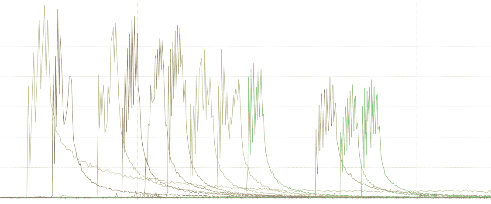
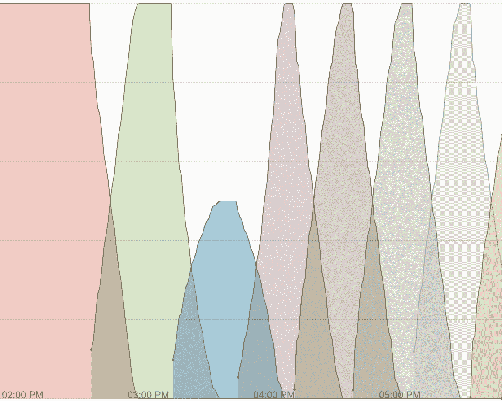
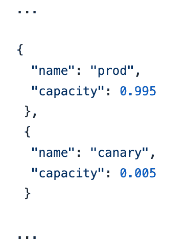
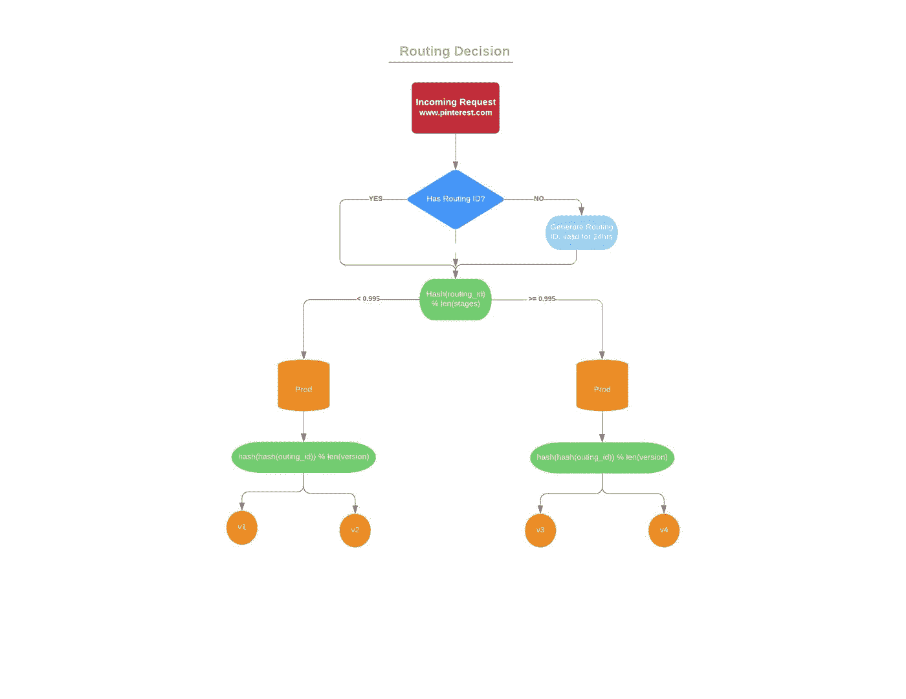
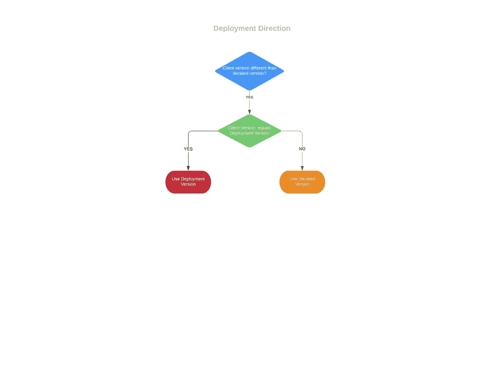

# 简化 web 部署

> 原文：<https://medium.com/pinterest-engineering/simplifying-web-deploys-19244fe13737?source=collection_archive---------1----------------------->

Raúl Gutiérrez Segalés，基础设施现场可靠性工程师
Ron Viscuso，核心产品软件工程师
徐永文，基础设施软件工程师

在过去的六个月里，Pinterest 已经为我们的 API 和 web 层转移到了一个 [CI](https://en.wikipedia.org/wiki/Continuous_integration) / [CD](https://en.wikipedia.org/wiki/Continuous_delivery) 模型，通过减少合并和生产之间的时间，真正提高了敏捷性。在更新之前，我们多年来一直以同样的方式部署我们的 web 代码，它开始显示出它的年龄。这种机制内部称为 A/B 部署，外部称为[蓝绿色部署](https://martinfowler.com/bliki/BlueGreenDeployment.html)。在这篇文章中，我们描述了我们如何以及为什么用滚动部署来代替它。

# 我们的旧部署模式(蓝绿色部署)

从早期开始，我们的主 web 属性的 web 层的 CD 方法就基于[蓝绿色部署模型](https://martinfowler.com/bliki/BlueGreenDeployment.html)，其中我们一直保持 web 层部署的两个实例。这些实例被称为 A 和 B，因此我们通常将这个部署模型称为 A/B(不要与 [A/B 测试](https://en.wikipedia.org/wiki/A/B_testing)混淆)。

在任何给定的时间，这些实例中只有一个是活动的并接收流量(以 A 为例)，因此我们将一个新版本部署到另一个实例(本例中为 B ),并在它被一些金丝雀流量验证后立即切换。b 将处于最新版本，处于活动状态并接收流量。下一次部署将在上进行，如此循环往复。

这种模式有几个积极的方面:

**即时回滚** 当一个回归以某种方式设法通过集成测试和金丝雀流量，以便稍后在生产中检测时，我们可以通过重新激活先前的版本来立即删除它。

**在给定的时间内，只有一个版本的应用程序运行** 由于一次只有一个实例处于活动状态，并且切换几乎是即时发生的，我们可以始终相信，在给定的时间内，我们只为一个版本的应用程序提供服务，这确实简化了生产指标的处理。

**部署期间没有容量损失**
由于只部署目标非活动实例，我们可以快速部署，然后在新版本随处可用时激活它。如果您正在就地更新生产端点，您真的无法做到这一点。

然而，事情并不完美。这里有一些我们不喜欢这个设置的地方:

**需要保持两个实例运行** 因为我们有两个 webapp 实例几乎一直在运行，所以我们的车队必须在内存、磁盘和 CPU 方面做出相应的调整。我们还必须解决实例重复的其他方面，例如端口和命名冲突，这增加了代码的复杂性。

**没有上升** 为了打开一个新版本，我们从 0%上升到 100%。有一个回归家族在金丝雀阶段没有出现，当他们出现时，已经太晚了。

我们必须在 ZooKeeper 中维护大量的状态，以跟踪之前提供了什么，新版本何时准备好等等。多年来，控制这一切的国家机器变得异常复杂，以至于很难在不引发事故的情况下改变一些事情。

**复杂的路由逻辑** 当有多个可能的状态时，确保请求被路由到正确版本的逻辑很难正确。我们必须考虑到所有可能的 A 服务、B 服务、金丝雀服务 A、金丝雀服务 B 等的组合。这一点，加上通知 Javascript 代码版本升级的逻辑，使得一切都难以维护，甚至更难扩展代码库来支持新的用例。

**独特性** Pinterest 上的大多数其他无状态集群使用基于 [Teletraan](https://github.com/pinterest/teletraan) 的众所周知的滚动部署模型，因此为我们的 web 集群建立一个难以理解的部署模型是一项真正的认知负担。

# 新的部署模式(滚动部署)

去年，我们决定是时候转向滚动部署模式了。组建了一个跨职能团队来规划和执行该项目，该团队由交付平台、流量和网络团队的工程师组成。

在探索了多种方法之后——每种方法在客户端、前端代理和后端 web 集群的复杂性上有本质的不同——我们决定可以在我们的[特使](https://www.envoyproxy.io)入口集群中处理大部分路由逻辑。

# 从 web 应用程序的角度来看，滚动部署

从应用程序的角度来看，向滚动部署的转移代表了我们处理生产指标和问题的方式的根本改变:我们不能再简单地依赖于在给定时间只提供一个版本的事实；事实上，在中期部署时，我们会有两个不同的版本，分别运行在一半的舰队上。因此，我们的行动项目之一是更新我们的系统和指标，以提高版本意识。

我们的客户端应用程序的版本也成为讨论的一个关键点，因为我们长期以来一直需要应用程序的客户端和服务器端部分之间的版本相似性。这意味着 1) [XHR](https://en.wikipedia.org/wiki/XMLHttpRequest) 来自运行特定版本应用的客户端的请求应该由同一版本的服务器端代码处理，2)当检测到新的服务器端版本时，我们的客户端会刷新到新的版本。

Graph showing web client refreshes during the day, each color represents a new version being rolled out to the web clients. *There, peaks coincide with the period when a new version is being deployed to our servers. At that moment, we signal to web clients that a new version is available on the server-side and instruct it to refresh. Once the deploy is complete, the number of refreshes rolls off until a new deploy starts.*

我们决定保留这种方法，因为它在开发和操作方面提供了许多好处，这是客户端和服务器端代码一致性的结果。然而，随着滚动部署，到新版本的截止时间不再是单个时间点，而是两个或更多服务器版本可以共存的更长时间间隔。我们很快了解到，我们需要将客户端更新与服务器端更新一起滚动，以保持每台主机请求的健康比率，同时保持版本相似性机制。

*A day in the life of the Pinterest web app.*

上图显示了活动的用户会话，每种颜色代表不同的版本。

请注意，在全天部署之后，我们是如何将 web 客户端从一个版本“滚动”到另一个版本的。较小的蓝色峰值表示部署在完成前发现问题时被回滚。它展示了这种模式的众多优势之一:早期事件检测。

# 滚动部署和流量路由

去年，流量团队用新的强大的[特使](https://www.envoyproxy.io/)代理替换了我们基于 Varnish 的入口层。Envoy 可以通过过滤器轻松扩展，过滤器可以用现代 C++编写。通过定制功能和强大的指标来扩展我们的边缘负载平衡器的能力让我们有信心探索蓝绿色部署模式的替代方案。我们的目标是拥有一个与其他集群几乎相同的部署模型，同时在部署期间保持客户端和服务器之间的版本相似性，以便 Web 团队可以在现有的前提下继续工作。这也很重要，因为版本之间的切换是有代价的(例如:浏览器刷新)。因此，在部署期间，对于每个活动的 Pinner，这最多需要发生一次。

我们首先简化了客户端逻辑，以确保处理版本切换的状态机只有一个入口点，使其更容易操作。由于我们独特的需求，我们不能仅仅使用 Envoy 现有的路由机制。我们的要求是:

*   在弃用期间，这两种部署类型都应该受到支持(蓝绿色和滚动)
*   我们应该能够跨阶段优雅地转移超过 1%的流量
*   行为应该尽可能具有确定性。例如:当强制一个现有的会话进入一个新的版本时，它不应该跳回到前一个版本，除非有一个回滚

因此，我们设计并原型化了一个路由过滤器，它将负责在滚动部署期间分发请求，同时满足上述需求。

第一个要求非常关键，大多数成功的迁移都是如此，因为它们提供了一个从旧世界优雅地迁移到新世界的好故事。这让我们在前进的过程中建立了信心，尽管这伴随着支持更多复杂性的代价。

特使过滤器的状态机最终看起来像这样:

*   如果请求没有路由 id，请为其分配一个
*   对于给定的路由 id，选择一个阶段。例如:hash(routing_id) % len(stages)
*   在给定阶段，如果使用滚动部署，则选择一个版本。例如:hash(routing _ id)% len(versions _ for _ that _ stage)

为了避免用户永久停留在某个阶段，我们建立了一个持续时间为 24 小时的路由 id。我们还提出了路线图的概念，它描述了跨阶段和版本的流量分布。下面是一个地图示例:

该路线图将 99.5%的流量发送到 prod，0.5%发送到 canary。在每个阶段，它将在不同版本之间动态、一致地分配流量。动态意味着它将根据每个版本的可用容量进行路由。一致意味着它将在路由 id 和可用版本之间应用排序，以确保给定的 routing_id 在部署期间不会跨版本跳转，并且它只跳转一次。

路线图存储在 ZooKeeper 中，并通过我们的配置管道分发。每个阶段每个版本的容量是根据我们发布的服务器集(也存在于 ZooKeeper 中)上的可用端点计算的。也就是说，端点具有关于其版本的元数据，然后用于容量计算。这非常方便，因为我们可以依靠现有的和经过战斗考验的系统。然而，这也带来了最终一致性的挑战。并非所有的特使服务器在同一时间都有相同的世界观。

为了解决这个问题，我们扩展了过滤器，赋予它“部署方向”的概念。也就是说，当路由图发生变化时，您可以通过观察容量如何变化来推断正在部署哪个版本。容量增加的版本是新版本。因此，当会话想要的版本与过滤器认为它应该得到的版本不匹配时，我们使用部署的方向来打破这种模糊性。这对于平息由于代理之间缺乏同步而发生的版本反弹非常有用。

# 结论

部署策略和流量路由是有趣的挑战。把它们做好真的可以让你的开发者和操作体验变得顺畅。当管道易于推理和调试时，它们还可以大大增加您的可靠性。考虑到项目的活力以及通过过滤器扩展其核心逻辑是多么容易，能够在 Envoy 上构建它确实使事情变得更容易。

改变已经存在多年的核心基础设施总是具有挑战性，因为有许多未记录的行为。然而，我们跨部署模型分阶段过渡的方法使得获得稳定的反馈并确保无事故迁移成为可能。

这个项目是多个团队的共同努力:交付平台、核心网络、服务框架和流量。在这个过程中，我们还收到了来自其他团队和演员的非常有价值的反馈。

设计想法和代码评论的致谢:詹姆斯·菲什，德里克·阿格塔，斯科特·比尔兹利，迈克尔·本尼迪克特，克里斯·劳埃德

> 我们正在建造世界上第一个视觉发现引擎。全世界有超过 2.5 亿人使用 Pinterest 来梦想、计划和准备他们在生活中想做的事情。[来加入我们吧！](https://careers.pinterest.com/careers)