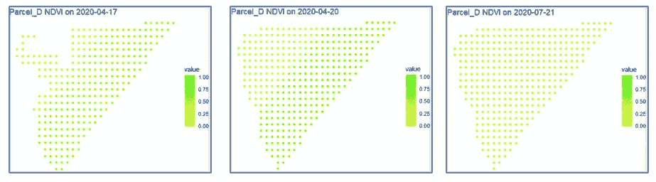
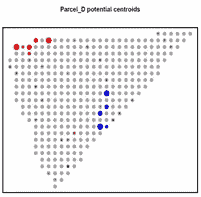
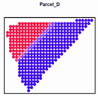
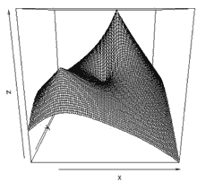
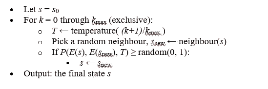
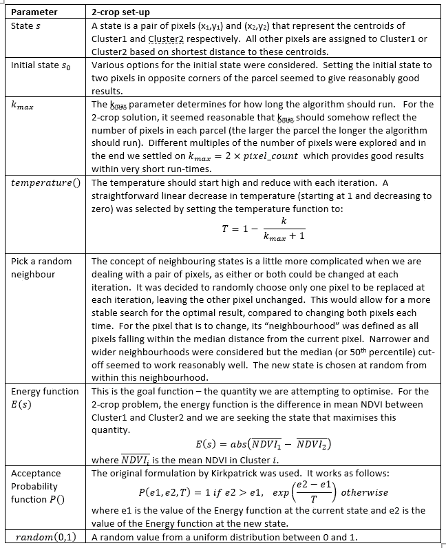
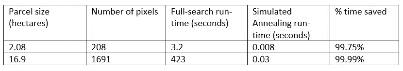
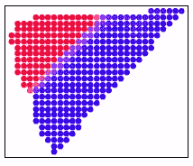
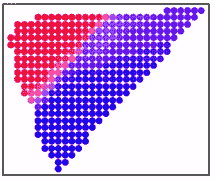

# 模拟退火算法在农业监测卫星数据中的应用

> 原文：<https://medium.com/version-1/simulated-annealing-applied-to-satellite-data-for-agricultural-monitoring-681b4aaa4a53?source=collection_archive---------3----------------------->

Photo by [NASA](https://unsplash.com/@nasa?utm_source=medium&utm_medium=referral) on [Unsplash](https://unsplash.com?utm_source=medium&utm_medium=referral)

地球观测卫星自 20 世纪 70 年代初就已经进入轨道。几十年来，世界各地的公共和私人组织一直使用卫星数据来监测农业用地，以便:

-预测作物产量和商品价格，

-监测粮食供应和粮食安全的风险，

-通过对批准的耕作方式进行货币支付来支持农民。

公有卫星免费提供低至 10 米空间分辨率的图像。可以从商业卫星所有者那里购买更精细的数据，他们可以提供空间分辨率低至 0.25 米的图像。

欧洲联盟各国正准备利用卫星数据(“监测检查”)来监测共同农业政策下农民收入支助的资格标准。哥白尼哨兵卫星的图像是免费提供的，成员国可以选择使用这一数据或“至少具有同等价值的其他数据”。成员国开发并共享机器学习算法——这些算法使用来自卫星数据的生物物理指标来识别农业事件(耕作、收获等)，对作物类型或土地使用进行分类，或监测土地覆盖随时间的变化。

# **一块田地，一种作物**

欧盟 CAP 收入支持的土地单位是农业用地，定义为“*一个农民申报的连续土地区域，其中包括不超过一个作物群*”。如果事先可靠地知道地块的边界，那么机器学习算法可以放心地应用于卫星图像，裁剪到地块的边界。

但是，宗地边界不正确怎么办？过去只有一种作物的一块土地，今年可能有两种或两种以上的作物。如果没有检测到这一点，识别宗地边界内最可能的作物的算法肯定会失败。

通过欧盟范围内的监控来展开检查的技术指南要求检查宗地的空间完整性，作为应用其他算法的先导。没有规定具体的机器学习算法，但问题类型是空间聚类——使用单个像素级数据将图像分成两个或更多个聚类。

下图显示了样本图像拍摄日期单个地块的 NDVI(归一化差异植被指数)。较高的 NDVI 值表明地面上有活着的绿色植被。4 月份的图像强烈暗示了两种不同作物的存在，然而 4 月 17 日的图像由于当天的云层覆盖而丢失了一些像素值。到 7 月 21 日，整个地块没有明显的 NDVI 差异，这表明任何空间聚类方法在某些日期可能比其他日期更好。

Figure 1: NDVI by pixel by date for Parcel_D

**空间聚类**

识别 2-作物地块内作物#1 和作物#2 的位置的潜在方法是迭代地指定像素对作为聚类 1 和聚类 2 的质心(其中每个聚类代表不同的作物)。给定日期的最佳解决方案是最大化两个聚类之间的平均 NDVI 差的像素对。

在上面的示例地块(“Parcel_D”)中，我们在每个图像中有多达 350 个像素，每个像素代表一个 10m 的区域。因此有 61，075 对像素要检查(我们可以从 350 种方式中选择 2 种)。

对于每个这样的对(质心 1、质心 2)，运行以下计算:

-计算每个其他像素到质心 1 和质心 2 的(直线)距离

-如果像素更靠近质心 1，则将其分配给聚类 1，否则分配给聚类 2

-计算集群 1 和集群 2 的平均 NDVI

-记录平均 NDVIs 之间的差异。

在对状态空间进行彻底搜索之后，为每个图像日期保留了使平均 NDVI 差异最大化的一对质心。图表中的蓝点和红点显示了整个生长季节的最佳质心。

Figure 2: Potential centroids of Cluster 1, Cluster 2

下面绘制了整个季节中聚类 1 或聚类 2 的像素的最终加权分类，使用蓝色和红色表示属于聚类 1 或聚类 2 的高概率，粉色/紫色阴影表示不确定区域。

结果显示，Parcel_D 相当清晰地划分为两个不同的区域，每个区域代表一种作物。现在这些子地块已经被识别，作物分类和其他机器学习算法可以安全地应用于每个子地块。

Figure 3: Full-search segmentation of Parcel_D

# **问题**

上述空间聚类技术的问题是检查所有像素对的计算时间。问题的复杂度是 O(n ),这是不可扩展的。上图所示的地块 D 面积为 3.5 公顷。一个 20 公顷的地块有 2，000 个像素，每个图像采集日期需要检查 1，999，000 对像素(即 2000 选 2)。对一个成员国要监测的所有地块进行这种计算会使农业监测系统陷入停顿。

# **解决方案**

该问题的一个解决方案是使用优化技术来更有效地找到最佳质心，而不需要穷尽搜索像素对的所有排列。

一种这样的优化技术是模拟退火。模拟退火算法基于模拟当金属或其他材料被加热然后冷却时观察到的热力。该算法最初“热”运行，在解空间中跳跃以找到全局最大值或最小值，随着时间的推移“冷却”以探索与当前解更接近的解。

“温度”特征的目的是避免“卡”在状态空间的子部分中，因为“在非零温度下，跳出局部最优总是可能的”( *Kirkpatrick，s；小格拉特公司；韦奇议员(1983 年)。“模拟退火优化”*)。

Figure 4: Example of a state space with a global and local maximum

该算法从初始状态 *s* 0 开始，并且继续，直到已经采取了最大的 *k* max 步。在每次迭代中，该算法考虑当前状态的某个相邻状态，并在概率上决定是移动到相邻状态还是停留在当前状态。如果温度高，迁移到邻州的概率更高(即使邻州产生更差的解)。随着温度降低，移动到相邻状态的概率降低。

模拟退火的[维基百科](https://en.wikipedia.org/wiki/Simulated_annealing)条目提供了该方法的伪代码:

Figure 5: Pseudo-code for simulated annealing

伪代码中的每一步都需要根据手头的问题进行定制。下面是如何将该方法应用于两茬作物问题:

Figure 6: Application of simulated annealing pseudo-code to 2-crop problem

# **结果**

如果该方法工作良好，使用模拟退火的子包裹的识别应该合理地接近状态空间的“全搜索”，并且该算法应该运行得更快。

首先处理运行时间，发现模拟退火方法的运行速度是全搜索方法的数倍，特别是在较大的包裹上:

Figure 7: Run-time for Simulated Annealing vs Full-search

就最终解决方案的质量或准确性而言，在模拟退火下，聚类 1 和聚类 2 之间的平均 NDVI 的差异有时低于使用全搜索方法发现的最大值。调查发现，模拟退火方法表现不佳的图像往往存在像素缺失的问题(由于云层覆盖)。这些图像往往导致全搜索方法找到相对于相邻像素对是异常值的“小生境”解决方案。增加 kmax 的值以允许模拟退火运行更长时间并没有实质上改善这些受云影响的图像的结果。

Figure 8: Full-search segmentation of Parcel_D

Figure 9: Simulated Annealing segmentation of Parcel_D

实际上，模拟退火方法不能总是返回绝对最佳的结果，这被认为不如在最佳时间内产生相当好的结果重要。比较上面图 8 和图 9 中的全搜索和模拟退火图像，可以看到模拟退火返回了靠近两种作物之间的边界的分割不太确定的小区域(紫色阴影)，但是这些紫色像素仍然被识别为更类似于“蓝色”作物而不是“红色”。

# **结论**

如果没有仔细设计，空间聚类算法的运行速度会非常慢。在国家农业活动监测的背景下，复杂度为 O(n)的算法是不实际的。模拟退火可以在运行时间的一小部分内提供出色的结果。该算法需要一些努力来使通用方法适合手头的问题，但是运行时间的节省意味着这种努力是值得的。