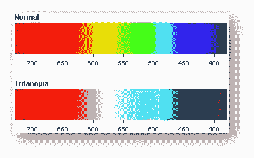
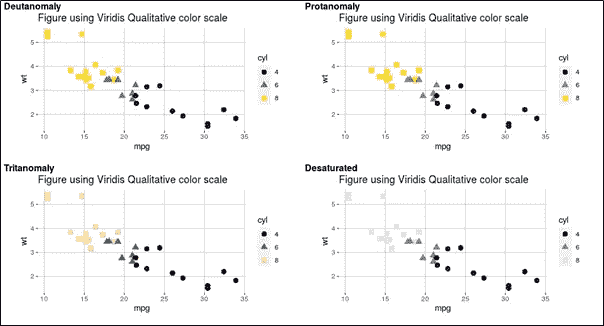

# 模拟色盲的 R 语言可视化

> 原文：<https://medium.com/version-1/simulating-visualisations-in-r-for-colour-blindness-2faddde63695?source=collection_archive---------0----------------------->

Photo by [Christina Rumpf](https://unsplash.com/@punk_rock_vegan?utm_source=medium&utm_medium=referral) on [Unsplash](https://unsplash.com?utm_source=medium&utm_medium=referral)

当通过图表和数字呈现时，数据被很好地分析和观察。对你的数据点进行正确的可视化可以将你的原始数据转化为有洞察力的智能信息。但是视觉化有一个非常重要的美学，即颜色。有了颜色，观想带来更清晰的洞察力。根据我们想要呈现的信息类型，我们有多种颜色选择，即定性颜色和定量颜色。

作为分析师和商业智能开发人员，我们中的大多数人在选择可视化的颜色时会忽略一些限制。当我们创作情节时，我们选择看起来对我们有吸引力的颜色，或者比其他颜色更有吸引力的颜色，比如对比强烈的明暗色调等等。然而，我们假设我们在考虑我们的观众需求的最大值，但是我们是否在考虑观众中的某些人在感知我们的情节时可能会因为我们选择的颜色而面临的隐藏问题。色盲患者可能会经历这些隐藏的问题。

色盲者在区分我们在视觉化中使用的一些颜色时会遇到挑战。因为这个问题，那个人可能无法理解我们想要传达的直觉。

这个博客是针对那些受雇于为他们的最终客户或项目客户生成图形和绘图的开发人员的。看完这篇博客后，我们应该有一个不同的视角来选择图表的颜色。

**目标**

在这篇文章中，我们打算说明我们如何在 R 语言中再现色盲的可视化。我们将看到色盲如何影响人们从视觉中推断信息的能力，以及人类可能存在的色盲类型。除此之外，我们还将介绍使用色盲友好库在 R 中创建情节。

**什么是色盲？**

色觉缺陷，也称为色盲，是一种辨别特定颜色能力减弱的形式。视网膜中有两种类型的细胞检测光，即视杆细胞和视锥细胞。视锥细胞是负责检测颜色的细胞，其类型有红色、绿色和蓝色。

Figure 1\. Cone cells in eye . [Source](https://www.aao.org/eye-health/anatomy/cones)

如果一种或多种视锥细胞工作不正常或缺失，就会发生色盲。因此，可能有轻度色盲的情况，其中任何一种视锥细胞功能不正常，或者有严重的情况，其中所有三个视锥细胞都不工作。

据估计，12 名男性中有 1 名(8%)和 200 名女性中有 1 名(0.5%)患有某种色觉缺陷。

让我们讨论一些常见类型的色盲

Figure 2\. Protanomaly . [Source](https://www.colour-blindness.com/protanopia-red-green-colour-blindness/)

**pro 正常情况下，**或 Protan 色盲会导致一个人难以区分**蓝色和绿色**以及**红色和绿色**的颜色。

Figure 3\. Deutanomaly . [Source](https://www.colour-blindness.com/deuteranopia-red-green-colour-blindness/)

**Deutanomaly、**或 Deutan 色盲导致一个人在辨别颜色时产生混淆，例如**绿色和黄色**，或**紫色和蓝色**。

Figure 4\. Tritanomaly . [Source](https://www.colour-blindness.com/tritanopia-blue-yellow-colour-blindness/)

**三色异常、**或三色色盲使人对**蓝色和绿色**或**黄色和紫色**产生混淆。

还有一种更罕见的色盲情况，那就是**单色和色盲**，意思是**没有颜色**。

色盲的人是如何看到颜色的？

下图描述了正常色觉和色觉缺失的人如何观察彩色图像。

Figure 5\. Color blind variants of a normal colourfull image . [Source](https://enchroma.com/pages/types-of-color-blindness)

到目前为止，我们已经了解了一些与色觉缺陷相关的概念。现在让我们进入这篇博文的主要议程，即 ***我们如何模拟 R 中的情节，这些情节被色盲和正常视力的人很好地可视化？***

在接下来的章节中，我们倾向于说明对色盲和视力正常的人来说视觉上正确的图的模拟。以及我们如何使用一些特定的颜色集/调色板来生成 r 中的这些类型的图。

我们将模拟使用不同调色板的 3 个图形。默认 ggplot 颜色，2。绘图用 [***冈部和伊藤***](http://jfly.iam.u-tokyo.ac.jp/color/) 调色板，和 3。使用 Viridis 库生成的调色板。

快速介绍 Okabe 和 Ito 调色板，他们建议了一组对色盲和非色盲都友好的颜色。下面是冈部和伊藤建议的调色板。

Figure 6\. Colour palette suggested for Colour-blinds and Non colour-blinds . [Source](http://jfly.iam.u-tokyo.ac.jp/colour/)

我们将使用 r 中内置的 [**mtcars**](https://www.rdocumentation.org/packages/datasets/versions/3.6.2/topics/mtcars) 数据集。该数据集包含 32 辆汽车在性能和设计方面的多个方面。下面是如何将这个数据集加载到 R 环境中的快照，并可以看到前 6 行。

Loading mtcars and Displaying top 6 rows from it

接下来，我们需要安装和加载一些 R 库来实现我们的最终目标。下面提到的是我们将需要的库列表:

1.[***gg plot 2***T5【是著名的 R 库生成剧情。](https://www.rdocumentation.org/packages/ggplot2/versions/3.3.2)

2. [***dplyr***](https://www.rdocumentation.org/packages/dplyr/versions/0.7.8) 是一个用于处理数据帧的 R 包。

3.[***colour blindr***](https://www.rdocumentation.org/packages/colorblindr/versions/0.1.0)是一个帮助模仿人物色盲效果的库。我们可以使用该库提供的函数来创建各种类型的色觉缺陷的效果。

4.[***viridis***](https://www.rdocumentation.org/packages/viridis/versions/0.5.1)是一个提供可用于 R 图的彩色地图/调色板的库。通过 viridis 提供的彩色地图是以这样一种方式设计的，即正常视力和所有形式的色觉障碍的读者都能很好地感知它们。

上述库的安装步骤在它们的官方文档页中给出，这些文档页与每个库的名称相链接。下一步应该是在 R 环境中安装后加载这些库。

Loading libraries

到目前为止，我们已经有了执行 R 图模拟所需的数据集和所需的库。我们只需要对数据集做一点小小的改变。使用屏幕截图中下面提到的代码，将 mtcars 的其中一列的类型更改为 factors。

Modifying column type in mtcars dataset

我们需要执行此步骤，因为列“cyl”被标记为连续变量，它只有 3 个值，即 4、6 和 8。因为我们将使用该列来对数据进行着色和整形，所以我们需要将它作为因子变量。

现在，我们将开始使用 ggplot2 用默认颜色生成我们的第一个图。

Plotting with default colour palette in R ggplot

让我们看一遍代码。所以，我们将 ***ggplot*** 图美学定义为 x 轴上的'***【mpg】'***列，y 轴上的'***【wt’***列，以及'***【cyl’***列为数据点的形状和颜色。接下来，我们用'***【gg title】***给剧情加标题。我们还使用' ***geom_points*** '定义了数据点的大小。最后，我们定义了一些主题属性，以改变背景颜色和绘制主要的网格线。运行上面的代码片段后，我们可以看到如下图

Plot1 with default ggplot colours

在图 1 中，视力正常的人可以看到 4 缸、6 缸和 8 缸汽车的不同颜色。

但是你有没有想过一个色盲的人会如何看到这些？现在让我们来模拟一下。我们将使用库' ***colourblindr*** '中的函数' ***cvd_grid*** ，为色盲人士重现 Plot1。下面是执行此步骤的代码片段。只需将 ggplot 变量发送给函数，它就完成了。

Code snippet to reproduce colour blind grid

上述命令将为各种类型的色盲生成如下所示的绘图网格。

Plot 1 colour blind variants generated using colorblindr library

上图显示了色盲患者的障碍。除了在对比度值上有一些差别外，氘异常和氘异常显示的颜色几乎相同。由于这两种色觉缺陷中的任何一种，人们将很难识别 4 缸和 6 缸汽车的数值。在 Tritanomaly 的情况下，该人员将面临区分 6 缸和 8 缸汽车的数据点的挑战。最后，去饱和色盲或色盲将导致一个人看不到任何颜色，或者在这种情况下，所有的数据点都是相同的颜色，即灰色。

因此，总结正常视觉和色盲视觉中的情节 1，我们可以很容易地发现色觉缺陷者所面临的问题。而对于正常人来说，Plot1 中的颜色在不同的数据点和数据类型中非常有吸引力和对比性。然而，我们可以看到色盲所面临的问题。如果我们没有不同类型的圆柱体的不同形状，那么色盲患者将很难区分不同的数据点。

现在，我们知道了为 r 中生成的图选择通用/默认颜色的问题。现在，让我们探讨使用具有不同调色板的图及其色盲变体来解决此问题的两种解决方案。

地块 2 将使用冈部和伊藤提出的色盲友好调色板。在这个图中，我们将从建议的调色板中选择任意 3 种颜色，然后产生它们的等价色盲变体。

下面是用 Okabe 和 Ito 调色板中的 3 种颜色生成 Plot2 的代码快照。

Plotting using colours from Okabe and Ito colour palette

上面的代码片段将生成一个 R 图，如下所示。

Plot 2 using Okabe and Ito suggested colour palette

这里，图 2 显示了正常视力人的非常独特的颜色。让我们生成该图的色盲变体，然后决定 Okabi 和 Ito 建议的调色板是否有用。为该图生成色盲变体的步骤与图 1 相同。使用 cvd_grid 函数并将脚本中的 Plot2 变量发送给此方法。这将产生如下所示的绘图网格。

Plot 2 colour blind variants

当我们使用 Okabe 和 Ito 调色板制作 Plot 2 时，它的颜色足以理解和区分汽车中的各种气缸。然而它的反色盲视角却不是这样。虽然氘异常和氘异常的再现可以说提供了一个清晰的视觉。Tritanomaly 可能会给理解 4 缸和 6 缸数据点带来困难。至于去饱和版本，数据点可以区分，但不容易。

在 Plot3 中，我们将使用 Viridis 库提供的色标。它提供了两种不同的功能来选择定性(离散)和定量(连续)值的颜色。***scale _ colour _ viridis _ d***和***scale _ colour _ viridis _ c***分别为。在我们的场景中，由于' ***cyl'*** 列是定性的，我们将使用***scale _ colour _ viridis _ d***函数来绘制我们的图。以下是代码快照，用于使用 Viridis 定性色标生成 Plot3。

Plotting using colours from Viridis qualitative colour scale

使用上述代码片段生成的图如下图所示。这里，具有正常色觉的人可以清楚地描绘和区分每个数据点的不同颜色的值。

Plot 3 using Viridis colour scale

让我们来看看它的等价色盲变体。

Plot 3 colour blind variant

图 3 色盲变体是最明显可区分的一种。由 Viridis 库指定的所有 3 种颜色都很好地描述了所有类型的色盲。

**到目前为止我们看到了什么？**

颜色在数据可视化中扮演着非常重要的角色。我们在选择颜色时必须非常小心。对于一个正常视力的人来说，看起来有吸引力的东西对一个色盲的人来说可能不是一个好主意。我们已经看到了不同类型色觉缺陷的人是如何感知图形中的颜色的。但是有一些色盲友好的调色板和 R 包，可以用一种色盲也能很好区分和理解的方式给你的 R 图着色。

就这样，我把这个帖子带到最后。我希望我已经涵盖了足够的内容，以传达我想在开始帖子时传达的信息。

请让我知道你的宝贵意见和反馈。

干杯！

**关于作者**

*Indeep Singh 是一名数据分析顾问，目前从事* [*版本 1*](https://www.version1.com/) *的数据分析实践。请务必关注 Indeep，了解更多关于数据分析和数据可视化的博客。*