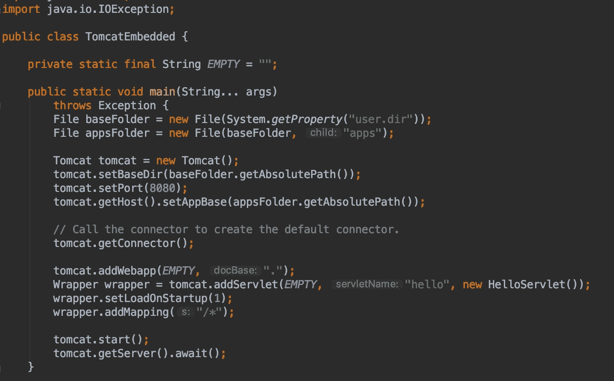

# Java 11 的单文件源代码

> 原文：<https://medium.com/oracledevs/single-file-source-code-with-java-11-74d1a4c3d31?source=collection_archive---------0----------------------->



Java 11 的众多显著特性之一是能够直接运行 Java 源代码的单个文件，而无需先编译源代码。作为对 JShell 的补充，这个特性有助于学习 Java 和编写简单的实用程序和 CLI。

假设您创建了一个 HelloWorld.java 文件，您猜对了，它打印“Hello World”:

```
public class HelloWorld {
    public static void main (String... args) {
        System.*out*.println("Hello World");
    }
}
```

安装了 JDK 11 后，您可以使用“java”启动程序运行该文件:

```
java HelloWorld.java
```

JDK 11 中的“java”启动程序已更新为在 4 种模式下运行:

*   启动一个类文件
*   启动 jar 的主类
*   启动模块的主类
*   启动在单个源文件中声明的类

当以下两个条件之一匹配时,“java”启动器识别单文件模式:

*   传递给它的第一项是带有“.”的类文件。java”扩展
*   指定了“--source”(读作破折号)选项

# Shebang 支持

如前所述，单文件模式对于创建小型实用程序很有用。Shebang ("#！")机制非常适合运行这样的单个文件实用程序。使用单个文件模式调用 Java 启动器的 shebang 文件应该以下列内容开始:

```
#!/path/to/java --source version
```

shebang 行可以包含其他启动选项，比如添加额外的类路径 jar。当然，文件应该被标记为可执行的。注意，当包含 shebang 行时，您的单个文件源代码名称不需要遵循 Java 类命名约定。例如，HelloWorld.java 可以改名为“你好”。

> Shebang 支持不是 Windows 自带的

有了这些知识，让我们创建一个小程序，将 Tomcat 作为嵌入式(TED)服务器运行。下载[嵌入式 tomcat zip](https://tomcat.apache.org/download-90.cgi) 文件，并将所需的 jar 文件解压到一个“lib”文件夹中。接下来，创建一个名为“ted”的文件，并将其标记为可执行文件:

```
touch ted && \
  chmod +x ted
```

将以下代码添加到文件中:

```
#!/usr/bin/java --class-path ./lib/* --source 11

import org.apache.catalina.Wrapper;
import org.apache.catalina.startup.Tomcat;

import javax.servlet.http.HttpServlet;
import javax.servlet.http.HttpServletRequest;
import javax.servlet.http.HttpServletResponse;
import java.io.File;
import java.io.IOException;

public class TomcatEmbedded {

    private static final String EMPTY = "";

    public static void main(String... args)
        throws Exception {
        File baseFolder = new File(System.getProperty("user.dir"));
        File appsFolder = new File(baseFolder, "apps");

        Tomcat tomcat = new Tomcat();
        tomcat.setBaseDir(baseFolder.getAbsolutePath());
        tomcat.setPort(8080);
        tomcat.getHost().setAppBase(appsFolder.getAbsolutePath());

        // Call the connector to create the default connector.
        tomcat.getConnector();

        tomcat.addWebapp(EMPTY, ".");
        Wrapper wrapper = tomcat.addServlet(EMPTY, "hello", new HelloServlet());
        wrapper.setLoadOnStartup(1);
        wrapper.addMapping("/*");

        tomcat.start();
        tomcat.getServer().await();
    }

    private static class HelloServlet extends HttpServlet {
        @Override
        protected void doGet(HttpServletRequest req, HttpServletResponse resp)
            throws IOException {
            resp.setStatus(200);
            var writer = resp.getWriter();
            writer.write("Hello World");
            writer.flush();
            writer.close();
        }
    }
}
```

保存文件，并将文件作为常规可执行文件运行:

```
./ted
```

在浏览器中导航到 [http://localhost:8080](http://localhost:8080) ，查看实用程序的运行情况。诚然，“ted”在目前的情况下没什么用处，但你可以扩展它，构建一个小型的开发者“Dropbox”实用程序，在虚拟机之间共享文件。

有了这个新的单文件源代码特性，用 Java 创建自包含实用程序的可能性是无穷无尽的。编码快乐！