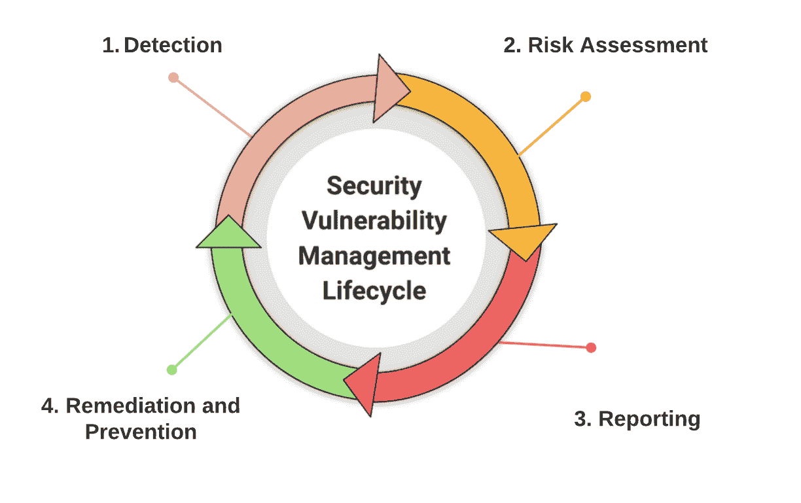
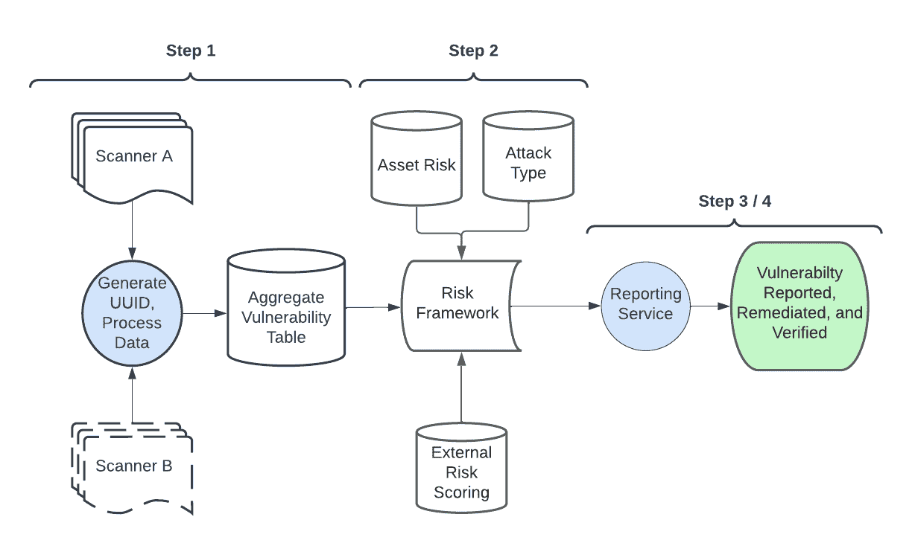
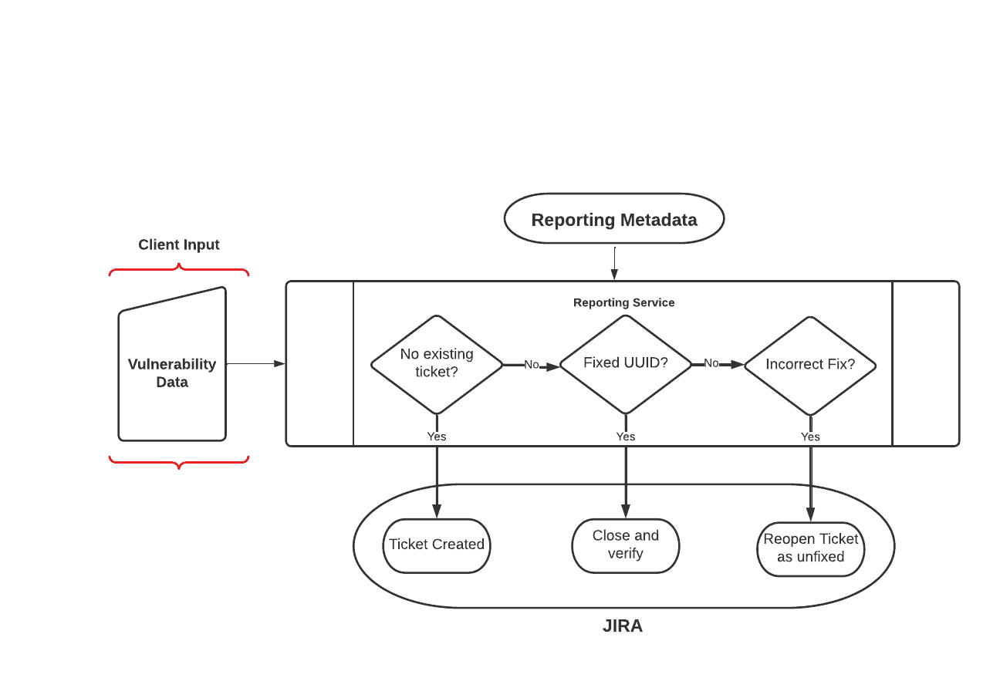
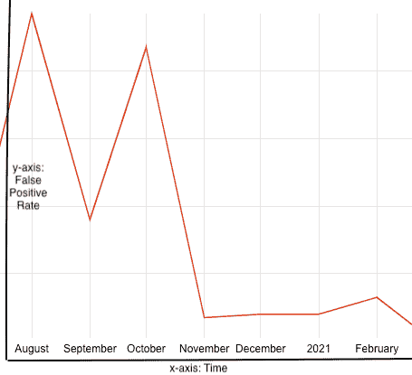

# 西西弗斯和 CVE 饲料:大规模的脆弱性管理

> 原文：<https://medium.com/airbnb-engineering/sisyphus-and-the-cve-feed-vulnerability-management-at-scale-e2749f86a7a4?source=collection_archive---------1----------------------->

**作者** [Keziah Perez Sonder Platt ner](https://www.linkedin.com/in/keziahsonderplattner)，高级软件工程师
[Kadia Mashal](https://www.linkedin.com/in/kadia-m-58a18328) ，工程经理

# 介绍

每个工程师都知道，安全是一个永无止境的问题。直到我们删除所有的代码，搬进树林里的小屋，我们不得不接受没有 100%安全的软件这一事实。你可以把一切都做得很完美，而一个众所周知的漏洞( [CVE](https://www.redhat.com/topics/security/what-is-cve) )可能会出现在你的基础设施中第三方库的最新版本中。事物在变得不安全之前都是安全的。就像西西弗斯一样，巨石永远不会到达山顶。

漏洞管理计划的目标不是消除漏洞，而是快速有效地检测和响应每天出现的大量威胁。有许多扫描器和厂商工具声称可以解决这个问题。但是扫描仪带来了永无止境的 CVE 报告泛滥的问题，从而降低了我们及时补救的能力。

# 漏洞管理生命周期

如果您是漏洞管理的新手，以下是生命周期的基础知识。

*Fig. 1: The Vulnerability Management Lifecycle*

**检测**

从 CVE 到不安全的错误配置，在我们的基础设施中寻找潜在的漏洞。

**风险评估**

对调查结果应用风险框架，以确定真正的积极因素并剔除不适用的漏洞。

**报告**

找到最适合解决这个问题的团队和/或个人，并有条不紊地跟踪进展。此外，集中跟踪所有漏洞，以便全面了解我们的攻击面。

**修复和预防**

及时补救漏洞，并投入工作，以防止漏洞被引入。

# 目标

在构建漏洞管理计划时，我们希望关注以下几点:

*   **可视化已知攻击面**:如果我们一开始就不知道自己的漏洞状态，我们就无法正确评估风险。
*   **速度**:及时完成检测、报告和修复。
*   **区分优先级**:在处理不太重要或难以利用的漏洞之前，先关注优先级最高的漏洞。
*   **扩展**:支持不断发展和扩展的云基础设施。

# 标准行业解决方案的差距和挑战

标准的行业建议依赖于现成的供应商部署、手动风险评估和操作繁重的报告流程。自动化(如果存在的话)依赖于有限的供应商功能，没有根据我们环境的独特属性进行调整的灵活性。这给实现我们的目标带来了重大挑战。

**缺乏独立于供应商的解决方案**

随着基础设施的扩展，我们想要跟踪的漏洞类型的数量也随之增长。我们需要各种扫描解决方案来覆盖我们的基地，但它们有不同的设置和报告流程。将来可能会有更适合我们的扫描解决方案，所以我们不想将自己局限于单一的供应商或解决方案。

**嘈杂且不准确的严重等级**

根据我们的经验，大多数扫描仪提供的风险评分不准确。像基本通用漏洞评分系统(CVSS)这样的漏洞公告和评估可能会描述难以利用或炒作问题的最坏情况，从而导致严重性被夸大。当发现一个主要的零日漏洞时，它更有可能被匿名 Twitter 用户而不是扫描器识别出来。

此外，内部缓解措施可以降低漏洞的影响，通用扫描器很少能够添加内部上下文来自定义风险评级。资产信息和漏洞的位置在确定其严重性方面起着重要作用。

**作战工作**

许多漏洞管理解决方案都假设在这个过程中需要人工干预。然而，人类会犯错误，每个手动步骤都会导致补救时间变慢。花时间在繁重的任务上，如手动评估风险严重性或制作票证，会占用我们专注于根本原因补救的时间。

# 指导原则

在开发我们的解决方案之前，我们希望建立指导原则。虽然总会有例外，但我们的目标是保持它作为我们的北极星。

**减少误报，减少人工干预。设计一个接近 100%真阳性的解决方案是很有诱惑力的。**

然而，当最大化真阳性时，不可避免地假阳性率也会增加。误报给安全团队和工程团队都带来了繁重的手工工作。我们不想在不值得解决的漏洞上“喊狼来了”。这样做不仅是不可伸缩的，而且会破坏对安全组织的信任。更不用说依靠手动分类来验证警报严重性会减慢响应时间，从而使漏洞开放更长时间。

此外，手动检查漏洞将导致更高的准确性的想法没有考虑到人为错误和警报疲劳。没有人或自动化的过程会获得 100%真正的正面准确性，这种知识必须构建到解决方案中，而不是与嘈杂的警报进行一场失败的战斗。

**将检测与预防措施结合起来。**
既然我们已经确定真正的阳性会从裂缝中溜走，我们需要解决如何处理这些情况。我们将检测和报告工作流与解决漏洞根本原因的预防性解决方案相结合。例如，如果我们确保有一个定期的补丁节奏，那么所有的漏洞——包括低优先级的漏洞——都将在一个合理的时间框架内得到解决。如果我们修复一个有缺陷的设计，我们将在第一时间减少漏洞的数量。

**建立关系。**

如果我们对抗其他工程团队，而不是授权和激励他们修复问题，那么世界上所有的自动化都将是无用的。开发人员的生产力很重要——我们不想创建一个繁重的系统，让开发人员感到沮丧，让安全性成为敌人。我们希望避免阻塞解决方案，除非优先级需要，并且我们希望将工程工作集中在我们的最高优先级差距上，而不是将工程师分散到许多低级和中级漏洞上。当然，这里总是有例外——有时一个漏洞严重到需要在半夜被呼叫。但是我们不想使用这种方法。

通过将安全补丁与其他好处配对，或者将其工作到现有的工作流中，使该过程对于外部工程师来说基本上是不可见的，这有助于让团队参与进来。

我们过去尝试过自上而下的解决方案，但没有什么比把工程团队视为我们的合作伙伴并作为利益相关者寻求他们的投入更有效的了，这使它成为一个互利的过程。

**保持问责**。如果没有修复漏洞的责任，检测漏洞没有任何帮助。我们希望确保它们正确地归属于业务部门，以便领导层负责修复漏洞。让业务部门负起责任意味着他们将被鼓励分配资源来解决问题，而不是把安全问题放在次要位置。

应该有一个基于漏洞严重性的公司范围的服务级别协议(SLA ),这是每个组织成功度量的一部分。如果无法满足 SLA，我们会提供自动化的 SLA 延期请求，以允许团队进行调整。我们避免例外，除非绝对必要，并定期审查推理。

# 构建自动化、独立于供应商的漏洞管理管道

考虑到这些挑战，标准的行业建议并不适用于我们的用例。因此，我们决定创建自己的工程解决方案。

*Fig. 2: Automated Vulnerability Pipeline*

## 步骤 1:聚集和处理漏洞

首先，我们将来自扫描仪的大量警报转换为标准化格式，集中在一个地方，而不是将每个扫描工具与其他工具隔离开来。

为了清晰地跟踪整个管道中的漏洞，我们为遇到的每种漏洞类型开发了一个 UUID 生成流程。此 UUID 可映射到漏洞及其所在的资产。这可能因漏洞类型而异——例如，对于我们的第三方软件包，我们通过*资产* + *软件包名称* + *软件包版本来跟踪漏洞。*单独跟踪资产中存在的每个 CVE 不太重要，因为修复一个包版本将解决每个相关的 CVE。当我们检测到一个资产不再使用一个特定的包或版本时，我们可以确信漏洞不再存在。并且将多个 cv 统一到一个 UUID 中更容易管理。

当扫描仪有一些重叠时，这也有帮助。我们没有直接使用有限的供应商功能，而是利用他们的 API 来获取结果，以便我们可以根据自己的需求处理警报，并允许我们消除重复警报和验证修复。然后，我们可以根据需要组合结果或添加附加信息。

## 第二步:将风险情境化

我们的下一步是通过采用扫描器提供的默认严重性计算并集成其他上下文来自动化风险评估。

所有公司都有不同的基础设施设置和缓解策略。例如，如果负载平衡器具有现有的缓解措施，涉及 DDOS 的漏洞就不会有那么大的影响。另一方面，处理 PII 的应用程序中的漏洞可能比扫描程序最初评估的要严重得多。

为了提高我们风险评估的准确性，我们考虑了以下因素:

*   **内部缓解**:某些漏洞类型可能与我们的基础设施无关。
*   **通用漏洞评分系统(CVSS)向量**:漏洞利用的类型很重要。例如，如果攻击需要本地权限和用户交互，即使影响很严重，利用的几率也会显著降低。通过攻击媒介分解 CVSS 基本分数，我们可以更好地了解漏洞风险。
*   **资产风险**:资产是否面向公众？还是处理低优先级元数据的内部服务？这对 PII 有用吗？它对生产流程有多重要？
*   **多个外部评分系统和元数据**:国家漏洞数据库(NVD)评级、红帽评级和厂商评级有区别吗？这是 3 年没更新的包吗？这是旧的，未经维护的第三方包吗？

这一步尽可能自动化是至关重要的。我们不想让工程师通读每一份 CVE 指南来确定漏洞的严重程度。

根据公司的情况，跟踪资产风险环境可能需要来自安全组织和其他工程团队的工程资源。这可能涉及从代码库或云基础架构提供商处收集元数据的工程工作，或者对大型现有数据集进行排序，并汇编最有用的参考信息。

虽然根据公司所处的阶段，这些信息可能并不总是可用，但跟踪资产信息是一项长期投资，随着安全计划的成熟，这项投资将获得回报。

没有必要等到所有相关信息都可用时才开始——即使是部分数据集也有助于开始，并且风险算法可以随着更多数据的到来而调整。例如，在微服务架构中，所有者可以在创建时填写带有服务属性的 yml 文件，并最终升级到更加自动化的服务元数据评估。

## 步骤 3:报告和补救

一旦我们标准化了漏洞的格式并通过 UUIDs 跟踪它们，我们就创建了一个通用的报告服务。票证创建、关闭和元数据跟踪的共享逻辑在服务中处理，因此我们不需要不断地重新发明轮子。我们将在*实现*部分更详细地讨论报告服务。

## 第四步。确认

一旦漏洞被所有者标记为已修复，我们希望通过编程来验证它是否真的消失了。正如我们的指导原则所述，人类始终是流程中的薄弱环节。任何人都可能错误地将一个票证关闭为已修复，除非我们验证漏洞真的消失了，否则我们不能有 100%的信心。

对于每天报告状态的扫描器，一旦 UUID 不再存在，我们可以将漏洞标记为已验证。对于更复杂的问题，我们可以编写单独的作业，将 UUID 状态传递给报告服务，以便可以关闭和/或验证票证。例如，如果我们正在跟踪一个特定的漏洞，我们可以从部署管道中收集信息，以确保补丁已经成功部署。

# 实施和扩展

我们希望分享我们管道的具体实现，但是，值得注意的是，有许多不同的技术可以用来处理类似的逻辑。

## 侦查

漏洞扫描器可能会影响性能。此外，部署许多供应商解决方案和/或代理会增加组织的攻击面。关键是要了解漏洞扫描程序将提供什么数据，并考虑已经部署的代理(即 Osquery、AWS Systems Manager 代理(SSM)等)是否可以提供类似的输出。因此，除了一些必要的传统供应商解决方案，我们主要利用已经用于其他目的的代理来识别安全漏洞。

## 气流

我们的流程主要在几年前 Airbnb 发布的开源数据处理工具 [Airflow](/airbnb-engineering/airflow-a-workflow-management-platform-46318b977fd8) 中实现。Airflow 允许我们创建带有上游和下游依赖性管理的计划作业。可以在任何时间范围内跟踪数据集，并且很容易在特定日期回填或重新运行作业(与标准的 cronjob 相反)。

这些步骤在可以链接在一起的[有向无环图(DAGs)](https://airflow.apache.org/docs/apache-airflow/stable/concepts/overview.html) 中实现。我们使用它来创建一个数据处理管道，以接收警报并对其进行处理，如管道说明中所述。共享数据，如内部风险背景、摄取的漏洞馈送和 NVD/红帽评分标准，可以在编写上下文化风险逻辑的管道中的任何点轻松访问。

## 报告服务

*Fig. 3: Reporting Service Logic*

既然我们已经有了针对单一类型漏洞的流程，我们希望能够轻松地针对我们开始跟踪的任何新类型的漏洞进行扩展。

这就是报告服务的重要性所在。我们的报告服务不关心漏洞的细节。它所需要的只是存储在表中的数据和预期的模式，以及客户机提供的创建票据副本的回调。

Airflow DAGs 和报告服务的模块化特性使得向我们的系统添加新的漏洞源变得非常简单。我们的团队不必负责编写每个接收/风险评估流程，使用我们管道的外部团队也不必担心管理共享的漏洞跟踪逻辑。共享的元数据可以一次又一次地重复使用，所以像风险评估逻辑这样的事情一次比一次简单。

*Fig. 4: How we scale our reporting service for any number of alert types.*

# 结果

## 缩放比例

在我们对这个系统进行标准化之前，漏洞管理团队必须更多地参与漏洞跟踪过程，这就产生了一个瓶颈。很难让不同的团队拥有特定类型的扫描器或漏洞，因为我们必须深入参与如何跟踪它。

在我们推出这一流程后，我们能够管理的漏洞数量急剧增加。[多个安全团队能够为他们自己的目的与我们的管道集成](/airbnb-engineering/automating-data-protection-at-scale-part-3-34e592c45d46)，统一整个组织的功能使我们能够自动获得指标，让我们深入了解整个攻击面。

## 操作

我们的风险情境化工作在管理风险评估的操作工作方面也产生了巨大的差异。

*Fig. 5: False positive rate over time*

例如，当我们第一次部署新的扫描器时，很大一部分警报是误报。我们每天花大量的时间来检查这些票，以过滤噪音并识别出优先级最高的 CVE。在几个月的时间里，我们调整了我们的风险评估算法，除了扫描器提供的默认严重性分数之外，还加入了不同种类的标准。现在，我们只是偶尔需要手动审查票证来验证严重性(主要是严重，这可能很难与高区分开来)，我们相信警报很可能是准确的。

## 案例研究:log4shell

拥有一个可扩展的漏洞管理系统的一个副作用是，在关键事件期间快速做出反应要容易得多。

像互联网的其他部分一样，当 log4j 漏洞发生时，我们必须快速行动。几年前，这项工作在操作和程序上都很困难，需要大量的时间和资源。然而，我们的新渠道让我们能够更快地做出响应。我们简单地编写了一个新的 DAG 来跟踪所有运行 Java 的服务，并将其传递给报告服务。当我们的工程师忙于修补服务时，我们编写了第二个 DAG 程序来检测服务是否被修补。然后，我们能够自信地验证服务的状态，同时为错误修复的服务重新开放票证。

# 要点和建议

漏洞管理是一个很难解决的问题，找到一个在定制环境中最有效的解决方案需要时间。对于组织来说，使用自动化来确定问题空间的优先级是非常关键的，这样可以让他们快速解决已知的攻击面。

漏洞管理应该被视为一个工程问题，而不是一个操作问题。如果你还没有采用这种方法，希望我们描述的好处能说服你朝着这个目标前进。就像每个工程解决方案一样，随着您收集更多关于您环境的数据集和指标，您将学会调整您的方法。

除了检测和指标跟踪，重要的是优先考虑自动化来解决漏洞的根本原因，因为指标本身不会减少攻击面。预防总是胜于补救。

最后，你的解决方案要有创意。调查您现有的工具，即使不是专门面向安全的工具，看看它们是否能提供漏洞洞察。您的漏洞管理自动化管道应该是模块化的和独立于供应商的，以提供整合所有可用数据源的灵活性。您可以重用的现有工具越多，您需要维护的额外攻击面就越少，同时仍然提供有价值的信号。

# 承认

感谢 Deanna Bjorkquist，她帮助推动了漏洞管理计划和自动化要求。感谢 Derek Wang 的代码优化和功能扩展。感谢 Christopher Barcellos 对我们的博文进行评论并提供反馈。感谢 Tina Nguyen 的帮助，使这篇博文成为可能。感谢马克·弗尔切克为我们的一些扫描解决方案所做的工作。感谢 Airbnb 气流内部团队的技术支持。

# ****************

所有产品名称、标识和品牌都是其各自所有者的财产。本网站中使用的所有公司、产品和服务名称仅用于识别目的。使用这些名称、标志和品牌并不意味着认可。