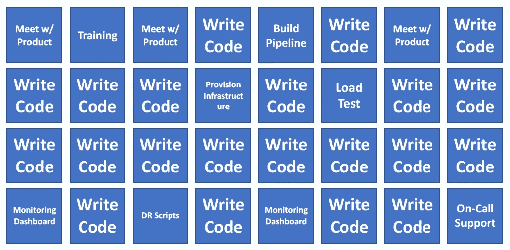
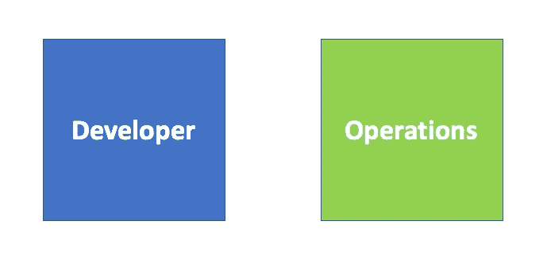
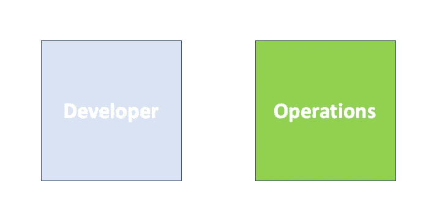
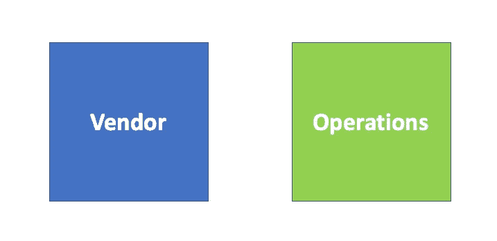
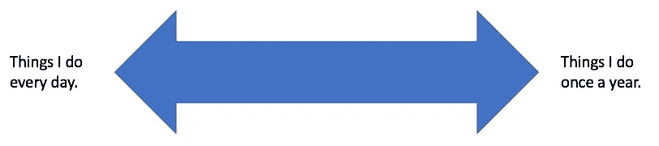
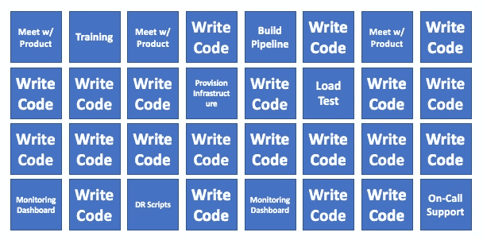

# 企业规模组织中的现场可靠性工程

> 原文：<https://medium.com/capital-one-tech/site-reliability-engineering-in-enterprise-scale-organizations-3357887d2c8e?source=collection_archive---------2----------------------->

随着公司越来越关注他们的数字运营，一个重要的概念正在围绕角色定义被描绘出来— *“谁在做什么？”*一旦销售和服务渠道转向数字化，每个人都成为技术团队的一部分。这对你最初的和扩大的团队有什么影响？像“DevOps”和“NoOps”这样的概念和术语用于定义策略，并强调软件产品如何交付和运行的组织边界。不幸的是，这个术语太吸引人了，以至于它被应用于“DevOps 工程师”这样的角色，这造成了混乱，因为它是模糊的，可以随意解释。

我更喜欢用术语[现场可靠性工程师角色](https://landing.google.com/sre/)，因为它描述了现代企业中员工的日常活动。我看到一些团队利用这些概念并为员工的职业发展设定期望，取得了巨大的成功。这也巩固了运营不会消失，而是在数字世界被重新定义的观念。

鉴于应用程序组合的规模和多样性，以下是我对企业中现场可靠性工程师角色的独特性的见解。

# 企业中的三种应用程序

*让我们从理解领域和设置上下文开始，从定义软件产品的范围开始。*

在一个大型企业中，我认为软件应用程序可以分为三个不同的类别，它们驱动着技术组织的人员需求。

## 1-定制持续开发

这是传统的软件工程模型，在这种模型中，有两个团队在历史上分担应用程序的责任——开发团队和运营团队。这个模型就是 DevOps 概念的来源，也是一些战略家关注的地方。

在这一类别中，最小化移交是任何有效过程的关键，并且包括核心组织设计原则。建立一个反馈回路，将产品质量问题反馈给软件作者，这是另一个焦点领域，并且定义了两个团队之间的任务分配。

大部分工作返回给开发人员，从而使大部分总体工作由产品团队控制。这是一个基于人员配备水平或工作量的潜在更准确的视觉效果。

以下是推进这一模式的一些重要观察结果。

1-大部分员工都在软件工程团队中。

2-要达到 100%的工作都由软件工程师完成的地步，需要这些团队中真正广泛的技能组合。

3-软件工程师想要做的“操作”任务的数量是有限的。

当建立组织的人员配备策略时，在建立技术组织时必须考虑另外两个应用程序模式，因为不是所有的软件应用程序都适合上面的模型。

## 2 —一次性应用程序开发

这是第一类的变体，但有一个关键的区别——一旦应用程序上线，开发人员就会离开。有时他们离开团队/项目，加入不同的团队/项目，利用他们在公司其他地方的专业知识和才能。有时，用于构建应用程序的员工是临时的，一旦产品交付，就没有理由保留他们。

一个普通的软件应用程序有大约七年的预期寿命，并且发现有几十年预期寿命的应用程序并不罕见(见:大型机)。随着时间的推移，这些应用程序的数量越来越多。对于一个大企业来说，这个量可能是相当大的。这对公司来说也不一定是件坏事，而是一个由合理的财务原因驱动的决定。

从实践的角度来看，完全“冻结”一个内部软件应用程序几乎是不可能的。围绕安全修补、底层硬件升级、持续系统监控和指标收集、灾难恢复练习等，还有大量其他工作要做。这意味着需要一个持续的技术人员来每天执行这些任务；它可能只是不支持新功能开发的员工。

## 3 —包装开发

这类似于先前的模型。有软件开发人员编写产品，但他们从来不是你公司的一部分，而是有一个购买和安装的现成解决方案。可能有一些内部资源认为自己是这些应用程序的软件工程师，但他们正在修改配置表和工作流，而不是正在执行的底层软件的专家。这意味着他们的支持和故障排除能力有限。

现在，可能有一份合同规定了供应商在销售后提供支持的条款；但是很少有这样的措辞，即任何和所有的工作都将由供应商处理。还有一些实际的限制需要考虑。例如，供应商是否有能力远程访问系统以获得支持，或者他们是否依赖本地技术人员来“操作键盘”？

这推动了对一些能够处理一线故障排除和事后支持的内部员工的需求。这可能包括对软件应用较小的补丁，或更改与其他系统的接口，如单点登录或系统监控和警报。

# 管理应用程序组合

企业内的人员配备变成了理解在这三个组中分配了多少软件产品的练习。与初创公司相比，企业的独特之处可能在于一家成立 20-30 年或更久的公司已经积累了大量的技术，在第二和第三类领域创造了惊人的数量。

回顾过去几十年的技术，有不同的“时代”,大型机、打包软件等都很流行。这些决策和趋势留下了需要在人员配备中考虑的支持线索。

根据我的经验，一家财富 500 强公司拥有数百个(或者数千个)软件应用程序并不罕见。

虽然新的投资可能会针对第一类应用，但技术预算和人员配备计划仍必须考虑这三个方面。

## 专业化的价值

现在，让我们深入应用场景(类别 1)来确定分工。这些应用程序可能是核心处理和服务系统，公司通过这些系统处理数百万张发票、索赔、报表和付款。他们有固定的员工，团队规模可能会占技术人员的相当大的比例。

工作的划分不应该由试图理解什么是“操作”类型的工作来驱动。相反，它应该通过发现专业化的规模经济来推动，从而为公司带来成本和质量效益。

例如，大型系统需要备份和复制到灾难恢复位置。对这些功能的持续监控至关重要，不应该靠猜测。将这项工作分配给团队中的每个软件工程师是低效的，并且对环境有潜在的危险。为什么？原因是他们并不是每天都这样做，而遵循一个可以提高坚持性的共同方法有巨大的价值。通过让一个专家做这样的工作，它为某人创造了所有权和激励，使整个团队或部门的任务自动化。

## 时间研究——如何找到专业任务

为了帮助建立角色之间的界限，一种系统化的方法包括对通过上线执行项目所需的故事进行时间研究。这可能产生的结果的一个例子是这样一个人工制品。

不应该默认所有的专业任务都交给 SRE 公司，因为一些非常规的任务加强了产品的核心工程。其价值在于理解将工作代码交付给产品所需的所有杂项任务，并理解这些任务的所有权。随着时间的推移，软件工程团队是否能够拥有所有这些任务，远远超过最初的发布？

如果没有，就需要计划人员缺口。

# 设定期望—从运营转向 SRE

现在，在看到了不同的模型之后，很有希望清楚地看到，在企业内部有对不专注于软件产品开发的技术人才的需求。一个很好的问题是，这与我们在企业中从事了几十年的传统技术运营角色有何不同。

一个词可以概括——进化*。随着公司变得更加数字化，对技能的需求也在增加。像密码重置这样的简单请求现在由自助服务门户和工作流处理。大多数用户对搜索引擎很熟悉，可以用它们来解决已经有已知解决方案的日常问题。*

*理想情况下，任何日常工作都可以自动化，这需要软件开发人员拥有的许多相同的工程技能，但更多的是系统工程方面的关注。*

*为企业建立体现这些新能力的现场可靠性工程团队是数字化组织中人员配备的未来。你的企业准备好了吗？*

***声明**:以上观点仅代表作者个人观点。除非本帖中另有说明，否则 Capital One 不属于所提及的任何公司，也不被其认可。使用或展示的所有商标和其他知识产权均为其各自所有者所有。本文为 2017 首都一。*

**欲了解更多关于 Capital One 的 API、开源、社区活动和开发人员文化的信息，请访问我们的一站式开发人员门户网站 DevExchange。*[*developer.capitalone.com/*](https://developer.capitalone.com/)*

## ***相关链接***

*   *[人才转型确实是云采用中最困难的部分](https://developer.capitalone.com/blog-post/talent-transformation-is-really-the-hardest-part-of-cloud-adoption/)*
*   *[无服务器是我一直想要的 PaaS](/capital-one-developers/serverless-is-the-paas-i-always-wanted-9e9c7d925539#.vxuonj13x)*