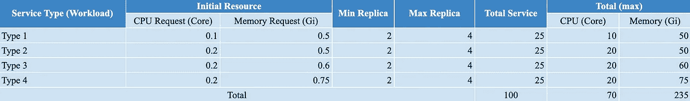
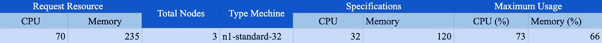

# 确定集群 Kubernetes 的规模

> 原文：<https://medium.easyread.co/sizing-cluster-kubernetes-b667d84a2598?source=collection_archive---------0----------------------->

Photo by [Cameron Venti](https://unsplash.com/@ventiviews?utm_source=medium&utm_medium=referral) on [Unsplash](https://unsplash.com?utm_source=medium&utm_medium=referral)

创建 *Kubernetes* 集群，有几件事情需要考虑，比如确定集群环境(*内部*或者*云*)、每个节点的硬件规格，如果需要的话还要计算存储。

集群规模调整的目的是每月成本规划和性能。

然而，实际上，集群是根据集群中的服务数量或每个服务的资源规模而增长的。

在这篇文章中，我将解释如何根据我们的需要计算集群的大小。我将尝试使用下面的研究案例来确定规模。

# 研究案例

一家公司计划迁移到运行在云中的 Kubernetes，该公司有一个微服务架构，总共有 100 个服务。所有这些服务都使用了*掌舵图*。

Type.Csv

从这 100 个服务中，我根据平均所需资源分成 4 种类型，然后确定最小最大复制。在本例中，我为所有服务类型设置了最小复制为 2，最大复制为 4。我去拿下面的桌子

Workload Calculation

*   初始资源是每种服务类型的 CPU 和内存的极限
*   最小/最大是所有*箱*的复制
*   总(最大)CPU/内存是以下因素的结果

> (最大复制*初始资源请求)*总服务

我总共有 70 个内核和 235 GB 的内存来运行所有的*pod*。

接下来，使用 *Google 云平台*提供的参考类型机器计算集群规模，您可以在这里看到[。](https://cloud.google.com/compute/docs/general-purpose-machines)

# 结果

Node Calculation

在该表中，有 3 个节点。要计算 CPU 核心和内存的总数:

*   32 * 3 = 96 个 CPU 内核
*   120 * 3 = 360 GB 内存

资源的最大使用率为 75%，以防止性能下降。为了计算最大使用量，我定义了下面的公式:

> 汇总((请求资源/(规格*总节点))* 100)

因此，我选择型号为 *n1-standard-32* 的机器，因为它在资源使用和运营成本方面更高效。

# 结论

可以用几种方法计算资源。那些只是基于经验的简单公式，而不是精确公式。

谢谢，祝你愉快。

# 参考

*   [https://kubernetes . io/id/docs/concepts/workloads/controllers/deployment/](https://kubernetes.io/id/docs/concepts/workloads/controllers/deployment/)
*   [https://cloud . Google . com/compute/docs/general-purpose-machines](https://cloud.google.com/compute/docs/general-purpose-machines)