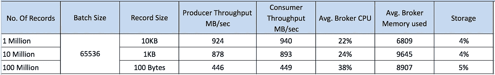

# 在 Oracle 云上调整您的活动中心(Apache Kafka)集群

> 原文：<https://medium.com/oracledevs/sizingeventhubcluster-dbb639e42094?source=collection_archive---------0----------------------->

这篇博文的目的是提供一个关于如何在 Oracle Cloud 上调整您的 Event Hub 云服务集群的高级指南。选择确切的集群大小和配置会因您的用例和需求而有很大差异，因此关于此主题的帖子(一语双关)只能旨在提供决策过程的大致方向。

本文从两个方面解释了集群的规模:

*   针对吞吐量调整规模
*   存储规模

# **确定吞吐量**

> 生产者/消费者吞吐量

在尝试确定事件中心集群的规模之前，要问的问题是生产者和消费者的预期吞吐量是多少。您的系统吞吐量将与您最薄弱的环节一样快。

生产者的生产速度是多少？，生成的消息的大小是多少？在给定消息大小的情况下，有多少消费者会从主题/分区中消费，他们能够以什么样的速度处理每条消息。

> 经纪人(和动物园管理员)的数量

增加代理数量和跨代理配置复制是一种机制，不仅可以实现并行性和更高的吞吐量，还可以实现高可用性。在 Event Hub 上运行开发和测试时，HA 可能不是一个因素，在这种情况下，可能不需要部署多个代理。但是，强烈建议部署多个代理(3+)。

ZooKeeper 在代理集群管理中起着至关重要的作用——跟踪哪些代理正在离开集群，哪些新代理正在加入，领导者选举和配置管理。这使得有必要确保 Zookeeper 也部署在 HA 集群中。

调整 Zookeeper 集群大小的建议是使用 1 个实例用于开发/测试环境，3 个实例用于计划 1 个节点故障，5 个实例用于计划 2 个节点故障。

> 您的经纪人的 CPU 形状

在撰写本文时，Oracle Cloud for EventHub Cloud Service for CPU Shapes 上的可用选项有:

OC1m — 1 个 OCPU，15 GB 内存

OC2m — 2 个 OCPU，30 GB 内存

OC3m — 4 个 OCPU，60GB 内存

OC4m — 8 个 OCPU，120 GB 内存

OCPU 提供的 CPU 容量相当于启用超线程技术的英特尔至强处理器的一个物理内核。每个 OCPU 对应两个硬件执行线程，称为 vcpu。

这是一个基准吞吐量示例:

***配置*** :

*   生产者/消费者:10/10
*   主题:10
*   分区:每个主题 10 个，
*   复制因子:3
*   代理节点:5 (OC3m)
*   动物园管理员:3 人(OC1m)
*   无压缩
*   acks = 1

注意:这个吞吐量是通过 Kafka 本地 API 实现的。已知 REST API 吞吐量要小得多，大约是原生 Kafka API 吞吐量的 1/4。该测试在 Oracle 云中的虚拟机中由生产者和消费者运行，虚拟机之间的延迟最小。

> 主题和分区的规模

选择#分区的决定取决于期望的吞吐量和您的生产者/消费者生态系统可以支持的并行度。一般来说，增加给定主题的分区数量会线性增加吞吐量——然而，吞吐量瓶颈最终可能是生产者的生产速度或消费者的消费速度。

Kafka 用户使用并在一些 Kafka 博客中发表的简单数学如下:

假设期望的吞吐量是“t”。最大生产者吞吐量是“p”，最大消费者吞吐量是“c”。

分区数量=最大值(t/p，t/c)。

经常使用的一个经验法则是至少拥有与最大消费者组中的消费者数量一样多的分区。

# **存储规模**

在代理上调整存储规模时要考虑的因素:

1.  主题数量，每个主题的分区数量
2.  期望复制因子
3.  邮件大小
4.  保存期
5.  预期从事件中心代理发布和使用消息的速率

根据上述因素，您可以粗略计算出 Event Hub 集群上每个代理所需的存储容量。

# 摘要

**总之，上面的帖子提供了一个粗略的指导方针，告诉人们应该如何确定他们的活动中心集群的规模。**

**通过设置警报阈值来监控集群的 CPU、内存和存储，可以帮助您从小规模开始，并随着时间的推移了解集群的性能和趋势。当您的系统准备好增长时，可以根据您的需求对您的集群进行微调。托管扩展是事件中心云服务(托管 Kafka)将提供的价值的一部分。**