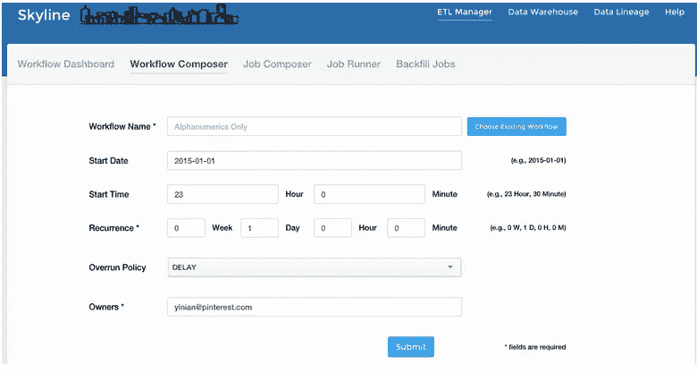
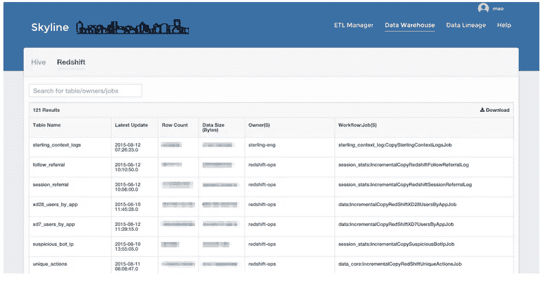
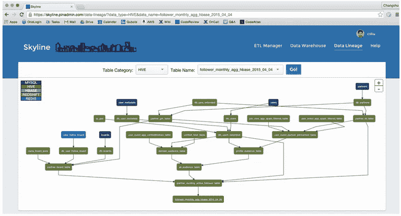
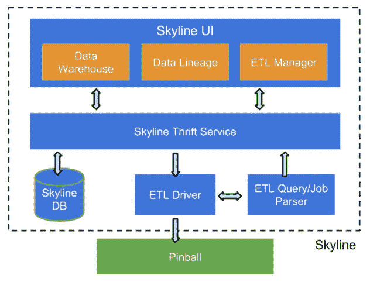

# Skyline: ETL 即服务

> 原文：<https://medium.com/pinterest-engineering/skyline-etl-as-a-service-a441efdeeb90?source=collection_archive---------0----------------------->

叶茂|发现网站 Pinterest 工程师

数据在 Pinterest 发挥了重要作用，既能为 Pinner 带来新产品体验，又能洞察 Pinner 的行为。我们一直在想办法减少将数据转化为可操作见解的摩擦。我们的数据用户(主要是分析师、产品经理、工程师和数据科学家)经常问的一个问题是，“我如何构建一个报告仪表板来每天跟踪 xyz 指标？”。随着访问数据的员工数量、数据量和查询数量的增加，扩展和支持新出现的需求成为一大挑战。为了解决这个问题，我们建立了一个名为 Skyline 的新数据平台。

在 Skyline 诞生之前，数据用户依赖数据工程师来:

*   找到要查询的正确的表
*   将查询生产为提取、转换和加载( [ETL](https://en.wikipedia.org/wiki/Extract,_transform,_load) )
*   回填给定 ETL 作业的历史数据(例如，过去一年的数据)，因为数据用户通常希望跟踪一整年的指标

Skyline 解决了上述要求，并支持三种核心用例:

1.  用于创建和安排处理这些数据的工作流/作业的自助用户界面
2.  Pinterest 仓库中数据的可视化探索
3.  能够理解数据的谱系(即数据依赖性)

## 自助 ETL

我们构建了一个自助式 ETL 管理器来简化作业创建和调度。使用此工具，数据用户可以使用简单的 SQL 查询创建和安排数据作业，自己完成以下任务:

*   将数据从配置单元移至红移
*   构建 [Pinalytics](https://engineering.pinterest.com/blog/building-pinalytics-pinterest%E2%80%99s-data-analytics-engine) (Pinterest 的数据分析引擎)报告
*   按需回填历史数据

由于简单的设计和易用性，ETL Manager 很快被数据分析师和产品经理所采用。超过 40%的 Pinalytics 报告是使用 Skyline 创建的。

## 数据探索

除了提供自助式 ETL，我们知道用户想要探索存在于 Pinterest 仓库(亚马逊 S3)中的数据。我们构建了一个名为 Skyline Data Warehouse 的功能，它提供了我们仓库中核心数据集的目录视图，并且每天自动更新。Skyline 数据仓库提供了关于数据表的以下信息:

*   哪个工作流/作业生成了数据
*   负责人(即可以联系并提出问题的个人或团队)
*   表是否是最新的
*   列名和类型
*   其他细节，如字节大小、估计的行数、表分区和样本行
*   数据用户的意见和注释

## 可视化数据谱系

在我们的规模下，我们运行数千个数据作业，每个作业都有相互依赖关系。以前，如果一个作业在生产中中断，用户很难找到所有受影响的下游表。为了简化这一过程，我们构建了一个自动沿袭检测系统，该系统可以监控和检测所有数据作业，并帮助:

*   了解一个表是如何从其他表派生出来的(在 MySQL、Hive、HBase、Redis 和 Redshift 中)
*   弄清楚 Pinalytics 报告是如何生成的
*   快速浏览表格的所有者/作业/工作流信息

## 体系结构

Skyline 具有以下组件:

*   Skyline UI :我们在 Flask 框架上构建了 web 应用程序。前端使用 React.js 库创建用户界面组件，如简单的交互式可视化，SQLAlchemy 与后端数据库进行交互。
*   **节俭服务和数据库**:作业的输入/输出信息是实现 Skyline 数据仓库、数据沿袭和 ETL 管理器特性的基本知识。所有的数据都存储在一个 MySQL 数据库中，我们构建了一个节俭的服务器，客户端可以与之交互来读写这些数据。因为数据量不是很大，并且因为我们需要做许多连接操作来获得数据血统关系，所以我们使用 MySQL 作为持久存储，而不是其他选择，如 HBase。
*   **ETL 驱动** : ETL 驱动是我们构建的一个 Python 库，用于解析 ETL 工作流/作业，通过 Skyline ETL manager 创建。在解析之后，ETL 驱动程序将作业转换为令牌，这些令牌由 [Pinball](https://engineering.pinterest.com/blog/pinball-building-workflow-management) (我们的工作流管理系统)识别，稍后它会调度这些作业进行处理。
*   **ETL 查询/作业解析器**:为了自动检测作业的输入和输出，我们构建了一对解析器:

1.  查询解析器，它自动检测所有查询的输入/输出表
2.  Hadoop 配置解析器，自动检测给定 Hadoop 作业的输入/输出 S3 文件路径。

每当用户在 Skyline 上创建一个新的 ETL 作业时，它的输入/输出信息将被自动提取、存储，并通过 Skyline UI 方便地浏览。

## 路标

我们希望很快开源 Skyline。在中期，我们考虑通过实施以下功能来扩展 Skyline:

*   在 Hive、Redshift 和 Presto 等各种后端上运行特定查询的能力
*   搜索任何数据相关信息的能力(例如，用户查询、评论、列信息、样本数据)
*   支持优先 ETL 工作流/作业调度

如果你对 Skyline 这样的数据基础设施项目感兴趣，[加入我们的团队](https://careers.pinterest.com/careers/engineering/san-francisco)！

*鸣谢:Skyline 是由叶茂、、祁一年和 Julia Oh 以及数据工程团队的其他成员共同创建的。在开发阶段，我们从业务分析团队和整个公司的其他数据用户那里获得了许多有用的反馈。*