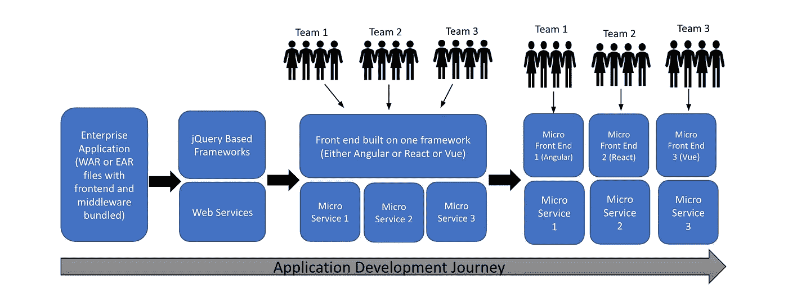
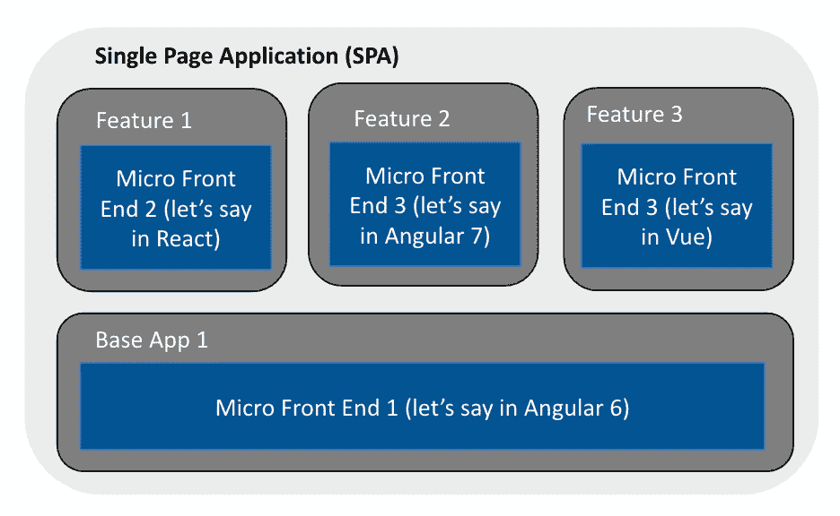
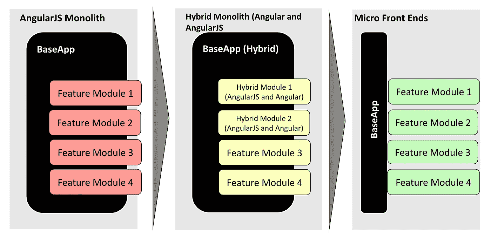

# 使用微前端架构杀死 UI AngularJS Monolith

> 原文：<https://medium.com/capital-one-tech/slaying-the-ui-angularjs-monolith-using-a-micro-frontend-architecture-f6c6332652d3?source=collection_archive---------2----------------------->

## *一种框架不可知的模块化 UI 架构的微前端方法*

> 快速变化的 web 开发世界的简短旅程…

在过去的十年里，AngularJS 已经成为“街区的新成员”，取代了基于 jQuery 的 web 工程解决方案的许多弱点。许多企业非常乐意用 AngularJS 构建他们的前沿门户网站，随着网络业务的指数级增长，AngularJS 让许多开发人员的生活变得更加轻松。

在 web 开发世界里，每个人都很快乐，但是这种快乐并没有持续很久。

*(注:在本博客中，AngularJS 将被称为 AngularJS，Angular 2 及以上将被称为 Angular。Angular 在代码可重用性、性能、代码组织、模块性、结构、进化的依赖管理等方面比 AngularJS 领先了一大步。简而言之，Angular 的基于组件的架构和可取消的异步操作支持，改变了底层结构，需要相当长的学习曲线才能升级到)*

更新的、更具破坏性的前端框架开始接管 web 开发世界，将 AngularJS 投入到被视为阻碍业务发展的遗留软件堆中。但是替换 AngularJS 不是一件容易的事情。随着更快的增长，基于 AngularJS 的项目的复杂性也增加了，大型企业代码库通常跨越多个团队。

结果是一个巨大的整体 AngularJS 怪兽伪装成前端应用程序，不缺乏性能和部署瓶颈。在像这样的单一应用程序可能导致的几个缺点中，企业面临的一些主要挑战是:

*   **跟不上业务增长的技术架构:**随着应用程序的增长，团队需要支持的功能也在增长。多个团队共同开发一个单一的应用程序，开发和发布协调是一场噩梦。
*   **创新受阻:【Angular 2、React、Vue 等更新的框架和库在前端领域提供了可观的性能改进和创新。然而，升级单一应用程序和/或使其与这些新框架和库互操作的繁重任务通常无法在不损害以现有发布速度发布新功能的情况下完成。**
*   **吸引和留住顶尖人才:**谁愿意在一个过时的框架中工作，因为这种框架被视为削弱了一个人的市场技能？因此，当工程团队被迫解决对他们的技术技能没有太大价值的问题时，员工的积极性会受到打击，导致员工流失。

克服所有这些挑战的一个可行的解决方案是迁移到称为[微前端](https://micro-frontends.org/)的模块化前端架构风格。通过这种架构，人们可以帮助*应对*不断变化的网络技术格局带来的中断和风险，同时在利用这些技术方面保持领先。

> *简单来说，微前端相当于前端世界的微服务。*

Figure 1: Application Development Journey

# 微前端方法

微前端方法将加载到浏览器中的前端代码分成多个独立的 web 应用程序。这些能够由不同的团队管理，并允许框架不可知论(应用和功能在 Vue、Angular、React 中构建)。

图 2 说明了单页面应用程序的框架无关的微前端架构。

Figure 2: Micro Frontend Architecture

# 微前端架构的优势

微前端架构相对于整体架构的主要优势在于:

*   **给予团队他们的发布自主权和时间回溯**:通过将功能从整体分割成独立的微前端，团队在发布产品/功能时享有更大的自主权和灵活性。不发布的团队不再需要熬夜参加发布电话会议，试图回归测试其他团队在产品中的变化。真是如释重负，对吧！
*   **让工程师开心**:不必依赖整个代码库，减少了依赖性和范围，使团队能够快速参与和交付。这为花费在创新上的时间创造了空间，而不用担心破坏其他团队的功能
*   **产生一个可扩展的、性能更好的 web 应用**:一个具有既定全球标准的松散耦合架构使得在需要时添加新功能或组建团队变得更加容易。由于每个应用都被分割成自己的微前端，如果企业应用上的单个功能(一个微前端)加载速度不快，也不会影响整个应用的性能。它还使得网页的某些部分可以更快地加载，允许用户在加载或需要所有功能之前与页面进行交互。

# 微前端架构面临的挑战

正如所有好事都伴随着挑战一样，实现微前端架构也面临着一些挑战:

*   **部署策略:**一个主要的实施考虑是决定是否应该使用大爆炸或分阶段的方法将他们的单片应用程序转换为微前端。
*   **有效的测试策略**:虽然 monolith 创建了一个所有团队都参与的发布方法，但是微前端只允许有贡献的团队参与给定的发布。这种方法要求团队实现同类最佳的回归测试实践，以确保不将损坏的特性发布给客户。
*   **为升级准备遗留应用程序:**一个现有的整体应用程序可能是在一个近乎过时的框架上(比如 AngularJS 1.3)。可能需要大量的工作和时间来使其做好升级准备，为此应用程序应该至少是 Angular 2 及以上。
*   **治理:**在组织和技术策略方面，组织中的团队可能被拉向多个方向，从而导致糟糕的变更管理。
*   **遗留前端框架:**随着框架和更新的库以指数速度发布，在框架之间创建可互操作的 UI 组件的能力需要构建可重用的基础元素。这也很耗时。
*   **上市速度与优化的技术:**持续的业务增长需要催生新的应用程序，与 monolith 共存或在 monolith 内部共存。在这种情况下，需要不断努力平衡市场速度和优化技术。

# 使当前代码升级友好的注意事项

开始升级之旅的第一步是让您现有的 AngularJS 代码准备好升级到 Angular。下面描述了准备正在进行的 AngularJS 开发的方法，只需要最少的重构。

*   将您的项目从传统的模型-视图-控制器架构转移到基于组件的架构。自包含指令中的每个视图。
*   用 restrict: `E`，一个隔离范围和 controllerAs: `$ctrl`配置您的指令。这将使您的指令更容易转换成角度分量语法。
*   尝试将常用功能提取到服务中，而不是放在控制器中。减少工厂的使用，而是将您的服务定义为 Typescript 类中的服务。

# 更新旧应用程序

您当前的旧版应用程序可能是以下版本之一。如果是这样的话，迁移到微前端架构的路径可以采用下面的一个或多个路径。

## 版本早于 1.5

假设您已经有了一个遗留的 AngularJS 应用程序。您可以从 Angular 2 和更高版本开始构建组件，使其与现有的 AngularJS 应用程序互操作，以便您当前的功能在升级到微前端完成时不会暂停。

怎么会？简单。Angular 开发了 UpgradeModule，提供升级和降级提供程序来帮助实现这一点。您可以在 AngularJS 应用程序中引导 Angular 应用程序，并将两个代码库放在一个存储库中，让组件可以互操作。注意——请关注下一篇关于如何做到这一点的博客！

通过这种方式，您可以在 AngularJS 应用程序中一次删除一个功能/模块，同时在 Angular 2 或更高版本中构建更新的组件。当您最终将所有 AngularJS 组件升级到 Angular 时，可以将代码提取到它自己的存储库中，使用 Angular 元素制作成一个微前端。

Figure 3: Demonstrating an incremental approach to moving from monolith to micro frontends implementation

## 版本介于 1.5 和 2 之间

如果您认为您的大多数 AngularJS 指令和服务已经是升级友好的，那么另一个极好的策略是本文中详述的[单 spa 方法](https://single-spa.js.org/)。单一 spa 方法创建了一个适配器，使应用程序能够互操作，并能够在彼此之间路由。这种策略最适合用大爆炸的方法将整块石头分割成微小的前端。它需要重构您现有的整体父 AngularJS 应用程序，使其升级友好，然后才能删除功能以创建微前端。考虑到单片应用程序复杂性的多样性，人们可能要花相当多的时间来变得易于升级。

## 年轻版 2 (Angular 2 及以上)

如果您已经完成了将应用程序从 AngularJS 升级到 Angular 2 的惊人壮举，那么恭喜您！给自己一个鼓励，因为实现框架不可知的微前端的大部分基础工作(有些人可能称之为繁重的工作)已经完成了。虽然有多种方法来实现微前端——单 SPA 元框架，多个 SPA 舒适地驻留在不同的 URL，通过 iFrames 隔离的微前端，与 Angular 6 一起发布的 Angular 元素，但我认为这是实现框架无关的微前端的最有效和最干净的方法。

*在我的下一篇博客中，我将介绍每种方法的优缺点，以及一个示例实现——敬请期待！*

# 结论

杀死这个庞然大物可不是在公园里散步，快速发展的网络技术领域加剧了这一事实。在本文中，我们详细介绍了所面临的挑战，以及使这种步行(更确切地说，是铁人三项)变得更容易的技巧和策略。终点线是一个微前端架构，它使你能够正面处理破坏性的 web 技术或框架。希望这篇文章能帮你达到！

*披露声明:这些观点是作者的观点。除非本帖中另有说明，否则 Capital One 不属于所提及的任何公司，也不被其认可。使用或展示的所有商标和其他知识产权都是其各自所有者的所有权。本文为 2019 首都一。*