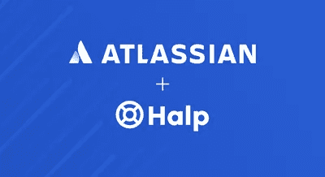

# Hvordan håndtere Incident Management fra hjemmekontoret?

> 原文：<https://medium.com/compendium/slik-h%C3%A5ndterer-du-u%C3%B8nskede-hendelser-fra-hjemmekontoret-e374b361721?source=collection_archive---------4----------------------->

Photo: [Unsplash](https://unsplash.com?utm_source=medium&utm_medium=referral)

Medforfatter: [Kristin Øveraas](https://medium.com/u/a112ba66e735?source=post_page-----e374b361721--------------------------------)

> Midt i ferdigstillingen av … som måtte leveres senest om to timer, falt …. ut. Jeg sjekket hjemmenettet, men alt lyste grønt. Det måtte være en sentral feil — dette lovet ikke bra!
> 
> Heldigvis hadde infrastrukturgruppen nylig innført *Vår statusside* , og gitt oss klar beskjed om å sjekke denne via PC, mobil eller … hver gang en av standardtjenestene fikk nykker. Hjemme-PCen hang, men på mobilen så jeg straks at … Siden dette var en kjent tilstand for dem, var feilrettingsarbeidet estimert til 15 minutter, med 90% sannsynlighet.
> 
> Jeg kunne senke skuldrene. Mitt restarbeid var lite. Jeg gikk en runde rundt huset, smakte på noen jordbær som akkurat var blitt modne, vinket til naboen og gikk inn igjen. Der fortalte statussiden at problemet var løst, og at dette ikke krevde restart fra brukerne. Det var bare å fortsette der det hadde stoppet opp. Med friske tanker gikk leveransen problemfritt.

Effektiv håndtering av uønskede hendelser er viktig. Dine ansatte forventer at alle tjenester skal være tilgjengelige — spesielt når de jobber på hjemmekontor. Alle brukere trenger informasjon når en viktig tjeneste går ned, og hvis konsekvensene er store, er det viktigere at infrastrukturteamet fokuserer på å få tjenesten opp igjen enn at de svarer på individuelle “hva skjer?”-spørsmål fra brukerne. Infrastrukturteamet selv må også kunne arbeide hjemmefra når de skal håndtere alvorlige og uønskede hendelser.

Alle typer IT-folk, infrastruktur-, drifts- og utviklerteam, og kanskje spesielt din service- og supportfunksjon, trenger støtte for å kunne modernisere arbeidsflyten og ha effektiv kommunikasjon.

Støtten finner de i riktige verktøy og i standarder for beste praksis for hendelseshåndtering. Med dette blir de mer proaktive, løser hendelser raskere og ikke minst: de blir i stand til å holde kundene/brukerne informerte på en effektiv måte.

Hvis selskapet ditt ikke er vant til å jobbe fra hjemmekontor, kan det være vanskeligere enn ellers å jobbe effektivt når uønskede hendelser inntreffer. En statusside gjør deg i stand til å kommunisere med alle dine ansatte via én enkelt faktakilde.

Atlassian har øvd på hendelsesstyring fra hjemmekontor i mange år, med hendelsesteam fordelt over hele kloden. Uavhengig av om du bruker Atlassians produkter eller ikke, kan du dra nytte av det de har lært og formidlere i disse 3 kildene:

*   [Atlassians håndbok for hendelseshåndtering](https://www.atlassian.com/incident-management/get-the-handbook) (Incident Management Handbook) inneholder gode råd, maler og andre verktøy som du kan velge fra.
*   [Malgenerator for hendelseshåndtering](https://www.atlassian.com/incident-management/incident-communication/templates) gjør kommunikasjon rundt ad hoc-hendelser superenkelt.
*   [Eksempler på statussider](https://www.statuspage.io/?&aceid=&adposition=&adgroup=60106384961&campaign=1442523485&creative=339564438466&device=c&keyword=atlassian%20statuspage&matchtype=e&network=g&placement=&ds_kids=p34193436388&ds_e=GOOGLE&ds_eid=700000001541417&ds_e1=GOOGLE&gclid=EAIaIQobChMIjIXFje-Z6QIVRMwYCh1ZjwvrEAAYASAAEgKhkPD_BwE&gclsrc=aw.ds) som hjelper deg til å etablere en statusside raskt.
    *Tips: klikk på Intercom for å se mer om hvordan dette kan se ut. De deler mye informasjon med sine brukere, mens Dropbox sin er strengere styrt.*

Atlassian har flere produkter og verktøy som kan brukes til enkel kommunikasjon mellom distribuerte team, interne team og kunder. Disse 3 utfyller hverandre:

**Jira Service Desk** brukes til alt fra tekniske forespørsler til å løse HR- og personalsaker. Det finnes så å si ingen grenser for hvordan du kan få støtte til å automatisere og korte ned tiden det tar å behandle en forespørsel. Se mer på våre hjemmesider.

**Opsgenie** er et varslingsstyringsverktøy som raskt identifiser hva som trenger størst oppmerksomhet når du blir rammet av en storm av varsler, og sender varsler til de rette menneskene til rett tid for å redusere responstiden.
Opsgenie integreres tett med overvåknings- og ChatOps-verktøyene som teamet ditt allerede bruker, og varsler settes opp akkurat slik du ønsker. Man kan dermed raskt kan ta grep og kommunisere effektivt fra hvor som helst.
[Les mer](https://www.atlassian.com/software/opsgenie) hos Atlassian. En gratis [14-dagers prøveperiode kan startes her](https://www.atlassian.com/software/opsgenie/what-is-opsgenie) .

**StatusPage** : En statusside for teamet hjelper deg med å kommunisere med alle dine ansatte via én enkelt faktakilde. Denne kan også brukes til å varsle planlagte endringer (Change Management) eller andre ting som kan tenkes å påvirke brukerne av tjenestene. Vil du ikke at alle skal vite alt som skjer? Da kan du bruke tilgangsstyrte sider.

Slik kan det se ut:

**For deg som bruker Slack**

Atlassian har kjøpt selskapet bak verktøyet Halp. Halp gjør Slack til en intern helpdesk-løsning for alle typer team som håndterer spørsmål via denne meldingstjenesten. Når Halp legges til Slack-workspacet ditt, kan du bruke enkle emoji-svar til å omforme en melding til en sak som holder rede på framdrift og status. Dette er en kjapp lettvektsmåte å håndtere henvendelser på. Brukerne kan konfigurere sin egen arbeidsflyt i bakkant, eller bruke en standard arbeidsflyt. Halp gjør at du kan håndtere alt fra Slack, og Halp er integrert med både Jira Service Desk og Confluence.

**Confluence** : Sist, men ikke minst, er Confluence den ultimate kunnskapsbasen for alle behov. Enkel å bruke, alltid tilgjengelig, og tett integrert med alle nevnte verktøy.

Kontakt [Computas](https://computas.com/tjenester/atlassian) hvis du ønsker å vite mer om hvordan ett eller flere av disse produktene kan hjelpe dere både i den operative, daglige driften, og til å bygge inn akkurat deres arbeidsmetoder slik at virksomheten drar nytte av dem på alle nivåer — også det strategiske.

Kilder og media: [Atlassian](https://partners.atlassian.com/display/news/2020/03/24/COVID-19+Partner+Program+impacts+and+FAQ%27s)