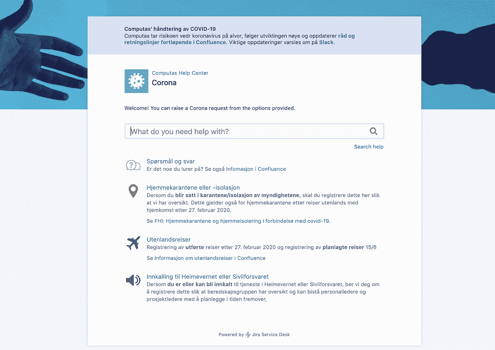
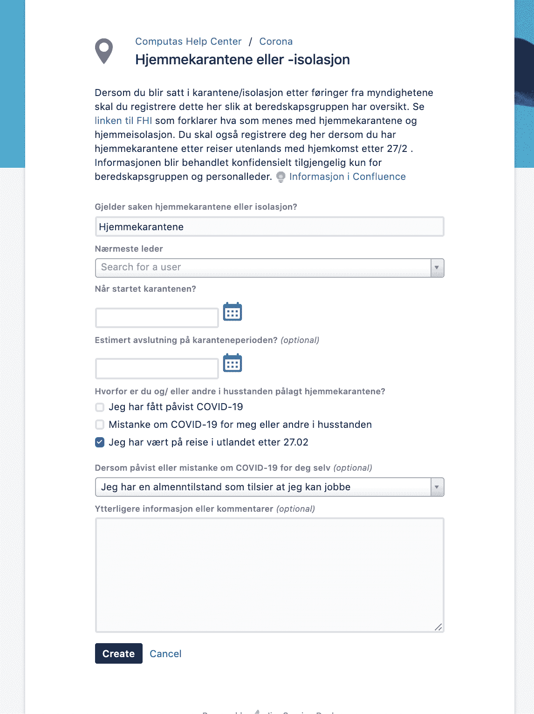
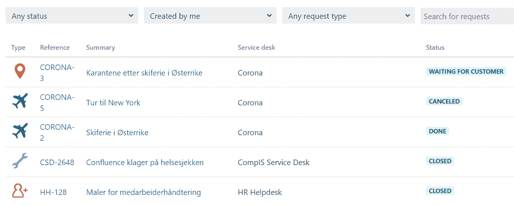
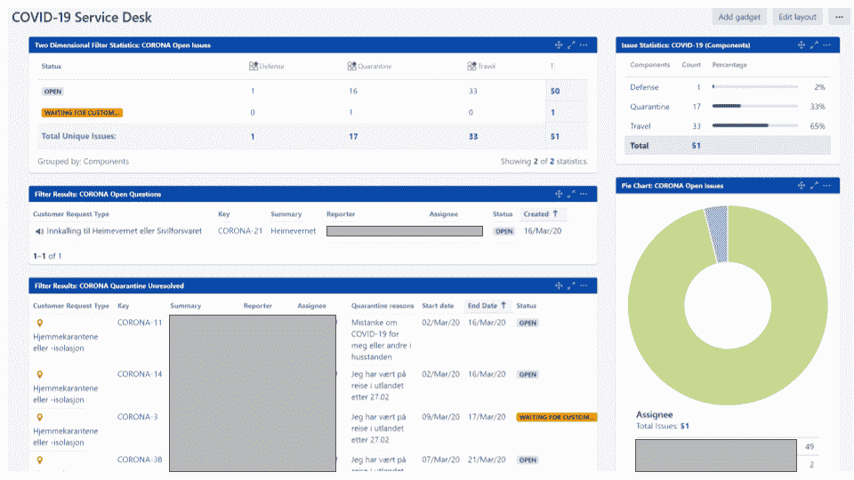

# Slik håndterer vi Korona-kommunikasjonen i Computas

> 原文：<https://medium.com/compendium/slik-h%C3%A5ndterer-vi-korona-kommunikasjonen-i-computas-34403e4ea5fc?source=collection_archive---------2----------------------->

*Fra koronautbruddet for alvor rammet Norge i starten av mars, har det vært stadig ny informasjon og retningslinjer å forholde seg til for norske bedrifter. Computas har en beredskapsgruppe som har ansvar for å koordinere mellom funksjoner og informere de ansatte i denne spesielle situasjonen. Beredskapsgruppen opplevde tidlig et behov for å holde styr på ansattes spørsmål, status og stadige situasjonsendringer, og ikke minst sikre en god arbeidsflyt for å håndtere henvendelsene. Egne løsninger og ansatte bidro til å løse utfordringen.*

Servicedesk for ansattes henvendelser om Korona

I Computas er vi over 300 ansatte, fordelt på tre land. Og som konsulentselskap har vi ansatte fordelt over flere titalls lokasjoner. I tillegg til å forholde seg til informasjon fra myndighetene har det vært viktig for beredskapsgruppen å holde oversikt over situasjonen til hver enkelt ansatt: hvem har planlagt å dra på konferanse, kurs eller andre arrangementer internt eller eksternt? Hvem skal på utenlandsreise? Hvor har folk vært på reise? Er det noen som har blitt satt i karantene eller i hjemmeisolasjon? Og etter hvert som situasjonen har utviklet seg: hvem kan bli kalt ut i tjeneste i Sivilforsvaret eller Heimevernet?

Allerede onsdag 11\. mars hadde informasjonsbehovet blitt såpass stort at det ble opprettet flere enkle skjema der ansatte kunne melde inn informasjonen beredskapsgruppen trengte. Det ble også opprettet en egen epost-adresse som ansatte kunne bruke dersom de hadde spørsmål, og meldinger til denne gikk til og ble håndtert av beredskapsgruppen. På denne måten fikk beredskapsgruppen raskt informasjon og en kartlegging av situasjonen internt, men oversikten var vanskelig å holde oppdatert. Det var også en svakhet at personalledere ikke hadde tilgang til informasjon om sine ansatte. Løsningen skalerte ikke med endringene som oppsto, og endringene skjedde hyppig.

# Hvorfor satte vi opp en Korona Service Desk?

Med bakgrunn i situasjonen over ble det besluttet å etablere en egen Korona Service Desk. Den bruker Jira Service Desk som motor. Ansatte kan gå inn på denne siden og melde inn informasjon om saker som:

*   At du har blitt pålagt hjemmeisolasjon/karantene av medisinsk personell eller etter føringer fra myndighetene
*   At du har vært på utenlandsreise (jobb eller privat) etter 27.02.
*   At du har planlagte utenlandsreiser (jobb eller privat) før 15.06.
*   At du har fått innkalling av Sivilforsvaret/Heimevernet
*   Generelle spørsmål du ikke finner svar på i fellesinformasjonen fra beredskapsgruppen

Om nye scenarier oppstår kan vi enkelt endre kategoriene over eller vi kan legge til nye situasjoner.

Innmelding av hjemmekarantene eller isolasjon

# Hvilke fordeler gir en Korona/Jira Service Desk?

*   **Gir oversikt**
    Alle henvendelser samles på ett sted, og det er lett å se hvilke henvendelser som er besvart og hvilke som må følges opp.
*   **Dialog samlet på ett sted**
    Gjennom henvendelsene kan vi nå ha løpende dialog og endre status som følge av dette. Vi slipper å sende eposter og koordinere mellom ansatt, personalledere og beredskapsgruppe. All kommunikasjonen er sporbar.

Eksempel på oversikt over saker en person har meldt inn, også i andre servicedesker

*   **Lett å endre**
    I en situasjon som endrer seg fra dag til dag er det en fordel å kunne endre det vi spør om, og å kunne opprette nye typer henvendelser når det trengs. Da Heimevernet ble tatt i bruk på Gardermoen tok det oss bare minutter å opprette en ny henvendelsestype.
*   **Tilgangsstyrt og tilfredsstiller GDPR**
    Kun de som trenger tilgang til enkeltes informasjon får tilgang — personalledere får oversikt over sine ansattes status og beredskapsgruppa har totaloversikten
*   **Sikker tilgangsstyring** Jira Service Desk gir tilgang for sluttbrukere gjennom en portal. HR har full tilgang til alle saker, og de er de eneste som kan behandle saker. Det er mulig å gi enkeltpersoner og grupper innsyn. Innsyn gis enten med tilgang til hele prosjektet eller som deltakere på enkeltsaker. Personer med innsyn kan kun se og kommentere saker.
*   **Lett å fordele arbeid i beredskapsgruppa:** henvendelser kan tilordnes den som skal ta ansvaret for dem. Ingenting glipper og ubehandlede henvendelser kan fordeles raskt.

Dashboard for beredskapsgruppen og HR

# Hvor lang tid brukte vi på å etablere en Korona Service Desk i Computas?

Computas er et IT-konsulentselskap og har flere ansatte som jobber med løsningene fra Atlassian til daglig — deriblant Jira Service Desk. Vi har allerede interne servicedesker for HR, Økonomi, IT support osv. Det tok derfor ikke mange timene før en av rådgiverne våre i samråd med beredskapsgruppen hadde fått løsningen på lufta og alle ansatte fikk beskjed om å bruke den fremfor de manuelle skjemaene som først var tatt i bruk.

Alle personalledere har nå adgang til å følge opp sine ansatte, og beredskapsgruppen har god oversikt over hvilke spørsmål og problemstillinger som dukker opp og kan tilpasse fellesinformasjonen i tråd med dette dersom svarene er av interesse for flere.

Korona-situasjonen har antakeligvis kommet like brått på Computas som de fleste andre virksomheter. Vi har imidlertid fått etablert en god, skalerbar løsning som hjelper beredskapsgruppen og personalledere med å holde oversikt og som reduserer støy i organisasjonen — slik at ansatte flest kan gjøre sine vanlige jobber (vel og merke fra hjemmekontor). Ta gjerne kontakt dersom deres virksomhet har behov for råd eller oppsett av en liknende løsning.

[Les tidligere blogginnlegg: Få et effektivt system for henvendelser til HR på under en uke med Jira Service Desk](/grensesnittet/få-et-effektivt-system-for-henvendelser-til-hr-på-under-en-uke-med-jira-service-desk-a020c41234fb)