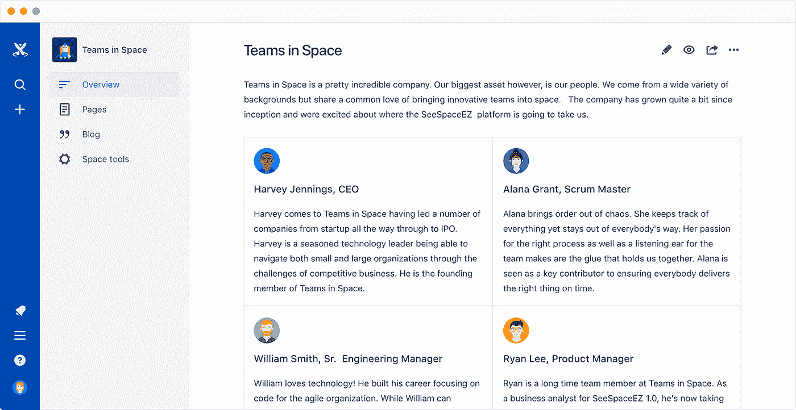

# Slik kan du utnytte Confluence som publiseringsplattform

> 原文：<https://medium.com/compendium/slik-kan-du-utnytte-confluence-som-publiseringsplattform-6d2bef40d37e?source=collection_archive---------1----------------------->

De fleste virksomheter har store mengder dokumentasjon lagret i form av dokumenter eller regneark, og ofte er det ønskelig å gjøre mye av dette åpent tilgjengelig for alle. Gode grunner til det kan være:

*   for å gjøre produkter eller tjenester bedre kjent
*   for å effektivisere samarbeidet med andre virksomheter eller enkeltpersoner

I slike tilfeller vil det være fornuftig å overføre innholdet til et samarbeidsverktøy som Confluence. Virksomheten kan samle store mengder informasjon og få strukturert innholdet inn i en god trestruktur. Leserne vil dermed få overblikk over den totale mengden dokumentasjon samtidig som de enkelt kan dykke ned i detaljene som de er mest interessert i. Skyløsningen av Confluence gjør det svært enkelt å gjøre innhold åpent enten for alle eller for utvalgte brukergrupper. Verktøyet gir i tillegg stor verdi ved at det effektiviserer samarbeidet når det gjelder utarbeidelse av innhold.

# **Hvorfor er det behov for en publiseringsstrategi?**

Mange virksomheter bruker i dag Confluence til intern samhandling og informasjonsutveksling, og det kan være fornuftig å bruke to forskjellige instanser av Confluence til henholdsvis intern og ekstern bruk. Det er også mulig å bruke en enkelt instans til begge formål, men det er mest vanlig å velge to med tanke på at det vil forenkle oppsett av teknisk infrastruktur som brukertilganger, brannmurer og sertifikater.

Ved utarbeidelse av dokumentasjon ønsker mange å jobbe internt med en versjon over tid før den tilgjengeliggjøres for andre. Dette gjøres ved å opprette et nytt område i Confluence når arbeidet med en ny versjon starter. Det innebærer imidlertid at produsentene av innholdet må passe godt på hvilken versjon de redigerer på. Dette kan gjøres tydeligere ved å bruke ulike visuelle profiler for grensesnittet i Confluence og ved å ta i bruk egne instanser for intern redigering og eksternt publiserte versjoner.

Det er behov for en gjennomtenkt strategi for publisering der flere forhold vurderes:

*   hvor ofte vil nye versjoner trolig komme i tida framover? (leveranseplan)
*   hvor mange endringer i dokumentasjonen er det vanligvis er snakk om ved nye versjoner?
*   hvor mange personer vil være innholdsprodusenter av dokumentasjonen?

# Hvilke spørsmål bør du stille deg?

For mange systemer er det viktig å ha definerte versjoner av dokumentasjonen som samarbeidspartnere eller leverandører kan forholde seg til. For andre systemer kan en virksomhet velge en variant der den offentliggjorte dokumentasjonen er «levende» og oppdateres fortløpende. Det vil da være mindre behov for rutiner rundt publisering, men det vil potensielt være litt vanskeligere å få oversikt over hvordan dokumentasjonen så ut på et gitt tidspunkt. Hver enkelt side i Confluence har imidlertid historikk der du kan se tidspunktet for endringer. Det finnes flere tillegg (add-ons) til Confluence som forenkler og automatiserer publiseringen av innhold, og et par slike eksempel er Comala Publishing og Scroll Viewport. Disse brukes i dag i noen offentlige virksomheter.

# Oppsummering

Du bør vurdere følgende konkrete forhold for å utarbeide din virksomhets publiseringsstrategi:

*   er det behov for å publisere både enkeltsider og hele områder?
*   vil brukerne ha behov for å laste ned deler eller hele settet av dokumentasjon?
*   finnes det et behov for å tilgjengeliggjøre flere parallelle versjoner av dokumentasjonen samtidig?
*   hvilke roller ønsker virksomheten å ha når det gjelder publisering? Skal det være en enkeltperson som er ansvarlig eller skal kompetansen spres på flere?
*   er antallet personer som oppdaterer dokumentasjonen såpass høyt at det bør være en strukturert prosess rundt flyten av QA/gjennomlesning før publisering?
*   er det behov for å koordinere publiseringsbehovet med andre miljøer i samme virksomhet?
*   hva er konsekvensen hvis innhold fjernes eller endres av eksterne brukere hvis det på et tidspunkt har blitt gjort noe feil med tilgangsstyringen?
*   hvordan sikres det at alle linker fortsatt er gyldige når innhold utarbeides til ulike områder og versjoner?
*   er det ønskelig å åpne opp for anonyme kommentarer på innholdet?
*   er det behov for varslinger når endringer av innholdet endres? Eller holder det at endringene oppsummeres i en oversikt? Bør det utarbeides en manuell endringsoversikt som utfyller den genererte oversikten over endringer?