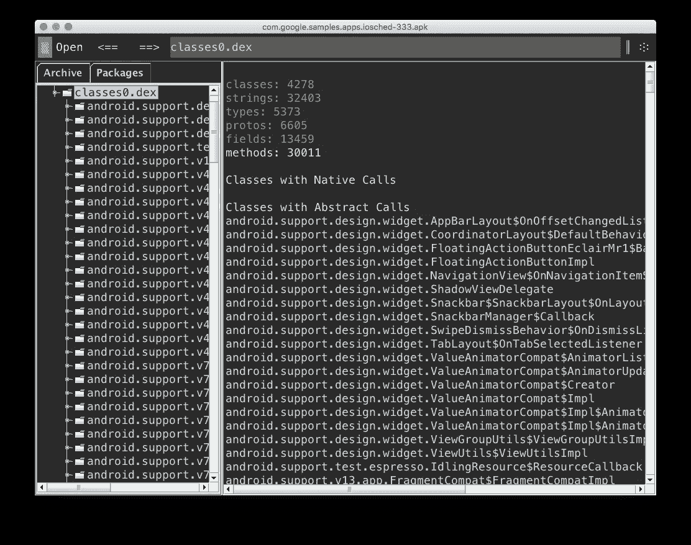

# #SmallerAPK，第 2 部分:缩小代码

> 原文：<https://medium.com/androiddevelopers/smallerapk-part-2-minifying-code-554560d2ed40?source=collection_archive---------2----------------------->


[**更新 1**](#7d6e) :上传 ProGuard 映射播放

在这一章中，你会发现适用于几乎所有应用的建议。这一切都是为了保持你的代码库整洁，检查你的依赖关系，并为你提供帮助你完成这些任务的工具。

# Dex 代码精简

你要做的第一件事是启用内置的迷你。它将尝试去除任何未使用的类和类成员，并使用较短的名称重命名任何标识符。这两种操作都会使结果代码变得更小，但是后者会使调试变得麻烦，所以我建议您只对您的*版本*构建类型启用缩小:

## build.gradle

```
android {
    ...
    buildTypes {
        release {
            minifyEnabled true
            proguardFiles getDefaultProguardFile('proguard-android.txt'), 'proguard-rules.pro'
        }
    }
}
```

第二行以 [ProGuard rules](http://proguard.sourceforge.net/manual/usage.html) 格式为 minifier 提供配置文件。第一个配置文件([Sdk/tools/proguard/proguard-android . txt](https://android.googlesource.com/platform/sdk/+/master/files/proguard-android.txt))包含在 Sdk 中，包含每个 Android 项目的一些相同的默认设置。查看这些规则可以帮助您熟悉 Proguard 配置语法。例如，这将保留(换句话说，防止被移除或重命名)视图子类中的任何 setter 或 getter 方法:

```
# keep setters in Views so that animations can still work.
# see [http://proguard.sourceforge.net/manual/examples.html#beans](http://proguard.sourceforge.net/manual/examples.html#beans)
-keepclassmembers public class * extends android.view.View {
    void set*(***);
    *** get*();
}
```

幸运的话，您的应用程序将在默认配置下工作。在构建过程中，一个名为 AAPT 的工具还会生成必要的规则，用于保留清单中提到的所有活动和其他组件，以及 XML 布局中使用的任何视图。库依赖应该通过[消费者程序文件](#8c00)提供他们的迷你配置，尽管有时他们只在他们的网站或手册上提供必要的程序规则。在这种情况下，您需要将它们复制到您的 *app/proguard-rules.pro* 文件中。

不幸的是，经常会出现这样的情况，在启用缩小后，你的应用要么不能编译，要么在运行时中断，通常是通过抛出 *ClassNotFoundException* 来处理被缩小器移除的类。要解决这个问题，您需要在您的 *app/* 文件夹中创建一个 *proguard-rules.pro* 文件，并提供消除编译时警告所需的规则(查看消息日志以获取信息)。您还必须确保保留运行时使用的、但被 minifier 剥离的所有类和成员。这些通常是通过反射访问的代码部分。

一个具体的例子是当 XML 布局中的自定义属性将类名作为字符串时，例如设置一个 *RecyclerView* 的 *layoutManager* :

```
<android.support.v7.widget.RecyclerView
    app:layoutManager=”android.support.v7.widget.GridLayoutManager”
    ...
/>
```

在这种情况下，AAPT 将无法计算出类的用法并生成必要的 ProGuard 规则。要应用修复，您应该在 ProGuard 配置中放入以下代码行，以防止 *GridLayoutManager* 类及其任何公共和受保护的方法被移除或重命名:

```
-keep public class android.support.v7.widget.GridLayoutManager {
    public protected *;
}
```

为了检查您编写的配置规则是否达到了预期的效果，您可以使用类似于 [ClassyShark](#0643) 的工具检查结果 APK 中的 *classes.dex* 文件。彻底测试你的应用程序也很重要！应用程序打开而不崩溃的事实并不表明微型配置是正确的。你**必须**测试你应用程序中的每一个屏幕和用户流是否崩溃。(我可以建议查看一下 [Android 测试支持库和 Espresso](https://google.github.io/android-testing-support-library/) 吗？:)

# 上传要播放的 ProGuard 映射

直到最近，分析用户设备上运行的混淆代码抛出的异常还是有点不方便的。通常，您必须从 Play Developer Console 复制 stacktrace，并使用计算机上的工具和编译时生成的 ProGuard 映射文件来解码原始的类和方法名。


游戏开发者控制台现在可以选择[上传映射文件](https://support.google.com/googleplay/android-developer/answer/6295281)和你的 APK，并且会在崩溃和 ANRs 面板显示去模糊的堆栈轨迹。请记住，您使用的映射文件必须来自与您的发布 APK 完全相同的编译运行。

> **注意**:你会在你的项目文件夹下找到 mappings.txt 文件，路径:<模块>/build/outputs/mapping/mapping . txt

# 库的 ProGuard 配置

如果您正在构建一个 AAR 库，用于需要 ProGuard 规则工作的其他项目，您应该使用 *consumerProguardFiles* 选项将一个 ProGuard 配置文件与 AAR 打包在一起。这样，任何使用你的库的人都不必担心在启用 minifier 时手动添加规则。在使用手册中的库编译项目时，也要确保提供关于任何其他需求的信息。

## build.gradle

```
android {
    ...
    defaultConfig {
        consumerProguardFiles “proguard-rules.txt”
    }
}
```

# 为 Google Play 服务使用粒度依赖性


在项目中使用 Google Play 服务库时，记得切换到粒度依赖。这意味着，如果你只是使用广告、地图或 GCM 等几个功能，你就不会把整个客户端库都拉进来。这里有一个表格，里面有你可以在[developers.google.com](https://developers.google.com/android/guides/setup)上使用的所有 Gradle 依赖字符串。顺便说一句，ProGuard 消费者规则包含在 Play 服务中，所以如果您为您的版本启用了代码精简器，它们应该可以正常工作。

# 追踪依赖关系

为 Android 开发的好处是，如果你有问题，可能有人已经解决了。随着项目的增长，您通常会引入越来越多的外部依赖来加快开发时间。最常见的可能是向后兼容的 Android 支持库、Play 服务、图像加载库、HTTP 客户端和各种其他 SDKs

开发人员经常问我:我应该使用哪个图像库？多少依赖项对我的项目来说太多了？这些问题没有确定的答案。如果你真的需要使用一个库，因为它可以解决你的问题(并且你知道它的缺点)，那么就去用吧。重要的是要有合适的工具来帮助你决定它将对你的项目规模产生什么样的影响，这样你才能做出明智的决定。

# 可传递的库依赖

当你认为你“只是”添加了一个小的帮助器库，突然你的索引大小爆炸了，你的方法数飙升了，那可能是因为你通常在你的 *build.gradle* 文件中看不到的传递依赖。幸运的是，有一些工具可以提供帮助:

```
$ ./gradlew app:dependencies...compile — Classpath for compiling the main sources.
+ — — com.android.support:appcompat-v7:23.1.1
| \ — — com.android.support:support-v4:23.1.1
| \ — — com.android.support:support-annotations:23.1.1
+ — — com.android.support:cardview-v7:23.1.1
+ — — com.android.support:design:23.1.1
| + — — com.android.support:appcompat-v7:23.1.1 (*)
| + — — com.android.support:recyclerview-v7:23.1.1
| | + — — com.android.support:support-annotations:23.1.1
| | \ — — com.android.support:support-v4:23.1.1 (*)
| \ — — com.android.support:support-v4:23.1.1 (*)
+ — — com.android.support:recyclerview-v7:23.1.1 (*)
\ — — com.android.support.test.espresso:espresso-idling-resource:2.2.1
```

*<modulename>:dependencies*命令给出了项目中每个库及其依赖树的概述。版本号旁边的星号(*)告诉您，这个特定的依赖项以前已经在输出中提到过，所以它无论如何都会包含在您的项目中，除非您删除它的所有其他实例。

> **注意**:如果您正在使用产品风格，并且您只需要一个用于您的应用程序的某些变体的库(例如，一个仅用于免费版本的 Ads SDK)，您可以指定以您的风格名称为前缀的依赖项，例如
> 依赖项{ freeCompile '…' }。

# 用 ClassyShark 检查 Dex 文件

有时，为了保护开发人员免受版本冲突的影响，一个库将它的依赖项直接包含在它的代码中，但是使用了一个改变的包名，本质上是隐藏了原来的包名。这也意味着你不会在 Gradle 依赖树中看到这种依赖。

如果您想更好地查看您的 APK 中打包的确切的类和包名，您可以使用 [ClassyShark](https://github.com/google/android-classyshark) 来检查您的 Dex 文件。这也有助于测试您的 ProGuard 规则，了解它们对最终 APK 的确切影响。



> **注意**:作为奖励，ClassyShark 将显示包的方法计数，这可能有助于您识别最大的多索引违规者。

继续阅读[第 3 部分:移除未使用的资源](/@wkalicinski/smallerapk-part-3-removing-unused-resources-1511f9e3f761)