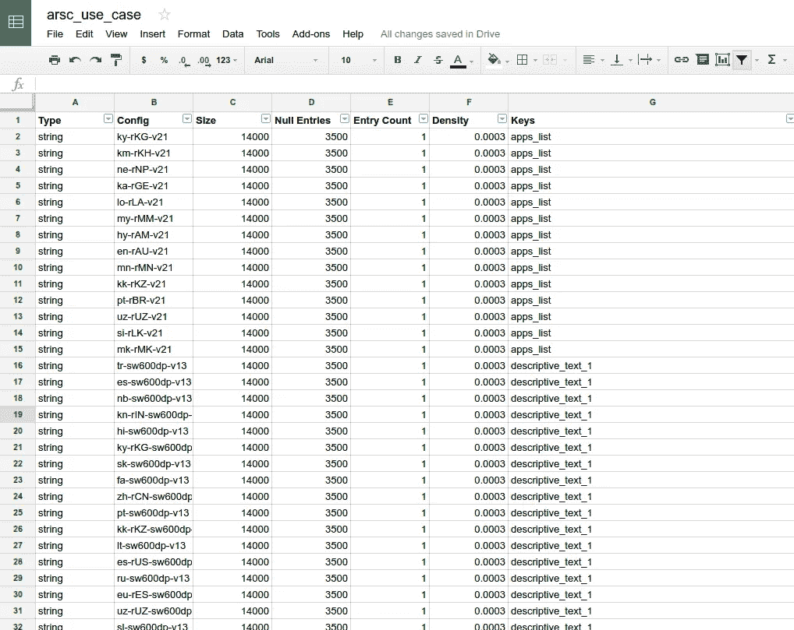

# #SmallerAPK，第 3 部分:删除未使用的资源

> 原文：<https://medium.com/androiddevelopers/smallerapk-part-3-removing-unused-resources-1511f9e3f761?source=collection_archive---------1----------------------->


[**更新 1**](#0b72) **:** 资源中的稀疏配置. arsc

有两种方法可以移除应用程序未使用的资源，但由于这些资源位于项目文件夹或依赖项中，因此会打包到 APK 中。一种方法依赖于我们在[前一章](/@wkalicinski/smallerapk-part-2-minifying-code-554560d2ed40)中讨论的缩小器/收缩器。除了删除未使用的代码，它还可以分析哪些资源实际上正在使用，并剥离那些从来没有包括在你的布局，绘图，代码等。要启用资源收缩，请将这一行添加到您的发布版本类型:

## build.gradle

```
android {
    ...
    buildTypes {
        release {
            minifyEnabled true
            **shrinkResources true** proguardFiles getDefaultProguardFile('proguard-android.txt'), 'proguard-rules.pro'
        }
    }
}
```

就像删除代码一样，自动化工具有时可能会对实际使用了哪些资源做出错误的判断。您可以使用特殊的*工具:keep* 属性告诉构建系统您想要保留的资源，类似于 ProGuard 配置文件如何列出要保留的类和方法。您可以将它添加到项目中已经存在的任何 *<资源>* 标签上，或者为收缩器规则创建一个单独的文件:

## res/raw/keep.xml

```
<?xml version="1.0" encoding="utf-8"?>
<resources xmlns:tools="http://schemas.android.com/tools"
   tools:keep="@layout/l_used*_c,@layout/l_used_a,@layout/l_used_b*"
/>
```

您还可以指定*工具:丢弃*来故意删除被保留的资源；

## res/raw/keep.xml

```
<?xml version="1.0" encoding="utf-8"?>
<resources xmlns:tools="http://schemas.android.com/tools"
    tools:shrinkMode="safe"
    tools:discard="@layout/unused2"
/>
```

通过查看日志文件以及在[工具站点](http://tools.android.com/tech-docs/new-build-system/resource-shrinking)上在*安全*和*严格*模式之间切换意味着什么，你可以阅读更多关于调试资源收缩器的内容。

当然，保持项目文件夹整洁有序是一个好习惯，所以如果你知道有任何旧的资源不再使用，你应该删除这些文件。

# 使用 ResConfigs 删除未使用的配置

许多库都有翻译成多种语言的字符串资源。例如，支持库和 Google Play 服务就是这种情况。你甚至可能已经开始为你的应用程序进行翻译，但是你还没有准备好向市场发布这些语言。您可以使用 *resConfigs* 选项来限制将包含在最终 APK 中的配置

## build.gradle

```
android {
    defaultConfig {
        ...
        resConfigs "en", "fr"
    }
}
```

这将删除不适合这两种语言配置的任何资源。

请注意，resConfigs 在与屏幕密度一起使用时略有其他语义(您只能使用一种密度)，最好使用 [splits](/@wkalicinski/smallerapk-part-4-multi-apk-through-abi-and-density-splits-477083989006) 来代替。在[第五部分:多 APK 产品风味](/@wkalicinski/smallerapk-part-5-multi-apk-through-product-flavors-e069759f19cd)中也有一个密度*重组*用法的例子

# 资源中的稀疏配置

我在这一节将要描述的问题通常只发生在非常大的应用程序中，有成百上千的资源字符串、样式或其他标识符进入 *resources.arsc* 文件。

如果您注意到该文件在您的 APK 中占据了异常大的空间，这可能表明您有太多的*稀疏配置*。让我解释一个简单的例子。

假设您有 5 个在默认配置文件夹中定义的基本字符串( *values/strings.xml* )。字符串本身将在字符串池中定义，而资源文件的另一个区域将包含一个由指向这些字符串的指针组成的资源配置。为了便于解释，下面是一个简化的 *resources.arsc* 文件的样子:

```
String pool: "My App", "Hello", "Exit", "Settings", "Feature" Default config: 
string/myapp      0x00000001
string/hello      0x00000002
string/exit       0x00000003
string/settings   0x00000004
string/feature    0x00000005
```

现在想象一下，你正在给你的应用程序添加一个只能在 API 21+上工作的新特性。该特性需要在使用时显示不同的消息，因此您决定覆盖 *values-v21/strings.xml* 中的一个字符串，并重新编译您的应用程序。

您可能会认为您只是向字符串池添加了一个新的字符串值，并为新创建的 v21 config 添加了一个字符串指针。不幸的是， *resources.arsc* 文件格式不是这样的。相反，您可能会看到:

```
String pool: "My App", "Hello", "Exit", "Settings", "Feature", "New feature" Default config:         -v21 config:
string/myapp      0x00000001              NO_ENTRY
string/hello      0x00000002              NO_ENTRY
string/exit       0x00000003              NO_ENTRY
string/settings   0x00000004              NO_ENTRY
string/feature    0x00000005              0x00000006

                  ==========              ==========
Config size:      20 bytes                **20 bytes**!
```

事实证明，每个配置( *-v21* 、 *-land* 甚至 *-en-land-v21* )都会在每个可能的资源位置上为指针预留空间。实际指针可以为空，这意味着在此配置中没有定义任何值。空指针仍然占用 4 个字节。

正如我在开始提到的，这里可能的节省主要取决于你的应用程序中有多少字符串(或其他类型的资源)。对于我们的例子来说，字符串的-v21 配置的开销只有 4 * 4 字节，也就是说在空条目中浪费了 16 字节(加上我们真正关心的指针的 4 字节)。

然而，在现实生活中，一个应用程序定义了 3500 个字符串，并有一个单独的横向配置，其中 1 个字符串被翻译成 50 种语言(因此它有一些文件夹，如 *values-en-land* 、 *-pl-land* 、 *-de-land* 、*-fr-land……*)将会丢失:

4 字节* 3500 个空条目* 50 种语言= **700 千字节**

也就是说,**删除一个字符串**就可以节省 700 千字节，我见过一些应用程序通过移动 3 个资源来减少配置数量，节省了超过 **2.5MB 的空间。**

有一个问题——因为你首先将一个资源放在一个单独的配置中，这通常意味着你需要它，而这实际上是在 Android 中这样做的正确方式。但是如果你能找到一个或几个能为你节省大量空间的资源，你可能会考虑想办法把它们一起扔掉。

另一种方式，尽管不太优雅，是在那种情况下在代码中不同版本的资源之间切换。例如，在您的 *values/strings.xml* 中，您可以有两个字符串: **string/my_feature** 和***string/my _ feature _ land***，然后在运行时根据当前屏幕方向选择正确的一个。

我们开源了一个工具，可以帮助您找到稀疏资源配置，并确定哪些资源导致了您的 *resources.arsc* 膨胀。它叫做 ArscBlamer，可以在这里找到:

[](https://github.com/google/android-arscblamer) [## 谷歌/安卓-arscblamer

### ArscBlamer 是一个命令行工具，可以解析 Android 应用程序的 resources.arsc 文件，并提取有用的、可操作的…

github.com](https://github.com/google/android-arscblamer) 

你需要安装 [Bazel](http://bazel.io/) 来编译 ArscBlamer。您可以使用以下命令编译和运行(全部在一行中):

```
$ bazel run //java/com/google/devrel/gmscore/tools/apk/arsc:ArscDumper --apk=/FULL_PATH_TO_APK/bar.apk - keys > output.csv
```



然后，在任何编辑器(如 [Google Sheets](https://docs.google.com/spreadsheets) )中打开生成的 CSV 文件，并按*空条目*列降序排序。

具有最多*空条目*的配置可能会被删除，右边的资源名称(*键*)将是您可以删除的配置。

让我知道这种技术是否适用于你的应用程序，以及你如何能够减少资源的大小。

[第 4 部分:通过 ABI 的多 APK 和密度分割](/@wkalicinski/smallerapk-part-4-multi-apk-through-abi-and-density-splits-477083989006)只需点击一下鼠标。