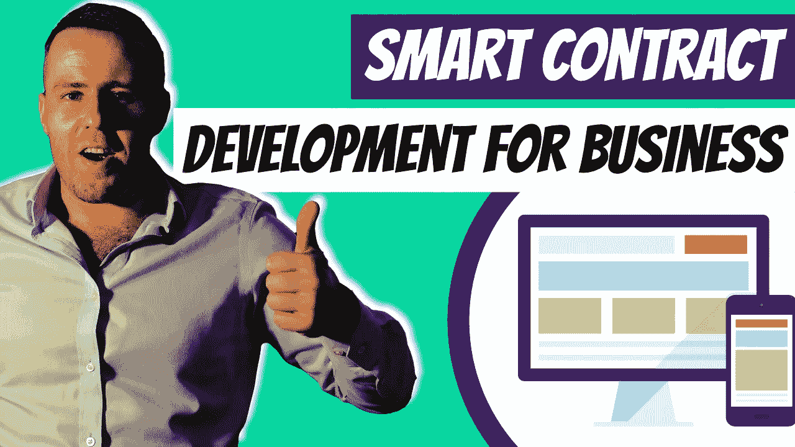

# 面向企业所有者的智能合同开发指南

> 原文：<https://medium.com/duomly-blockchain-online-courses/smart-contract-development-guide-for-business-owners-7e181b8a5e11?source=collection_archive---------1----------------------->

[Smart Contract Development Guide for Business Owners](https://www.blog.duomly.com/smart-contract-development-guide/)

本文原载:[https://www . blog . duomly . com/smart-contract-development-guide/](https://www.blog.duomly.com/smart-contract-development-guide/)

作为企业主，您可能听说过“智能合同”这个术语，并想知道它是什么，以及它如何为您的企业带来好处。智能合同是使用区块链技术来自动协商和执行交易的数字合同。