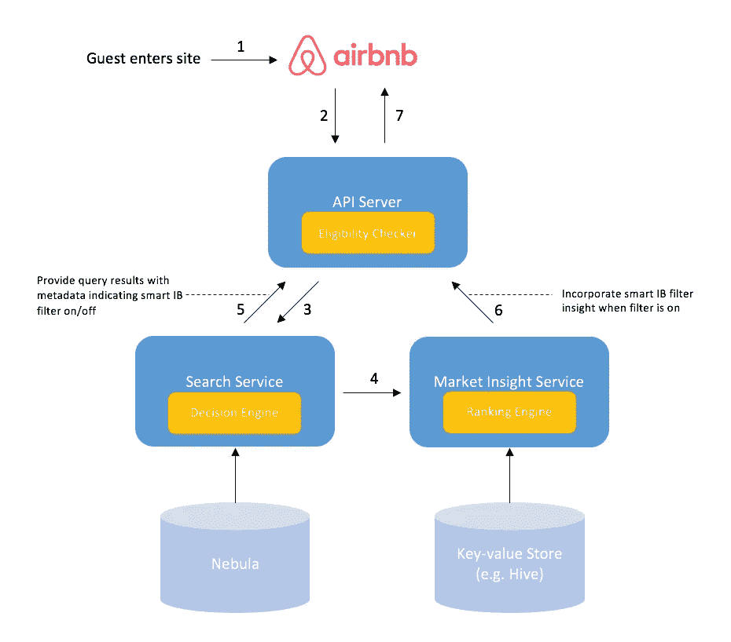
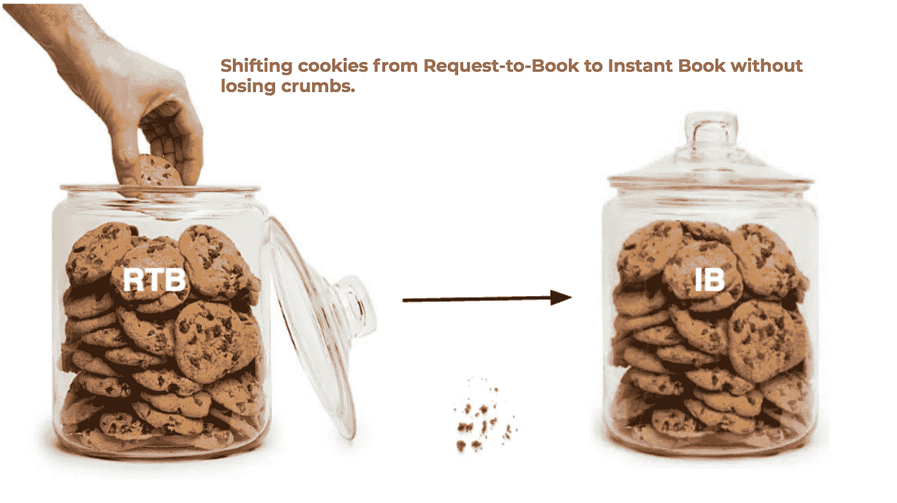
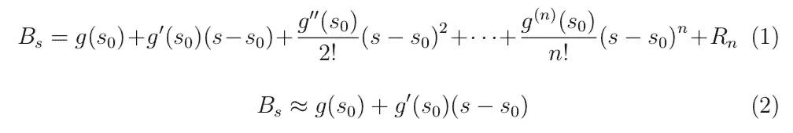
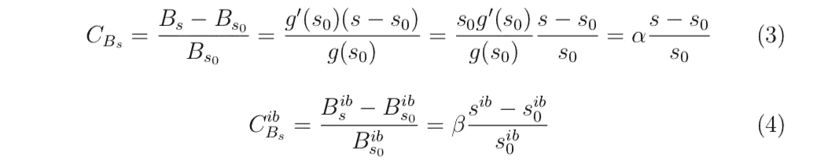
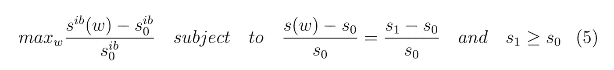
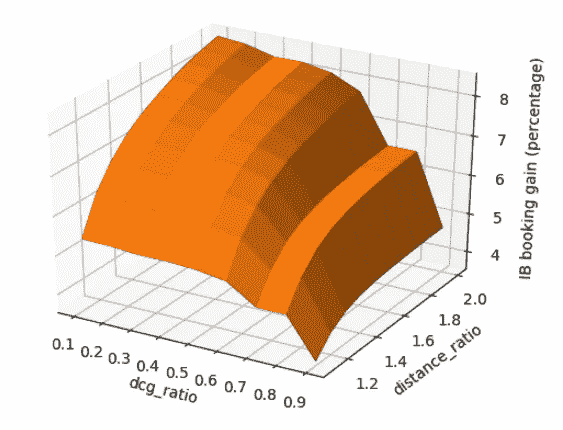
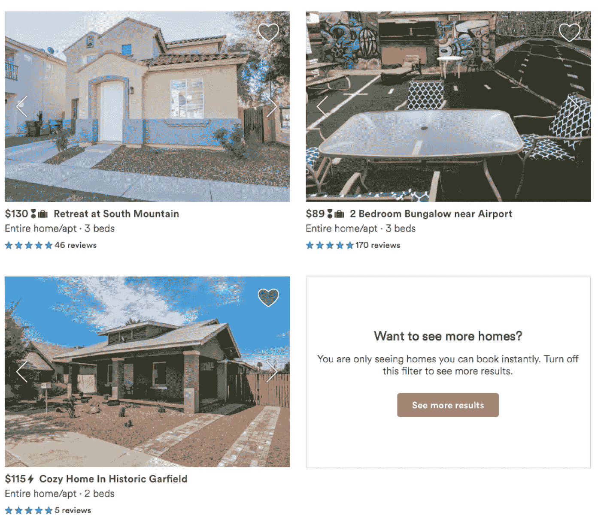

# 智能即时图书过滤器

> 原文：<https://medium.com/airbnb-engineering/smart-instant-book-filter-book-with-confidence-ab3d6dace0b2?source=collection_archive---------2----------------------->

## 探索旨在帮助客人放心预订的功能

*由***[*范丽*](https://www.linkedin.com/in/fanli0704/)*&*[*崔涛*](https://www.linkedin.com/in/tao-cui-60b73713/)**

****

**人们喜欢事情快。我们希望一小时内送达，一分钟内下载，即时发布新闻。这就是为什么我们需要帮助我们的 Airbnb 社区立即预订他们想要的房源。 [*即时预订*](https://www.airbnb.com/help/article/523/what-is-instant-book) 是我们产品中的一个关键杠杆，它使 Airbnb 社区能够立即预订位置，而无需事先获得主办方的批准，并提高接受度。**

**在过去的几年里，我们的*即时预订*已经发生了难以置信的变化，如今三分之二的预订是通过*即时预订*完成的。2016 年以来，我们一直在稳步改进*即开本*，其中最大的一个杠杆就是智能*即开本滤镜*。在接下来的部分中，我们将提供智能*即时预订*过滤器的概述，并阐明它如何帮助我们的 Airbnb 社区即时预订并属于任何地方。**

# **我们的使命**

**在 Airbnb，我们始终致力于提供便捷、成功的预订体验。在我们提供*即时预订*之前，使用预订请求的客人经常会遭到多次拒绝，对于想要快速制定计划的旅行者来说，这种情况可能会变得更糟。通过*即时预订*，客人可以在我们的搜索页面上过滤，找到可以即时确认预订的地方。尽管如此，我们也意识到有些客人选择了*预订请求*列表，却不知道被拒绝的可能性和可能的响应延迟。**

**受此推动，我们启动了一个*智能即时图书* *过滤器*——智能地将*即时图书*过滤器应用于搜索，以鼓励更好的用户体验。**

**在我们前进之前，我们面临以下两个挑战:**

1.  **什么时候应该自动应用智能*即时书籍滤镜***
2.  **我们应该如何通知客人一个*速食书*滤镜已经打开？**

**在我们的搜索服务中，可以获得所有房源特性和市场动态的广泛知识。我们构建了一个嵌入在搜索服务中的决策引擎，利用这些数据来回答问题 1。此外，我们在 platform 中有一个强大的渠道向我们的客人提供信息性的见解— [*市场见解*](/airbnb-engineering/helping-guests-make-informed-decisions-with-market-insights-8b09dc904353) 。这解决了问题 2。**

**接下来我们就来解释一下*智能速读本滤镜*的工作流程和使用体验。**

# **建筑和体验**

**在本节中，我们首先对模型进行概念化，然后解释数据、算法和模型。最后，我们将描述用户体验。**

**在高层次上，当客人使用 Airbnb 搜索房屋时，API 服务器首先收集基本的查询信息，并执行初始资格检查。接下来，API 服务器查询搜索服务，并与*市场洞察*服务对话，以决定是否应触发*即时图书*过滤器，实时生成相应的候选*市场洞察*。最后，API 服务器组合从两个服务收集的信息，并在 UI 中反映结果。**

****

**Figure 1\. Smart Instant Book Filter workflow**

**如图 1 所示，工作流程如下:**

1.  **客人首先到达我们的平台。**
2.  **游客通过搜索框搜索房屋。API 服务将在此阶段验证基本信息，例如查询是否包含入住和退房日期，以标记符合智能*即时图书过滤器*的查询。**
3.  **API 服务器向搜索服务发送带有智能*即时书籍过滤器*资格标志的搜索请求，搜索服务与我们的内部存储平台 [Nebula](/airbnb-engineering/nebula-as-a-storage-platform-to-build-airbnbs-search-backends-ecc577b05f06) 进行对话，以执行排名并生成搜索结果。我们的决策引擎位于消费搜索结果的搜索服务内部，并使用确定性模型来决定是否触发智能*即时图书过滤器*。**
4.  **搜索服务将市场可用性元数据传递给市场洞察服务，其中包括智能*即时图书过滤器*洞察在内的候选洞察将根据其对客户的价值进行排名。**
5.  **搜索服务将结果返回给服务器。**
6.  **市场洞察服务将最终合格的洞察返回给服务器。**
7.  **API 服务器组合所有信息并驱动前端显示。**

## **数据**

**我们在搜索服务中的决策引擎整合了异构数据源——用户数据、列表数据、平台数据和查询动态——以做出审慎的决策。**

*   ***实时数据*:用户数据、平台数据和查询数据是从 API 服务传递过来的基础信息。鉴于不同平台上的各种用户体验，我们在每个平台的基础上训练模型，我们通过应用更宽松的阈值来不同地尊重最后一分钟的预订。**
*   ***聚合数据*:我们根据需求、供应和列表的数量和质量，以及其他信息(包括每个搜索请求的地理漂移)来聚合搜索结果。列表的质量是基于折扣累积效用来衡量的，折扣累积效用概括了每个列表的评论评级、页面浏览量和其他质量分数的事实。一些聚合数据是预先计算的，并由 [*内部工具*](/airbnb-engineering/airflow-a-workflow-management-platform-46318b977fd8) 提供。**

## **算法和模型**

**我们的目标是通过巧妙应用*即时预订*过滤器，将*预订请求*转换为*即时预订*。因此，我们只在特定情况下为客人显示*即时预订*结果。然而，这里最大的挑战是如何避免在此过程中由于供应规模减少而造成的预订损失。图 2 显示了这种情况的类似情况。**

****

**Figure 2\. Shift Request-to-Book to Instant Book**

**所以我们考虑下面的问题设置。每个搜索都与一个排名分数 *s* 相关联，该排名分数由一个*即时预订排名分数*和一个*请求预订*排名分数组成。我们使用函数 *g* 作为预订 *Bs* 和排名分数 *s* 之间的代理，因此我们有: *Bs = g(s)* 。注意这里我们没有假设任何形式的函数 *g* 。这样问题就简化为在不减少 *Bs 的情况下增加速读本。***

**设 s0 为没有智能*即时书过滤器*的排名分数，那么我们就可以对等式 1 中的 s0 进行函数 *g* 的泰勒展开。**

****

**通过将其近似为一阶，我们得到等式 2。那么预订变化百分比可以表示为等式 3，其中 *α* 是取决于平台和季节性的常数。同样，我们可以在等式 4 中计算出*即时书*的百分比变化。这里 *β* 取决于*即时图书*结果在当前搜索结果中的比例。**

****

**我们可以通过分析之前的*即时书*排名实验来回填 *α* 和 *β* 的值。利用 *α* 和 *β，*我们可以基于离线计算的排名分数变化可靠地预测未来实验的性能。有了这些统计数据，我们就可以根据固定的策略优化基于确定性决策树的决策引擎。更正式地说，我们希望:**

****

**其中 *w* 是我们的特征向量，它在*数据*部分中描述，并作为我们确定性决策树中的分支因子， *s1* 是我们的目标预订分数。**

**我们可以将等式 5 解释为最大化*即时预订*排名分数，同时保持整体预订的排名分数略微为正或中性。我们还可以最大化给定目标*即时预订*排名分数的整体预订排名分数，反之亦然。我们通过使用 Python 工具箱在维度空间中搜索来离线计算我们的特征向量值，以最好地推广*即时图书*。图 3 中示出了维度空间分布的一个示例，其中我们搜索给定距离比维度和折扣效用值维度的*即时图书*得分增益的最佳值。**

****

**Figure 3\. Instant Book score gain as a function of discounted utility value and distance ratio**

**接下来我们就来举例说明智能*即本书滤镜*的用户体验。**

## **用户体验**

**当搜索服务发现它有资格打开*即时书籍*过滤器时，在有足够高质量供应的情况下，我们将自动打开*即时书籍*过滤器，并用工具提示提醒客人。**

****

**Smart Instant Book Filter with Tooltip**

**如果客人在*即时图书过滤器*开启时不断放大地图缩小搜索范围，从而找到越来越少的*即时图书*结果，一张*市场洞察*卡片将取代单一列表卡片，提醒客人可以一键释放智能*即时图书过滤器*。**

****

**Contextual Market Insight Reminder Card**

# **关键要点**

## **从顶部漏斗重新思考问题**

**在过去的一年里，我们与用户体验研究员、产品专家和数据科学家密切合作，研究如何推广*即时图书*，并向我们的 Airbnb 社区传达信息— *即时图书*是未来。大量的努力都致力于主机端。这个项目是我们从来宾端开始的，并取得了良好的结果。结果，我们的工作推动了*即时图书*的增长超过了 5%,融入了公司的实质性增长。**

## **弥合客人和主人之间的差距**

**今天大多数预订是通过*即时预订*进行的，而不是*请求预订*。随着嘉宾发现更容易利用*即时通讯工具*过滤器，我们在实验中发现的一个二阶效应是主持人采用*即时通讯工具*的倾向，这与主持人一方大力开展的*即时通讯工具*采用活动相当。客人和主人之间的界限很模糊——许多主人也是客人。这意味着客人和主人之间的互动非常重要，这为这一领域的进一步发展铺平了道路。**

# **未来计划**

**市场动态不断变化。Airbnb 一直是探索和利用先进技术的先驱，包括构建 [*自动化机器学习基础设施*](/airbnb-engineering/automated-machine-learning-a-paradigm-shift-that-accelerates-data-scientist-productivity-airbnb-f1f8a10d61f8) *和* [*工作流管理平台*](/airbnb-engineering/airflow-a-workflow-management-platform-46318b977fd8) 。当我们不断迭代智能*即时图书过滤器*时，除了当前的模型状态之外，我们还计划利用自动化的 ML 基础设施，并将系统与在线评分模型集成，以捕捉不断变化的条件。**

***我们跨越国界，共同完成使命，履行承诺。我们对这个框架的未来充满激情，对这项工作可能的方向感到兴奋。特别感谢李，他提出了最初的想法。多亏了易、李和惠，他们迭代并制造了该产品的第一个可发货版本。这要感谢陶，他帮助修正了模型，并将性能提升到了一个新的水平。***

**我们要感谢 [*苏拉比古普塔*](https://www.linkedin.com/in/surbs/)[*里卡多比昂*](https://www.linkedin.com/in/ricardo-bion/)[*布伦丹柯林斯*](https://www.linkedin.com/in/brendanmcollins/)*[*马丁阮*](https://www.linkedin.com/in/nguyenmartin/)[*【戴鹏*](https://www.linkedin.com/in/daipeng/)*[*杰夫福塞特*](https://www.linkedin.com/in/jeffreyfossett/) *在许多方面的慷慨帮助大声喊出来*[*Trunal Bhanse*](https://www.linkedin.com/in/trunal/)*[*Lenny Rachitsky*](https://www.linkedin.com/in/lennyrachitsky/)*为输入，Adam Neary* *为评论本文。******

***感兴趣？我们是* [*招聘*](https://www.airbnb.com/careers/departments/engineering) *！***