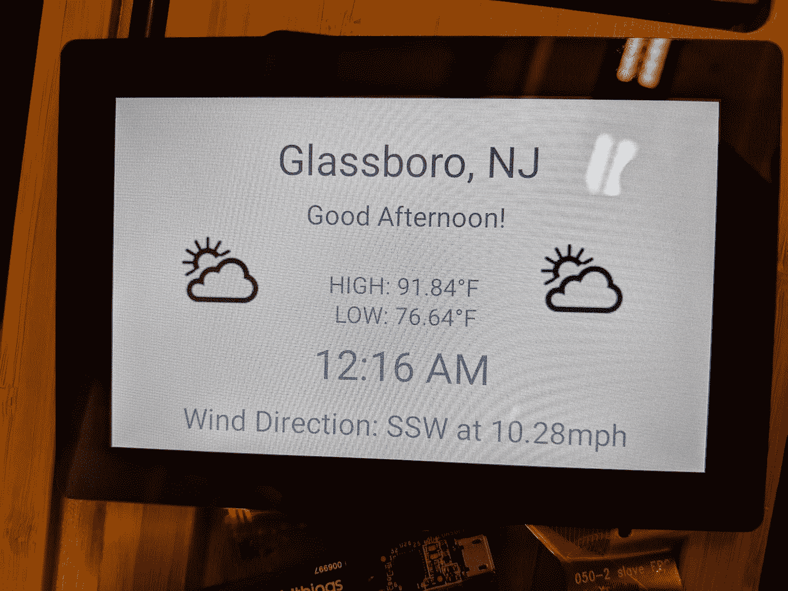

# 智能标志和 Android 事物:案例研究

> 原文：<https://medium.com/androiddevelopers/smart-signs-android-things-a-case-study-ba2bcfbc4d1b?source=collection_archive---------9----------------------->

在春季学期，罗文大学电气和计算机工程项目的三名学生与 Android Things 的开发者预览版和 Google Assistant SDK 的开发者预览版一起工作，以构建一种与日常设备交互的新方式。

在大学里，有一个工程诊所的概念。大三大四每学期都要上一次门诊。这些可以是由学生、教授或公司发起的研究项目。这些诊所为学生提供真实世界的工程问题，为他们提供实践经验。

[Android Things](https://developer.android.com/things/index.html) 平台已经从开发者预览版发展到最近发布的 1.0 版本，这是该框架最初的稳定版本。该平台为开发人员提供了很大的潜力，不仅可以构建嵌入式设备，还可以构建智能和交互式设备。物联网不仅仅是将计算机放入日常物品中，而是为使用这些物品的人创造新奇有用的体验。

# 从数字标牌到互动标牌

数字标牌[是一个不断增长的行业](https://www.reuters.com/brandfeatures/venture-capital/article?id=34829)，对许多企业、餐馆和其他设施具有吸引力，因为它使他们能够轻松控制和改变显示的内容。然而，从公告栏迁移到数字屏幕时，用户体验并没有改善。

数字标牌向用户展示了大量信息，迫使他们分析和理解一切。将对内容的控制权交给企业会剥夺用户的控制权。标志上的内容可能会突然改变，例如转换到一组新的信息，导致读者失去他们的位置并感到更加失落。

数字标牌应该是什么样的？用户应该获得适合他们的体验。当他们走到购物中心的数字地图前时，他们正在寻找一个特定的地方。当他们查看即将到来的事件的数字日历时，他们正在寻找特定事件的时间。这些标志如何变得互动，给人一种量身定制的体验？

一个简单的方法是使用谷歌助手 SDK。有了它，用户可以提出问题，谷歌助理可以使用自然语言处理来识别他们的意图，并给他们一个答案。除了助手的所有一般知识，开发人员还可以通过[定制设备动作](https://developers.google.com/assistant/sdk/device-actions-overview#custom)添加特定领域的知识和能力。

如果你在一个购物中心，询问洗手间可以让软件在地图上明确指出这个位置，并给出方向。你可以询问活动，并根据你选择的主题获得时间或列表。

更多的用例浮现在脑海中:当地天气、新闻和广告折扣都是潜在的功能，可以创造更加个性化和丰富的用户体验。

# 样机研究

这群学生从基于 i.MX7D 运行开发者预览版 0.6 的 [Android Things starter kit](https://androidthings.withgoogle.com/#!/kits/starter-kit) 开始。在这学期的课程中，他们写了一份设计文件，详细说明他们将建造什么，以及在这个过程中他们将使用什么技术。在整个学期中，他们完成了一个概念验证，并能够在年终诊所展示中展示完整的项目。

Example of the sign’s zero state

从[助手样本项目](https://github.com/androidthings/sample-googleassistant)开始，他们增加了一个显示屏，可以用来在提问前显示信息。这个零状态包括当前时间并显示当地天气，如上图所示。

自定义设备操作扩展了应用程序的功能，以处理特定于学生用例的自定义语法。查询模式被放置在[动作包](https://developers.google.com/assistant/sdk/guides/service/python/extend/custom-actions)中，如下所示:

*“(房间)在哪里？$SchemaOrg_Number:number"*

*“我怎么去(房间)？$SchemaOrg_Number:number"*

当有人给出类似*“我如何到达 101”**“216 房间在哪里”*的查询时，app 会收到一个名为 *Room_Number* 的动作，其参数为*号*。

由此，该应用程序能够向您显示到达目的地的方向。标志的位置预计不会改变，可以为每个设备进行硬编码。视觉方向的示例如下所示。

Example of viewing directions from the sign

# 适合这项工作的工具

Android Things 使得构建这种物联网设备变得非常容易。该团队能够利用现有的移动应用样本代码，并将其整合到他们的物联网应用中。在这样做的过程中，他们能够使用许多现有的库和工具，如 [ConstraintLayout](https://developer.android.com/training/constraint-layout/) ，而无需任何特定的修改。

最终的结果是一个端到端处理整个用户体验的 APK。使用标志的人可以获得智能体验，提供高质量的答案和丰富的视觉界面。当有错误修复或新功能时，可以很容易地将其添加到 APK 中，并通过集成的空中更新功能交付。

# 下一步是什么？

现在，该小组已经完成了概念验证，他们秋季学期的重点将是更容易地将标志集成到大学的工程大楼中，并使软件更具可配置性，以便可以在其他地方使用。即使它将在公共空间，平台的安全性意味着不应该有任何问题。