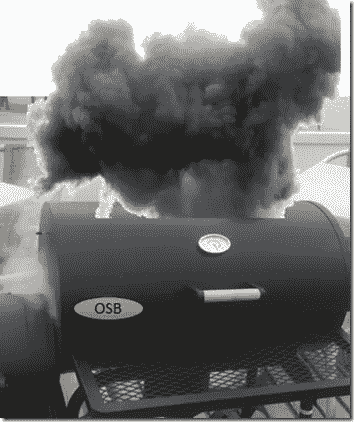

# 从黑匣子里冒出的烟——如何在一个不太透明的系统上解决主要的生产问题

> 原文：<https://medium.com/oracledevs/smoke-escaping-from-a-black-box-how-to-tackle-major-production-issues-on-a-system-that-is-not-eeddda127937?source=collection_archive---------0----------------------->

这个故事是根据真实事件改编的。这是最近才发生的。

我被叫到一个组织中，该组织正在经历影响任务关键流程的性能和稳定性问题。他们的服务车不时停下来，而且越来越频繁…