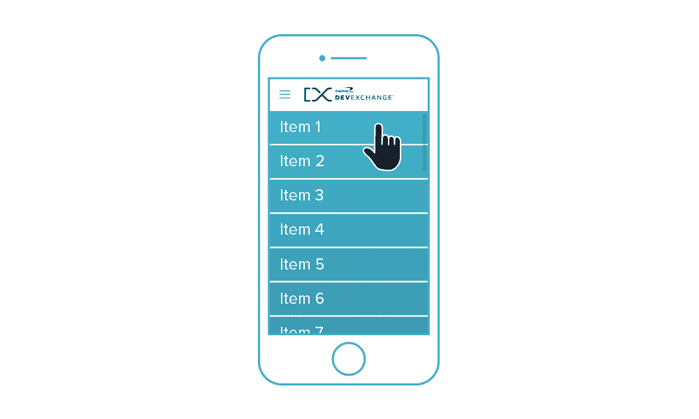
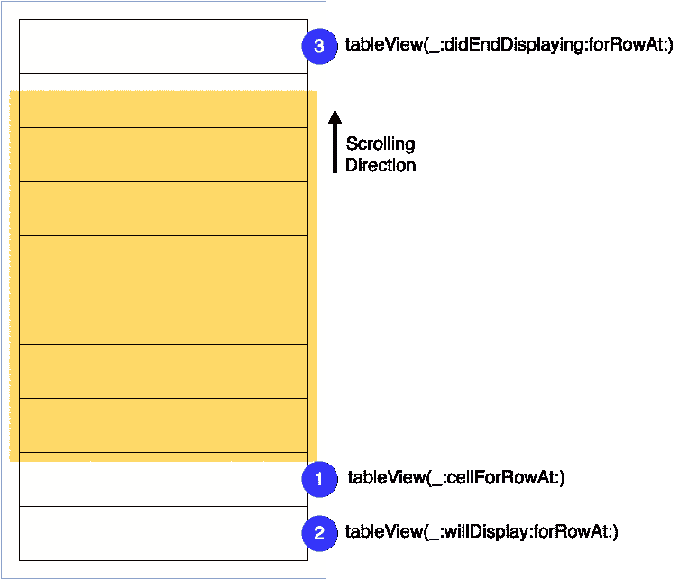

# 在 UITableView 和 UICollectionView 中平滑滚动

> 原文：<https://medium.com/capital-one-tech/smooth-scrolling-in-uitableview-and-uicollectionview-a012045d77f?source=collection_archive---------0----------------------->

正如大多数 iOS 开发人员所知，在构建移动应用程序时，显示数据集是一项相当常见的任务。苹果的 SDK 提供了两个组件来帮助执行这样的任务，而不必从头开始实现一切:一个表格视图([**ui table view**](https://developer.apple.com/reference/uikit/uitableview)**)**和一个集合视图([**UICollectionView**](https://developer.apple.com/reference/uikit/uicollectionview)**)**。

表视图和集合视图都被设计为支持显示可以滚动的数据集。然而，当显示大量数据时，实现完美平滑的滚动可能非常棘手。这并不理想，因为它会对用户体验产生负面影响。

作为 Capital One 移动应用的 iOS 开发团队的一员，我有机会尝试表格视图和集合视图；这篇文章反映了我在显示大量可滚动数据方面的个人经验。在这篇文章中，我们将回顾优化上述 SDK 组件性能的最重要技巧。这一步对于实现非常流畅的滚动体验至关重要。请注意，以下几点大部分都适用于 **UITableView** 和 **UICollectionView** ，因为它们有很多“幕后”行为。有几点是针对 **UICollectionView** 、的，因为这个视图将额外的布局细节放在了开发人员的肩上。

让我们先快速概述一下上述组件。 **UITableView** 经过优化，将视图显示为一系列行。由于布局是预定义的，SDK 组件负责大部分布局，并提供主要用于显示单元格内容的委托。另一方面，UICollectionView 提供了最大的灵活性，因为布局是完全可定制的。然而，集合视图中的灵活性是以必须关注关于需要如何执行布局的额外细节为代价的。

# **对**通用的提示 **UITableView 和 UICollectionView**

***注:*** *我准备用****UITableView****来做我的代码片段。但是同样的概念也适用于****ui collection view****。*

## 细胞渲染是一项关键任务

**UITableView** 和 **UITableViewCell** 之间的主要交互可以用以下事件来描述:

*   表格视图正在请求需要显示的单元格([表格视图(_:cellForRowAt:)](https://developer.apple.com/reference/uikit/uitableviewdatasource/1614861-tableview) )。
*   表格视图即将显示单元格([表格视图(_:willDisplay:forRowAt:)](https://developer.apple.com/reference/uikit/uitableviewdelegate/1614883-tableview) )。
*   该单元格已从表格视图([表格视图(_:didendisplaying:for rowat:)](https://developer.apple.com/reference/uikit/uitableviewdelegate/1614870-tableview))中删除。

对于上述所有事件，表视图正在传递发生交互的索引(行)。这里是 **UITableViewCell** 生命周期的可视化:

首先，[table view(_:cellForRowAt:)](https://developer.apple.com/reference/uikit/uitableviewdatasource/1614861-tableview)方法应该尽可能快。每次需要显示单元格时，都会调用此方法。它执行得越快，表格视图的滚动就越平滑。

为了确保尽可能快地渲染单元格，我们可以做一些事情。以下是渲染单元格的基本代码，摘自[苹果的文档](https://developer.apple.com/library/content/referencelibrary/GettingStarted/DevelopiOSAppsSwift/Lesson7.html#//apple_ref/doc/uid/TP40015214-CH8-SW1):

在获取将要被重用的单元实例([dequeueReusableCell(with identifier:for:)](https://developer.apple.com/reference/uikit/uitableview/1614878-dequeuereusablecell))之后，我们需要通过为其属性分配所需的值来配置它。让我们看看如何让我们的代码快速执行。

## **定义单元格的视图模型**

一种方法是让我们需要展示的所有属性都容易获得，并把它们分配给相应的细胞。为了实现这一点，我们可以利用**模式。假设我们需要在表格视图中显示一组用户*和*。我们可以将*用户*的模型定义为:**

**为用户定义一个视图模型很简单:**

## **异步获取数据并缓存视图模型**

**现在我们已经定义了我们的模型和视图模型，让我们让它们工作吧！我们将通过 web 服务为*用户*获取数据。当然，我们希望尽可能实现最佳的用户体验。因此，我们将注意以下事项:**

*   ****获取数据时避免阻塞主线程。****
*   ****在我们获取数据后更新表格视图。****

**这意味着我们将异步获取数据。我们将通过一个特定的控制器来执行这个任务，以便保持提取逻辑与模型和视图模型分离，如下所示:**

**现在，我们可以检索数据并异步更新表视图，如下面的代码片段所示:**

**我们可以使用上面的代码片段以几种不同的方式获取*用户*数据:**

*   ****只有在第一次加载表格视图时，通过将它放置在**[**viewDidLoad()**](https://developer.apple.com/reference/uikit/uiviewcontroller/1621495-viewdidload)**中。****
*   ****每次显示表格视图时，通过将它放置在** [**视图中就会出现(_:)**](https://developer.apple.com/reference/uikit/uiviewcontroller/1621510-viewwillappear) **。****
*   ****根据用户需求(例如通过下拉刷新)，通过将其置于负责刷新数据的方法调用中。****

**选择取决于后端数据的变化频率。如果数据大部分是静态的或者不经常改变，那么第一种选择更好。否则，我们应该选择第二种。**

## **异步加载图像并缓存它们**

**为我们的细胞加载图像是很常见的。因为我们试图获得最好的滚动性能，我们肯定不想阻塞获取图像的主线程。避免这种情况的一个简单方法是通过在 [URLSession](https://developer.apple.com/library/ios/documentation/Foundation/Reference/NSURLSession_class/) 周围创建一个简单的包装器来异步加载图像:**

**这让我们可以使用后台线程获取每个图像，然后在所需数据可用时更新 UI。通过缓存图像，我们可以进一步提高我们的性能。**

**如果我们不想——或者负担不起——自己编写自定义的异步图像下载和缓存，我们可以利用像 [SDWebImage](https://github.com/rs/SDWebImage) 或 [AlamofireImage](https://github.com/Alamofire/AlamofireImage) 这样的库。这些库提供了我们正在寻找的开箱即用的功能。**

## **自定义单元格**

**为了充分利用缓存的视图模型，我们可以通过对*用户*单元进行子类化来对其进行定制(对于表视图，从 **UITableViewCell** ，对于集合视图，从 **UICollectionViewCell** )。基本方法是为需要显示的模型的每个属性创建一个出口，并从视图模型中初始化它:**

## **使用不透明图层，避免渐变**

**由于使用透明图层或应用渐变需要大量的计算，如果可能的话，我们应该避免使用它们来提高滚动性能。特别是，我们应该避免改变 *alpha* 值，最好对单元格及其包含的任何图像使用标准 RGB 颜色(避免使用 *UIColor.clear* ):**

## **将一切放在一起:优化的单元格渲染**

**在这一点上，一旦到了渲染的时候，配置单元应该是容易且非常快速的，因为:**

*   ****我们正在使用缓存的视图模型数据。****
*   ****我们正在异步获取图像。****

**下面是更新后的代码:**

# **特定于 UITableView 的提示**

## **对可变高度的单元格使用自动调整大小的单元格**

**如果我们想要在表格视图中显示的单元格具有可变高度，我们可以使用[自调整大小的单元格](http://useyourloaf.com/blog/self-sizing-table-view-cells/)。基本上，我们应该创建适当的自动布局约束，以确保具有可变高度的 UI 组件能够正确伸展。然后我们只需要初始化 [estimatedRowHeight](https://developer.apple.com/reference/uikit/uitableview/1614925-estimatedrowheight) 和 [rowHeight](https://developer.apple.com/reference/uikit/uitableview/1614852-rowheight) 属性:**

*****注意:*** *在不幸的情况下，我们不能使用自调整大小的单元格(例如，如果仍然需要支持 iOS7 ),我们必须实现*[*tableView(_:heightForRowAt:)*](https://developer.apple.com/reference/uikit/uitableviewdelegate/1614998-tableview)*来计算每个单元格的高度。然而，仍然有可能通过以下方式提高滚动性能:***

*   *****一次性预计算所有行高。*****
*   *****返回调用***[***table view(_:heightForRowAt:)***](https://developer.apple.com/reference/uikit/uitableviewdelegate/1614998-tableview)***时的缓存值。*****

# **特定于 UICollectionView 的提示**

**通过实现适当的[**uicollectionviewlayoutdelegate**](https://developer.apple.com/reference/uikit/uicollectionviewflowlayout)协议方法，我们可以轻松地定制我们的大多数集合视图。**

## **计算你的细胞大小**

**我们可以通过实现[collection view(_:layout:sizeForItemAt:)](https://developer.apple.com/reference/uikit/uicollectionviewdelegateflowlayout/1617708-collectionview)来自定义集合视图单元格的大小:**

## **处理尺寸等级和方向变化**

**在以下情况下，我们应该确保正确刷新集合视图布局:**

*   ****过渡到不同的尺寸等级。****
*   ****旋转设备。****

**这可以通过实现[viewlilltransition(to:with:)](https://developer.apple.com/reference/uikit/uicontentcontainer/1621466-viewwilltransition)来实现:**

## **动态调整单元格布局**

**如果我们需要动态调整单元格布局，我们应该通过在自定义集合视图单元格(是 **UICollectionViewCell** 的子类)中覆盖 [apply(_:)](https://developer.apple.com/reference/uikit/uicollectionreusableview/1620139-apply) 来解决这个问题:**

**例如，通常在该方法中执行的一个常见任务是调整多行 **UILabel** 的最大宽度，通过编程设置其[preferredMaxLayoutWidth](https://developer.apple.com/reference/uikit/uilabel/1620534-preferredmaxlayoutwidth)属性:**

# **结论**

**您可以在此处找到一个小样本，其中包含针对 **UITableView** 和 **UICollectionView** [的建议提示。](https://github.com/andrea-prearo/SwiftExamples/tree/master/SmoothScrolling/Client)**

**在这篇文章中，我们研究了一些常见的技巧来实现 **UITableView** 和 **UICollectionView** 的平滑滚动。我们还介绍了一些适用于每种特定集合类型的技巧。根据特定的 UI 需求，可能有更好或不同的方法来优化您的集合类型。然而，这篇文章中描述的基本原则仍然适用。和往常一样，找出哪些优化效果最好的最好方法是分析你的应用。**

***欲了解更多关于 Capital One 的 API、开源、社区活动和开发人员文化的信息，请访问我们的一站式开发人员门户网站 DevExchange。*[*https://developer.capitalone.com/*](https://developer.capitalone.com/)**