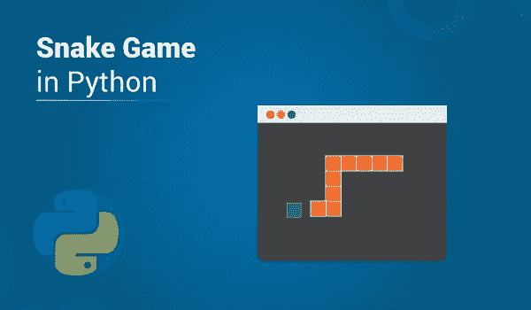

# 如何用 PyGame 在 Python 中实现贪吃蛇游戏？

> 原文：<https://medium.com/edureka/snake-game-with-pygame-497f1683eeaa?source=collection_archive---------0----------------------->

Snake Game in Python — Edureka

是的，我知道你们都玩过贪吃蛇游戏，而且肯定，你们从来不想输。作为孩子，我们都喜欢寻找作弊手段，以便永远不会看到“游戏结束”的信息，但作为技术人员，我知道你会想让这条“蛇”随着你的节拍起舞。这就是我将在这篇关于 Python 中的贪吃蛇游戏的文章中向大家展示的内容。在继续之前，让我们快速浏览一下…