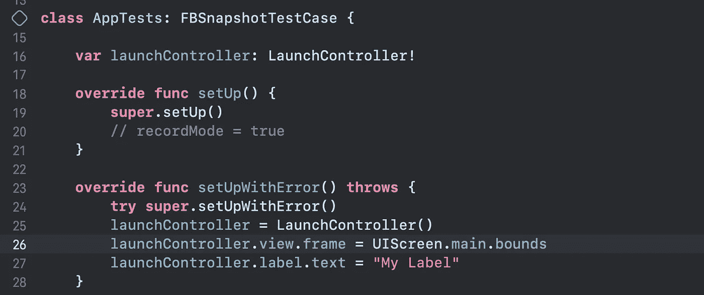

# 快照测试(FBSnapshotTestCase/iosnapshottestcase)

> 原文：<https://medium.com/globant/snapshot-testing-fbsnapshottestcase-iossnapshottestcase-8fa9cc8cbb37?source=collection_archive---------1----------------------->


# 它的作用

FBSnapshotTestCase 被重命名为 iOSSnapshotTestCase。“快照测试用例”采用一个已配置的 UIView 或 CALayer，并使用必要的 UIKit 或核心动画方法来生成其内容的图像快照。

iOSSnapshotTestCase 在预定义的路径上创建一个参考图像，并将其与代码生成的实际图像进行比较。只有一个像素变化可能是失败的测试案例。

iOSSnapshotTestCase 在您使用多个用户界面以及错误地更改用户界面时非常有用。

# 装置

# 步骤 1:为项目中的快照测试创建测试目标


# 步骤 2:将 iOSSnapshotTestCase 添加到项目中

> *确保在测试目标中添加 pod，而不是在应用程序目标中。*

# 椰子:

*将以下几行添加到您的 podfile:*

对于 Swift:

```
target “AppTests” douse_frameworks!pod ‘iOSSnapshotTestCase’end
```

对于目标 C:(不包含 Swift 支持)

```
target “AppTests” douse_frameworks!pod ‘iOSSnapshotTestCase/Core’end
```

# 迦太基:

*在你的 c* artfile *中添加以下几行:*

```
github "uber/ios-snapshot-test-case" ~> 6.1.0
```

# 步骤 3:设置测试方案

> *用提到的名称和值*在下面的路径中添加环境变量

# 应用目标->编辑方案->运行->环境变量


**FB _ REFERENCE _ IMAGE _ DIR**:$(SOURCE _ ROOT)/$(PROJECT _ NAME)测试/引用图像

**IMAGE _ DIFF _ DIR**:$(SOURCE _ ROOT)/$(PROJECT _ NAME)测试/失败差异

> *这里我们使用 FB_REFERENCE_IMAGE_DIR 和 IMAGE_DIFF_DIR 来存储特定路径上的参考和失败/diffs 图像。*

# 履行

1.  子类 FBSnapshotTestCase 而不是 XCTestCase。

2.在测试中，根据需要使用 FBSnapshotVerifyView 或 FBSnapshotVerifyViewController。

3.使用 self.recordMode = true 运行一次测试；在测试的设置方法中。

4.删除启用记录模式的行(self.recordMode = true)并运行测试。


> 当你在一个测试方法中编写多个测试用例时，确保为每个项目添加不同的标识符。


现在你一定有一个问题，它如何与动态用户界面的工作。用简单语言，我们将把动态用户界面变成静态用户界面。这里我们将在设置方法中提供静态文本。您可以为每个元素提供模拟数据。


有时，在为元素添加模拟文本时，您可能会在设置方法中遇到应用程序崩溃问题。因为视图找不到框架。因此，在这种情况下，我们必须为视图添加框架。



# 额外:

> *iosnapshottestcase 总共创建 2 个文件夹。*
> 
> *1) ReferenceImages_64*
> 
> *当我们记录图像时，它将在此生成，其名称为:功能名称+标识符(如果已添加)*
> 
> 2)故障差异
> 
> *当测试用例失败时，它将创建失败图像和差异图像(参考图像和失败图像的组合)*


# 优点:

当我们在一个控制器中创建多个 UI 类时，测试就变得容易了。不要点击我的应用程序来查看正确的视图。它为我提供了一种测试视图相关代码的方法，并且它可以用来可视化视图状态，而不用在模拟器或真实设备中跳来跳去。

# 缺点:

当您的参考映像和当前模拟器设备不同时，测试用例将失败。作为它的匹配像素。

# 结论

*FBSnapshotTestCase* 让我们能够进行单个测试，并立即看到我们对不同状态所做的更改。快照测试速度很快。在一个应用程序的测试套件中有很多测试是没有问题的。如果你还没有用过，你应该试一试。

参考来自 [GITHUB](https://github.com/uber/ios-snapshot-test-case#carthage)
参考图片来自 [Raywenderlich](https://www.raywenderlich.com/5043-ios-snapshot-test-case-testing-the-ui)