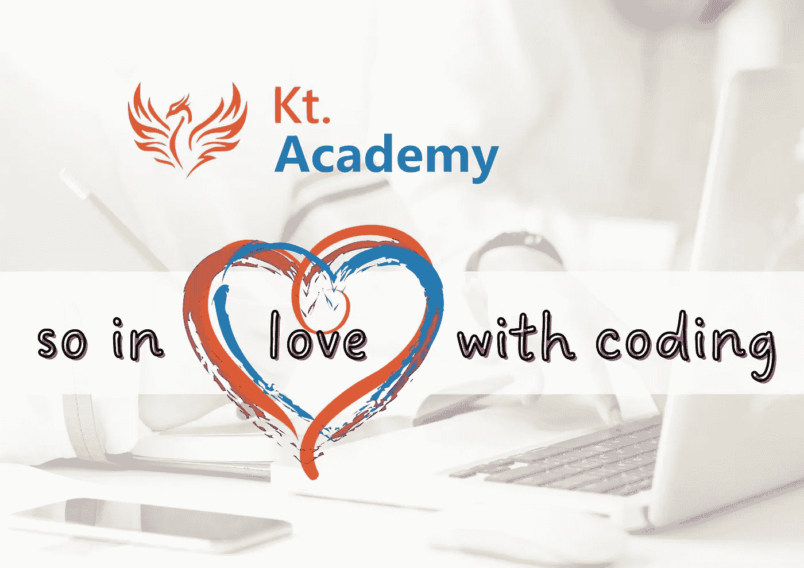
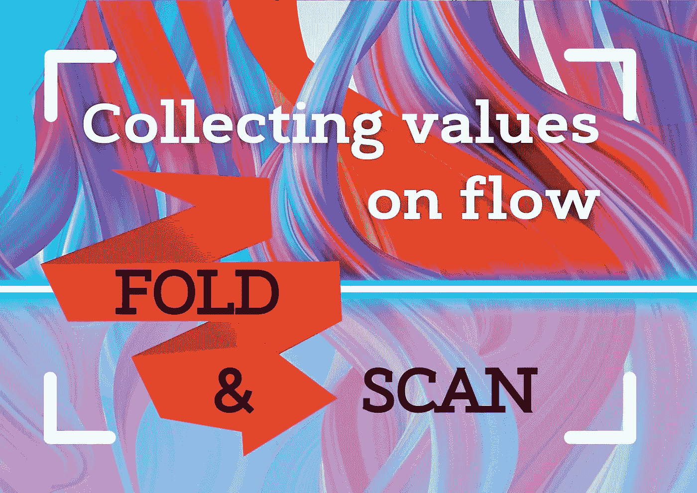
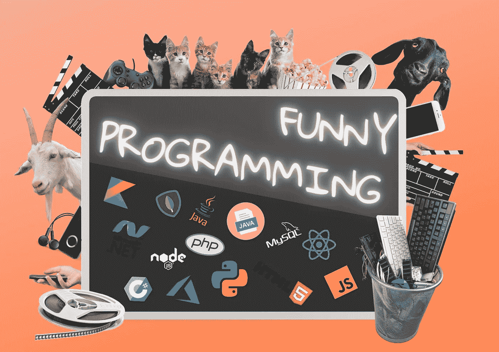
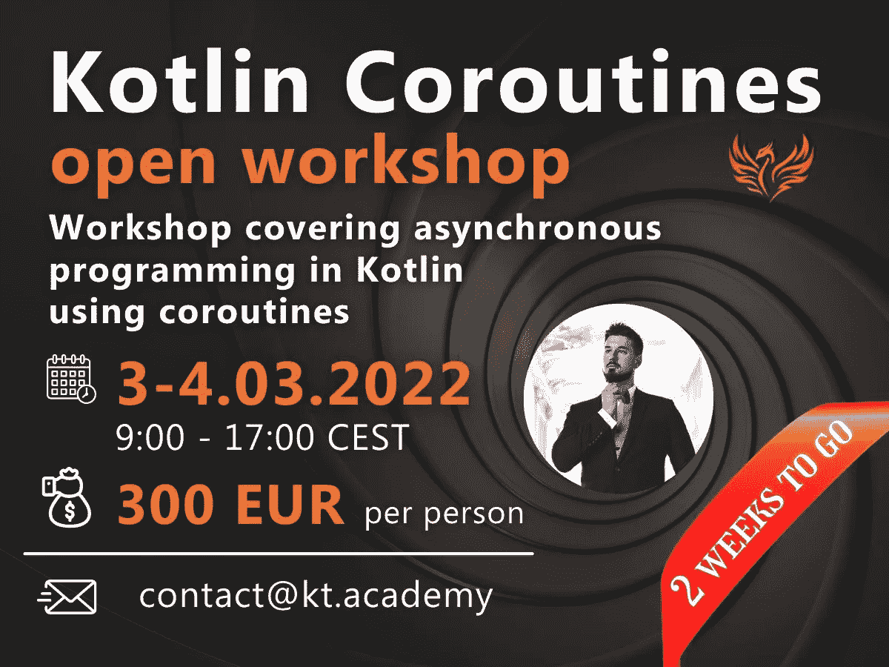

# 如此热爱编码:2 篇 Kotlin 协同程序文章& Kobby 插件文章&有趣的编程💘

> 原文：<https://blog.kotlin-academy.com/so-in-love-with-coding-2-kotlin-coroutines-articles-kobby-plugin-article-funny-programming-23c105baf7c9?source=collection_archive---------1----------------------->

嗨，程序员们！🤗

💗💗💗💗💗💗💗💗💗💗💗💗💗💗💗💗💗💗💗💗💗💗💗💗最近我们庆祝了**情人节**！我们祝你拥有无限的爱……
特别为**编码**！

下面是今天新闻简报内容的简要列表:

**Kotlin Coroutines-Flow 文章**作者**Marcin moska a**:
👉[采集流量值:折叠扫描](https://kt.academy/article/cc-scan)👉[展平流程:flatMapConcat、flatMapMerge 和 flatMapLatest](https://kt.academy/article/cc-flatmap)

文章是从**科特林协程**书的部分。你可以在这里找到早期访问[。📖](https://leanpub.com/coroutines/)

**Kobby 插件文章**作者 **Dmitry Ermakov:** 作者
👉[如何通过 GraphQL 模式生成 Kotlin DSL 客户端](/how-to-generate-kotlin-dsl-client-by-graphql-schema-707fd0c55284)

✳·德米特里联系了我们，我们重新发表了他的文章。想成为德米特里那样的人吗？我们仍然对新作者开放。
关于我们的[介质](https://blog.kotlin-academy.com/)的更多信息📝

**Offtop 搞笑内容文章**由**Marcin moskaa**撰写让你开怀大笑:
👉[搞笑编程视频](https://kt.academy/article/humour-video)

我们想唱:
😂“我用手指感觉到它，我用脚趾感觉到它
**代码**围绕着我，所以这种感觉越来越强烈”😂

尽情享受吧！🙃

让我们学习如何使用折叠和扫描来累积流量值。👇

**采集流量值；折叠并扫描**

[Collecting values on flow: fold and scan](https://kt.academy/article/cc-scan)

🔻这是《科特林协同程序》一书中的一章。你可以在 LeanPub 上找到早期访问。

让我们来学习如何使用 flatMapConcat、flatMapMerge 和 flatMapLatest 对流进行平面映射。

👉**展平流程:flatMapConcat、flatMapMerge 和 flatMapLatest**

[Flattening flow: flatMapConcat, flatMapMerge and flatMapLatest](https://kt.academy/article/cc-flatmap)

🔻这是《科特林协同程序》一书中的一章。你可以在 [LeanPub](https://leanpub.com/coroutines/) 上找到早期访问。

介绍 Kobby 插件——kot Lin graph QL 客户端的代码生成器。我们来试试吧！听起来很有趣，然后读读由 **Dmitry Ermakov** 写的文章。👇

**如何通过 GraphQL 模式生成 Kotlin DSL 客户端**

[How to generate Kotlin DSL Client by GraphQL schema](/how-to-generate-kotlin-dsl-client-by-graphql-schema-707fd0c55284)

📹我们，开发者，创造了我们自己的亚文化。难怪全球有超过 2400 万人。我们有相似的问题和挫折。在我们当中，有许多音乐家和其他种类的艺术家。难怪我们的社区时不时会制作一些有趣的视频或漫画。在本文中，**Marcin moska a**收集了他最喜欢的视频。

**搞笑编程视频**

[Funny programming videos](https://kt.academy/article/humour-video)

由**Marcin moska a 主持的**kot Lin Coroutines 公开研讨会**只剩下 2 周了🤩**

📅:2022 年 3 月 3 日至 4 月 4 日
⏲:欧洲中部时间 9:00–17:00(GMT+1)
💰:300 欧元 pp
🔤:EN

查看详细信息并在此注册👇

[科特林协同程序(kt.academy)](https://kt.academy/workshop/coroutines)

💝💝💝💝💝💝💝💝💝💝💝💝💝💝💝💝💝💝💝💝💝💝💝💝

代码在空中！💝今天的节目到此结束🙂

如果你有什么想告诉我们的，请回复这封邮件让我们知道！💌

敬请期待！👌
Kt。学院团队

www: [kt.academy](https://kt.academy/)
博客:[blog.kotlin-academy.com](http://blog.kotlin-academy.com/)
Twitter EN:[@ ktdotsacademy](https://twitter.com/ktdotacademy)
Twitter PL:[@ ktdotsacademypl](https://twitter.com/ktdotacademyPL)
FB:[@ ktdotsacademy](https://www.facebook.com/KtDotAcademy)
LinkedIn:[@ Kt。学院](https://www.linkedin.com/company/kt-academy/)

