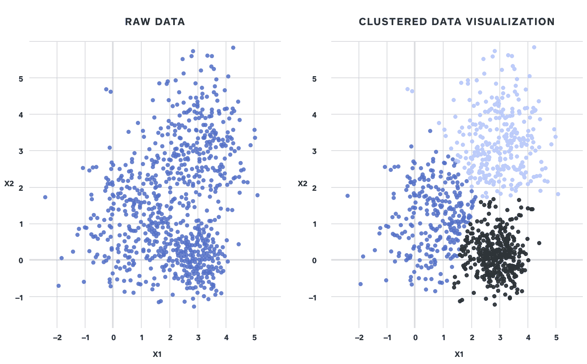
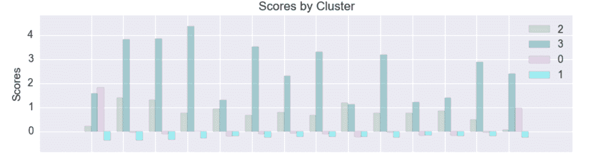
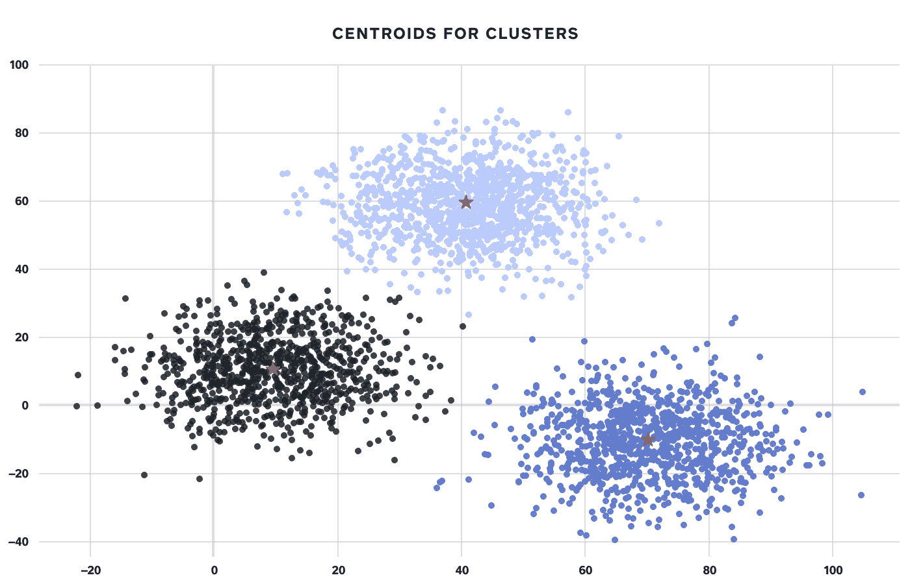

# 所以你有一些集群，现在呢？

> 原文：<https://medium.com/square-corner-blog/so-you-have-some-clusters-now-what-abfd297a575b?source=collection_archive---------0----------------------->

> 注意，我们已经行动了！如果您想继续了解 Square 的最新技术内容，请访问我们的新家[https://developer.squareup.com/blog](https://developer.squareup.com/blog)

**如何为你的集群增值**

由[张帆](https://medium.com/u/ff15f956e93d?source=post_page-----abfd297a575b--------------------------------)、[伊娜卡勒](https://medium.com/u/cb3167d9b290?source=post_page-----abfd297a575b--------------------------------)撰写

**问题**

将[无监督学习](https://en.wikipedia.org/wiki/Unsupervised_learning)应用于数据集的最常见方式之一是[聚类](https://en.wikipedia.org/wiki/Cluster_analysis)，具体来说就是[基于质心的聚类](https://en.wikipedia.org/wiki/Cluster_analysis#Centroid-based_clustering)。聚类获取大量观察值，并根据相似性将它们分成不同的组。

图 1:获取一个二维数据集，并将其分成 3 个不同的集群

对于那些以前编写过聚类算法的人来说， [K-means](https://en.wikipedia.org/wiki/K-means_clustering) 和使用[肘方法](https://en.wikipedia.org/wiki/Elbow_method_(clustering))寻找最佳聚类数的概念可能很熟悉。更难回答的问题是— *每个集群代表什么*？当使用聚类来理解我们的卖家行为时，我们恰恰遇到了这个问题。

我们开始时对数据如何聚集有一定的假设，但没有具体预测我们的卖家分成多少个不同的组。第一直觉是手动生成一组我们知道有趣的信号。例如，支付量、支付金额和业务类型是区分我们的卖家的一些最常见的维度，因此我们试图在聚类分析中使用它们。由此产生的集群是沿着我们已经知道是重要的维度最优分离的，并且支持我们最初的理解。零售卖家不同于食品和饮料卖家，拥有多个地点的大型企业不同于只有一个地点的小型企业，等等。虽然在确认之前的理解和分析方面很有价值，但这并没有告诉我们任何新的东西！

我们没有获得任何关于我们的卖家如何不同的新见解，因为我们将我们对哪些信号重要的偏见嵌入到了我们的数据集中。那么我们如何解决这个问题呢？

**数据和方法**

为了尝试解开更多有趣的洞见，我们继续用包含较少偏差的数据集来重建我们的聚类。Square 的风险系统根据各种行为信号为每个卖家生成数千个信号。这基本上是数据的厨房水槽，我们使用这个数据集而不是手动选择信号，手动选择信号会引入前面提到的偏差。当然，这种方法也有一些保留，包括我们可能用已知的偏见替换未知的偏见。我们希望在未来的博客文章中访问这个特定的主题。

在这一点上，我们有我们的数据，我们的一组特征，定义了许多 K 个聚类，并将卖家聚类到我们的 K 个聚类中。接下来，我们尝试几种不同的方法来为每个集群分配“配置文件”:

*实证方法*

一旦我们构建了集群，我们就可以生成所有卖家的列表以及他们属于哪个集群。然后，我们可以选择一个特定的集群，沿着已知的维度研究卖家特征。或者，我们可以查看与其他集群相比，哪些分组在特定维度上索引过高或过低。对于这两种方法，我们都提出了一个不同集群的维度列表，然后猜测这些集群将代表什么。

这是第二种方法的一个例子。在本例中，我们将主键和分类标签加入到我们感兴趣的特征中，以分析和绘制每个分类的平均比例值。感兴趣的特征在 x 轴上，该特征的缩放平均值在 y 轴上。可视化差异使我们可以看到聚类 0 是由第一个和最后一个特征分类的。与此同时，第三类几乎对所有特征都有最高值。由此我们可以开始将难以描述的集群标签翻译成对观众来说有意义的标签。

图 2:每个集群在 4 个不同维度上的平均“得分”

根据数据聚类的目的，用于分析聚类的特征集将会发生变化。当使用聚类来了解不同的销售者如何使用 Square 产品时，维度是特定于使用数据的。当想要确定这些卖家的价值平方时，特征集由与收入、卖家规模、LTV 等相关的广泛变量组成。

*质心方法*

我们可以计算出每个聚类中哪个卖家最接近质心(中心点),并将该卖家标记为该聚类中最具“代表性”的卖家。然后，我们可以沿着已知的维度或信号来研究卖家，以得出我们对集群概况的最佳猜测，就像经验方法一样。另一种方法是研究假设的质心，而不是最具代表性的元素。对于这两种方法，我们都在假设代表在我们的团队中是如何工作的，所以两种方法中哪一种更好完全取决于具体情况。当然，如果聚类内的方差很大，那么无论是假设质心还是经验质心都不能很好地代表该组。

这是这种方法的一个例子。在下图中，每个星团中间的星星表示该星团中最具代表性的成员。

图 3:恒星识别每个星团的质心

*从集群成员中监督学习*

一旦创建了分类，我们就可以隔离出在不同分类中变化最大的最有影响力的特征，并对分类的概况做出有根据的猜测。这是确定集群如何索引过度或索引不足的更复杂的版本。

一种区分有影响的特征的方法是使用随机森林分类器。例如，如果我们有 4 个集群，我们可以使用现有的信号来预测每个人属于第一个集群的概率，然后是第二个集群，等等。结果将是 K 个模型匹配 K 个聚类，每个聚类一个模型，并预测一个实例是否可能属于每个聚类。随机森林算法的大多数标准实现将向您显示对于每个特定的预测，哪些[特征是重要的](http://scikit-learn.org/stable/auto_examples/ensemble/plot_forest_importances.html)，这可以激发更多关于这些重要特征对集群本身的影响的直觉。

获得特征影响的另一种方法是使用单个多类分类模型( [sklearn.multiclass](http://scikit-learn.org/stable/modules/multiclass.html#multiclass) )，将您的响应作为值为 1，…，K 的“聚类”列。这提供了单个模型的好处，该模型可用于使用 K 均值数据集之外的附加信号来预测实例的聚类。例如，在产品使用的应用程序中，您可以将尚未使用过该产品的用户划分到不同的群中，从而更具体地细分您的目标市场。我们希望在未来的博客文章中扩展这一技术。

**结果**

一旦我们确定了哪些维度在区分我们的聚类中起着重要作用，我们很可能会发现两件事情中的一件:要么顶部信号与我们之前认为重要的东西不一致，要么它们是一致的。

如果我们的结果是前者，那太好了！你可以深入了解你的观察结果与哪些新行为不同，以及它们与你现有的假设有何不同。理想情况下，这些分歧是重大的，可操作的。

然而，通常情况下，集群分裂的顶部信号是已知的和预期的。这至少验证了现有的细分是有意义的，但我们可以了解更多。

假设您的数据通过顶部信号得到了最佳分离，那么如果您在这些聚类中再次聚类，会怎么样呢？这将揭示第二组重要的信号，控制第一组信号。当我们发现我们的第一批集群被分割成我们现有的业务规模时，我们正是这样做的。我们添加了一个额外的信号列表，这些信号在我们的第一个数据集中没有出现，我们还添加了一个洞察列表，让我们了解我们的卖家在不同规模的企业中有什么不同。这一系列见解为营销和产品团队的战略提供了信息，并为产品开发和销售互动提供了个性化的方法。

说到聚类，您很少在选择了最佳数量的聚类并运行算法之后就完成了。聚类的可解释性以及对数据的额外理解具有很大的价值。