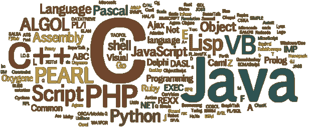

# 所以你想成为一名职业程序员？

> 原文：<https://medium.com/javascript-scene/so-you-want-to-be-a-professional-coder-a3b5deb5329f?source=collection_archive---------6----------------------->

我写代码的时间比我想承认的要长。我基本上是“自学”的，但我最终还是在大学里学了一些编程课程，我不认为这些课程对我的整体编码知识和经验有多大帮助。你只能通过构建实际的非示例性的东西来学习编码。在这篇文章中，我分享了我收集的**非常固执己见的**技巧、建议和我认为你应该做和不应该做的事情。*固执己见*是这里的关键词，很多专业程序员不同意我在这里提出的一些观点。

这些天我主要用 JavaScript 编码，所以这里的一些观点可能对语言有一点偏见。半信半疑。

## **1 -高效使用你的键盘**

学会用全部 10 个手指触摸打字，并且永远不要再看你的键盘。学会每分钟至少跑 60 英里，不要纠结于跑得更快。

事实上，我是出于需要才学习触摸打字的。我不得不在没有标签的键盘上打字，而且我太穷了，买不起另一个。在很长一段时间里，我用 4-6 个手指在 Qwerty 上打字，实际上每分钟超过 90 个字，但我不喜欢我没有使用所有 10 个手指的事实。一个朋友建议我试试德沃夏克，我照做了。切换到德沃夏克并不容易，但强迫自己用全部 10 个手指重新学习打字可能是我作为一名程序员做过的最好的决定。

了解制表符补全并尽可能地使用它。Tab 应该是[键盘上最常用的键](https://edgecoders.com/the-most-useful-keys-on-your-keyboard-619c2b913f88#.xpxgzy5df)。制表符补全不仅仅是关于打字速度，更重要的是为了避免错误和知道你能做什么。现代程序实际上自带了制表符补全功能(例如，在 Node 的 REPL 模式下测试它！).一些程序——比如 git——需要添加一个[脚本](https://github.com/git/git/blob/master/contrib/completion/git-completion.bash)来启用制表符补全，这是完全值得的。

尽可能把你的鼠标扔掉。你真的可以用键盘做任何事情(甚至是[浏览](https://chrome.google.com/webstore/detail/vimium/dbepggeogbaibhgnhhndojpepiihcmeb?hl=en)和 Gmail 之类的应用)。如果你用所有 10 个手指触摸打字，这尤其正确，因为每次你使用鼠标时，你都离开了主行，当你回来时，你需要重新建立你的位置。我通常在不打字的时候使用鼠标。

## 2 -有效地使用你的编辑器

学习一个终端编辑器，不要找借口不学。你在这里没有太多的选择，不是 Vim 就是 Emacs。即使您不打算每天使用终端编辑器，当您唯一的选择是使用 ssh 在某个地方进行更改时，您也需要使用一个好的编辑器。相关；学习 tmux 或 screen，并始终在 tmux/screen 会话中运行您的终端编辑器。您可以退出终端，并重新启动到您离开时的位置，使用所有相同的历史记录、打开的缓冲区和您执行的命令的确切状态。

让你的编辑为你做繁忙的工作。让它 lint 你的代码文件保存，并有一个键盘快捷键，自动修复明显的 lint 问题。使用代码片段和自动完成(是的，终端编辑器也可以做到这一点)。让您的编辑器自动修复空白错误，并在 EOF 处插入一个空行(在提交之前总是检查您的 git 差异，如果可以的话，让它成为 git 预提交挂钩)。也可以使用你的编辑器进行拼写检查。

与你的缩进保持一致。林挺可以帮你。如果您对此没有强烈的意见，请避免使用制表符，而是使用 2(或 4)个空格。一个空格总是一列，而一个选项卡在不同的环境中使用不同数量的列，当代码在不同的环境之间移动时，就会出现问题。然而，不管你选择什么样的制表符/空格，请保持一致，*请，*不要混用制表符和空格。在您的编辑器中显示空白字符，并总是修复任何粘贴的代码，以匹配您的缩进样式。

## 3 -知道你的编程语言能做什么，不能做什么

轻松阅读 API 文档并学习您的语言的标准库。不要死记硬背如何使用东西，只要意识到你的语言中强大功能的存在，并知道如何快速查找它们。

理解文档中用于交流诸如类型、必需/可选、事物顺序、别名、依赖性等内容的语法。理解并使用*人*命令来了解你的选择，甚至只是验证你将要做什么。

了解命令式和声明式编程风格。尝试将一种方式编写的代码转换成另一种方式。如果你使用 JavaScript，学习这种语言的函数式编程能力(这里有一本[关于这方面的好书](https://www.manning.com/books/functional-programming-in-javascript))。

理解函数调用和函数引用，通过值传递和通过引用传递，以及 JavaScript 做的任何奇怪的事情的区别。

## 4:学会热爱调试

就像小孩子一样，代码通过不当行为进行交流。改变你对错误和问题的态度，面对它们总是很棒的，因为你可能会学到新的东西，并且很容易当场取得进展。不要只是解决问题，要理解为什么会发生。堆栈跟踪是您最好的朋友。

轻松阅读和调试您第一次看到的外来代码。尽可能使用交互式调试(断点、单步调试等)，但不要低估打印调试的价值。在某些情况下，打印调试远比交互调试有效。

调试时不要猜测，要学会如何隔离问题，执行健全性检查，只有在这之后，才能形成关于什么可能出错的理论。你的第一直觉永远是猜测，抵制它。

舒适地用谷歌搜索东西。如果你正在编写代码，而你的浏览器不经常访问 google.com，你可能做错了。搜索不仅仅是为了解决问题，我更经常使用搜索来激发我下一步的计划。你可以从网上复制一些东西，并在你的代码中使用它们，只要你理解它们。永远不要使用你不完全理解的代码行(仅仅因为网上有人告诉你它可以工作，或者甚至因为它以前对你工作过)。

## 5:衡量和组织

学习如何在实施变革之前和之后进行衡量。当您的更改是优化时，这一点更为重要。在这种情况下，如果你不能衡量改变的效果，那就不值得去做。

理解并使用 OODA 循环:观察、定位、决定和行动。当你把它应用于编码时，奇妙的事情发生了。最重要的是，在观察和确定方向之前，千万不要做决定或行动。

尽可能缩短你开发过程中的反馈回路(看[这个](https://vimeo.com/36579366))。自动化您经常运行的开发命令，并在尽可能靠近“预览”区域的地方测试您的更改。

始终使用版本控制，尽早提交并经常提交。使用描述性的提交消息来回答这个问题:*为什么这个变化*。版本控制不仅适用于大型项目和团队。我用它来做我自己做的小项目。好处太多了，不容错过。

## 6:从来没有。停下来。学习。

当你停止在编码职业中学习的时候，你基本上正在以超乎你想象的速度衰退到无关紧要。设定一个目标，每个月或者每个星期读一本书，参加一个在线课程，如果可以的话，甚至每周都可以。

不要太执着于一门语言或者一个框架。最好的东西总是还没有被发明出来。然而，停止“学习”新语言，而是“使用”它们来构建东西。

尽可能了解所有可能的数据结构(集合、堆栈、队列、映射、列表、树、堆、图、...)及其变体。了解他们擅长什么，不擅长什么(至少在 CRUD 操作方面)。学习如何用你的语言实现和使用这些数据结构。这比背算法重要多了。

学习 Bash、Cron 和 Linux 的自动化方式。学习正则表达式，尽管也许不要在生产中使用它们，直到你对它们超级熟悉。

挑战自我。尝试重新学习你以前没有理解的内容。在很长一段时间里，我无法学习 Vim，我讨厌它，但经过几年的努力，它是我没有放弃的最好的事情。好东西难学。

我最喜欢的学习方式之一是[教](https://edgecoders.com/the-best-way-to-learn-something-is-to-teach-it-e8dbe3256355#.zg5so8wen)，试着教一个完全的初学者如何编码。

## 7:先测试。经常测试。

先学习如何编写自动化测试。当你在编写代码之前就有了指导性的测试，你就不再是猜测解决方案，你有了一个立即验证它们的方法。

然而，不要浪费时间为每一件奇怪的事情编写测试。不要测试已经测试过的东西。了解测试在何时何地提供价值，并在那里投入时间，除非你能度量质量，否则不要费心度量你的代码测试了多少。考试的质量才是最重要的。把注意力放在那上面。

将一个大的特性分成具有可测试结果的小增量，一次只关注一个增量。定义结果，然后实现增量。如果你写了 10 行以上的代码却没有进行测试，你可能做错了。

## 8:优化你的时间

不要一心多用。我们不是为此而生的。优化流程中那些鼓励你多任务的阻碍因素，比如等待构建或测试运行。如果你不能让他们更短，为他们找一个经理。就像 Node.js 为你管理线程中的阻塞 IO 一样，在你的开发过程中找到一些自动化阻塞的东西，只在你需要采取行动的时候通知你。

在开始编码之前，关掉所有的通知，减少所有的干扰，但是一定要多休息，让你的大脑回到[创意扩散模式](https://staciechoice1010.wordpress.com/2014/08/08/focused-vs-diffused-mode/amp/)。

永远不要过度工作或熬夜，当你疲劳时，你的效率会大大降低，而且你很可能会犯代价高昂的错误。需要的时候睡觉。如果可以的话，经常睡觉。不要强迫你的身体停留在虚假的能量上。不要为此与大自然抗争。

不要试图估算时间，因为你根本做不到。当有人让你估计时间时，唯一正确的估计是:“[当它完成的时候](/javascript-scene/why-deadlines-need-to-drop-dead-321739ae6be1#.30m4vrrqs)”

## 9:思考和验证

在你打字之前思考，读的比写的多。Vim 以“阅读”模式启动并拥有强大的导航功能是有原因的。当您认为您得出了推动变更的结论时，在实现该变更之前，研究潜在问题的代码。我用的最多的 git 命令是 git grep。

用多种方法解决一个问题，然后选择一个解决方案。你可能认为这是浪费时间，但事实并非如此。它验证好的解决方案并提高你的思考能力。

练习逻辑思维和分析，可以的话玩拼图和策略游戏。你的分析技能比你的语法技能重要得多。尽你所能投入所有的时间来改善它们。

当涉及到处理任何类型的外部输入时，验证和清理都不是可选的。永远不要相信用户的输入。在多个层面进行验证:前端、服务，甚至数据库。理解和使用数据库约束。

尽可能地处理异常，但也要知道有些异常应该会出现。这个不要泛泛而谈。千万不要“一网打尽”。确保您有方法来检查和反映生产中代码中发生的异常。

## 10:编写可读的代码

花点时间到处想出描述性的名字，文件，变量，函数，类，测试。写软件主要是交流实现。如果需要的话使用注释，但是只有当你不能用代码本身来表达你想在注释中放什么的时候。

在函数中使用命名参数，不要依赖参数的位置。不要使用太多的 if/switch 语句，尽可能尝试使用简单的对象查找。如果必须使用 if/switch 语句，请避免嵌套它们。

让你的编辑器显示垂直的 80 字符行，不要越过它。这并不是因为你的显示器变大了，学校的惯例。长长的行使得一切都难以阅读。大屏幕上中等大小的文章最大宽度为 80 个字符是有原因的。

最后，试着在任何地方都遵循 *10-max* 的经验法则。每个函数不超过 10 行，每个文件不超过 10 个函数，每个文件夹不超过 10 个文件，每个列表不超过 10 个项目。

感谢阅读。